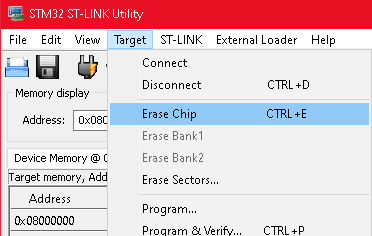
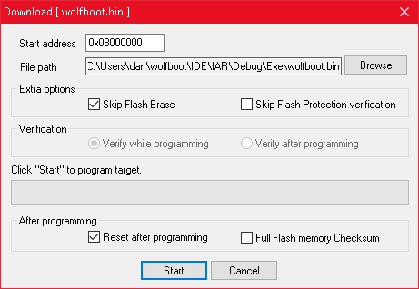
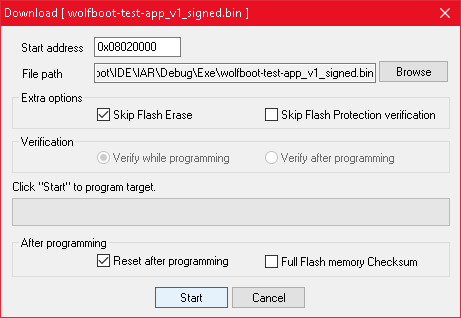

# wolfBoot demo application for IAR EWARM

Instruction to compile and test under MS Windows.


## Target platform

This example application has been configured to work on STM32F4.

wolfBoot is stored and executed at the beginning of the flash (0x08000000), while the signed
application image starts at address 0x08020000.


## Workspace

The workspace [wolfboot-test-app.eww](./wolfboot-test-app.eww) contains two projects:
  - wolfBoot
  - wolfBoot-test-app

Each project will compile into a separate binary, the two binaries can be uploaded to the target using
ST-Link utilities (e.g. [STSW-LINK004](https://www.st.com/en/development-tools/stsw-link004.html)) as explained below.

## Instructions

### Creating the keys

This step is required to compile the bootloader.

Open a command line terminal in the [IAR](./) directory. Execute the following script:

```
generate_key.bat

```

The script will generate a keypair. The file `ecc256.der` in the root of the repository contains the private key that will be used
to sign valid firmware images. The file `src/ecc256_pub_key.c` now contains the public key that the bootloader embeds in its codebase
to use it later to verify the image.


### Compiling and linking the images

Now both projects (wolfboot and wolfboot-test-app) can be compiled and linked. 
The two resulting images will be placed in the output directory `Debug/Exe`:
  - wolfboot.bin
  - wolfboot-test-app.bin

### Signing the firmware image

The test application (main firmware) must be now tagged with a version number and signed. This is done by the script `sign_test_app.bat`.

The script requires one numeric argument that is used as the version tag for the signed image. Running it with version "1":

```
sign_test_app.bat 1
```

Will create a new file named `wolfboot-test-app_v1_signed.bin`, which will be placed in the output directory `Debug/Exe`.


### Uploading the binary images to the target

Using the ST-LINK Utility, perform the following steps:

	1. Erase the entire flash memory



*Erase the entire flash memory before uploading the binary files*


	2. Upload `wolfboot.bin` to addess 0x08000000




	3. Upload `wolfboot-test-app_v1_signed.bin` to address 0x08020000. Ensure that the flag "Skip Flash Erase" is active.




### Verify that the system is up and running

If you are using a STM32F407-discovery board, a red LED will turn on upon application boot.


