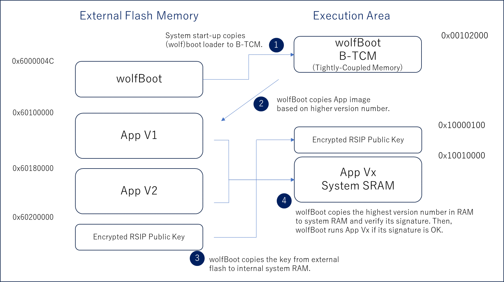

# wolfBoot for Renesas RZN2L with RSIP

## 1. Overview

This example demonstrates simple secure firmware boot from external flash by wolfBoot. The example uses SPI boot mode with external flash on the evaluation board. In addition to boot mode, this readme explains about RSIP driver use. RSIP provides Cryptographic accelerator, Random number generator and Secure key manegement.


A sample application v1 is securely loaded into internal RAM if there is not higher version in update region. A sample application v2 will be loaded when it is in update region.Both versions behave the same except blinking LED Red(v1) or Yellow(v2). They are compiled by e2Studio and running on the target board.


In this demo, you may download two versions of the application binary file.
You can download and execute wolfBoot by e2Studio debugger. Use a USB connection between PC and the board for the debugger and flash programmer.

## 2. Components, Tools and Board Settings

### 2-1. Tools
|Item|Name/Version|Note|
|:--|:--|:--|
|Board|Renesas RZN2L RSK||
|Device|R9A07G084M08GBG||
|Toolchain|GCC ARM Embedded 10.3.1.20210824|Included in GCC for Renesas RZ|
|FSP Version|1.3.0|Download from Renesas site|
|IDE|e2studio 2024-01.1 (24.1.1)|Download from Renesas site|
|SEGGER J-Link|J-Link Commander V7.94j |Download from J-Link|
|Key tool|keygen and sign|Included in wolfBoot|


|FIT Components|Version|Note|
|:--|:--|:--|
|Board Support Package Common Files|v1.3.0||
|I/O Port|v1.3.0||
|Arm CMSIS Version 5 - Core (M)|v5.7.0+renesas.1||
|Board support package for R9A07G084M04GBG|v1.3.0|Note1|
|Board support package for RZN2L|v1.3.0||
|Board support package for RZN2L - FSP Data|v1.3.0||
|RSK+RZN2L Board Support Files (xSPI0 x1 boot mode)|v1.3.0||
|SDRAM on Bus State Controller|v1.3.0||
|Renesas Secure IP Driver|v1.3.0+fsp.1.2.0||
|RSIP Engine for RZ/N2L|v1.3.0+fsp.1.2.0||

Note1:\
 To use RSIP drive, a devvice type should be `R9A07G084M04GBG`. However, choosing `R9A07G084M04GBG` won't allow to select `RSK+RZN2L` board. This example uses LED and external flash memory on `RSK + RZN2L` board. Therefore, the example temporary `R9A07G084M04GBG` for the device type. Updating e2studio or fsp could resolve the issue.

### 2-2. Project folders
e2Studio Project:\
wolfBoot      IDE/Renesas/e2studio/RZN2L/wolfBoot\
Sample app    IDE/Renesas/e2studio/RZN2L/app_RZ\
Flash Simple Loader IDE/Renesas/e2studio/RZN2L/flash_app


### 2-3. Board Settings
The switch and jumper settings required to run the sample program from external flash are shown below. For details on each setting, see the Renesas Starter Kit+ for RZN2L User's Manual.

|Project|SW4-1|SW4-2|SW4-3|SW4-4|SW4-7|
|:--|:--|:--|:--|:--|:--|
|xSPI0 boot mode|ON|ON|ON|ON|OFF|

|Project|CN8|CN24|
|:--|:--|:--|
|xSPI0 boot mode|Short 2-3|Short2-3|

## 3. Operation Overview
The example uses SPI boot mode with external flash on the evaluation board. On this boot mode, the loader program, which is wolfBoot, is copied to the internal RAM(B-TCM). wolfBoot copies the encrypted RSIP key on flash memory and the application program from external flash memory to RAM(System RAM). As final step of wolfBoot the entry point of the copied application program is called if its integrity and authenticity are OK.



## 4. How to build and use
This section describes about how to build wolfBoot and application and use them.

### 4-1) Key generation
It has key tools running under the host environment such as Linux, Windows or MacOS.
For compiling the tools, follow the instruction described in the user manual.


```
$ cd <wolfBoot>
$ make keytools RENESAS_KEY=3
$ export PATH=$PATH:<wolfBoot>/tools/keytools
$ keygen --rsa2048 -g ./pri-rsa2048.der  # RSA2048
```

The `keygen` tool generates a pair of private and public key with -g option.
The private key is stored in the specified file.
The public key is stored in a key store as a C source code in "src/keystore.c" so that it can be compiled and linked with wolfBoot.
If you have an existing key pair, you can use -i option to import the public key to the store.

The example for Renesas RZ with RSIP only supports RSA 2048 bit now.

### 5) Compile wolfBoot

Open project under IDE/Renesas/e2studio/RZN2L/wolfBoot with e2Studio, and build the project.

#### 5-1) Create `dummy_loader` application
+ Click File->New->`RZ/N C/C++ FSP Project`.
+ Select `RSK+RZN2L (xSPI0 x1 boot mode)` from Drop-down list.
+ Check `Executable`.
+ Select `No RTOS` from RTOS selection. Click Next.
+ Check `Bare Metal Minimal`. Click Finish.
+ Open Smart Configurator by clicking configuration.xml in the project
+ Go to `BSP` tab and increase LDR_SIZE_NML under `RSK+RZN2L(xSIP0x1 boot mode)` on Properties page, e.g. 0x00010000
+ Go to `BSP` tab and increase SVC Stack Size under `RZN2L stack size` on Properties page, e.g. 0x2000
+ Go to `BSP` tab and increase Heap Size under `RZN2L` on Properties page, e.g. 0x10000
+ Go to `Stacks` tab and add RSIP driver from `New Stack` -> `Security`
+ Select `RSIP driver` on Threads pain and open its `property` page
+ Disable algorithms except the following algorithms:\
R_RSIP_KeyImportWithUFPK  -> RSA-2048 PUblic Key (New format)\
R_RSIP_RSA*Encrypt/Verify -> RSA-2048 (for new-format wrapped key)\
R_RSIP_RSA*Decrypt/Sign   -> RSA-2048 (for new-format wrapped key)

This helps to reduce a loader footprint.

+ Save `dummy_loader` FSP configuration
+ Copy <u>configuration.xml</u> and pincfg under `dummy_loader` to `wolfBoot`
+ Open Smart Configurator by clicking copied configuration.xml
+ Click `Generate Project Content` on Smart Configurator
+ Righ click on the project and Open property of the project
+ Go to Cross ARM Linker
+ Change Script files(-T) from `fsp_xspi0_boot.ld` to `fsp_xspi0_boot_loader.ld`
+ Add/Modify FSP generated code :
+ fsp/src/bsp/cmsis/Device/RENESAS/Source/startup.c

ORIGINAL
```
BSP_TARGET_ARM BSP_ATTRIBUTE_STACKLESS void __Vectors (void)
{
    __asm volatile (
        "    ldr pc,=Reset_Handler            \n"
```
==>

MODIFIED
```
BSP_TARGET_ARM BSP_ATTRIBUTE_STACKLESS void __Vectors (void)
{
    /* This software loops are only needed when debugging. */
    __asm volatile (
        "    mov   r0, #0                         \n"
        "    movw  r1, #0xf07f                    \n"
        "    movt  r1, #0x2fa                     \n"
        "software_loop:                           \n"
        "    adds  r0, #1                         \n"
        "    cmp   r0, r1                         \n"
        "    bne   software_loop                  \n"
        ::: "memory");
    __asm volatile (
#if 0
        "    ldr pc,=Reset_Handler            \n"
#else
        "    ldr pc,=system_init              \n"
#endif
```

ORIGINAL
```
BSP_TARGET_ARM void mpu_cache_init (void)
{
...
#if BSP_CFG_C_RUNTIME_INIT  && !defined(EXTERNAL_LOADER)

    /* Copy the loader data from external Flash to internal RAM. */
    bsp_loader_data_init();

    /* Clear loader bss section in internal RAM. */
    bsp_loader_bss_init();
#endif
...
#if !(BSP_CFG_RAM_EXECUTION)

    /* Copy the application program from external Flash to internal RAM. */
    bsp_copy_to_ram();

    /* Clear bss section in internal RAM. */
    bsp_application_bss_init();
#endif
...
}
```

==>

MODIFIED
```
BSP_TARGET_ARM void mpu_cache_init (void)
{
...
if BSP_CFG_C_RUNTIME_INIT && !defined(EXTERNAL_LOADER)

    /* Copy the loader data from external Flash to internal RAM. */
    bsp_loader_data_init();

    /* Clear loader bss section in internal RAM. */
    bsp_loader_bss_init();
#endif
...
#if !(BSP_CFG_RAM_EXECUTION)

    /* Copy the application program from external Flash to internal RAM. */
    /* bsp_copy_to_ram(); */

    /* Clear bss section in internal RAM. */
    bsp_application_bss_init();
#endif
...
}
```

+ Build `wolfBoot` project

### 6) Compile the sample application

Open project under IDE/Renesas/e2studio/RZN2L/app_RZ with e2Studio, and build the project.

 #### 6-1). Create `dummy_application`
+ Click File->New->`RZ/N C/C++ FSP Project`.
+ Select `RSK+RZN2L (xSPI0 x1 boot mode)` from Drop-down list.
+ Check `Executable`.
+ Select `No RTOS` from RTOS selection. Click Next.
+ Check `Bare Metal Minimal`. Click Finish.
+ Open Smart Configurator by clicking configuration.xml in the project
+ Open Interrupts tab
+ Select `INTCPU0` interrupts from `New User Event` -> `ICU`
+ Enter `intcpu0_handler` as interruption name

+ Save `dummy_application` FSP configuration
+ Copy <u>configuration.xml</u> and pincfg under `dummy_application` to `app_RZ`
+ Open Smart Configurator by clicking copied configuration.xml
+ Click `Generate Project Content` on Smart Configurator
+ Right click on the project and Open property of the project
+ Go to Cross ARM Linker
+ Change Script files(-T) from `fsp_xspi0_boot.ld` to `fsp_xspi0_boot_app.ld`
+ Add/Modify FSP generated code :
+ fsp/src/bsp/cmsis/Device/RENESAS/Source/startup.c

ORIGINAL
```
BSP_TARGET_ARM BSP_ATTRIBUTE_STACKLESS void __Vectors (void)
{
    __asm volatile (
```

==>

MODIFIED
```
BSP_TARGET_ARM BSP_ATTRIBUTE_STACKLESS void __Vectors (void)
{
    __asm volatile (
#if 0
        "    ldr pc,=Reset_Handler            \n"
#else
        "    ldr pc,=local_system_init        \n"
#endif
```


ORIGINAL
```
BSP_TARGET_ARM void mpu_cache_init (void)
{
...
#if BSP_CFG_C_RUNTIME_INIT

    /* Copy the loader data from external Flash to internal RAM. */
    bsp_loader_data_init();
...
#if !(BSP_CFG_RAM_EXECUTION)

    /* Copy the application program from external Flash to internal RAM. */
    bsp_copy_to_ram();
...
}
```

==>

MODIFIED
```
BSP_TARGET_ARM void mpu_cache_init (void)
{
...
if BSP_CFG_C_RUNTIME_INIT && !defined(EXTERNAL_LOADER_APP)

    /* Copy the loader data from external Flash to internal RAM. */
    bsp_loader_data_init();
....

#if !(BSP_CFG_RAM_EXECUTION) && !defined(EXTERNAL_LOADER_APP)

    /* Copy the application program from external Flash to internal RAM. */
    bsp_copy_to_ram();
...
}
```

+ Build `app_RZ` project

Code Origin and entry point is "0x10010000". app_RZ.bin is generated under Debug.

### 7) Generate a encryped Key for RSIP
RSIP needs to have a encrypted key for sign verification installed in advance. This section describes how to use wolfBoot with RSIP encrypted key. Current version supports RSA2048. RSIP RSA Signature supports #PKCS 1, v1.5. You can generate a RSA key pair by wolfBoot "keygen" command along with Renesas Security Key Management Tool, a.ka. `skmt`. The `skmt` tool's CUI interface generates a encrypted key from a RAW key and generates C language initial data and a header file for an application program with RSIP.


The example project assumes `rsa_pub`.h. Please specify `rsa_pub`.c for `/output` option. Similar to that, please specify `rsa_public` for `/keyname` option so that it can macth the example program expectation. After `rsa_pub`.h generated, you can copy the generated C header file to IDE/Renesas/e2studio/RZN2L/wolfboot/src.

```
$ export PATH:$PATH:<wolfBoot>/tools/keytools
$ export PATH:$PATH:<skmt>
$ cd <wolfBoot>
$ keygen --rsa2048 -g ./pri-rsa2048.der
$ openssl rsa -in pri-rsa2048.der -pubout -out pub-rsa2048.pem
$ skmt.exe /genkey /ufpk file=./ufpk_rzn2l.key /wufpk file=./ufpk_rzn2l.key_enc.key -key file=./pub-rsa2048.pem -mcu RZ-TSIP -keytype RSA-2048-public /output rsa_pub.c /filetype "csource" /keyname rsa_public
Output File: C:\workspace\wolfBoot_work\rsa_pub.h
Output File: C:\workspace\wolfBoot_work\rsa_pub.c
UFPK: F907AF3E87A8D9FED6FFCD246590EB5DCC9CA9AB1BF9160A8AA8CA4A4AEF2C19
W-UFPK: 00000000C0E4C5236974289C93F748C5C2C5310BDF1BE4753F4D8350D584F0674293F8F3
IV: 7AB13913EC6390A1AC1EB80FF0286CB6
Encrypted key: 9B27D2C45918828F224458CD38E8453D225B463906CE0C80FD330698B8E605389DE7D05620379D4BC33764779175D3CFCE22AB16E4E2EF271B7D9AA4CFB9F6514A93A93B9178CEB4FB5E9153078007B0D414087A7A42692D0DD3DD5E7A7E01FD8B4F69B7EBBAE4CCB7B3E8E3DE406EB9C8A5FBAFD33200FD1BDB5E83C3F4E5059C4CB8B39D5C7EB95AD26E6AE45664BE0C62A1217248EFAF031E6F2C0A7A9EDC3DB0DF2588EC600D21AC7EC7E69B5B58B9A92643400C42D110076670D7FD41B2B6A92C3765F1F273094FC0368CCE3C0AE856982C73C673A445F86C9E59EECA77B0B883B70562E62E453C65FB6690B354CB972D6B32B8C339B667C2F0BE85E04E8E409662B5B95CCFDAA47A12E137BC105A2ADFA1732018A66AD737FE078697DB
$ cp rsa_pub.h IDE/Renesas/e2studio/RZN2L/wolfboot/src/rsa_pub.h
```

To write a encrypted key to flash, it generates a binary key by skmt.

```
$ skmt.exe /genkey /ufpk file=./ufpk_rzn2l.key /wufpk file=./ufpk_rzn2l.key_enc.key -key file=./pub-rsa2048.pem -mcu RZ-TSIP -keytype RSA-2048-public /output rsa_pub2048.bin /filetype "bin"
$ cp rsa_pub2048.bin IDE/Renesas/e2studio/RZN2L/flash_app
```

### 7) Generate Signature for app V1

The sign tool (`tools/keytools/sign`) generates a signature for the binary with a specified version.
It generates a file contain a partition header and application image.
The partition header contains the generated signature and other control fields.
Output file name is made up from the input file name and version like app_RenesasRx01_v1.0_signed.bin.

```
# export PATH=$PATH:/path/to/wolfBoot-root/tools/keytools
$ cd IDE/Renesas/e2studio/RZN2L/app_RZ/Debug/
$ sign --rsa2048enc app_RZ.bin ../../../../../../pri-rsa2048.der 1.0
wolfBoot KeyTools (Compiled C version)
wolfBoot version 2000000
Update type:          Firmware
Input image:          app_RZ.bin
Selected cipher:      RSA2048
Selected hash  :      SHA256
Public key:           ../../../../../../pri-rsa2048.der
Output  image:        app_RZ_v1.0_signed.bin
Target partition id : 1
image header size calculated at runtime (512 bytes)
Calculating SHA256 digest...
Signing the digest...
Output image(s) successfully created.
```
Note2:\
Please specify `--rsa2048enc` for `sign` tool option. Verify API of RSIP drive assumes to have `DigestInfo` for padding.

### 8) Download the app V1

To download the app V1 to external flash, you can use `flash_simple_loader` application which is located in /IDE/Renesas/e2studio/RZN2L/flash_app

Open project under IDE/Renesas/e2studio/RZN2L/flash_app with e2Studio, and build the project.

+ Copy <u>configuration.xml</u> and pincfg under `dummy_application` to `flash_simple_loader`
+ Open Smart Configurator by clicking configuration.xml in the project
+ Open Interrupts tab
+ Select `INTCPU0` interrupts and remove it
+ Click `Generate Project Content` on Smart Configurator
+ Go to `BSP` tab and disable C Runtime Initialization under `RZN2L` on Properties page
+ Right click on the project and Open property of the project
+ Go to Cross ARM Linker
+ Change Script files(-T) from `fsp_xspi0_boot.ld` to `fsp_xspi0_boot_loader.ld`
+ Build `flash_simple_loader` project

To run the application,

+ Right-Click the Project name.
+ Select `Debug As` -> `Renesas GDB Hardware Debugging`
+ Select `J-Link ARM`. Click OK.
+ Select `R9A07G084M04`. Click OK.

This simple application just downloads binary files defined in `Flash_section.s`, `Flash_update.s` and `Flash_wrappedkey_public.s` through J-Link Flash Downloader. `Flash_update.s` doesn't include `the app v2` initially and `Flash_wrappedkey_public.s` doesn't include key binary data. Please remove comment-out at `Flash_wrappedkey_public.s`, and then runs the program so that version 1 example and public key are downloaded to external flash memory.

Flash_wrappedkey_public.s

```
/* To download the encrypted rsip key, please remove comment out.  */
/* .incbin "../rsa_pub2048.bin" */
```

Flash_update.s

```
/* To download the app v2, please remove comment out.  */
/* .incbin "../../app_RZ/Debug/app_RZ_v2.0_signed.bin" */
```

### 9) Execute initial boot

Now, you can download and start wolfBoot program by e2Studio debugger.
After starting the program, you can see the partition information as follows.
If the boot program succeeds successfully and authenticity check then start application V1. To initially run `wolfBoot` project,
1.) Right-Click the Project name.
2.) Select `Debug As` -> `Renesas GDB Hardware Debugging`
3.) Select `J-Link ARM`. Click OK.
4.) Select `R9A07G084M04`. Click OK.

You can see RED LED blinking on the board.

### 10) Generate Signed app V2 and download it

Similar to V1, you can sign and generate a binary of V2. The update partition starts at "0x60180000".

```
$ sign --rsa2048enc app_RA.bin ../../../../../pri-rsa2048.der 2.0
```

To download the app V2, please remove comment out line in `Flash_update.s` of `flash_simple_loader`
Flash_update.s

```
/* To download the app v2, please remove comment out.  */
.incbin "../../app_RZ/Debug/app_RZ_v2.0_signed.bin"
```

And then clean and build `flash_simple_loader`, run it


### 11) Re-boot and execute the app V2

The boot program compares version number of download images in external flash memory. It simply chooses hight version number from two images to run.
The boot program downloads the selected image from flash to System Ram.

You can see now YELLOW LED blinking.


### 12) Erase flash memory
If you want to erase flash memory for initialization, you can use J-Link Commander tool.

Launch J-Link Commander tool.

```
SEGGER J-Link Commander V7.94j (Compiled Feb 14 2024 15:37:25)
DLL version V7.94j, compiled Feb 14 2024 15:36:06

Connecting to J-Link via USB...O.K.
Firmware: J-Link OB-S124 compiled Dec 13 2023 14:39:54
Hardware version: V1.00
J-Link uptime (since boot): 0d 01h 14m 48s
S/N: 831910878
USB speed mode: Full speed (12 MBit/s)
VTref=3.300V


Type "connect" to establish a target connection, '?' for help
J-Link>connect
Please specify device / core. <Default>: R9A07G084M04
Type '?' for selection dialog
Device>R9A07G084M08GBG
Please specify target interface:
  J) JTAG (Default)
  S) SWD
  T) cJTAG
TIF>S
Specify target interface speed [kHz]. <Default>: 4000 kHz
Speed>
Device "R9A07G084M08" selected.
...
J-Link>exec EnableEraseAllFlashBanks
```
e.g. erase all flash
```
erase 0x60100000,0x603FFFFF
```

e.g. erase BOOT PARTITION

```
erase 0x60100000,0x60180000
```

e.g. erase UPDATE PARTITION

```
erase 0x601800000,0x601E0000
```

### 13. References

For board settings:

[RZN2L FSP Getting Started](https://www.renesas.com/us/en/document/qsg/rzt2rzn2-getting-started-flexible-software-package)

Example Programs:

[RZ/T2, RZ/N2 Group Device Setup Guide for Flash boot Sample program](https://www.renesas.com/jp/ja/document/scd/rzt2-and-rzn2-group-device-setup-guide-flash-boot-sample-program?language=ja&r=1622651)

[RZ/N2L Group Example of separating loader program and application program projects](https://www.renesas.com/us/en/document/scd/rzn2l-group-example-separating-loader-program-and-application-program-projects?r=1622651)
