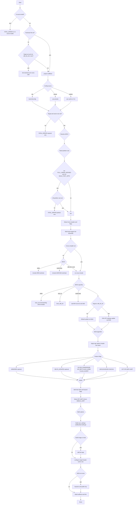

# wolfBoot CMake

Review the [Keystore Docs](../docs/keystore.md) and [Signing Docs](../docs/Signing.md)
regarding backup and storage of the generated `src/keystore.c` file. This file
is excluded from source in `.gitignore`.

**Save to a safe place outside of the wolfBoot tree.**

See the local [config_defaults.cmake](./config_defaults.cmake) file. Of particular interest
are some environment configuration settings:

```cmake
# Environments are detected in this order:
set(DETECT_VISUALGDB true)
set(DETECT_CUBEIDE true)
set(DETECT_VS2022 true)

# Enable HAL download only implemented for TMS devices at this time.
# See [WOLFBOOT_ROOT]/cmake/stm32_hal_download.cmake
# and [WOLFBOOT_ROOT]/cmake/downloads/stm32_hal_download.cmake
set(ENABLE_HAL_DOWNLOAD true)
set(FOUND_HAL_BASE false)

# optionally use .config files; See CMakePresets.json instead
set(USE_DOT_CONFIG false)
```

## Relevant CMake Files

- [`WOLFBOOT_ROOT`/CMakeLists.txt](../CMakeLists.txt) - Top-level CMake entry that configures the wolfBoot build.
Used to initialize the project, include cmake/wolfboot.cmake, set options, and define targets.
This file is where `project()` is declared and where toolchain logic or preset imports begin.

- [`WOLFBOOT_ROOT`/CMakePresets.json](../CMakePresets.json) - OS-agnostic CMake preset definitions.
Used by `cmake --preset {name}` and `cmake --build --preset {name}` to apply consistent settings.
Centralizes toolchain paths, target names, build directories, and key cache variables such as:
`{ "CMAKE_TOOLCHAIN_FILE": "cmake/toolchain_arm-none-eabi.cmake", "WOLFBOOT_TARGET": "stm32l4" }`.

- [`WOLFBOOT_ROOT`/CMakeSettings.json](../CMakeSettings.json) - Visual Studio integration file.
Maps Visual Studio configurations (Debug, Release) to existing CMake presets.
Controls IntelliSense, environment variables, and the preset shown in the VS CMake toolbar.

## This `cmake` Directory Overview

- [preset-examples/CMakeUserPresets.json.sample](./preset-examples/CMakeUserPresets.json.sample) - Example local overrides for user-specific paths and options. Copy to `CMakeUserPresets.json` in the `WOLFBOOT_ROOT` directory and customize. Not committed. Copy to `WOLFBOOT_ROOT` and remove the `.sample` suffix.

- [config_defaults.cmake](./config_defaults.cmake) - Default cache values and feature toggles used when presets or .config do not provide them.

- [cube_ide_config.cmake](./cube_ide_config.cmake) - Optional STM32CubeIDE integration. Maps CubeIDE variables or project layout into CMake context.

- [current_user.cmake](./current_user.cmake) - Cross-platform detection of the current user for path composition and cache hints.

- [downloads](./downloads) - Series-specific scripts and docs for fetching STM32 HAL and CMSIS artifacts on demand.

- [functions.cmake](./functions.cmake) - Reusable helper functions for path checks, argument validation, status output, and small build utilities.

- [load_dot_config.cmake](./load_dot_config.cmake) - Imports legacy `.config` values from Makefile-based builds into modern CMake cache variables.

- [stm32_hal_download.cmake](./stm32_hal_download.cmake) - Common download logic used by downloads/stm32*.cmake modules to fetch HAL and CMSIS.

- [toolchain_aarch64-none-elf.cmake](./toolchain_aarch64-none-elf.cmake) - Bare-metal AArch64 toolchain configuration for 64-bit ARM targets.

- [toolchain_arm-none-eabi.cmake](./toolchain_arm-none-eabi.cmake) - Main Cortex-M cross toolchain config. Disables try-run, standardizes flags, and sets compilers.

- [utils.cmake](./utils.cmake) - Lightweight utilities shared by other modules. Path normalization, small helpers, and logging wrappers.

- [visualgdb_config.cmake](./visualgdb_config.cmake) - VisualGDB quality-of-life settings for Windows builds that use Sysprogs BSPs.

- [vs2022_config.cmake](./vs2022_config.cmake) - Visual Studio 2022 integration hints. Keeps generator and environment consistent with VS CMake.

- [wolfboot.cmake](./wolfboot.cmake) - wolfBoot CMake glue: targets, include directories, compile definitions, and link rules.

- [downloads/README.md](./downloads/README.md) - Notes for the downloads subsystem and expected directory layout.

- [downloads/stm32l4.cmake](./downloads/stm32l4.cmake) - STM32L4 fetch script for HAL and CMSIS.

- [`WOLFBOOT_ROOT`/.vs/VSWorkspaceSettings.json](../.vs/VSWorkspaceSettings.json) - Exclusion directories: Visual Studio tries to be "helpful" and open a solution file. This is undesired when opening a directory as a CMake project.

----

### Build with cmake using `.config` files

Presets are preferred instead of `.config`, see below.

To use `.config` files instead of presets,

```bash
# cd your [WOLFBOOT_ROOT]

# Backup current config
mv ./.config ./.config.bak

# Get an example config
cp ./config/examples/stm32h7.config ./.config

# Call cmake with -DUSE_DOT_CONFIG=ON
cmake -S . -B build-stm32h7 -DUSE_DOT_CONFIG=ON

# Sample build
cmake --build build-stm32h7 -j
```

The output should look contain text like this:

```text
-- Found a .config file, will parse
-- Config mode: dot (.config cache)
-- Loading config from: /mnt/c/workspace/wolfBoot-gojimmypi
-- Reading config file: /mnt/c/workspace/wolfBoot-gojimmypi/.config
-- -- Parsing lines from config file...
-- -- Found line: ARCH?=ARM
-- -- Parsed key: ARCH
-- -- Parsed op:  ?
-- -- Parsed val: ARM
-- -- Assignment: ARCH=ARM
-- -- Found line: TARGET?=stm32h7
-- -- Parsed key: TARGET
-- -- Parsed op:  ?
-- -- Parsed val: stm32h7
-- -- Assignment: TARGET=stm32h7
-- -- Found line: SIGN?=ECC256
-- -- Parsed key: SIGN
-- -- Parsed op:  ?
-- -- Parsed val: ECC256
  ...etc...
```

Calling `cmake` with an existing `.config` file will default to dot-config mode.

```bash
ls .config
cmake -S . -B build-stm32h7
```

Specify additional directories, for example the STM32L4:

```bash
cmake -S . -B build-stm32l4 -DUSE_DOT_CONFIG=ON \
  -DHAL_DRV="${VG_BASE}/Drivers/STM32L4xx_HAL_Driver" \
  -DHAL_CMSIS_DEV="${VG_BASE}/Drivers/CMSIS/Device/ST/STM32L4xx/Include" \
  -DHAL_CMSIS_CORE="${VG_BASE}/Drivers/CMSIS/Include" \
  -DHAL_TEMPLATE_INC="${VG_BASE}/Drivers/STM32L4xx_HAL_Driver/Inc"

cmake --build build-stm32l4 -j
```

### Build presets

Each configure preset has a matching build preset with jobs=4, verbose=true, and targets=["all"].

Example commands:

```bash
cmake --preset stm32l4
cmake --build --preset stm32l4

cmake --preset stm32h7
cmake --build --preset stm32h7
```

### CMake User Presets.

See the [preset-examples/CMakeUserPresets.json.sample(./preset-examples/CMakeUserPresets.json.sample).
Copy the file to `WOLFBOOT_ROOT` and remove the`.sample` suffix: `CMakeUserPresets.json`.

It is critically important that none the names of a user preset do not conflict with regular presets.

For instance, the sample extends and overrides some of the `stm32l4` settings,
using LLVM clang on Windows, and prefixes ALL the names with `my-`:

```json
{
  "version": 3,
  "configurePresets": [
    {
      "name": "my-stm32l4",
      "displayName": "my STM32L4",
      "inherits": [
        "stm32l4"
      ],
      "generator": "Ninja",
      "binaryDir": "${sourceDir}/build-my-stm32l4",
      "cacheVariables": {
        "ARM_GCC_BIN": "C:/SysGCC/arm-eabi/bin",
        "HOST_CC": "C:/Program Files/LLVM/bin/clang.exe"
      }
    }
  ],
  "buildPresets": [
    {
      "name": "my-stm32l4",
      "configurePreset": "my-stm32l4"
    }
  ]
}
```


From the [docs for CMake Presets](https://cmake.org/cmake/help/latest/manual/cmake-presets.7.html):

>"Added in version 3.19.
>
>One problem that CMake users often face is sharing settings with other people for common ways to configure
a project. This may be done to support CI builds, or for users who frequently use the same build. CMake
supports two main files, `CMakePresets.json` and `CMakeUserPresets.json`, that allow users to specify common
configure options and share them with others. CMake also supports files included with the include field.
>
>`CMakePresets.json` and` CMakeUserPresets.json` live in the project's root directory. They both have
exactly the same format, and both are optional (though at least one must be present if `--preset` is
specified). `CMakePresets.json` is meant to specify project-wide build details, while `CMakeUserPresets.json`
is meant for developers to specify their own local build details.
>
>CMakePresets.json may be checked into a version control system, and `CMakeUserPresets.json` should NOT be
checked in. For example, if a project is using Git, `CMakePresets.json` may be tracked, and
`CMakeUserPresets.json` should be added to the .gitignore."

## Troubleshooting

The wrong toolchain is being used, or a target was not specified:

```
Error: no such instruction: `isb'
```

### Other log files

Windows users may find cmake log files in this directory helpful:

```
C:\Users\%USERNAME%\AppData\Local\CMakeTools
```

## CMake Logic Flow

Simplified Diagram:



----

In more detail:

```mermaid
flowchart TD
  %% wolfBoot CMake Build Logic Flow (conservative syntax for VS 2022)

  %% ================================
  %% 0) Initial checks & toolchain
  %% ================================
  S["Start (cmake 3.16+)\ninclude(cmake/config_defaults.cmake)"] --> I1{"In-source build?"}
  I1 -- "yes" --> I1E["FATAL_ERROR:\nIn-source builds are not allowed"]
  I1 -- "no" --> T0{"CMAKE_TOOLCHAIN_FILE defined?"}
  T0 -- "no" --> T1{"WOLFBOOT_TARGET is set\nand not x86_64_efi or sim?"}
  T1 -- "yes" --> T2["Set CMAKE_TOOLCHAIN_FILE:\ncmake/toolchain_arm-none-eabi.cmake"]
  T1 -- "no" --> PRJ
  T0 -- "yes" --> PRJ

  %% ================================
  %% 1) Project & host env discovery
  %% ================================
  PRJ["project(wolfBoot)"] --> INC["include: cmake/functions.cmake\ninclude: cmake/utils.cmake"]
  INC --> IDE0{"DETECT_VISUALGDB?"}
  IDE0 -- "yes" --> IDE1["include(cmake/visualgdb_config.cmake)"]
  IDE0 -- "no" --> VS0{"Windows host and DETECT_VS2022\nand NOT FOUND_HAL_BASE?"}
  VS0 -- "yes" --> VS1["include(cmake/vs2022_config.cmake)"]
  VS0 -- "no" --> CUBE0{"DETECT_CUBEIDE and NOT FOUND_HAL_BASE?"}
  CUBE0 -- "yes" --> CUBE1["include(cmake/cube_ide_config.cmake)"]
  CUBE0 -- "no" --> HALD0{"NOT FOUND_HAL_BASE and ENABLE_HAL_DOWNLOAD?"}
  HALD0 -- "yes" --> HALD1{"WOLFBOOT_TARGET matches ^stm32?"}
  HALD1 -- "yes" --> HALD2["include(cmake/stm32_hal_download.cmake)"]
  HALD1 -- "no" --> HALWARN["WARNING:\nHAL not found and download not available"]
  HALD0 -- "no" --> CFGSRC

  %% ================================
  %% 2) Config source (dot vs preset)
  %% ================================
  CFGSRC{"USE_DOT_CONFIG?"} -- "yes" --> DOTINC["include(cmake/load_dot_config.cmake)"]
  CFGSRC -- "no" --> DOTDIS["Info:\nNo .config files will be read"]

  DOTINC --> DOTX{"Found file ./.config?"}
  DOTX -- "yes" --> DOTLOAD["WOLFBOOT_CONFIG_MODE=dot\nload_dot_config(.config)"]
  DOTX -- "no" --> NODOT["Info:\nNo .config file found"]

  DOTDIS --> PRESETQ{"WOLFBOOT_CONFIG_MODE equals preset?"}
  PRESETQ -- "yes" --> PRESETOK["Use cacheVariables from CMakePresets.json"]
  PRESETQ -- "no" --> PRESETNONE["Info:\nNot using .config nor CMakePresets.json"]

  %% ================================
  %% 3) Target, arch, partitions
  %% ================================
  subgraph TGT["Target, Arch, Partitions"]
    direction TB
    TGT0{"WOLFBOOT_TARGET empty?"}
    TGT0 -- "yes" --> TGT1["Set WOLFBOOT_TARGET from TARGET cache var"]
    TGT0 -- "no" --> TGT2["Status:\nBuilding for WOLFBOOT_TARGET"]
    TGT2 --> SEC0{"WOLFBOOT_SECTOR_SIZE defined?"}
    SEC0 -- "no" --> SECERR["FATAL_ERROR:\nWOLFBOOT_SECTOR_SIZE must be defined"]
    SEC0 -- "yes" --> AT0["Init ARM_TARGETS list"]
    AT0 --> ASEL{"Target in ARM_TARGETS?"}
    ASEL -- "yes" --> ARCH_ARM["ARCH = ARM"]
    ASEL -- "no" --> AX86{"Target equals x86_64_efi?"}
    AX86 -- "yes" --> ARCH_X86["ARCH = x86_64"]
    AX86 -- "no" --> ASIM{"Target equals sim?"}
    ASIM -- "yes" --> ARCH_SIM["ARCH = sim"]
    ASIM -- "no" --> AERR["FATAL_ERROR:\nUnable to configure ARCH"]

    PART0{"PULL_LINKER_DEFINES or BUILD_TEST_APPS set?"}
    PART0 -- "no" --> PART1{"Require partition vars:\nPARTITION_SIZE\nBOOT_ADDRESS\nUPDATE_ADDRESS\nSWAP_ADDRESS"}
    PART1 -- "no" --> PARTERR["FATAL_ERROR:\nMissing partition vars"]
    PART1 -- "yes" --> PARTOK["OK:\nPartition vars present"]
    PART0 -- "yes" --> PARTLK["OK:\nAddresses come from linker or tests"]
  end

  %% ================================
  %% 4) Host compiler & Windows shim
  %% ================================
  ARCH_ARM --> HOST
  ARCH_X86 --> HOST
  ARCH_SIM --> HOST
  HOST["Detect HOST_CC (gcc or clang or cl)\nSet HOST flags and HOST_IS_MSVC"] --> SHIM{"Windows host and HOST_IS_MSVC?"}
  SHIM -- "yes" --> SHIMON["Generate minimal unistd.h shim\nPrepend to HOST_INCLUDES"]
  SHIM -- "no" --> SHIMOFF["No shim"]

  %% ================================
  %% 5) Helper tools (native)
  %% ================================
  SHIMON --> TOOLS
  SHIMOFF --> TOOLS
  TOOLS["Build native tools with HOST_CC:\n- bin-assemble (custom)\n- sign (tools/keytools/sign.c)\n- keygen (tools/keytools/keygen.c)\nDefine KEYTOOL_SOURCES and flags"] --> TOOLSDONE["keytools ALL depends on sign and keygen"]

  %% ================================
  %% 6) Cross toolchain include (once)
  %% ================================
  TOOLSDONE --> XTC{"CMAKE_C_COMPILER already set?"}
  XTC -- "no" --> XTCSEL{"ARCH selection"}
  XTCSEL -- "ARM" --> XARM["include(cmake/toolchain_arm-none-eabi.cmake)"]
  XTCSEL -- "AARCH64" --> XA64["include(cmake/toolchain_aarch64-none-elf.cmake)"]
  XTCSEL -- "x86_64 or sim" --> XNONE["No cross toolchain include"]
  XTC -- "yes" --> XNONE

  %% ================================
  %% 7) Arch-specific sources and options
  %% ================================
  XNONE --> ARCHO{"Which ARCH?"}
  ARCHO -- "x86_64" --> AX86S["Add src/boot_x86_64.c\nIf DEBUG then add WOLFBOOT_DEBUG_EFI"]
  ARCHO -- "ARM" --> AARMS["Add src/boot_arm.c\nAdd ARCH_ARM\nAdd -ffreestanding -nostartfiles -fomit-frame-pointer"]
  ARCHO -- "AARCH64" --> AA64S["Add aarch64 sources\nAdd ARCH_AARCH64 NO_QNX WOLFBOOT_DUALBOOT MMU\nIf SPMATH then add sp_c32.c"]

  AX86S --> UPDS["UPDATE_SOURCES = src/update_flash.c (default)"]
  AARMS --> ARMSTMS{"WOLFBOOT_TARGET specifics"}
  ARMSTMS --> ARMf4{"Target stm32f4?"}
  ARMf4 -- "yes" --> ARMf4set["ARCH_FLASH_OFFSET=0x08000000\nRequire CLOCK_SPEED and PLL vars\nAdd compile definitions"]
  ARMSTMS --> ARMu5{"Target stm32u5?"}
  ARMu5 -- "yes" --> ARMu5set["ARCH_FLASH_OFFSET=0x08000000"]
  ARMSTMS --> ARMh7{"Target stm32h7?"}
  ARMh7 -- "yes" --> ARMh7set["ARCH_FLASH_OFFSET=0x08000000"]
  ARMSTMS --> ARMl0{"Target stm32l0?"}
  ARMl0 -- "yes" --> ARMl0inv["Set FLAGS_INVERT=ON"]
  AA64S --> UPDS

  UPDS --> EFIQ{"Target equals x86_64_efi?"}
  EFIQ -- "yes" --> EFICONF["Set GNU EFI crt0 and lds paths\nAdd TARGET_X86_64_EFI\nSet shared linker flags\nUPDATE_SOURCES = src/update_ram.c"]
  EFIQ -- "no" --> ARCHOFF["Continue"]

  %% ================================
  %% 8) DSA / signing, header size, stack
  %% ================================
  ARCHOFF --> DSA{"SIGN algorithm"}
  DSA -- "NONE" --> S_NONE["No signing; stack by hash\nAdd WOLFBOOT_NO_SIGN"]
  DSA -- "ECC256" --> S_ECC256["KEYTOOL --ecc256; add WOLFBOOT_SIGN_ECC256\nStack depends; header >= 256"]
  DSA -- "ECC384" --> S_ECC384["KEYTOOL --ecc384; add WOLFBOOT_SIGN_ECC384\nStack depends; header >= 512"]
  DSA -- "ECC521" --> S_ECC521["KEYTOOL --ecc521; add WOLFBOOT_SIGN_ECC521\nStack depends; header >= 512"]
  DSA -- "ED25519" --> S_ED25519["KEYTOOL --ed25519; add WOLFBOOT_SIGN_ED25519\nStack default 5000; header >= 256"]
  DSA -- "ED448" --> S_ED448["KEYTOOL --ed448; add WOLFBOOT_SIGN_ED448\nStack 1024 or 4376; header >= 512"]
  DSA -- "RSA2048" --> S_RSA2048["KEYTOOL --rsa2048; add WOLFBOOT_SIGN_RSA2048\nStack varies; header >= 512"]
  DSA -- "RSA4096" --> S_RSA4096["KEYTOOL --rsa4096; add WOLFBOOT_SIGN_RSA4096\nStack varies; header >= 1024"]

  S_NONE --> DSA_APPLY
  S_ECC256 --> DSA_APPLY
  S_ECC384 --> DSA_APPLY
  S_ECC521 --> DSA_APPLY
  S_ED25519 --> DSA_APPLY
  S_ED448 --> DSA_APPLY
  S_RSA2048 --> DSA_APPLY
  S_RSA4096 --> DSA_APPLY

  DSA_APPLY["Append IMAGE_HEADER_SIZE and SIGN_OPTIONS to WOLFBOOT_DEFS\nAdd -Wstack-usage and -Wno-unused"] --> FLAGS

  %% ================================
  %% 9) Feature flags and encryption
  %% ================================
  FLAGS{"Apply feature toggles"} --> F_PULL["If PULL_LINKER_DEFINES then add def"]
  FLAGS --> F_RAM["If RAM_CODE then add def"]
  FLAGS --> F_FHOME["If FLAGS_HOME then add FLAGS_HOME=1"]
  FLAGS --> F_FINV["If FLAGS_INVERT then add WOLFBOOT_FLAGS_INVERT=1"]
  FLAGS --> F_SPI["If SPI_FLASH or QSPI_FLASH or OCTOSPI_FLASH or UART_FLASH\nthen set EXT_FLASH and add sources"]
  FLAGS --> F_ENC{"ENCRYPT enabled?"}
  F_ENC -- "yes" --> F_ENCSEL{"Select AES128 or AES256 or CHACHA"}
  F_ENCSEL --> F_AES128["Add ENCRYPT_WITH_AES128; EXT_ENCRYPTED=1"]
  F_ENCSEL --> F_AES256["Add ENCRYPT_WITH_AES256; EXT_ENCRYPTED=1"]
  F_ENCSEL --> F_CHACHA["Default CHACHA; add ENCRYPT_WITH_CHACHA and HAVE_CHACHA\nEXT_ENCRYPTED=1"]
  FLAGS --> F_DOWN["If ALLOW_DOWNGRADE then add def"]
  FLAGS --> F_WO["If NVM_FLASH_WRITEONCE then add def"]
  FLAGS --> F_NOBKP["If DISABLE_BACKUP then add def"]
  FLAGS --> F_NOMPU["If NO_MPU then add WOLFBOOT_NO_MPU"]
  FLAGS --> F_VER{"WOLFBOOT_VERSION defined?"}
  F_VER -- "no" --> F_VERSET["Set WOLFBOOT_VERSION=1"]
  F_VER -- "yes" --> F_VEROK["Keep version"]

  %% ================================
  %% 10) Delta updates and armored
  %% ================================
  F_VEROK --> DELTA{"DELTA_UPDATES enabled?"}
  F_VERSET --> DELTA
  DELTA -- "yes" --> DELTAON["Add src/delta.c and DELTA_UPDATES\nIf DELTA_BLOCK_SIZE defined then add def"]
  DELTA -- "no" --> ARMOR{"ARMORED enabled?"}
  ARMOR -- "yes" --> ARMORON["Add WOLFBOOT_ARMORED"]
  ARMOR -- "no" --> NEXT0

  DELTAON --> NEXT0
  ARMORON --> NEXT0

  %% ================================
  %% 11) Hash selection
  %% ================================
  NEXT0 --> HASH{"HASH selection"}
  HASH -- "SHA256" --> H256["Add WOLFBOOT_HASH_SHA256"]
  HASH -- "SHA384" --> H384["Add WOLFBOOT_HASH_SHA384; KEYTOOL --sha384"]
  HASH -- "SHA3" --> H3["Add WOLFBOOT_HASH_SHA3_384; KEYTOOL --sha3"]

  %% ================================
  %% 12) HAL and drivers
  %% ================================
  H256 --> HAL
  H384 --> HAL
  H3 --> HAL
  HAL["SPI_TARGET and UART_TARGET default to WOLFBOOT_TARGET\nIf target is STM32 in list then SPI_TARGET=stm32"] --> HALDRV{"Drivers enabled?"}
  HALDRV -- "SPI_FLASH" --> DSPIS["Add spi driver and src/spi_flash.c"]
  HALDRV -- "QSPI_FLASH" --> DQSPIS["Add spi driver and src/qspi_flash.c"]
  HALDRV -- "UART_FLASH" --> DUART["Add uart driver and src/uart_flash.c"]
  HALDRV -- "none" --> HALNEXT["No external flash drivers"]
  HALDRV --> DBGQ{"DEBUG_UART enabled?"}
  DBGQ -- "yes" --> DBGON["Add DEBUG_UART and uart driver path"]
  DBGQ -- "no" --> DBGOFF["No debug uart"]

  %% ================================
  %% 13) Math options (wolfSSL)
  %% ================================
  DBGOFF --> MATH
  DBGON --> MATH
  MATH{"SPMATH / SPMATHALL"} --> MALL["If SPMATHALL then add WOLFSSL_SP_MATH_ALL"]
  MATH --> MFAST["If neither then add USE_FAST_MATH"]
  MATH --> MNONE["If only SPMATH then no extra def"]

  %% ================================
  %% 14) Build HAL libs and wolfcrypt
  %% ================================
  MALL --> LIBS0
  MFAST --> LIBS0
  MNONE --> LIBS0
  LIBS0["add_library(user_settings INTERFACE)\nadd_library(wolfboothal)"] --> STM32L4Q{"Target equals stm32l4?"}
  STM32L4Q -- "yes" --> L4HAL["Create stm32l4_hal subset\nLink into wolfboothal"]
  STM32L4Q -- "no" --> L4SKIP["Skip stm32l4 subset"]
  L4HAL --> CRYPT
  L4SKIP --> CRYPT
  CRYPT["add_subdirectory(lib) for wolfcrypt"] --> BUILDIMG{"BUILD_TEST_APPS or BUILD_IMAGE?"}
  BUILDIMG -- "yes" --> ADDAPP["Print status and add_subdirectory(test-app)"]
  BUILDIMG -- "no" --> VARS

  %% ================================
  %% 15) Cache vars, target.h, target iface
  %% ================================
  ADDAPP --> VARS
  VARS["Set INTERNAL cache vars\nconfigure_file target.h\nadd_library(target INTERFACE)"] --> KEYGENQ{"SIGN is not NONE?"}

  %% ================================
  %% 16) Keystore generation and public key lib
  %% ================================
  KEYGENQ -- "yes" --> KEYGEN["add_custom_target(keystore)\nIf keystore.c missing then run keygen"]
  KEYGENQ -- "no" --> KEYGENSKIP["Skip keystore and public_key"]
  KEYGEN --> PUBKEY["add_library(public_key)\nUse generated keystore.c\nLink target"]
  KEYGENSKIP --> WBLIB

  %% ================================
  %% 17) Final libraries
  %% ================================
  PUBKEY --> WBLIB
  WBLIB["add_library(wolfboot)\nAdd src/libwolfboot.c and flash sources\nApply WOLFBOOT_DEFS and include dirs\nLink wolfboothal target wolfcrypt\nAdd -Wno-unused and SIM_COMPILE_OPTIONS"] --> DONE["Done"]

```


