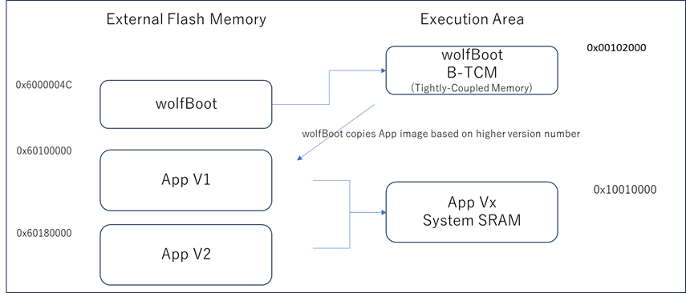

# Targets

This README describes configuration of supported targets.

## Supported Targets

* [Cortex-A53 / Raspberry PI 3](#cortex-a53--raspberry-pi-3-experimental)
* [Cypress PSoC-6](#cypress-psoc-6)
* [Infineon AURIX TC3xx](#infineon-aurix-tc3xx)
* [Intel x86-64 Intel FSP](#intel-x86_64-with-intel-fsp-support)
* [Microchip SAME51](#microchip-same51)
* [NXP Kinetis](#nxp-kinetis)
* [NXP LPC54xxx](#nxp-lpc54xxx)
* [NXP MCXA153](#nxp-mcxa153)
* [NXP P1021 PPC](#nxp-qoriq-p1021-ppc)
* [NXP T1024 PPC](#nxp-qoriq-t1024-ppc)
* [NXP T2080 PPC](#nxp-qoriq-t2080-ppc)
* [NXP iMX-RT](#nxp-imx-rt)
* [Nordic nRF52840](#nordic-nrf52840)
* [Qemu x86-64 UEFI](#qemu-x86-64-uefi)
* [Renesas RA6M4](#renesas-ra6m4)
* [Renesas RX65N](#renesas-rx65n)
* [Renesas RX72N](#renesas-rx72n)
* [Renesas RZN2L](#renesas-rzn2l)
* [STM32C0](#stm32c0)
* [STM32F4](#stm32f4)
* [STM32F7](#stm32f7)
* [STM32G0](#stm32g0)
* [STM32H5](#stm32h5)
* [STM32H7](#stm32h7)
* [STM32L0](#stm32l0)
* [STM32L4](#stm32l4)
* [STM32L5](#stm32l5)
* [STM32U5](#stm32u5)
* [STM32WB55](#stm32wb55)
* [SiFive HiFive1 RISC-V](#sifive-hifive1-risc-v)
* [TI Hercules TMS570LC435](#ti-hercules-tms570lc435)
* [Xilinx Zynq UltraScale](#xilinx-zynq-ultrascale)


## STM32F4

Example 512KB partitioning on STM32-F407

The example firmware provided in the `test-app` is configured to boot from the primary partition
starting at address 0x20000. The flash layout is provided by the default example using the following
configuration in `target.h`:

```C
#define WOLFBOOT_SECTOR_SIZE              0x20000
#define WOLFBOOT_PARTITION_SIZE           0x20000

#define WOLFBOOT_PARTITION_BOOT_ADDRESS   0x20000
#define WOLFBOOT_PARTITION_UPDATE_ADDRESS 0x40000
#define WOLFBOOT_PARTITION_SWAP_ADDRESS   0x60000
```

This results in the following partition configuration:


This configuration demonstrates one of the possible layouts, with the slots
aligned to the beginning of the physical sector on the flash.

The entry point for all the runnable firmware images on this target will be `0x20100`,
256 Bytes after the beginning of the first flash partition. This is due to the presence
of the firmware image header at the beginning of the partition, as explained more in details
in [Firmware image](firmware_image.md)

In this particular case, due to the flash geometry, the swap space must be as big as 128KB, to account for proper sector swapping between the two images.

On other systems, the SWAP space can be as small as 512B, if multiple smaller flash blocks are used.

More information about the geometry of the flash and in-application programming (IAP) can be found in the manufacturer manual of each target device.

### STM32F4 Programming

```
st-flash write factory.bin 0x08000000
```

### STM32F4 Debugging

1. Start GDB server

OpenOCD: `openocd --file ./config/openocd/openocd_stm32f4.cfg`
OR
ST-Link: `st-util -p 3333`

2. Start GDB Client

```sh
arm-none-eabi-gdb
add-symbol-file test-app/image.elf 0x20100
mon reset init
b main
c
```


## STM32L4
Example 1MB partitioning on STM32L4

- Sector size: 4KB
- Wolfboot partition size: 40 KB
- Application partition size: 488 KB

```C
#define WOLFBOOT_SECTOR_SIZE                 0x1000   /* 4 KB */
#define WOLFBOOT_PARTITION_BOOT_ADDRESS      0x0800A000
#define WOLFBOOT_PARTITION_SIZE              0x7A000  /* 488 KB */
#define WOLFBOOT_PARTITION_UPDATE_ADDRESS    0x08084000
#define WOLFBOOT_PARTITION_SWAP_ADDRESS      0x080FE000
```


## STM32L5

### Scenario 1: TrustZone Enabled


#### Example Description

The implementation shows how to switch from secure application to non-secure application,
thanks to the system isolation performed, which splits the internal Flash and internal
SRAM memories into two parts:
 - the first half is used by wolfboot running in secure mode and the secure application
 - the remaining available space is used for non-secure application and update partition

The example configuration for this scenario is available in [/config/examples/stm32l5.config](/config/examples/stm32l5.config).

#### Hardware and Software environment

- This example runs on STM32L562QEIxQ devices with security enabled (TZEN=1).
- This example has been tested with STMicroelectronics STM32L562E-DK (MB1373)
- User Option Bytes requirement (with STM32CubeProgrammer tool - see below for instructions)

```
TZEN = 1                            System with TrustZone-M enabled
DBANK = 1                           Dual bank mode
SECWM1_PSTRT=0x0  SECWM1_PEND=0x7F  All 128 pages of internal Flash Bank1 set as secure
SECWM2_PSTRT=0x1  SECWM2_PEND=0x0   No page of internal Flash Bank2 set as secure, hence Bank2 non-secure
```

- NOTE: STM32CubeProgrammer V2.3.0 is required  (v2.4.0 has a known bug for STM32L5)

#### How to use it

1. `cp ./config/examples/stm32l5.config .config`
2. `make`
3. Prepare board with option bytes configuration reported above
    - `STM32_Programmer_CLI -c port=swd mode=hotplug -ob TZEN=1 DBANK=1`
    - `STM32_Programmer_CLI -c port=swd mode=hotplug -ob SECWM1_PSTRT=0x0 SECWM1_PEND=0x7F SECWM2_PSTRT=0x1 SECWM2_PEND=0x0`
4. flash wolfBoot.bin to 0x0c00 0000
    - `STM32_Programmer_CLI -c port=swd -d ./wolfboot.bin 0x0C000000`
5. flash .\test-app\image_v1_signed.bin to 0x0804 0000
    - `STM32_Programmer_CLI -c port=swd -d ./test-app/image_v1_signed.bin 0x08040000`
6. RED LD9 will be on

- NOTE: STM32_Programmer_CLI Default Locations
* Windows: `C:\Program Files\STMicroelectronics\STM32Cube\STM32CubeProgrammer\bin\STM32_Programmer_CLI.exe`
* Linux: `/usr/local/STMicroelectronics/STM32Cube/STM32CubeProgrammer/bin/STM32_Programmer_CLI`
* Mac OS/X: `/Applications/STMicroelectronics/STM32Cube/STM32CubeProgrammer/STM32CubeProgrammer.app/Contents/MacOs/bin/STM32_Programmer_CLI`

### Scenario 2: Trustzone Enabled, wolfCrypt as secure engine for NS applications

This is similar to Scenario 1, but also includes wolfCrypt in secure mode, and
that can be accessed via PKCS11 interface by non-secure applications.

This option can be enabled with the `WOLFCRYPT_TZ=1` and `WOLFCRYPT_TZ_PKCS11=1`
options in your configuration. This enables a PKCS11 accessible from NS domain via
non-secure callables (NSC).

The example configuration for this scenario is available in [/config/examples/stm32l5-wolfcrypt-tz.config](/config/examples/stm32l5-wolfcrypt-tz.config).

For more information, see [/docs/STM32-TZ.md](/docs/STM32-TZ.md).


### Scenario 3: Trustzone Disabled, using DUAL BANK

#### Example Description

The implementation shows how to use STM32L5xx in DUAL BANK mode, with TrustZone disabled.
The DUAL_BANK option is only available on this target when TrustZone is disabled (TZEN = 0).

The flash memory is segmented into two different banks:

  - Bank 0: (0x08000000)
  - Bank 1: (0x08040000)

Bank 0 contains the bootloader at address 0x08000000, and the application at address 0x08040000.
When a valid image is available at the same offset in Bank 1, a candidate is selected for booting between the two valid images.
A firmware update can be uploaded at address 0x08048000.

The example configuration is available in [/config/examples/stm32l5-nonsecure-dualbank.config](/config/examples/stm32l5-nonsecure-dualbank.config).

To run flash `./test-app/image.bin` to `0x08000000`.
    - `STM32_Programmer_CLI -c port=swd -d ./test-app/image.bin 0x08000000`

Or program each partition using:
1. flash `wolfboot.bin` to 0x08000000:
    - `STM32_Programmer_CLI -c port=swd -d ./wolfboot.elf`
2. flash main application to 0x0800 a000
    - `STM32_Programmer_CLI -c port=swd -d ./test-app/image_v1_signed.bin 0x0800a000`

RED LD9 will be on indicating successful boot ().

Updates can be flashed at 0x0804a000:

- `STM32_Programmer_CLI -c port=swd -d ./test-app/image_v2_signed.bin 0x0804a000`

The two partition are logically remapped by using BANK_SWAP capabilities. This partition
swap is immediate and does not require a SWAP partition.


### Debugging

Use `make DEBUG=1` and reload firmware.

- STM32CubeIDE v.1.3.0 required
- Run the debugger via:

Linux:

```
ST-LINK_gdbserver -d -cp /opt/st/stm32cubeide_1.3.0/plugins/com.st.stm32cube.ide.mcu.externaltools.cubeprogrammer.linux64_1.3.0.202002181050/tools/bin -e -r 1 -p 3333`
```

Max OS/X:

```sh
sudo ln -s /Applications/STM32CubeIDE.app/Contents/Eclipse/plugins/com.st.stm32cube.ide.mcu.externaltools.stlink-gdb-server.macos64_1.6.0.202101291314/tools/bin/native/mac_x64/libSTLinkUSBDriver.dylib /usr/local/lib/libSTLinkUSBDriver.dylib

/Applications/STM32CubeIDE.app/Contents/Eclipse/plugins/com.st.stm32cube.ide.mcu.externaltools.stlink-gdb-server.macos64_1.6.0.202101291314/tools/bin/ST-LINK_gdbserver -d -cp ./Contents/Eclipse/plugins/com.st.stm32cube.ide.mcu.externaltools.cubeprogrammer.macos64_1.6.0.202101291314/tools/bin -e -r 1 -p 3333
```

- Connect with arm-none-eabi-gdb

wolfBoot has a .gdbinit to configure
```
arm-none-eabi-gdb
add-symbol-file test-app/image.elf
mon reset init
```


## STM32U5

The STM32U5 is a Cortex-M33 (ARMv8-M).

Note: We have seen issues with vector table alignment, so the default image header size (IMAGE_HEADER_SIZE) has been increased to 1024 bytes to avoid potential issues.

### Scenario 1: TrustZone enabled, staging non-secure application

#### Example description

The implementation shows how to switch from secure application to non-secure application,
thanks to the system isolation performed, which splits the internal Flash and internal
SRAM memories into two parts:
 - the first 256KB are used by wolfboot running in secure mode and the secure application
 - the remaining available space is used for non-secure application and update partition

The example configuration for this scenario is available in [/config/examples/stm32u5.config](/config/examples/stm32u5.config).

#### Example Description

The implementation shows how to switch from secure application to non-secure application,
thanks to the system isolation performed, which splits the internal Flash and internal
SRAM memories into two parts:
 - the first half for secure application
 - the second half for non-secure application

#### Hardware and Software environment

- This example runs on STM32U585AII6Q devices with security enabled (TZEN=1).
- This example has been tested with STMicroelectronics B-U585I-IOT02A (MB1551)
- User Option Bytes requirement (with STM32CubeProgrammer tool - see below for instructions)

```
TZEN = 1                            System with TrustZone-M enabled
DBANK = 1                           Dual bank mode
SECWM1_PSTRT=0x0  SECWM1_PEND=0x7F  All 128 pages of internal Flash Bank1 set as secure
SECWM2_PSTRT=0x1  SECWM2_PEND=0x0   No page of internal Flash Bank2 set as secure, hence Bank2 non-secure
```

- NOTE: STM32CubeProgrammer V2.8.0 or newer is required

#### How to use it

1. `cp ./config/examples/stm32u5.config .config`
2. `make TZEN=1`
3. Prepare board with option bytes configuration reported above
    - `STM32_Programmer_CLI -c port=swd mode=hotplug -ob TZEN=1 DBANK=1`
    - `STM32_Programmer_CLI -c port=swd mode=hotplug -ob SECWM1_PSTRT=0x0 SECWM1_PEND=0x7F SECWM2_PSTRT=0x1 SECWM2_PEND=0x0`
4. flash wolfBoot.bin to 0x0c000000
    - `STM32_Programmer_CLI -c port=swd -d ./wolfboot.bin 0x0C000000`
5. flash .\test-app\image_v1_signed.bin to 0x08010000
    - `STM32_Programmer_CLI -c port=swd -d ./test-app/image_v1_signed.bin 0x08100000`
6. RED LD9 will be on

- NOTE: STM32_Programmer_CLI Default Locations
* Windows: `C:\Program Files\STMicroelectronics\STM32Cube\STM32CubeProgrammer\bin\STM32_Programmer_CLI.exe`
* Linux: `/usr/local/STMicroelectronics/STM32Cube/STM32CubeProgrammer/bin/STM32_Programmer_CLI`
* Mac OS/X: `/Applications/STMicroelectronics/STM32Cube/STM32CubeProgrammer/STM32CubeProgrammer.app/Contents/MacOs/bin/STM32_Programmer_CLI`

### Scenario 2: TrustZone Enabled, wolfCrypt as secure engine for NS applications

This is similar to Scenario 1, but also includes wolfCrypt in secure mode, and
that can be accessed via PKCS11 interface by non-secure applications.

This option can be enabled with the `WOLFCRYPT_TZ=1` and `WOLFCRYPT_TZ_PKCS11=1`
options in your configuration. This enables a PKCS11 accessible from NS domain via
non-secure callables (NSC).

The example configuration for this scenario is available in [/config/examples/stm32u5-wolfcrypt-tz.config](/config/examples/stm32u5-wolfcrypt-tz.config).

For more information, see [/docs/STM32-TZ.md](/docs/STM32-TZ.md).


### Scenario 3: TrustZone Disabled (DUAL BANK mode)

#### Example Description

The implementation shows how to use STM32U5xx in DUAL_BANK mode, with TrustZone disabled.
The DUAL_BANK option is only available on this target when TrustZone is disabled (TZEN = 0).

The flash memory is segmented into two different banks:

  - Bank 0: (0x08000000)
  - Bank 1: (0x08100000)

Bank 0 contains the bootloader at address 0x08000000, and the application at address 0x08100000.
When a valid image is available at the same offset in Bank 1, a candidate is selected for booting between the two valid images.
A firmware update can be uploaded at address 0x08108000.

The example configuration is available in [/config/examples/stm32u5-nonsecure-dualbank.config](/config/examples/stm32u5-nonsecure-dualbank.config).

Program each partition using:
1. flash `wolfboot.bin` to 0x08000000:
    - `STM32_Programmer_CLI -c port=swd -d ./wolfboot.bin 0x08000000`
2. flash `image_v1_signed.bin` to 0x08008000
    - `STM32_Programmer_CLI -c port=swd -d ./test-app/image_v1_signed.bin 0x08008000`

RED LD9 will be on indicating successful boot ()

### Debugging

Use `make DEBUG=1` and reload firmware.

- STM32CubeIDE v.1.7.0 required
- Run the debugger via:

Linux:

```
ST-LINK_gdbserver -d -cp /opt/st/stm32cubeide_1.3.0/plugins/com.st.stm32cube.ide.mcu.externaltools.cubeprogrammer.linux64_1.3.0.202002181050/tools/bin -e -r 1 -p 3333`
```

Max OS/X:

```sh
/Applications/STM32CubeIDE.app/Contents/Eclipse/plugins/com.st.stm32cube.ide.mcu.externaltools.stlink-gdb-server.macos64_2.1.300.202403291623/tools/bin/ST-LINK_gdbserver -d -cp /Applications/STM32CubeIDE.app/Contents/Eclipse/plugins/com.st.stm32cube.ide.mcu.externaltools.cubeprogrammer.macos64_2.1.201.202404072231/tools/bin -e -r 1 -p 3333
```

Win:

```
ST-LINK_gdbserver -d -cp C:\ST\STM32CubeIDE_1.7.0\STM32CubeIDE\plugins\com.st.stm32cube.ide.mcu.externaltools.cubeprogrammer.win32_2.0.0.202105311346\tools\bin -e -r 1 -p 3333`
```
- Connect with arm-none-eabi-gdb or gdb-multiarch

wolfBoot has a .gdbinit to configure
```
add-symbol-file test-app/image.elf
```


## STM32L0

Example 192KB partitioning on STM32-L073

This device is capable of erasing single flash pages (256B each).

However, we choose to use a logic sector size of 4KB for the swaps, to limit the amount of
writes to the swap partition.

The proposed geometry in this example `target.h` uses 32KB for wolfBoot, and two
partitions of 64KB each, leaving room for up to 8KB to use for swap (4K are being used here).

```C
#define WOLFBOOT_SECTOR_SIZE                 0x1000   /* 4 KB */
#define WOLFBOOT_PARTITION_BOOT_ADDRESS      0x8000
#define WOLFBOOT_PARTITION_SIZE              0x10000 /* 64 KB */
#define WOLFBOOT_PARTITION_UPDATE_ADDRESS    0x18000
#define WOLFBOOT_PARTITION_SWAP_ADDRESS      0x28000
```

### STM32L0 Building

Use `make TARGET=stm32l0`. The option `CORTEX_M0` is automatically selected for this target.


## STM32G0

Supports STM32G0x0x0/STM32G0x1.

Example 128KB partitioning on STM32-G070:

- Sector size: 2KB
- Wolfboot partition size: 32KB
- Application partition size: 44 KB

```C
#define WOLFBOOT_SECTOR_SIZE                 0x800   /* 2 KB */
#define WOLFBOOT_PARTITION_BOOT_ADDRESS      0x08008000
#define WOLFBOOT_PARTITION_SIZE              0xB000  /* 44 KB */
#define WOLFBOOT_PARTITION_UPDATE_ADDRESS    0x08013000
#define WOLFBOOT_PARTITION_SWAP_ADDRESS      0x0801E000
```

### Building STM32G0

Reference configuration (see [/config/examples/stm32g0.config](/config/examples/stm32g0.config)).
You can copy this to wolfBoot root as `.config`: `cp ./config/examples/stm32g0.config .config`.
To build you can use `make`.

The TARGET for this is `stm32g0`: `make TARGET=stm32g0`.
The option `CORTEX_M0` is automatically selected for this target.
The option `NVM_FLASH_WRITEONCE=1` is mandatory on this target, since the IAP driver does not support
multiple writes after each erase operation.

#### STM32G0 Secure Hide Protection Feature (Optional)

This part supports a "secure memory protection" feature makes the wolfBoot partition unaccessible after jump to application.

It uses the `FLASH_CR:SEC_PROT` and `FLASH_SECT:SEC_SIZE` registers. This is the
number of 2KB pages to block access to from the 0x8000000 base address.

Command example to enable this for 32KB bootloader:

```
STM32_Programmer_CLI -c port=swd mode=hotplug -ob SEC_SIZE=0x10
```

Enabled with `CFLAGS_EXTRA+=-DFLASH_SECURABLE_MEMORY_SUPPORT`.
Requires `RAM_CODE=1` to enable RAMFUNCTION support.

### STM32G0 Programming

Compile requirements: `make TARGET=stm32g0 NVM_FLASH_WRITEONCE=1`

The output is a single `factory.bin` that includes `wolfboot.bin` and `test-app/image_v1_signed.bin` combined together.
This should be programmed to the flash start address `0x08000000`.

Flash using the STM32CubeProgrammer CLI:

```
STM32_Programmer_CLI -c port=swd -d factory.bin 0x08000000
```

### STM32G0 Debugging

Use `make DEBUG=1` and program firmware again.

Start GDB server on port 3333:

```
ST-LINK_gdbserver -d -e -r 1 -p 3333
OR
st-util -p 3333
```

wolfBoot has a .gdbinit to configure GDB

```
arm-none-eabi-gdb
add-symbol-file test-app/image.elf 0x08008100
mon reset init
```

## STM32C0

Supports STM32C0x0/STM32C0x1. Instructions are for the STM Nucleo-C031C6 dev board.

Tested build configurations:
* With RSA2048 and SHA2-256 the code size is 10988 and it boots in under 1 second.
* With ED25519 and SHA2-384 the code size is 10024 and takes about 10 seconds for the LED to turn on.
* With LMS-8-10-1 and SHA2-256 the code size is 8164 on gcc-13 (could fit in 8KB partition)

### Example 32KB partitioning on STM32-G070

with ED25519 or LMS-8-10-1:

- Sector size: 2KB
- Wolfboot partition size: 10KB
- Application partition size: 10 KB
- Swap size 2KB

```C
#define WOLFBOOT_SECTOR_SIZE                 0x800   /* 2 KB */
#define WOLFBOOT_PARTITION_BOOT_ADDRESS      0x08002800 /* at 10KB */
#define WOLFBOOT_PARTITION_SIZE              0x2800  /* 10 KB */
#define WOLFBOOT_PARTITION_UPDATE_ADDRESS    0x08005000 /* at 20KB */
#define WOLFBOOT_PARTITION_SWAP_ADDRESS      0x08007800 /* at 30KB */
```

with RSA2048:

- Sector size: 2KB
- Wolfboot partition size: 12KB
- Application partition size: 8 KB
- Swap size 2KB

```C
#define WOLFBOOT_SECTOR_SIZE                 0x800      /* 2 KB */
#define WOLFBOOT_PARTITION_BOOT_ADDRESS      0x08003000 /* at 12KB */
#define WOLFBOOT_PARTITION_SIZE              0x2000     /* 8 KB */
#define WOLFBOOT_PARTITION_UPDATE_ADDRESS    0x08005000 /* at 20KB */
#define WOLFBOOT_PARTITION_SWAP_ADDRESS      0x08007800 /* at 30KB */
```

### Building STM32C0

Reference configuration files (see [config/examples/stm32c0.config](/config/examples/stm32c0.config),
[config/examples/stm32c0-rsa2048.config](/config/examples/stm32c0-rsa2048.config) and
[config/examples/stm32c0-lms-8-10-1.config](/config/examples/stm32c0-lms-8-10-1.config)).

You can copy one of these to wolfBoot root as `.config`: `cp ./config/examples/stm32c0.config .config`.
To build you can use `make`.

The TARGET for this is `stm32c0`: `make TARGET=stm32c0`.
The option `CORTEX_M0` is automatically selected for this target.
The option `NVM_FLASH_WRITEONCE=1` is mandatory on this target, since the IAP driver does not support
multiple writes after each erase operation.

#### STM32C0 Secure Hide Protection Feature (Optional)

This part supports a "secure memory protection" feature makes the wolfBoot partition unaccessible after jump to application.

It uses the `FLASH_CR:SEC_PROT` and `FLASH_SECT:SEC_SIZE` registers. This is the
number of 2KB pages to block access to from the 0x8000000 base address.

Command example to enable this for 10KB bootloader:

```
STM32_Programmer_CLI -c port=swd mode=hotplug -ob SEC_SIZE=0x05
```

Enabled with `CFLAGS_EXTRA+=-DFLASH_SECURABLE_MEMORY_SUPPORT`.
Requires `RAM_CODE=1` to enable RAMFUNCTION support.

### STM32C0 Programming

Compile requirements: `make TARGET=stm32c0 NVM_FLASH_WRITEONCE=1`

The output is a single `factory.bin` that includes `wolfboot.bin` and `test-app/image_v1_signed.bin` combined together.
This should be programmed to the flash start address `0x08000000`.

Flash using the STM32CubeProgrammer CLI:

```
STM32_Programmer_CLI -c port=swd -d factory.bin 0x08000000
```

### STM32C0 Debugging

Use `make DEBUG=1` and program firmware again.

Start GDB server on port 3333:

```
ST-LINK_gdbserver -d -e -r 1 -p 3333
OR
st-util -p 3333
```

wolfBoot has a .gdbinit to configure GDB

```
arm-none-eabi-gdb
add-symbol-file test-app/image.elf 0x08008100
mon reset init
```


## STM32WB55

Example partitioning on Nucleo-68 board:

- Sector size: 4KB
- Wolfboot partition size: 32 KB
- Application partition size: 128 KB

```C
#define WOLFBOOT_SECTOR_SIZE                 0x1000   /* 4 KB */
#define WOLFBOOT_PARTITION_BOOT_ADDRESS      0x8000
#define WOLFBOOT_PARTITION_SIZE              0x20000 /* 128 KB */
#define WOLFBOOT_PARTITION_UPDATE_ADDRESS    0x28000
#define WOLFBOOT_PARTITION_SWAP_ADDRESS      0x48000
```

### STM32WB55 Building

Use `make TARGET=stm32wb`.

The option `NVM_FLASH_WRITEONCE=1` is mandatory on this target, since the IAP driver does not support
multiple writes after each erase operation.

Compile with:

`make TARGET=stm32wb NVM_FLASH_WRITEONCE=1`

### STM32WB55 with OpenOCD

`openocd --file ./config/openocd/openocd_stm32wbx.cfg`

```
telnet localhost 4444
reset halt
flash write_image unlock erase factory.bin 0x08000000
flash verify_bank 0 factory.bin
reset
```

### STM32WB55 with ST-Link

```
git clone https://github.com/stlink-org/stlink.git
cd stlink
cmake .
make
sudo make install
```

```
st-flash write factory.bin 0x08000000

# Start GDB server
st-util -p 3333
```

### STM32WB55 Debugging

Use `make DEBUG=1` and reload firmware.

wolfBoot has a .gdbinit to configure
```
arm-none-eabi-gdb
add-symbol-file test-app/image.elf 0x08008100
mon reset init
```


## SiFive HiFive1 RISC-V

### Features
* E31 RISC-V 320MHz 32-bit processor
* Onboard 16KB scratchpad RAM
* External 4MB QSPI Flash

### Default Linker Settings
* FLASH: Address 0x20000000, Len 0x6a120 (424 KB)
* RAM:   Address 0x80000000, Len 0x4000  (16 KB)

### Stock bootloader
Start Address: 0x20000000 is 64KB. Provides a "double tap" reset feature to halt boot and allow debugger to attach for reprogramming. Press reset button, when green light comes on press reset button again, then board will flash red.

### Application Code
Start Address: 0x20010000

### wolfBoot configuration

The default wolfBoot configuration will add a second stage bootloader, leaving the stock "double tap" bootloader as a fallback for recovery. Your production implementation should replace this and partition addresses in `target.h` will need updated, so they are `0x10000` less.

To set the Freedom SDK location use `FREEDOM_E_SDK=~/src/freedom-e-sdk`.

For testing wolfBoot here are the changes required:

1. Makefile arguments:
    * ARCH=RISCV
    * TARGET=hifive1

    ```
    make ARCH=RISCV TARGET=hifive1 RAM_CODE=1 clean
    make ARCH=RISCV TARGET=hifive1 RAM_CODE=1
    ```

    If using the `riscv64-unknown-elf-` cross compiler you can add `CROSS_COMPILE=riscv64-unknown-elf-` to your `make` or modify `arch.mk` as follows:

    ```
     ifeq ($(ARCH),RISCV)
    -  CROSS_COMPILE:=riscv32-unknown-elf-
    +  CROSS_COMPILE:=riscv64-unknown-elf-
    ```


2. `include/target.h`

Bootloader Size: 0x10000 (64KB)
Application Size 0x40000 (256KB)
Swap Sector Size: 0x1000 (4KB)

```c
#define WOLFBOOT_SECTOR_SIZE                 0x1000
#define WOLFBOOT_PARTITION_BOOT_ADDRESS      0x20020000

#define WOLFBOOT_PARTITION_SIZE              0x40000
#define WOLFBOOT_PARTITION_UPDATE_ADDRESS    0x20060000
#define WOLFBOOT_PARTITION_SWAP_ADDRESS      0x200A0000
```

### Build Options

* To use ECC instead of ED25519 use make argument `SIGN=ECC256`
* To output wolfboot as hex for loading with JLink use make argument `wolfboot.hex`

### Loading

Loading with JLink:

```
JLinkExe -device FE310 -if JTAG -speed 4000 -jtagconf -1,-1 -autoconnect 1
loadbin factory.bin 0x20010000
rnh
```

### Debugging

Debugging with JLink:

In one terminal:
`JLinkGDBServer -device FE310 -port 3333`

In another terminal:
```
riscv64-unknown-elf-gdb wolfboot.elf -ex "set remotetimeout 240" -ex "target extended-remote localhost:3333"
add-symbol-file test-app/image.elf 0x20020100
```


## STM32F7

The STM32-F76x and F77x offer dual-bank hardware-assisted swapping.
The flash geometry must be defined beforehand, and wolfBoot can be compiled to use hardware
assisted bank-swapping to perform updates.


Example 2MB partitioning on STM32-F769:

- Dual-bank configuration

BANK A: 0x08000000 to 0x080FFFFFF (1MB)
BANK B: 0x08100000 to 0x081FFFFFF (1MB)

- WolfBoot executes from BANK A after reboot (address: 0x08000000)
- Boot partition @ BANK A + 0x20000 = 0x08020000
- Update partition @ BANK B + 0x20000 = 0x08120000
- Application entry point: 0x08020100

```C
#define WOLFBOOT_SECTOR_SIZE              0x20000
#define WOLFBOOT_PARTITION_SIZE           0x40000

#define WOLFBOOT_PARTITION_BOOT_ADDRESS   0x08020000
#define WOLFBOOT_PARTITION_UPDATE_ADDRESS 0x08120000
#define WOLFBOOT_PARTITION_SWAP_ADDRESS   0x0   /* Unused, swap is hw-assisted */
```

### Build Options

To activate the dual-bank hardware-assisted swap feature on STM32F76x/77x, use the
`DUALBANK_SWAP=1` compile time option. Some code requires to run in RAM during the swapping
of the images, so the compile-time option `RAMCODE=1` is also required in this case.

Dual-bank STM32F7 build can be built using:

```
make TARGET=stm32f7 DUALBANK_SWAP=1 RAM_CODE=1
```

### Loading the firmware

To switch between single-bank (1x2MB) and dual-bank (2 x 1MB) mode mapping, this [stm32f7-dualbank-tool](https://github.com/danielinux/stm32f7-dualbank-tool)
can be used.
Before starting openocd, switch the flash mode to dualbank (e.g. via `make dualbank` using the dualbank tool).

OpenOCD configuration for flashing/debugging, can be copied into `openocd.cfg` in your working directory:

```
source [find interface/stlink.cfg]
source [find board/stm32f7discovery.cfg]
$_TARGETNAME configure -event reset-init {
    mmw 0xe0042004 0x7 0x0
}
init
reset
halt
```

OpenOCD can be either run in background (to allow remote GDB and monitor terminal connections), or
directly from command line, to execute terminal scripts.

If OpenOCD is running, local TCP port 4444 can be used to access an interactive terminal prompt. `telnet localhost 4444`

Using the following openocd commands, the initial images for wolfBoot and the test application
are loaded to flash in bank 0:

```
flash write_image unlock erase wolfboot.bin 0x08000000
flash verify_bank 0 wolfboot.bin
flash write_image unlock erase test-app/image_v1_signed.bin 0x08020000
flash verify_bank 0 test-app/image_v1_signed.bin 0x20000
reset
resume 0x0000001
```

To sign the same application image as new version (2), use the `sign` tool provided:

```
tools/keytools/sign test-app/image.bin wolfboot_signing_private_key.der 2
```

From OpenOCD, the updated image (version 2) can be flashed to the second bank:
```
flash write_image unlock erase test-app/image_v2_signed.bin 0x08120000
flash verify_bank 0 test-app/image_v1_signed.bin 0x20000
```

Upon reboot, wolfboot will elect the best candidate (version 2 in this case) and authenticate the image.
If the accepted candidate image resides on BANK B (like in this case), wolfBoot will perform one bank swap before
booting.

The bank-swap operation is immediate and a SWAP image is not required  in this case. Fallback mechanism can rely on
a second choice (older firmware) in the other bank.

### STM32F7 Debugging

Debugging with OpenOCD:

Use the OpenOCD configuration from the previous section to run OpenOCD.

From another console, connect using gdb, e.g.:

```
arm-none-eabi-gdb
(gdb) target remote:3333
```

## STM32H5

Like [STM32L5](#stm32l5) and [STM32U5](#stm32u5), STM32H5 support is also demonstrated
through different scenarios.

Additionally, wolfBoot can be compiled with `FLASH_OTP_KEYSTORE` option, to store
the public key(s) used for firmware authentication into a dedicated, one-time
programmable flash area that can be write protected.
For more information, see [/docs/flash-OTP.md](/docs/flash-OTP.md).

### Scenario 1: TrustZone enabled, staging non-secure application

#### Example description

The implementation shows how to switch from secure application to non-secure application,
thanks to the system isolation performed, which splits the internal Flash and internal
SRAM memories into two parts:
 - the first 256KB are used by wolfboot running in secure mode and the secure application
 - the remaining available space is used for non-secure application and update partition

The example configuration for this scenario is available in [/config/examples/stm32h5.config](/config/examples/stm32h5.config).

#### How to use it

- set the option bytes to enable trustzone:

`STM32_Programmer_CLI -c port=swd -ob TZEN=0xB4`

- set the option bytes to enable flash secure protection of first 256KB:
`STM32_Programmer_CLI -c port=swd -ob SECWM1_PSTRT=0x0 SECWM1_PEND=0x1F SECWM2_PSTRT=0x1F SECWM2_PEND=0x0`

- flash the wolfboot image to the secure partition:
`STM32_Programmer_CLI -c port=swd -d wolfboot.bin 0x0C000000`

- flash the application image to the non-secure partition:
`STM32_Programmer_CLI -c port=swd -d test-app/image_v1_signed.bin 0x08040000`

For a full list of all the option bytes tested with this configuration, refer to [STM32-TZ.md](/docs/STM32-TZ.md).

### Scenario 2: TrustZone Enabled, wolfCrypt as secure engine for NS applications

This is similar to Scenario 1, but also includes wolfCrypt in secure mode, and
that can be accessed via PKCS11 interface by non-secure applications.

This option can be enabled with the `WOLFCRYPT_TZ=1` and `WOLFCRYPT_TZ_PKCS11=1`
options in your configuration. This enables a PKCS11 accessible from NS domain via
non-secure callables (NSC).

The example configuration for this scenario is available in [/config/examples/stm32h5-tz.config](/config/examples/stm32h5-tz.config).

For more information, see [/docs/STM32-TZ.md](/docs/STM32-TZ.md).

### Scenario 3: DUALBANK mode

The STM32H5 can be configured to use hardware-assisted bank swapping to facilitate the update.
The configuration file to copy into `.config` is `config/examples/stm32h5-dualbank.config`.

For DUALBANK with TrustZone use `stm32h5-tz-dualbank-otp.config`.

DUALBANK configuration (Tested on NUCLEO-STM32H563ZI):

BANK A: 0x08000000 to 0x080FFFFFF (1MB)
BANK B: 0x08100000 to 0x081FFFFFF (1MB)

First of all, ensure that the `SWAP_BANK` option byte is off when running wolfBoot
for the first time:

```
STM32_Programmer_CLI -c port=swd -ob SWAP_BANK=0
```

It is a good idea to start with an empty flash, by erasing all sectors via:

```
STM32_Programmer_CLI -c port=swd -e 0 255
```
Compile wolfBoot with `make`. The file `factory.bin` contains both wolfboot and the
version 1 of the application, and can be uploaded to the board at the beginning
of the first bank using `STM32_Programmer_CLI` tool:

```
STM32_Programmer_CLI -c port=swd -d factory.bin 0x08000000
```

Optionally, you can upload another copy of wolfboot.bin to the beginning of the second bank.
Wolfboot should take care of copying itself to the second bank upon first boot if you don't.:

```
STM32_Programmer_CLI -c port=swd -d wolfboot.bin 0x08100000
```

After uploading the images, reboot your board. The green LED should indicate that v1 of the
test application is running.

To initiate an update, sign a new version of the app and upload the v3 to the update partition
on the second bank:

```
tools/keytools/sign --ecc256 test-app/image.bin wolfboot_signing_private_key.der 3
STM32_Programmer_CLI -c port=swd -d test-app/image_v3_signed.bin 0x08110000
```

Reboot the board to initiate an update via DUALBANK hw-assisted swap.
Any version except the first one will also turn on the orange LED.


## STM32H7

The STM32H7 flash geometry must be defined beforehand.

Use the "make config" operation to generate a .config file or copy the template
using `cp ./config/examples/stm32h7.config .config`.

Example 2MB partitioning on STM32-H753:

```
WOLFBOOT_SECTOR_SIZE?=0x20000
WOLFBOOT_PARTITION_SIZE?=0xD0000
WOLFBOOT_PARTITION_BOOT_ADDRESS?=0x8020000
WOLFBOOT_PARTITION_UPDATE_ADDRESS?=0x80F0000
WOLFBOOT_PARTITION_SWAP_ADDRESS?=0x81C0000
```

### Build Options

The STM32H7 build can be built using:

```
make TARGET=stm32h7 SIGN=ECC256
```

The STM32H7 also supports using the QSPI for external flash. To enable use `QSPI_FLASH=1` in your configuration. The pins are defined in `hal/spi/spi_drv_stm32.h`. A built-in alternate pin configuration can be used with `QSPI_ALT_CONFIGURATION`. The flash and QSPI parameters are defined in `src/qspi_flash.c` and can be overridden at build time.

### STM32H7 Programming

ST-Link Flash Tools:
```
st-flash write factory.bin 0x08000000
```
OR
```
st-flash write wolfboot.bin 0x08000000
st-flash write test-app/image_v1_signed.bin 0x08020000
```

### STM32H7 Testing

To sign the same application image as new version (2), use the sign tool

Python: `tools/keytools/sign --ecc256 --sha256 test-app/image.bin wolfboot_signing_private_key.der 2`

C Tool: `tools/keytools/sign    --ecc256 --sha256 test-app/image.bin wolfboot_signing_private_key.der 2`

Flash the updated version 2 image: `st-flash write test-app/image_v2_signed.bin 0x08120000`

Upon reboot, wolfboot will elect the best candidate (version 2 in this case) and authenticate the image.
If the accepted candidate image resides on BANK B (like in this case), wolfBoot will perform one bank swap before
booting.

### STM32H7 Debugging

1. Start GDB server

ST-Link: `st-util -p 3333`

ST-Link: `ST-LINK_gdbserver -d -e -r 1 -p 3333`

Mac OS:
```
/Applications/STM32CubeIDE.app/Contents/Eclipse/plugins/com.st.stm32cube.ide.mcu.externaltools.stlink-gdb-server.macos64_2.0.300.202203231527/tools/bin/ST-LINK_gdbserver -d -cp /Applications/STM32CubeIDE.app/Contents/Eclipse/plugins/com.st.stm32cube.ide.mcu.externaltools.cubeprogrammer.macos64_2.0.200.202202231230/tools/bin -e -r 1 -p 3333
```

2. Start GDB Client from wolfBoot root:

```sh
arm-none-eabi-gdb
add-symbol-file test-app/image.elf 0x08020000
mon reset init
b main
c
```


## NXP LPC54xxx

### Build Options

The LPC54xxx build can be obtained by specifying the CPU type and the MCUXpresso SDK path at compile time.

The following configuration has been tested against LPC54606J512BD208:

```
make TARGET=lpc SIGN=ECC256 MCUXPRESSO?=/path/to/LPC54606J512/SDK
    MCUXPRESSO_CPU?=LPC54606J512BD208 \
    MCUXPRESSO_DRIVERS?=$(MCUXPRESSO)/devices/LPC54606 \
    MCUXPRESSO_CMSIS?=$(MCUXPRESSO)/CMSIS
```

### Loading the firmware

Loading with JLink (example: LPC54606J512)

```
JLinkExe -device LPC606J512 -if SWD -speed 4000
erase
loadbin factory.bin 0
r
h
```

### Debugging with JLink

```
JLinkGDBServer -device LPC606J512 -if SWD -speed 4000 -port 3333
```

Then, from another console:

```
arm-none-eabi-gdb wolfboot.elf -ex "target remote localhost:3333"
(gdb) add-symbol-file test-app/image.elf 0x0000a100
```


## Cortex-A53 / Raspberry PI 3 (experimental)

Tested using `https://github.com/raspberrypi/linux` on Ubuntu 20

Prerequisites: `sudo apt install gcc-aarch64-linux-gnu qemu-system-aarch64`

### Compiling the kernel

* Get raspberry-pi linux kernel:

```
git clone https://github.com/raspberrypi/linux linux-rpi -b rpi-4.19.y --depth=1
```

* Build kernel image:

```
export wolfboot_dir=`pwd`
cd linux-rpi
patch -p1 < $wolfboot_dir/tools/wolfboot-rpi-devicetree.diff
make ARCH=arm64 CROSS_COMPILE=aarch64-linux-gnu- bcmrpi3_defconfig
make ARCH=arm64 CROSS_COMPILE=aarch64-linux-gnu-
```

* Copy Image and .dtb to the wolfboot directory

```
cp ./arch/arm64/boot/Image arch/arm64/boot/dts/broadcom/bcm2710-rpi-3-b.dtb $wolfboot_dir
cd $wolfboot_dir
```

### Testing with qemu-system-aarch64

* Build wolfboot using the example configuration (RSA4096, SHA3)

```
cp config/examples/raspi3.config .config
make clean
make wolfboot.bin CROSS_COMPILE=aarch64-linux-gnu-
```

* Sign Linux kernel image
```
make keytools
./tools/keytools/sign --rsa4096 --sha3 Image wolfboot_signing_private_key.der 1
```

* Compose the image

```
tools/bin-assemble/bin-assemble wolfboot_linux_raspi.bin 0x0 wolfboot.bin \
                              0xc0000 Image_v1_signed.bin
dd if=bcm2710-rpi-3-b.dtb of=wolfboot_linux_raspi.bin bs=1 seek=128K conv=notrunc
```

* Test boot using qemu

```
qemu-system-aarch64 -M raspi3b -m 1024 -serial stdio -kernel wolfboot_linux_raspi.bin -cpu cortex-a53
```


### Testing with kernel encryption

The raspberry pi target is used to demonstrate the end-to-end encryption when booting
images from RAM. The image is encrypted after being signed. The bootloader uses
the same symmetric key to decrypt the image to RAM before performing the
validity checks. Here are the steps to enable this feature:

* Build wolfboot using the example configuration (RSA4096, SHA3, ENCRYPT=1)

```
cp config/examples/raspi3-encrypted.config .config
make clean
make wolfboot.bin CROSS_COMPILE=aarch64-linux-gnu-
```

* Create the decrypt key + nonce

```
printf "0123456789abcdef0123456789abcdef0123456789ab" > /tmp/enc_key.der
```

* Sign and encrypt Linux kernel image
```
make keytools
./tools/keytools/sign --aes256 --encrypt /tmp/enc_key.der --rsa4096 --sha3 Image wolfboot_signing_private_key.der 1
```

* Compose the image

```
tools/bin-assemble/bin-assemble wolfboot_linux_raspi.bin 0x0 wolfboot.bin \
                              0xc0000 Image_v1_signed_and_encrypted.bin
dd if=bcm2710-rpi-3-b.dtb of=wolfboot_linux_raspi.bin bs=1 seek=128K conv=notrunc
```

* Test boot using qemu

```
qemu-system-aarch64 -M raspi3b -m 1024 -serial stdio -kernel wolfboot_linux_raspi.bin -cpu cortex-a53
```


## Xilinx Zynq UltraScale

Xilinx UltraScale+ ZCU102 (Aarch64)

See example .config file at `config/examples/zynqmp.config`.

Example build options (.config):
```
TARGET=zynq
ARCH=AARCH64
SIGN=RSA4096
HASH=SHA3
```

### Building Zynq with Xilinx tools (Vitis IDE)

See [IDE/XilinxSDK/README.md](/IDE/XilinxSDK/README.md) for using Xilinx IDE

### Building Zynq with gcc-aarch64-linux-gnu

Requires `gcc-aarch64-linux-gnu` package.
Use `make CROSS_COMPILE=aarch64-linux-gnu-`

### Building Zynq with QNX

```sh
source ~/qnx700/qnxsdp-env.sh
cp ./config/examples/zynqmp.config .config
make clean
make CROSS_COMPILE=aarch64-unknown-nto-qnx7.0.0-
```

#### Testing Zynq with QEMU

```
qemu-system-aarch64 -machine xlnx-zcu102 -cpu cortex-a53 -serial stdio -display none \
    -device loader,file=wolfboot.bin,cpu-num=0

```

### Testing with qemu-system-aarch64

* Build wolfboot using the example configuration (RSA4096, SHA3)

```
cp config/examples/raspi3.config .config
make clean
make wolfboot.bin CROSS_COMPILE=aarch64-linux-gnu-
```

* Sign Linux kernel image
```
make keytools
./tools/keytools/sign --rsa4096 --sha3 Image wolfboot_signing_private_key.der 1
```

* Compose the image

```
tools/bin-assemble/bin-assemble wolfboot_linux_raspi.bin 0x0 wolfboot.bin \
                              0xc0000 Image_v1_signed.bin
dd if=bcm2710-rpi-3-b.dtb of=wolfboot_linux_raspi.bin bs=1 seek=128K conv=notrunc
```

* Test boot using qemu

```
qemu-system-aarch64 -M raspi3b -m 1024 -serial stdio -kernel wolfboot_linux_raspi.bin -cpu cortex-a53
```


#### Signing Zynq

`tools/keytools/sign --rsa4096 --sha3 /srv/linux-rpi4/vmlinux.bin wolfboot_signing_private_key.der 1`


## Cypress PSoC-6

The Cypress PSoC 62S2 is a dual-core Cortex-M4 & Cortex-M0+ MCU. The secure boot process is managed by the M0+.
WolfBoot can be compiled as second stage flash bootloader to manage application verification and firmware updates.

### Building

The following configuration has been tested using PSoC 62S2 Wi-Fi BT Pioneer Kit (CY8CKIT-052S2-43012).

#### Target specific requirements

wolfBoot uses the following components to access peripherals on the PSoC:

  * [Cypress Core Library](https://github.com/cypresssemiconductorco/core-lib)
  * [PSoC 6 Peripheral Driver Library](https://github.com/cypresssemiconductorco/psoc6pdl)
  * [CY8CKIT-062S2-43012 BSP](https://github.com/cypresssemiconductorco/TARGET_CY8CKIT-062S2-43012)

Cypress provides a [customized OpenOCD](https://github.com/cypresssemiconductorco/Openocd) for programming the flash and
debugging.

### Clock settings

wolfBoot configures PLL1 to run at 100 MHz and is driving `CLK_FAST`, `CLK_PERI`, and `CLK_SLOW` at that frequency.

#### Build configuration

The following configuration has been tested on the PSoC CY8CKIT-62S2-43012:

```
make TARGET=psoc6 \
    NVM_FLASH_WRITEONCE=1 \
    CYPRESS_PDL=./lib/psoc6pdl \
    CYPRESS_TARGET_LIB=./lib/TARGET_CY8CKIT-062S2-43012 \
    CYPRESS_CORE_LIB=./lib/core-lib \
    WOLFBOOT_SECTOR_SIZE=4096
```

Note: A reference `.config` can be found in [/config/examples/cypsoc6.config](/config/examples/cypsoc6.config).

Hardware acceleration is enable by default using psoc6 crypto hw support.

To compile with hardware acceleration disabled, use the option

`PSOC6_CRYPTO=0`

in your wolfBoot configuration.

#### OpenOCD installation

Compile and install the customized OpenOCD.

Use the following configuration file when running `openocd` to connect to the PSoC6 board:

```
### openocd.cfg for PSoC-62S2

source [find interface/kitprog3.cfg]
transport select swd
adapter speed 1000
source [find target/psoc6_2m.cfg]
init
reset init
```

### Loading the firmware

To upload `factory.bin` to the device with OpenOCD, connect the device,
run OpenOCD with the configuration from the previous section, then connect
to the local openOCD server running on TCP port 4444 using `telnet localhost 4444`.

From the telnet console, type:

`program factory.bin 0x10000000`

When the transfer is finished, you can either close openOCD or start a debugging session.

### Debugging

Debugging with OpenOCD:

Use the OpenOCD configuration from the previous sections to run OpenOCD.

From another console, connect using gdb, e.g.:

```
arm-none-eabi-gdb
(gdb) target remote:3333
```

To reset the board to start from the M0+ flash bootloader position (wolfBoot reset handler), use
the monitor command sequence below:

```
(gdb) mon init
(gdb) mon reset init
(gdb) mon psoc6 reset_halt
```

## Microchip SAME51

SAME51 is a Cortex-M4 microcontroller with a dual-bank, 1MB flash memory divided
in blocks of 8KB.

### Toolchain

Although it is possible to build wolfBoot with xc32 compilers,
we recommend to use gcc for building wolfBoot for best results in terms of
footprint and performance, due to some assembly optimizations in wolfCrypt, being
available for gcc only. There is no limitation however on the toolchain used
to compile the application firmware or RTOS as the two binary files are independent.


### Building using gcc/makefile

The following configurations have been tested using ATSAME51J20A development kit.

  * `config/examples/same51.config` - example configuration with swap partition (dual-bank disabled)
  * `config/examples/same51-dualbank.config` - configuration with two banks (no swap partition)

To build wolfBoot, copy the selected configuration into `.config` and run `make`.


### Building using MPLAB IDE

Example projects are provided to build wolfBoot and a test application using MPLAB.
These projects are configured to build both stages using xc32-gcc, and have been
tested with MpLab IDE v. 6.20.

The example application can be used to update the firmware over USB.

More details about building the example projects can be found in the
[IDE/MPLAB](/IDE/MPLAB) directory in this repository.


### Uploading the bootloader and the firmware image

Secure boot and updates have been tested on the SAM E51 Curiosity Nano evaluation
board, connecting to a Pro debugger to the D0/D1 pads.

The two firmware images can be uploaded separately using the JLinkExe utility:

```
$ JLinkExe -if swd -speed 1000 -Device ATSAME51J20

J-Link> loadbin wolfboot.bin 0x0

J-Link> loadbin test-app/image_v1_signed.bin 0x8000
```

The above is assuming the default configuration where the BOOT partition starts at
address `0x8000`.


## NXP iMX-RT

The NXP iMX-RT10xx family of devices contain a Cortex-M7 with a DCP coprocessor for SHA256 acceleration.

WolfBoot currently supports the NXP RT1040, RT1050, RT1060/1061/1062, and RT1064 devices.

### Building wolfBoot

MCUXpresso SDK is required by wolfBoot to access device drivers on this platform.
A package can be obtained from the [MCUXpresso SDK Builder](https://mcuxpresso.nxp.com/en/welcome), by selecting a target and keeping the default choice of components.

* For the RT1040 use `EVKB-IMXRT1040`. See configuration example in `config/examples/imx-rt1040.config`.
* For the RT1050 use `EVKB-IMXRT1050`. See configuration example in `config/examples/imx-rt1050.config`.
* For the RT1060 use `EVKB-IMXRT1060`. See configuration example in `config/examples/imx-rt1060.config`.
* For the RT1064 use `EVK-IMXRT1064`. See configuration example in `config/examples/imx-rt1064.config`.

Set the wolfBoot `MCUXPRESSO` configuration variable to the path where the SDK package is extracted, then build wolfBoot normally by running `make`.

wolfBoot support for iMX-RT1060/iMX-RT1050 has been tested using MCUXpresso SDK version 2.14.0. Support for the iMX-RT1064 has been tested using MCUXpresso SDK version 2.13.0

DCP support (hardware acceleration for SHA256 operations) can be enabled by using PKA=1 in the configuration file.

You can also get the SDK and CMSIS bundles using these repositories:
* https://github.com/nxp-mcuxpresso/mcux-sdk
* https://github.com/nxp-mcuxpresso/CMSIS_5
Use MCUXSDK=1 with this option, since the pack paths are different.

Example:
```
MCUXSDK?=1
MCUXPRESSO?=$(PWD)/../mcux-sdk
MCUXPRESSO_DRIVERS?=$(MCUXPRESSO)/devices/MIMXRT1062
MCUXPRESSO_CMSIS?="$(PWD)/../CMSIS_5/CMSIS"
```

### Custom Device Configuration Data (DCD)

On iMX-RT10xx it is possible to load a custom DCD section from an external
source file. A customized DCD section should be declared within the `.dcd_data`
section, e.g.:


`const uint8_t __attribute__((section(".dcd_data"))) dcd_data[] = { /* ... */ };`


If an external `.dcd_data` section is provided, the option `NXP_CUSTOM_DCD=1` must
be added to the configuration.

### Building wolfBoot for HAB (High Assurance Boot)

The `imx_rt` target supports building without a flash configuration, IVT, Boot Data and DCD. This is needed when wanting to use HAB through NXP's *Secure Provisioning Tool* to sign wolfBoot to enable secure boot. To build wolfBoot this way `TARGET_IMX_HAB` needs to be set to 1 in the configuration file (see `config/examples/imx-rt1060 _hab.config` for an example). When built with `TARGET_IMX_HAB=1` wolfBoot must be written to flash using NXP's *Secure Provisioning Tool*.

### Building libwolfBoot

To enable interactions with wolfBoot, your application needs to include `libwolfBoot`. When compiling this a few things are important to note:
* When using XIP, functions that have the `RAMFUNCTION` signature need to be located in RAM and not flash. To do this the `.ramcode` section needs to be placed in RAM. Note that defining `WOLFBOOT_USE_STDLIBC` will not use wolfBoot's implementation of `memcpy`, and thus breaks this requirement.
* When using XIP, the `DCACHE_InvalidateByRange` function from NXP's SDK needs to be placed in RAM. To do this exclude the file it's located in from being put into flash
```
.text :
{
    ...
    *(EXCLUDE_FILE(
        */fsl_cache.c.obj
        ) .text*) /* .text* sections (code) */
    *(EXCLUDE_FILE(
        */fsl_cache.c.obj
        ) .rodata*) /* .rodata* sections (constants, strings, etc.) */
    ...
} > FLASH
```
and instead include it in your RAM section
.ram :
{
    */fsl_cache.c.obj(.text* .rodata*)
} > RAM

### Flashing

Firmware can be directly uploaded to the target by copying `factory.bin` to the virtual USB drive associated to the device, or by loading the image directly into flash using a JTAG/SWD debugger.

The RT1050 EVKB board comes wired to use the 64MB HyperFlash. If you'd like to use QSPI there is a rework that can be performed (see AN12183). The default onboard QSPI 8MB ISSI IS25WP064A (`CONFIG_FLASH_IS25WP064A`). To use a 64Mbit Winbond W25Q64JV define `CONFIG_FLASH_W25Q64JV` (16Mbit, 32Mbit, 128Mbit, 256Mbit and 512Mbit versions are also available). These options are also available for the RT1042 and RT1061 target.

If you have updated the MCULink to use JLink then you can connect to the board with JLinkExe using one of the following commands:

```sh
# HyperFlash
JLinkExe -if swd -speed 5000 -Device "MIMXRT1042xxxxB"
JLinkExe -if swd -speed 5000 -Device "MIMXRT1052XXX6A"
JLinkExe -if swd -speed 5000 -Device "MIMXRT1062XXX6B"
# QSPI
JLinkExe -if swd -speed 5000 -Device "MIMXRT1042xxxxB?BankAddr=0x60000000&Loader=QSPI"
JLinkExe -if swd -speed 5000 -Device "MIMXRT1052XXX6A?BankAddr=0x60000000&Loader=QSPI"
JLinkExe -if swd -speed 5000 -Device "MIMXRT1062XXX6B?BankAddr=0x60000000&Loader=QSPI"
```

Flash using:

```sh
loadbin factory.bin 0x60000000
```

### Testing Update

First make the update partition, pre-triggered for update:

```sh
./tools/scripts/prepare_update.sh
```

Run the "loadbin" commands to flash the update:

```sh
loadbin update.bin 0x60030000
```

Reboot device. Expected output:

```
wolfBoot Test app, version = 1
wolfBoot Test app, version = 8
```

### NXP iMX-RT Debugging JTAG / JLINK

```sh
# Start JLink GDB server for your device
JLinkGDBServer -Device MIMXRT1042xxxxB -speed 5000 -if swd -port 3333
JLinkGDBServer -Device MIMXRT1052xxx6A -speed 5000 -if swd -port 3333
JLinkGDBServer -Device MIMXRT1062xxx6B -speed 5000 -if swd -port 3333

# From wolfBoot directory
arm-none-eabi-gdb
add-symbol-file test-app/image.elf 0x60010100
mon reset init
b main
c
```


## NXP Kinetis

Supports K64 and K82 with crypto hardware acceleration.

### Build options

See [/config/examples/kinetis-k82f.config](/config/examples/kinetis-k82f.config) for example configuration.

The TARGET is `kinetis`. For LTC PKA support set `PKA=`.

Set `MCUXPRESSO`, `MCUXPRESSO_CPU`, `MCUXPRESSO_DRIVERS` and `MCUXPRESSO_CMSIS` for MCUXpresso configuration.

### Example partitioning for K82

```
WOLFBOOT_PARTITION_SIZE?=0x7A000
WOLFBOOT_SECTOR_SIZE?=0x1000
WOLFBOOT_PARTITION_BOOT_ADDRESS?=0xA000
WOLFBOOT_PARTITION_UPDATE_ADDRESS?=0x84000
WOLFBOOT_PARTITION_SWAP_ADDRESS?=0xff000
```


## NXP QorIQ P1021 PPC

The NXP QorIQ P1021 is a PPC e500v2 based processor (two cores). This has been tested with a NAND boot source.

### Boot ROM NXP P1021

wolfBoot supports loading from external flash using the eLBC FMC (Flash Machine) with NAND.

When each e500 core comes out of reset, its MMU has one 4-Kbyte page defined at `0x0_FFFF_Fnnn`. For NAND boot the first 4KB is loaded to this region with the first offset jump instruction at `0x0_FFFF_FFFC`. The 4KB is mapped to the eLBC FCM buffers.

This device defines the default boot ROM address range to be 8 Mbytes at address `0x0_FF80_0000` to `0x0_FFFF_FFFF`.

These pin determine if the boot ROM will use small or large flash page:
* `cfg_rom_loc[0:3]` = 1000 Local bus FCM-8-bit NAND flash small page
* `cfg_rom_loc[0:3]` = 1010 Local bus FCM-8-bit NAND flash large page

If the boot sequencer is not enabled, the processor cores exit reset and fetches boot code in default configurations.

A loader must reside in the 4KB page to handle early startup including DDR and then load wolfBoot into DDR for execution.

### Design for NXP P1021

1) First stage loader (4KB) resides in first block of NAND flash.
2) Boot ROM loads this into eLBC FCM RAM and maps it to 0xFFFF0000 and sets PC to 0xFFFFFFFC
3) wolfBoot boot assembly configures TLB MMU, LAW, DDR3 and UART (same for all boot stages)
4) First stage loader relocates itself to DDR (to free FCM to allow reading NAND)
5) First stage loader reads entire wolfBoot from NAND flash to DDR and jumps to it
6) wolfBoot loads and parses the header for application partition
7) wolfBoot performs SHA2-384 hash of the application
8) wolfBoot performs a signature verification of the hash
9) wolfBoot loads the application into DDR and jumps to it

### First Stage Loader (stage 1) for NXP P1021 PPC

A first stage loader is required to load the wolfBoot image into DDR for execution. This is because only 4KB of code space is available on boot. The stage 1 loader must also copy iteslf from the FCM buffer to DDR (or L2SRAM) to allow using of the eLBC to read NAND blocks.

#### Flash Layout for NXP P1021 PPC (default)

| File                         | NAND offset |
| ---------------------------- | ----------- |
| stage1/loader_stage1.bin     | 0x00000000  |
| wolfboot.bin                 | 0x00008000  |
| test-app/image_v1_signed.bin | 0x00200000  |
| update                       | 0x01200000  |
| fsl_qe_ucode_1021_10_A.bin   | 0x01F00000  |
| swap block                   | 0x02200000  |

### Building wolfBoot for NXP P1021 PPC

By default wolfBoot will use `powerpc-linux-gnu-` cross-compiler prefix. These tools can be installed with the Debian package `gcc-powerpc-linux-gnu` (`sudo apt install gcc-powerpc-linux-gnu`).

The `make` creates a `factory_wstage1.bin` image that can be programmed at `0x00000000`, that include the first stage loader, wolfBoot and a signed test application.

To build the first stage load, wolfBoot, sign a custom application and assembly a single factory image use:

```
cp config/examples/nxp-p1021.config .config

# build the key tools
make keytools

make clean
make stage1

# Build wolfBoot (with or without DEBUG)
make DEBUG=1 wolfboot.bin
# OR
make wolfboot.bin

# Sign application
# 1=version (can be any 32-bit value)
./tools/keytools/sign \
    --ecc384 \
    --sha384 \
    test-app/image.bin \
    wolfboot_signing_private_key.der \
    1

./tools/bin-assemble/bin-assemble \
  factory.bin \
    0x0        hal/nxp_p1021_stage1.bin \
    0x8000     wolfboot.bin \
    0x200000   test-app/image.bin \
    0x01F00000 fsl_qe_ucode_1021_10_A.bin
```

### Debugging NXP P1021 PPC

Use `V=1` to show verbose output for build steps.
Use `DEBUG=1` to enable debug symbols.

The first stage loader must fit into 4KB. To build this in release and assemble a debug version of wolfBoot use the following steps:

```
make clean
make stage1
make DEBUG=1 wolfboot.bin
make DEBUG=1 test-app/image_v1_signed.bin
make factory_wstage1.bin
```


## NXP QorIQ T1024 PPC

The NXP QorIQ T1024 is a two core 64-bit PPC e5500 based processor at 1400MHz. Each core has 256KB L2 cache.

Board: T1024RDB
Board rev: 0x3031
CPLD ver: 0x42

T1024E, Version: 1.0, (0x8548_0010)
e5500, Version: 2.1, (0x8024_1021)

Reset Configuration Word (RCW):
00000000: 0810000e 00000000 00000000 00000000
00000010: 2d800003 40408812 fc027000 21000000
00000020: 00000000 00000000 60000000 00036800
00000030: 00000100 484a5808 00000000 00000006

Flash is NOR on IFC CS0 (0x0_EC00_0000) 64MB (default).

Default NOR Flash Memory Layout (64MB) (128KB block, 1K page)

| Description       | Address    | Size                |
| ----------------- | ---------- | ------------------- |
| RCW               | 0xEC000000 | 0x00020000 (128 KB) |
| Free              | 0xEC020000 | 0x000D0000 (832 KB) |
| Swap Sector       | 0xEC0F0000 | 0x00010000 ( 64 KB) |
| Free              | 0xEC100000 | 0x00700000 (  7 MB) |
| FDT (Primary)     | 0xEC800000 | 0x00020000 (128 KB) |
| FDT (Update)      | 0xEC820000 | 0x00020000 (128 KB) |
| Free              | 0xEC840000 | 0x008A0000 (   8MB) |
| Ethenet Config    | 0xED0E0000 | 0x00000400 (  1 KB) |
| Free              | 0xED100000 | 0x00F00000 ( 15 MB) |
| Application (OS)  | 0xEE000000 | 0x00F00000 ( 15 MB) |
| Update (OS)       | 0xEEF00000 | 0x00F00000 ( 15 MB) |
| QUICC             | 0xEFE00000 | 0x00100000 (  1 MB) |
| DPAA (FMAN)       | 0xEFF00000 | 0x00020000 (128 KB) |
| wolfBoot          | 0xEFF40000 | 0x000BC000 (752 KB) |
| wolfBoot Stage 1  | 0xEFFFC000 | 0x00004000 ( 16 KB) |

QE: uploading microcode 'Microcode for T1024 r1.0' version 0.0.1

DDR4 2GB

### Building wolfBoot for NXP T1024 PPC

By default wolfBoot will use `powerpc-linux-gnu-` cross-compiler prefix. These tools can be installed with the Debian package `gcc-powerpc-linux-gnu` (`sudo apt install gcc-powerpc-linux-gnu`).

The `make` creates a `factory_stage1.bin` image that can be programmed at `0xEC000000`

```
cp ./config/examples/nxp-t1024.config .config
make clean
make keytools
make
```

Or each `make` component can be manually built using:

```
make stage1
make wolfboot.elf
make test-app/image_v1_signed.bin
```

If getting errors with keystore then you can reset things using `make distclean`.

### Signing Custom application

```
./tools/keytools/sign --ecc384 --sha384 custom.elf wolfboot_signing_private_key.der 1
```

### Assembly of custom firmware image

```
./tools/bin-assemble/bin-assemble factory_custom.bin \
    0xEC000000 RCW_CTS.bin \
    0xEC020000 custom.dtb \
    0xEE000000 custom_v1_signed.bin \
    0xEFE00000 iram_Type_A_T1024_r1.0.bin \
    0xEFF00000 fsl_fman_ucode_t1024_r1.0_108_4_5.bin \
    0xEFF40000 wolfboot.bin \
    0xEFFFC000 stage1/loader_stage1.bin
```

Flash factory_custom.bin to NOR base 0xEC00_0000


## NXP QorIQ T2080 PPC

The NXP QorIQ T2080 is a PPC e6500 based processor (four cores). Support has been tested with the NAII 68PPC2.

Example configurations for this target are provided in:
* NXP T2080: [/config/examples/nxp-t2080.config](/config/examples/nxp-t2080.config).
* NAII 68PPC2: [/config/examples/nxp-t2080-68ppc2.config](/config/examples/nxp-t2080-68ppc2.config).

### Design NXP T2080 PPC

The QorIQ requires a Reset Configuration Word (RCW) to define the boot parameters, which resides at the start of the flash (0xE8000000).

The flash boot entry point is `0xEFFFFFFC`, which is an offset jump to wolfBoot initialization boot code. Initially the PowerPC core enables only a 4KB region to execute from. The initialization code (`src/boot_ppc_start.S`) sets the required CCSR and TLB for memory addressing and jumps to wolfBoot `main()`.

RM 4.3.3 Boot Space Translation

"When each core comes out of reset, its MMU has one 4 KB page defined at 0x0_FFFF_Fnnn. Each core begins execution with the instruction at effective address 0x0_FFFF_FFFC. To get this instruction, the core's first instruction fetch is a burst read of boot code from effective address 0x0_FFFF_FFC0."

### Building wolfBoot for NXP T2080 PPC

By default wolfBoot will use `powerpc-linux-gnu-` cross-compiler prefix. These tools can be installed with the Debian package `gcc-powerpc-linux-gnu` (`sudo apt install gcc-powerpc-linux-gnu`).

The `make` creates a `factory.bin` image that can be programmed at `0xE8080000`

```
cp ./config/examples/nxp-t2080-68ppc2.config .config
make clean
make keytools
make
```

Or each `make` component can be manually built using:

```
make wolfboot.elf
make test-app/image_v1_signed.bin
```

If getting errors with keystore then you can reset things using `make distclean`.

#### Building QorIQ Linux SDK fsl-toolchain

To use the NXP cross-compiler:

Find "QorIQ Linux SDK v2.0 PPCE6500 IMAGE.iso" on nxp.com and extract the "fsl-toolchain". Then run the script to install to default location `/opt/fsl-qoriq/2.0/`.

Then add the following lines to your `.config`:
```
CROSS_COMPILE?=/opt/fsl-qoriq/2.0/sysroots/x86_64-fslsdk-linux/usr/bin/powerpc-fsl-linux/powerpc-fsl-linux-
CROSS_COMPILE_PATH=/opt/fsl-qoriq/2.0/sysroots/ppce6500-fsl-linux/usr
```

### Programming NXP T2080 PPC

NOR Flash Region: `0xE8000000 - 0xEFFFFFFF` (128 MB)

Flash Layout (with files):

| Description | File | Address |
| ----------- | ---- | ------- |
| Reset Configuration Word (RCW) | `68PPC2_RCW_v0p7.bin` | `0xE8000000` |
| Frame Manager Microcode | `fsl_fman_ucode_t2080_r1.0.bin` | `0xE8020000` |
| Signed Application | `test-app/image_v1_signed.bin` | `0xE8080000` |
| wolfBoot | `wolfboot.bin` | `0xEFF40000` |
| Boot Entry Point (with offset jump to init code) |  | `0xEFFFFFFC` |

Or program the `factory.bin` to `0xE8080000`

Example Boot Debug Output:

```
wolfBoot Init
Part: Active 0, Address E8080000
Image size 1028
Firmware Valid
Loading 1028 bytes to RAM at 19000
Failed parsing DTB to load.
Booting at 19000
Test App

0x00000001
0x00000002
0x00000003
0x00000004
0x00000005
0x00000006
0x00000007
...
```

#### Flash Programming with Lauterbach

See these TRACE32 demo script files:
* `./demo/powerpc64bit/hardware/qoriq_t2/t2080rdb/flash_cfi.cmm`
* `./demo/powerpc64bit/hardware/qoriq_t2/t2080rdb/demo_set_rcw.cmm`

```
DO flash_cfi.cmm

FLASH.ReProgram 0xEFF40000--0xEFFFFFFF /Erase
Data.LOAD.binary wolfboot.bin 0xEFF40000
FLASH.ReProgram.off

Data.LOAD.binary wolfboot.bin 0xEFF40000 /Verify
```

Note: To disable the flash protection bits use:

```
;enter Non-volatile protection mode (C0h)
Data.Set 0xE8000000+0xAAA %W 0xAAAA
Data.Set 0xE8000000+0x554 %W 0x5555
Data.Set 0xE8000000+0xAAA %W 0xC0C0
;clear all protection bit (80h/30h)
Data.Set 0xE8000000 %W 0x8080
Data.Set 0xE8000000 %W 0x3030
;exit Non-volatile protection mode (90h/00h)
Data.Set 0xE8000000 %W 0x9090
Data.Set 0xE8000000 %W 0x0000
```

#### Flash Programming with CodeWarrior TAP

In CodeWarrior use the `Flash Programmer` tool (see under Commander View -> Miscellaneous)
* Connection: "CodeWarrior TAP Connection"
* Flash Configuration File: "T2080QDS_NOR_FLASH.xml"
* Unprotect flash memory before erase: Check
* Choose file and set offset address.

#### Flash Programming from U-Boot

```
tftp 1000000 wolfboot.bin
protect off eff40000 +C0000
erase eff40000 +C0000
cp.b 1000000 eff40000 C0000
protect on eff40000 +C0000
cmp.b 1000000 eff40000 C0000
```

### Debugging NXP T2080 PPC

#### Lauterbach

```
SYStem.RESet
SYStem.BdmClock 15.MHz
SYStem.CPU T2080
SYStem.DETECT CPU
CORE.ASSIGN 1.
SYStem.Option.FREEZE OFF
SYStem.Up

Data.LOAD.Elf wolfboot.elf /NoCODE

Break main
List.auto
Go
```

If cross-compiling on a different machine you can use the `/StripPART` option:

```
sYmbol.SourcePATH.SetBaseDir ~/wolfBoot
Data.LOAD.Elf wolfboot.elf /NoCODE /StripPART "/home/username/wolfBoot/"
```

#### CodeWarrior TAP

This is an example for debugging the T2080 with CodeWarrior TAP, however we were not successful using it. The Lauterbach is what we ended up using to debug.

Start GDB Proxy:

Linux: /opt/Freescale/CW_PA_v10.5.1/PA/ccs/bin/gdbproxy
Windows: C:\Freescale\CW_PA_v10.5.1\PA\ccs\bin\gdbproxy.exe

```
set logging on
set debug remote 10
set remotetimeout 20
set tdesc filename ../xml/e6500.xml
set remote hardware-breakpoint-limit 10
target remote t2080-tap-01:2345
mon probe fpga
mon ccs_host t2080-tap-01
mon ccs_path /opt/Freescale/CodeWarrior_PA_10.5.1/PA/ccs/bin/ccs
mon jtag_speed 12500
mon jtag_chain t4amp
mon connect
Remote debugging using t2080-tap-01:2345
0x00000000 in ?? ()
(gdb) mon get_probe_status
Connected to gdbserver t2080-tap-01:2345

Executing Initialization File: /opt/Freescale/CodeWarrior_PA_10.5.1/PA/PA_Support/Initialization_Files/QorIQ_T2/68PPC2_init_sram.tcl
thread break: Stopped, 0x0, 0x0, cpuPowerPCBig,  Connected (state, tid, pid, cpu, target)
```

## NXP MCXA153

NXP MCXA153 is a Cortex-M33 microcontroller running at 96MHz.
The support has been tested using FRDM-MCXA153 with the onboard MCU-Link configured in JLink mode.

This requires the MCXA SDK from the NXP MCUXpresso SDK Builder. We tested using `SDK_2.14.2_MCXA153` and placed into `../NXP/MCXA153` by default (see .config or set with `MCUXPRESSO`).
MCUXpresso SDK Builder

### MCX A: Configuring and compiling

Copy the example configuration file and build with make:

```sh
cp config/examples/mcxa.config .config`
make
```

### MCX A: Loading the firmware

The NXP Freedom MCX A board debugger comes loaded with MCU Link, but it can be updated to JLink. See https://docs.nxp.com/bundle/UM12012/page/topics/Updating_MCU_Link_firmware.html

Use JLinkExe tool to upload the initial firmware: `JLinkExe -if swd -Device MCXA153`

At the Jlink prompt, type:

```
loadbin factory.bin 0
Downloading file [factory.bin]...
J-Link: Flash download: Bank 0 @ 0x00000000: Skipped. Contents already match
O.K.
```

Reset or power cycle board.

Once wolfBoot has performed validation of the partition and booted the D15 Green LED on P3_13 will illuminate.

### MCX A: Testing firmware update

1) Sign the test-app with version 2:

```sh
./tools/keytools/sign --ecc256 test-app/image.bin wolfboot_signing_private_key.der 2
```

2) Create a bin footer with wolfBoot trailer "BOOT" and "p" (ASCII for 0x70 == IMG_STATE_UPDATING):

```sh
echo -n "pBOOT" > trigger_magic.bin
```

3) Assembly new factory update.bin:

```sh
./tools/bin-assemble/bin-assemble \
  update.bin \
    0x0    test-app/image_v2_signed.bin \
    0xAFFB trigger_magic.bin
```

4) Flash update.bin to 0x13000 (`loadbin update.bin 0x13000`). The D15 RGB LED Blue P3_0 will show if version is > 1.

Note: For alternate larger scheme flash `update.bin` to `0x14000` and place trigger_magic.bin at `0x9FFB`.

### MCX A: Debugging

Debugging with JLink:

Note: We include a `.gdbinit` in the wolfBoot root that loads the wolfboot and test-app elf files.

In one terminal: `JLinkGDBServer -if swd -Device MCXA153 -port 3333`

In another terminal use `gdb`:

```
b main
mon reset
c
```


## TI Hercules TMS570LC435

See [/config/examples/ti-tms570lc435.config](/config/examples/ti-tms570lc435.config) for example configuration.


## Nordic nRF52840

We have full Nordic nRF5280 examples for Contiki and RIOT-OS in our [wolfBoot-examples repo](https://github.com/wolfSSL/wolfboot-examples)

Examples for nRF52:
* RIOT-OS: https://github.com/wolfSSL/wolfBoot-examples/tree/master/riotOS-nrf52840dk-ble
* Contiki-OS: https://github.com/wolfSSL/wolfBoot-examples/tree/master/contiki-nrf52

Example of flash memory layout and configuration on the nRF52:

  - 0x000000 - 0x01efff : Reserved for Nordic SoftDevice binary
  - 0x01f000 - 0x02efff : Bootloader partition for wolfBoot
  - 0x02f000 - 0x056fff : Active (boot) partition
  - 0x057000 - 0x057fff : Unused
  - 0x058000 - 0x07ffff : Upgrade partition

```c
#define WOLFBOOT_SECTOR_SIZE              4096
#define WOLFBOOT_PARTITION_SIZE           0x28000

#define WOLFBOOT_PARTITION_BOOT_ADDRESS   0x2f000
#define WOLFBOOT_PARTITION_SWAP_ADDRESS   0x57000
#define WOLFBOOT_PARTITION_UPDATE_ADDRESS 0x58000
```

## Simulated

You can create a simulated target that uses files to mimic an internal and
optionally an external flash. The build will produce an executable ELF file
`wolfBoot.elf`. You can provide another executable ELF as firmware image and it
will be executed. The command-line arguments of `wolfBoot.elf` are forwarded to
the application. The example application `test-app\app_sim.c` uses the arguments
to interact with `libwolfboot.c` and automate functional testing.  You can
find an example configuration in `config/examples/sim.config`.

An example of using the `test-app/sim.c` to test firmware update:

```
cp ./config/examples/sim.config .config
make

# create the file internal_flash.dd with firmware v1 on the boot partition and
# firmware v2 on the update partition
make test-sim-internal-flash-with-update
# it should print 1
./wolfboot.elf success get_version
# trigger an update
./wolfboot.elf update_trigger
# it should print 2
./wolfboot.elf success get_version
# it should print 2
./wolfboot.elf success get_version
```

Note: This also works on Mac OS, but `objcopy` does not exist. Install with `brew install binutils` and make using `OBJCOPY=/usr/local/Cellar//binutils/2.41/bin/objcopy make`.


## Renesas RX65N

Tested on the:
* RX65N-2MB-Starter-Kit-Plus
* RX65N Target Board (RTK5RX65N0C00000BR) (includes onboard E2 Lite emulator)

Both include an E2 Lite Emulator.

### Renesas Console

Console output is supported with `DEBUG_UART=1`.

RSK+:
This board includes a USB to Serial port that uses SCI8 and PJ1/PJ2.
This is the wolfBoot HAL default for RX65N.

RX65N target board:

Can route UART Serial output to PC3 via PMOD1-IO0 at Pin 9.
This requires an external TTL UART to USB adapter.
You will need to set `CFLAGS_EXTRA+="-DDEBUG_UART_SCI=3"` in .config.
In the renesas-rx.c uart_init these port mode and port function select settings are needed:

```c
/* Configure PC3/PC2 for UART */
PORT_PMR(0xC) |= ((1 << 2) | (1 << 3));
/* SCI Function Select = 0xA (UART) */
MPC_PFS(0xC2) = 0xA; /* PC2-RXD5 */
MPC_PFS(0xC3) = 0xA; /* PC3-TXD5 */
```

Example Boot Output (with DEBUG_UART=1):

```
wolfBoot HAL Init
Boot partition: 0xFFE00000
Image size 25932

| ------------------------------------------------------------------- |
| Renesas RX User Application in BOOT partition started by wolfBoot   |
| ------------------------------------------------------------------- |

wolfBoot HAL Init

=== Boot Partition[ffe00000] ===
Magic:    WOLF
Version:  01
Status:   ff (New)
Trailer Magic: ˇˇˇˇ

=== Update Partition[ffef0000] ===
Magic:    ˇˇˇˇ
Version:  00
Status:   ff (New)
Trailer Magic: ˇˇˇˇ

Current Firmware Version: 1
Hit any key to call wolfBoot_success the firmware.
```

### Renesas Flash Layout

Default Onboard Flash Memory Layout (2MB) (32KB sector):

| Description       | Address    | Size                |
| ----------------- | ---------- | ------------------- |
| OFSM Option Mem   | 0xFE7F5D00 | 0x00000080 (128 B ) |
| Application       | 0xFFE00000 | 0x000F0000 (960 KB) |
| Update            | 0xFFEF0000 | 0x000F0000 (960 KB) |
| Swap              | 0xFFFE0000 | 0x00010000 ( 64 KB) |
| wolfBoot          | 0xFFFF0000 | 0x00010000 ( 64 KB) |


### Renesas Data Endianess

To switch RX parts to big endian data use:

```sh
# Big Endian
rfp-cli -if fine -t e2l -device RX65x -auth id FFFFFFFFFFFFFFFFFFFFFFFFFFFFFFFF -write32 0xFE7F5D00 0xFFFFFFF8
OR
# Little Endian
rfp-cli -if fine -t e2l -device RX65x -auth id FFFFFFFFFFFFFFFFFFFFFFFFFFFFFFFF -write32 0xFE7F5D00 0xFFFFFFFF
```

### Building Renesas RX65N

Building RX wolfBoot requires the RX-ELF compiler. Please Download and install the Renesas RX GCC toolchain:
https://llvm-gcc-renesas.com/rx-download-toolchains/

Default installation path (Linux): `~/toolchains/gcc_8.3.0.202311_rx_elf`
Default installation path (Windows): `C:\ProgramData\GCC for Renesas RX 8.3.0.202305-GNURX-ELF\rx-elf\rx-elf`

Configuration:
Use `./config/examples/renesas-rx65n.config` as a starting point by copying it to the wolfBoot root as `.config`.

```sh
cp ./config/examples/renesas-rx65n.config .config
make
```

With RX GCC path or or custom cross compiler directly:
`make CROSS_COMPILE="~/toolchains/gcc_8.3.0.202311_rx_elf/bin/rx-elf-"`
OR
`make RX_GCC_PATH="~/toolchains/gcc_8.3.0.202311_rx_elf"`

TSIP: To enable TSIP use `make PKA=1`. See [docs/Renesas.md](docs/Renesas.md) for details.

### Flashing Renesas RX65N

Download the Renesas Flashing Tool: https://www.renesas.com/us/en/software-tool/renesas-flash-programmer-programming-gui
Download the Renesas E2 Lite Linux Driver: https://www.renesas.com/us/en/document/swo/e2-emulator-e2-emulator-lite-linux-driver?r=488806

Default Flash ID Code: FFFFFFFFFFFFFFFFFFFFFFFFFFFFFFFF

Flash Using:

```
rfp-cli -if fine -t e2l -device RX65x -auto -auth id FFFFFFFFFFFFFFFFFFFFFFFFFFFFFFFF \
    -bin FFFF0000 wolfboot.bin \
    -bin FFE00000 test-app/image_v1_signed.bin \
    -run
```

Note: Endianess: if using big endian add `-endian big`

Note: Linux Install E2 Lite USB Driver:

```sh
sudo cp 99-renesas-emu.rules /etc/udev/rules.d/
sudo udevadm control --reload-rules
```

### Debugging Renesas RX65N

Create a new "Renesas Debug" project. Choose the "E2 Lite" emulator and the built `wolfboot.elf`. After project is created open the "Debug Configuration" and change the debugger interface from "JTAG" to "FINE". Run debug and it will stop in the "reset" code in `boot_renesas_start.S`. If using Big Endian change endianess mode in "Debugger -> Debug Tool Settings -> Memory Endian -> Big Endian".


## Renesas RX72N

Tested on the RX72N ENVISION KIT (HMI development kit for IoT systems). This includes an onboard E2 Lite emulator.

The Renesas RX72N is supported either natively with "make" or through e2Studio. If using e2Studio see [Readme.md](../IDE/Renesas/e2studio/RX72N/Readme.md).

Default UART Serial on SCI2 at P12-RXD2 P13-TXD2. Use USB on CN8 to attach a Virtual USB COM port. This feaure is enabled with `DEBUG_UART=1`.

Example Boot Output (with DEBUG_UART=1):

```
wolfBoot HAL Init
Boot partition: 0xFFC00000
Image size 27772

| ------------------------------------------------------------------- |
| Renesas RX User Application in BOOT partition started by wolfBoot   |
| ------------------------------------------------------------------- |

wolfBoot HAL Init

=== Boot Partition[ffc00000] ===
Magic:    WOLF
Version:  01
Status:   ff (New)
Trailer Magic: ˇˇˇˇ

=== Update Partition[ffdf0000] ===
Magic:    ˇˇˇˇ
Version:  00
Status:   ff (New)
Trailer Magic: ˇˇˇˇ

Current Firmware Version: 1
Hit any key to call wolfBoot_success the firmware.
```

Default Onboard Flash Memory Layout (4MB) (32KB sector):

| Description       | Address    | Size                 |
| ----------------- | ---------- | -------------------- |
| OFSM Option Mem   | 0xFE7F5D00 | 0x00000080 ( 128 B ) |
| Application       | 0xFFC00000 | 0x001F0000 (1984 KB) |
| Update            | 0xFFDF0000 | 0x001F0000 (1984 KB) |
| Swap              | 0xFFFE0000 | 0x00010000 (  64 KB) |
| wolfBoot          | 0xFFFF0000 | 0x00010000 (  64 KB) |

To switch RX parts to big endian data use:

```sh
# Big Endian
rfp-cli -if fine -t e2l -device RX72x -auth id FFFFFFFFFFFFFFFFFFFFFFFFFFFFFFFF -write32 0xFE7F5D00 0xFFFFFFF8
OR
# Little Endian
rfp-cli -if fine -t e2l -device RX72x -auth id FFFFFFFFFFFFFFFFFFFFFFFFFFFFFFFF -write32 0xFE7F5D00 0xFFFFFFFF
```

### Building Renesas RX72N

Building RX wolfBoot requires the RX-ELF compiler. Please Download and install the Renesas RX GCC toolchain:
https://llvm-gcc-renesas.com/rx-download-toolchains/

Default installation path (Linux): `~/toolchains/gcc_8.3.0.202311_rx_elf`
Default installation path (Windows): `C:\ProgramData\GCC for Renesas RX 8.3.0.202305-GNURX-ELF\rx-elf\rx-elf`

Configuration:
Use `./config/examples/renesas-rx72n.config` as a starting point by copying it to the wolfBoot root as `.config`.

```sh
cp ./config/examples/renesas-rx72n.config .config
make
```

With RX GCC path or or custom cross compiler directly:
`make CROSS_COMPILE="~/toolchains/gcc_8.3.0.202311_rx_elf/bin/rx-elf-"`
OR
`make RX_GCC_PATH="~/toolchains/gcc_8.3.0.202311_rx_elf"`


TSIP: To enable TSIP use `make PKA=1`. See [docs/Renesas.md](docs/Renesas.md) for details.

### Flashing Renesas RX72N

Download the Renesas Flashing Tool: https://www.renesas.com/us/en/software-tool/renesas-flash-programmer-programming-gui
Download the Renesas E2 Lite Linux Driver: https://www.renesas.com/us/en/document/swo/e2-emulator-e2-emulator-lite-linux-driver?r=488806

Default Flash ID Code: FFFFFFFFFFFFFFFFFFFFFFFFFFFFFFFF

Flash Using:

```
rfp-cli -if fine -t e2l -device RX72x -auto -auth id FFFFFFFFFFFFFFFFFFFFFFFFFFFFFFFF \
    -bin FFFF0000 wolfboot.bin \
    -bin FFC00000 test-app/image_v1_signed.bin \
    -run
```

Note: Endianess: if using big endian add `-endian big`

Note: Linux Install E2 Lite USB Driver:

```sh
sudo cp 99-renesas-emu.rules /etc/udev/rules.d/
sudo udevadm control --reload-rules
```


## Renesas RA6M4

This example for `Renesas RA6M4` demonstrates a simple secure firmware update by wolfBoot. A sample application v1 is
securely updated to v2. Both versions behave the same except displaying its version of v1 or v2.
They are compiled by e2Studio and running on the target board.

In this demo, you may download two versions of application binary file by Renesas Flash Programmer.
You can download and execute wolfBoot by e2Studio debugger. Use a USB connection between PC and the
board for the debugger and flash programmer.

Flash Allocation:
```
+---------------------------+------------------------+-----+
| B |H|                     |H|                      |     |
| o |e|   Primary           |e|   Update             |Swap |
| o |a|   Partition         |a|   Partition          |Sect |
| t |d|                     |d|                      |     |
+---------------------------+------------------------+-----+
0x00000000: wolfBoot
0x00010000: Primary partition (Header)
0x00010200: Primary partition (Application image)
0x00080000: Update  partition (Header)
0x00080200: Update  partition (Application image)
0x000F0000: Swap sector
```

Detailed steps can be found at [Readme.md](../IDE/Renesas/e2studio/RA6M4/Readme.md).

## Renesas RZN2L
This example demonstrates simple secure firmware boot from external flash by wolfBoot.
A sample application v1 is securely loaded into internal RAM if there is not higher version in update region. A sample application v2 will be loaded when it is in update region.Both versions behave the same except blinking LED Red(v1) or Yellow(v2). They are compiled by e2Studio and running on the target board.

The example uses SPI boot mode with external flash on the evaluation board. On this boot mode, the loader program, which is wolfBoot, is copied to the internal RAM(B-TCM). wolfBoot copies the application program from external flash memory to RAM(System RAM). As final step of wolfBoot the entry point of the copied application program is called if its integrity and authenticity are OK.




Detailed steps can be found at [Readme.md](../IDE/Renesas/e2studio/RZN2L/Readme.md).

## Qemu x86-64 UEFI

The simplest option to compile wolfBoot as a bootloader for x86-64bit machines is
the UEFI mode. This mechanism requires an UEFI bios, which stages wolfBoot
by running the binary as an EFI application.

The following instructions describe the procedure to configure wolfBoot as EFI
application and run it on qemu using tianocore as main firmware. A GNU/Linux system
built via buildroot is then authenticated and staged by wolfBoot.

### Prerequisites:

 * qemu-system-x86_64
 * [GNU-EFI] (https://sourceforge.net/projects/gnu-efi/)
 * Open Virtual Machine firmware bios images (OVMF) by [Tianocore](https://tianocore.org)

On a debian-like system it is sufficient to install the packages as follows:

```
# for wolfBoot and others
apt install git make gcc

# for test scripts
apt install sudo dosfstools curl
apt install qemu qemu-system-x86 ovmf gnu-efi

# for buildroot
apt install file bzip2 g++ wget cpio unzip rsync bc
```

### Configuration

An example configuration is provided in [config/examples/x86_64_efi.config](config/examples/x86_64_efi.config)

### Building and running on qemu

The bootloader and the initialization script `startup.nsh` for execution in the EFI environment are stored in a loopback FAT partition.

The script [tools/efi/prepare_uefi_partition.sh](tools/efi/prepare_uefi_partition.sh) creates a new empty
FAT loopback partitions and adds `startup.nsh`.

A kernel with an embedded rootfs partition can be now created and added to the image, via the
script [tools/efi/compile_efi_linux.sh](tools/efi/compile_efi_linux.sh). The script actually adds two instances
of the target systems: `kernel.img` and `update.img`, both signed for authentication, and tagged with version
`1` and `2` respectively.

Compiling with `make` will produce the bootloader image in `wolfboot.efi`.


The script [tools/efi/run_efi.sh](tools/efi/run_efi.sh) will add `wolfboot.efi` to the bootloader loopback
partition, and run the system on qemu. If both kernel images are present and valid, wolfBoot will choose the image
with the higher version number, so `update.img` will be staged as it's tagged with version `2`.

The sequence is summarized below:

```
cp config/examples/x86_64_efi.config .config
tools/efi/prepare_efi_partition.sh
make
tools/efi/compile_efi_linux.sh
tools/efi/run_efi.sh
```

```
EFI v2.70 (EDK II, 0x00010000)
[700/1832]
Mapping table
      FS0: Alias(s):F0a:;BLK0:
          PciRoot(0x0)/Pci(0x1,0x1)/Ata(0x0)
     BLK1: Alias(s):
               PciRoot(0x0)/Pci(0x1,0x1)/Ata(0x0)
Press ESC in 1 seconds to skip startup.nsh or any other key to continue.
Starting wolfBoot EFI...
Image base: 0xE3C6000
Opening file: kernel.img, size: 6658272
Opening file: update.img, size: 6658272
Active Part 1
Firmware Valid
Booting at 0D630000
Staging kernel at address D630100, size: 6658016
```

You can `Ctrl-C` or login as `root` and power off qemu with `poweroff`


## Intel x86_64 with Intel FSP support

This setup is more complex than the UEFI approach described earlier, but allows
for complete control of the machine since the very first stage after poweron.

In other words, wolfBoot can run as a secure replacement of the system BIOS, thanks to the
integration with the Intel Firmware Support Package (FSP). FSP provides services
for target-specific initial configuration (memory and silicon initialization,
power management, etc.). These services are designed to be accessed and invoked
by the bootloader.

If wolfBoot is compiled with FSP support, it invokes the necessary machine-dependent
binary code, which that can be obtained from the chip manufacturer.

The following variables must be set in your `.config` file when using this feature:


- `ARCH` = `x86_64`
- `TARGET` = A useful name for the target you want to support. You can refer to
  x86_fsp_qemu or kontron_vx3060_s2 for reference
- `FSP_T_BASE`: the base address where the FSP-T binary blob will be loaded.
- `FSP_M_BASE`: the base address where the FSP-M binary blob will be loaded.
- `FSP_S_BASE`: the base address where the FSP-S binary blob will be loaded.
- `FSP_T_BIN`: path to the FSP-T binary blob
- `FSP_M_BIN`: path to the FSP-M binary blob
- `FSP_S_BIN`: path to the FSP-S binary blob
- `WOLFBOOT_ORIGIN`: the start address of wolfBoot inside the flash (flash is mapped so that it ends at the 4GB boundary)
- `BOOTLOADER_PARTITION_SIZE`: the size of the partition that stores wolfBoot in the flash
- `WOLFBOOT_LOAD_BASE`: the address where wolfboot will be loaded in RAM after the first initialization phase

While Intel FSP aims to abstract away specific machine details, you still need
some machine-specific code. Current supported targets are QEMU and the TigerLake based Kontron VX3060-S2 board.
Refer to the Intel Integration Guide of the selected silicon for more information.

Note:

- This feature requires `NASM` to be installed on the machine building wolfBoot.


### Running on 64-bit QEMU

Two example configuration files are available: `config/examples/x86_fsp_qemu.config` and `config/examples/x86_fsp_qemu_seal.config`.
Both will try to load a 64bit ELF/Multiboot2 payload from the emulated sata drive.
The second one is an example of configuration that also do measure boot and seal/unseal secrets using a TPM.

A test ELF/Multiboot2 image is provided as well. To test `config/examples/x86_fsp_qemu.config` use the following steps:


```
# Copy the example configuration for this target
cp config/examples/x86_fsp_qemu.config .config

# Create necessary Intel FSP binaries from edk2 repo
./tools/scripts/x86_fsp/qemu/qemu_build_fsp.sh

# build wolfboot
make

# make test-app
make test-app/image.elf

# make_hd.sh sign the image, creates a file-based hard disk image with GPT table and raw partitions and then copies the signed images into the partitions.
IMAGE=test-app/image.elf tools/scripts/x86_fsp/qemu/make_hd.sh

# run wolfBoot + test-image
./tools/scripts/x86_fsp/qemu/qemu.sh
```

#### Sample boot output using config/examples/x86_fsp_qemu.config
```
Cache-as-RAM initialized
FSP-T:0.0.10 build 0
FSP-M:0.0.10 build 0
no microcode for QEMU target
calling FspMemInit...

============= FSP Spec v2.0 Header Revision v3 ($QEMFSP$ v0.0.10.0) =============
Fsp BootFirmwareVolumeBase - 0xFFE30000
Fsp BootFirmwareVolumeSize - 0x22000
Fsp TemporaryRamBase       - 0x4
Fsp TemporaryRamSize       - 0x50000
Fsp PeiTemporaryRamBase    - 0x4
Fsp PeiTemporaryRamSize    - 0x34000
Fsp StackBase              - 0x34004
Fsp StackSize              - 0x1C000
Register PPI Notify: DCD0BE23-9586-40F4-B643-06522CED4EDE
Install PPI: 8C8CE578-8A3D-4F1C-9935-896185C32DD3
Install PPI: 5473C07A-3DCB-4DCA-BD6F-1E9689E7349A
The 0th FV start address is 0x000FFE30000, size is 0x00022000, handle is 0xFFE30000
Register PPI Notify: 49EDB1C1-BF21-4761-BB12-EB0031AABB39
Register PPI Notify: EA7CA24B-DED5-4DAD-A389-BF827E8F9B38
Install PPI: B9E0ABFE-5979-4914-977F-6DEE78C278A6
Install PPI: A1EEAB87-C859-479D-89B5-1461F4061A3E
Install PPI: DBE23AA9-A345-4B97-85B6-B226F1617389
DiscoverPeimsAndOrderWithApriori(): Found 0x2 PEI FFS files in the 0th FV
Loading PEIM 9B3ADA4F-AE56-4C24-8DEA-F03B7558AE50
Loading PEIM at 0x000FFE3D8C8 EntryPoint=0x000FFE3EC4C PcdPeim.efi
Install PPI: 06E81C58-4AD7-44BC-8390-F10265F72480
Install PPI: 01F34D25-4DE2-23AD-3FF3-36353FF323F1
Install PPI: 4D8B155B-C059-4C8F-8926-06FD4331DB8A
Install PPI: A60C6B59-E459-425D-9C69-0BCC9CB27D81
Register PPI Notify: 605EA650-C65C-42E1-BA80-91A52AB618C6
Loading PEIM 9E1CC850-6731-4848-8752-6673C7005EEE
Loading PEIM at 0x000FFE3F114 EntryPoint=0x000FFE411DF FspmInit.efi
FspmInitPoint() - Begin
BootMode : 0x0
Install PPI: 7408D748-FC8C-4EE6-9288-C4BEC092A410
Register PPI Notify: F894643D-C449-42D1-8EA8-85BDD8C65BDE
PeiInstallPeiMemory MemoryBegin 0x3EF00000, MemoryLength 0x100000
FspmInitPoint() - End
Temp Stack : BaseAddress=0x34004 Length=0x1C000
Temp Heap  : BaseAddress=0x4 Length=0x34000
Total temporary memory:    327680 bytes.
  temporary memory stack ever used:       3360 bytes.
  temporary memory heap used for HobList: 2104 bytes.
  temporary memory heap occupied by memory pages: 0 bytes.
Old Stack size 114688, New stack size 131072
Stack Hob: BaseAddress=0x3EF00000 Length=0x20000
Heap Offset = 0x3EF1FFFC Stack Offset = 0x3EECFFFC
Loading PEIM 52C05B14-0B98-496C-BC3B-04B50211D680
Loading PEIM at 0x0003EFF5150 EntryPoint=0x0003EFFBBC6 PeiCore.efi
Reinstall PPI: 8C8CE578-8A3D-4F1C-9935-896185C32DD3
Reinstall PPI: 5473C07A-3DCB-4DCA-BD6F-1E9689E7349A
Reinstall PPI: B9E0ABFE-5979-4914-977F-6DEE78C278A6
Install PPI: F894643D-C449-42D1-8EA8-85BDD8C65BDE
Notify: PPI Guid: F894643D-C449-42D1-8EA8-85BDD8C65BDE, Peim notify entry point: FFE40AB2
Memory Discovered Notify invoked ...
FSP TOLM = 0x3F000000
Migrate FSP-M UPD from 7F540 to 3EFF4000
FspMemoryInitApi() - [Status: 0x00000000] - End
success
top reserved 0_3EF00000h
mem: [ 0x3EEF0000, 0x3EF00000 ] - stack (0x10000)
mem: [ 0x3EEEFFF4, 0x3EEF0000 ] - stage2 parameter (0xC)
hoblist@0x3EF20000
mem: [ 0x3EEE8000, 0x3EEEFFF4 ] - page tables (0x7FF4)
page table @ 0x3EEE8000 [length: 7000]
mem: [ 0x3EEE7FF8, 0x3EEE8000 ] - stage2 ptr holder (0x8)
TOLUM: 0x3EEE7FF8
TempRamExitApi() - Begin
Memory Discovered Notify completed ...
TempRamExitApi() - [Status: 0x00000000] - End
mem: [ 0x800000, 0x800084 ] - stage1 .data (0x84)
mem: [ 0x8000A0, 0x801A80 ] - stage1 .bss (0x19E0)
mem: [ 0xFED5E00, 0xFEEAF00 ] - FSPS (0x15100)
Authenticating FSP_S at FED5E00...
Image size 86016
verify_payload: image open successfully.
verify_payload: integrity OK. Checking signature.
FSP_S: verified OK.
FSP-S:0.0.10 build 0
call silicon...
SiliconInitApi() - Begin
Install PPI: 49EDB1C1-BF21-4761-BB12-EB0031AABB39
Notify: PPI Guid: 49EDB1C1-BF21-4761-BB12-EB0031AABB39, Peim notify entry point: FFE370A2
The 1th FV start address is 0x0000FED5F00, size is 0x00015000, handle is 0xFED5F00
DiscoverPeimsAndOrderWithApriori(): Found 0x4 PEI FFS files in the 1th FV
Loading PEIM 86D70125-BAA3-4296-A62F-602BEBBB9081
Loading PEIM at 0x0003EFEE150 EntryPoint=0x0003EFF15B9 DxeIpl.efi
Install PPI: 1A36E4E7-FAB6-476A-8E75-695A0576FDD7
Install PPI: 0AE8CE5D-E448-4437-A8D7-EBF5F194F731
Loading PEIM 131B73AC-C033-4DE1-8794-6DAB08E731CF
Loading PEIM at 0x0003EFE6000 EntryPoint=0x0003EFE702B FspsInit.efi
FspInitEntryPoint() - start
Register PPI Notify: 605EA650-C65C-42E1-BA80-91A52AB618C6
Register PPI Notify: BD44F629-EAE7-4198-87F1-39FAB0FD717E
Register PPI Notify: 7CE88FB3-4BD7-4679-87A8-A8D8DEE50D2B
Register PPI Notify: 6ECD1463-4A4A-461B-AF5F-5A33E3B2162B
Register PPI Notify: 30CFE3E7-3DE1-4586-BE20-DEABA1B3B793
FspInitEntryPoint() - end
Loading PEIM BA37F2C5-B0F3-4A95-B55F-F25F4F6F8452
Loading PEIM at 0x0003EFDC000 EntryPoint=0x0003EFDDA67 QemuVideo.efi
NO valid graphics config data found!
Loading PEIM 29CBB005-C972-49F3-960F-292E2202CECD
Loading PEIM at 0x0003EFD2000 EntryPoint=0x0003EFD3265 FspNotifyPhasePeim.efi
The entry of FspNotificationPeim
Reinstall PPI: 0AE8CE5D-E448-4437-A8D7-EBF5F194F731
DXE IPL Entry
FSP HOB is located at 0x3EF20000
Install PPI: 605EA650-C65C-42E1-BA80-91A52AB618C6
Notify: PPI Guid: 605EA650-C65C-42E1-BA80-91A52AB618C6, Peim notify entry point: FFE3EB9A
Notify: PPI Guid: 605EA650-C65C-42E1-BA80-91A52AB618C6, Peim notify entry point: 3EFE6EE0
FspInitEndOfPeiCallback++
FspInitEndOfPeiCallback--
FSP is waiting for NOTIFY
FspSiliconInitApi() - [Status: 0x00000000] - End
success
pcie retraining failed FFFFFFFF
cap a 0
ddt disabled 0
device enable: 0
device enable: 128
NotifyPhaseApi() - Begin  [Phase: 00000020]
FSP Post PCI Enumeration ...
Install PPI: 30CFE3E7-3DE1-4586-BE20-DEABA1B3B793
Notify: PPI Guid: 30CFE3E7-3DE1-4586-BE20-DEABA1B3B793, Peim notify entry point: 3EFE6F12
FspInitAfterPciEnumerationCallback++
FspInitAfterPciEnumerationCallback--
NotifyPhaseApi() - End  [Status: 0x00000000]
NotifyPhaseApi() - Begin  [Phase: 00000040]
FSP Ready To Boot ...
Install PPI: 7CE88FB3-4BD7-4679-87A8-A8D8DEE50D2B
Notify: PPI Guid: 7CE88FB3-4BD7-4679-87A8-A8D8DEE50D2B, Peim notify entry point: 3EFE6F44
FspReadyToBootCallback++
FspReadyToBootCallback--
NotifyPhaseApi() - End  [Status: 0x00000000]
NotifyPhaseApi() - Begin  [Phase: 000000F0]
FSP End of Firmware ...
Install PPI: BD44F629-EAE7-4198-87F1-39FAB0FD717E
Notify: PPI Guid: BD44F629-EAE7-4198-87F1-39FAB0FD717E, Peim notify entry point: 3EFE6F76
FspEndOfFirmwareCallback++
FspEndOfFirmwareCallback--
NotifyPhaseApi() - End  [Status: 0x00000000]
CPUID(0):D 68747541 444D4163
mem: [ 0x1FFFF00, 0x200CC70 ] - wolfboot (0xCD70)
mem: [ 0x200CC70, 0x222FA00 ] - wolfboot .bss (0x222D90)
load wolfboot end
Authenticating wolfboot at 2000000...
Image size 52336
verify_payload: image open successfully.
verify_payload: integrity OK. Checking signature.
wolfBoot: verified OK.
starting wolfboot 64bit
AHCI port 0: No disk detected
AHCI port 1: No disk detected
AHCI port 2: No disk detected
AHCI port 3: No disk detected
AHCI port 4: No disk detected
AHCI port 5: Disk detected (det: 3 ipm: 1)
SATA disk drive detected on AHCI port 5
Reading MBR...
Found GPT PTE at sector 1
Found valid boot signature in MBR
Valid GPT partition table
Current LBA: 0x1
Backup LBA: 0x1FFFF
Max number of partitions: 128
Software limited: only allowing up to 16 partitions per disk.
Disk size: 66043392
disk0.p0 (0_1000000h@ 0_100000)
disk0.p1 (0_1000000h@ 0_1100000)
Total partitions on disk0: 2
Checking primary OS image in 0,0...
Checking secondary OS image in 0,1...
Versions, A:1 B:2
Load address 0x222FA00
Attempting boot from partition B
mem: [ 0x222FA00, 0x2241DC8 ] - ELF (0x123C8)
Loading image from disk...done.
Image size 74696
Checking image integrity...done.
Verifying image signature...done.
Firmware Valid.
Booting at 222FB00
mem: [ 0x100, 0x1E0 ] - MPTABLE (0xE0)
Loading elf at 0x222FB00
Found valid elf64 (little endian)
Program Headers 7 (size 56)
Load 504 bytes (offset 0x0) to 0x400000 (p 0x400000)
Load 3999 bytes (offset 0x1000) to 0x401000 (p 0x401000)
Load 1952 bytes (offset 0x2000) to 0x402000 (p 0x402000)
Load 32 bytes (offset 0x3000) to 0x403000 (p 0x403000)
Entry point 0x401000
Elf loaded (ret 0), entry 0x0_401000
mb2 header found at 2232B00
booting...
wolfBoot QEMU x86 FSP test app
```

### Running on QEMU with swtpm (TPM emulator)

First step: [clone and install swtpm](https://github.com/stefanberger/swtpm), a
TPM emulator that can be connected to qemu guest VMs. This TPM emulator will
create a memory-mapped I/O device.

A small note is that `config/examples/x86_fsp_qemu_seal.config` showcases two
different key ecc size of 384 and 256 of authentication for image verification
and TPM sealing respectively.

The correct steps to run the example:
```
# copy the example configuration for this target
cp config/examples/x86_fsp_qemu_seal.config .config

# create necessary Intel FSP binaries from edk2 repo
tools/scripts/x86_fsp/qemu/qemu_build_fsp.sh

# make keytools and tpmtools
make keytools
make tpmtools

# create two keys, one for signing the images (ecc384) and one to seal/unseal secret into the TPM (ecc256)
./tools/keytools/keygen --force --ecc384 -g wolfboot_signing_private_key.der --ecc256 -g tpm_seal_key.key

# build wolfboot, manually add ECC256 for TPM
make CFLAGS_EXTRA="-DHAVE_ECC256"

# compute the value of PCR0 to sign with TPM key
PCR0=$(python ./tools/scripts/x86_fsp/compute_pcr.py --target qemu wolfboot_stage1.bin | tail -n 1)

# sign the policy
./tools/tpm/policy_sign -ecc256 -key=tpm_seal_key.key  -pcr=0 -pcrdigest=$PCR0

# install the policy
./tools/scripts/x86_fsp/tpm_install_policy.sh policy.bin.sig

# make test-app
make test-app/image.elf

# make_hd.sh sign the image, creates a file-based hard disk image with GPT table and raw partitions and then copy the signed images into the partitions.
IMAGE=test-app/image.elf SIGN=--ecc384 tools/scripts/x86_fsp/qemu/make_hd.sh

# run wolfBoot + test-image, use -t to emulate a TPM (requires swtpm)
./tools/scripts/x86_fsp/qemu/qemu.sh -t
```

For more advanced uses of TPM, please check [TPM.md](TPM.md) to configure wolfBoot
according to your secure boot strategy.

### Running on Kontron VX3060-S2

A reference configuration and helper scripts are provided to run wolfBoot on
Kontron VX3060-S2 board.
A flash dump of the original Flash BIOS is needed.
To compile a flashable image run the following steps:

```
cp config/examples/kontron_vx3060_s2.config .config
./tools/scripts/x86_fsp/tgl/tgl_download_fsp.sh
make tpmtools
./tools/scripts/x86_fsp/tgl/assemble_image.sh -k
make CFLAGS_EXTRA="-DHAVE_ECC256"
./tools/scripts/x86_fsp/tgl/assemble_image.sh -n /path/to/original/flash/dump
```

they produce a file named `final_image.bin` inside the root folder of the
repository that can be directly flashed into the BIOS flash of the board.

## Infineon AURIX TC3xx

wolfBoot supports the AURIX TC3xx family of devices, and provides a demo application targeting the TC375 AURIX LiteKit-V2. 

For detailed instructions on using wolfBoot with the AURIX TC3xx, please refer to [IDE/AURIX/README.md](../IDE/AURIX/README.md)  

wolfBoot can also integrate with [wolfHSM](https://www.wolfssl.com/products/wolfhsm/) on AURIX TC3xx devices, offloading cryptographic operations and key storage to the AURIX HSM core. For more information on using wolfBoot with wolfHSM on AURIX devices, please contact us at facts@wolfssl.com. 
