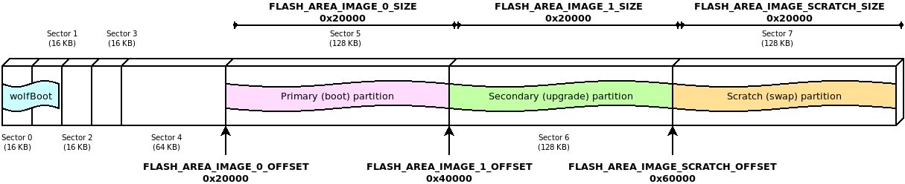

# Targets

This README describes configuration of supported targets.

## STM32F407

Example 512KB partitioning on STM32-F407

The example firmware provided in the `test-app` is configured to boot from the primary partition
starting at address 0x20000. The flash layout is provided by the default example using the following
configuration in `target.h`:

```C
#define WOLFBOOT_SECTOR_SIZE              0x20000
#define WOLFBOOT_PARTITION_SIZE           0x20000

#define WOLFBOOT_PARTITION_BOOT_ADDRESS   0x20000
#define WOLFBOOT_PARTITION_UPDATE_ADDRESS 0x40000
#define WOLFBOOT_PARTITION_SWAP_ADDRESS   0x60000
```

This results in the following partition configuration:



This configuration demonstrates one of the possible layouts, with the slots
aligned to the beginning of the physical sector on the flash.

The entry point for all the runnable firmware images on this target will be `0x20100`,
256 Bytes after the beginning of the first flash partition. This is due to the presence
of the firmware image header at the beginning of the partition, as explained more in details
in [Firmware image](firmware_image.md)

In this particular case, due to the flash geometry, the swap space must be as big as 128KB, to account for proper sector swapping between the two images.

On other systems, the SWAP space can be as small as 512B, if multiple smaller flash blocks are used.

More information about the geometry of the flash and in-application programming (IAP) can be found in the manufacturer manual of each target device.

### STM32F4 Programming

```
st-flash write factory.bin 0x08000000
```

### STM32F4 Debugging

1. Start GDB server

OpenOCD: `openocd --file ./config/openocd/openocd_stm32f4.cfg`
OR
ST-Link: `st-util -p 3333`

2. Start GDB Client

```sh
arm-none-eabi-gdb
add-symbol-file test-app/image.elf 0x20100
mon reset init
b main
c
```

## STM32L5

### Scenario 1: TrustZone Enabled

#### Example Description

The implementation shows how to switch from secure application to non-secure application
thanks to the system isolation performed to split the internal Flash and internal SRAM memories
into two halves:
 - the first half for the secure application
 - the second half for the non-secure application

#### Hardware and Software environment

- This example runs on STM32L562QEIxQ devices with security enabled (TZEN=1).
- This example has been tested with STMicroelectronics STM32L562E-DK (MB1373)
- User Option Bytes requirement (with STM32CubeProgrammer tool - see below for instructions)

```
TZEN = 1                            System with TrustZone-M enabled
DBANK = 1                           Dual bank mode
SECWM1_PSTRT=0x0  SECWM1_PEND=0x7F  All 128 pages of internal Flash Bank1 set as secure
SECWM2_PSTRT=0x1  SECWM2_PEND=0x0   No page of internal Flash Bank2 set as secure, hence Bank2 non-secure
```

- NOTE: STM32CubeProgrammer V2.3.0 is required  (v2.4.0 has a known bug for STM32L5)

#### How to use it

1. `cp ./config/examples/stm32l5.config .config`
2. `make TZEN=1`
3. Prepare board with option bytes configuration reported above
    - `STM32_Programmer_CLI -c port=swd mode=hotplug -ob TZEN=1 DBANK=1`
    - `STM32_Programmer_CLI -c port=swd mode=hotplug -ob SECWM1_PSTRT=0x0 SECWM1_PEND=0x7F SECWM2_PSTRT=0x1 SECWM2_PEND=0x0`
4. flash wolfBoot.bin to 0x0c00 0000
    - `STM32_Programmer_CLI -c port=swd -d ./wolfboot.bin 0x0C000000`
5. flash .\test-app\image_v1_signed.bin to 0x0804 0000
    - `STM32_Programmer_CLI -c port=swd -d ./test-app/image_v1_signed.bin 0x08040000`
6. RED LD9 will be on

### Scenario 2: Trustzone Disabled

#### Example Description

The implementation shows how to use STM32L5xx in DUAL_BANK mode, with TrustZone disabled.
The DUAL_BANK option is only available on this target when TrustZone is disabled (TZEN = 0).

The flash memory is segmented into two different banks:

  - Bank 0: (0x08000000)
  - Bank 1: (0x08040000)

Bank 0 contains the bootloader at address 0x08000000, and the application at address 0x08008000.
When a valid image is available at the same offset in Bank 1, a candidate is selected for booting between the two valid images.
A firmware update can be uploaded at address 0x08048000.

The example configuration is available in `config/examples/stm32l5-nonsecure-dualbank.config`.


### Debugging

Use `make DEBUG=1` and reload firmware.

- STM32CubeIDE v.1.3.0 required
- Run the debugger via:

`ST-LINK_gdbserver -d -cp /opt/st/stm32cubeide_1.3.0/plugins/com.st.stm32cube.ide.mcu.externaltools.cubeprogrammer.linux64_1.3.0.202002181050/tools/bin -e -r 1 -p 3333`

- Connect with arm-none-eabi-gdb

wolfBoot has a .gdbinit to configure
```
arm-none-eabi-gdb
add-symbol-file test-app/image.elf
mon reset init
```


## STM32L0x3

Example 192KB partitioning on STM32-L073

This device is capable of erasing single flash pages (256B each).

However, we choose to use a logic sector size of 4KB for the swaps, to limit the amount of
writes to the swap partition.

The proposed geometry in this example `target.h` uses 32KB for wolfBoot, and two
partitions of 64KB each, leaving room for up to 8KB to use for swap (4K are being used here).

```C
#define WOLFBOOT_SECTOR_SIZE                 0x1000   /* 4 KB */
#define WOLFBOOT_PARTITION_BOOT_ADDRESS      0x8000
#define WOLFBOOT_PARTITION_SIZE              0x10000 /* 64 KB */
#define WOLFBOOT_PARTITION_UPDATE_ADDRESS    0x18000
#define WOLFBOOT_PARTITION_SWAP_ADDRESS      0x28000
```

### Building

Use `make TARGET=stm32l0`. The option `CORTEX_M0` is automatically selected for this target.

## STM32G0x0/STM32G0x1

Example 128KB partitioning on STM32-G070:

- Sector size: 2KB
- Wolfboot partition size: 32KB
- Application partition size: 45 KB

```C
#define WOLFBOOT_SECTOR_SIZE                 0x800   /* 2 KB */
#define WOLFBOOT_PARTITION_BOOT_ADDRESS      0x8000
#define WOLFBOOT_PARTITION_SIZE              0xB000 /* 45 KB */
#define WOLFBOOT_PARTITION_UPDATE_ADDRESS    0x13000
#define WOLFBOOT_PARTITION_SWAP_ADDRESS      0x1E000
```

### Building

Use `make TARGET=stm32g0`. The option `CORTEX_M0` is automatically selected for this target.
The option `NVM_FLASH_WRITEONCE=1` is mandatory on this target, since the IAP driver does not support
multiple writes after each erase operation.

Compile with:

`make TARGET=stm32g0 NVM_FLASH_WRITEONCE=1`


## STM32WB55

Example partitioning on Nucleo-68 board:

- Sector size: 4KB
- Wolfboot partition size: 32 KB
- Application partition size: 128 KB

```C
#define WOLFBOOT_SECTOR_SIZE                 0x1000   /* 4 KB */
#define WOLFBOOT_PARTITION_BOOT_ADDRESS      0x8000
#define WOLFBOOT_PARTITION_SIZE              0x20000 /* 128 KB */
#define WOLFBOOT_PARTITION_UPDATE_ADDRESS    0x28000
#define WOLFBOOT_PARTITION_SWAP_ADDRESS      0x48000
```

### STM32WB55 Building

Use `make TARGET=stm32wb`.

The option `NVM_FLASH_WRITEONCE=1` is mandatory on this target, since the IAP driver does not support
multiple writes after each erase operation.

Compile with:

`make TARGET=stm32wb NVM_FLASH_WRITEONCE=1`

### STM32WB55 with OpenOCD

`openocd --file ./config/openocd/openocd_stm32wbx.cfg`

```
telnet localhost 4444
reset halt
flash write_image unlock erase factory.bin 0x08000000
flash verify_bank 0 factory.bin
reset
```

### STM32WB55 with ST-Link

```
git clone https://github.com/stlink-org/stlink.git
cd stlink
cmake .
make
sudo make install
```

```
st-flash write factory.bin 0x08000000

# Start GDB server
st-util -p 3333
```

### STM32WB55 Debugging

Use `make DEBUG=1` and reload firmware.

wolfBoot has a .gdbinit to configure
```
arm-none-eabi-gdb
add-symbol-file test-app/image.elf 0x08008100
mon reset init
```


## SiFive HiFive1 RISC-V

### Features
* E31 RISC-V 320MHz 32-bit processor
* Onboard 16KB scratchpad RAM
* External 4MB QSPI Flash

### Default Linker Settings
* FLASH: Address 0x20000000, Len 0x6a120 (424 KB)
* RAM:   Address 0x80000000, Len 0x4000  (16 KB)

### Stock bootloader
Start Address: 0x20000000 is 64KB. Provides a "double tap" reset feature to halt boot and allow debugger to attach for reprogramming. Press reset button, when green light comes on press reset button again, then board will flash red.

### Application Code
Start Address: 0x20010000

### wolfBoot configuration

The default wolfBoot configuration will add a second stage bootloader, leaving the stock "double tap" bootloader as a fallback for recovery. Your production implementation should replace this and partition addresses in `target.h` will need updated, so they are `0x10000` less.

For testing wolfBoot here are the changes required:

1. Makefile arguments:
    * ARCH=RISCV
    * TARGET=hifive1

    ```
    make ARCH=RISCV TARGET=hifive1 RAM_CODE=1 clean
    make ARCH=RISCV TARGET=hifive1 RAM_CODE=1
    ```

    If using the `riscv64-unknown-elf-` cross compiler you can add `CROSS_COMPILE=riscv64-unknown-elf-` to your `make` or modify `arch.mk` as follows:

    ```
     ifeq ($(ARCH),RISCV)
    -  CROSS_COMPILE:=riscv32-unknown-elf-
    +  CROSS_COMPILE:=riscv64-unknown-elf-
    ```


2. `include/target.h`

Bootloader Size: 0x10000 (64KB)
Application Size 0x40000 (256KB)
Swap Sector Size: 0x1000 (4KB)

```c
#define WOLFBOOT_SECTOR_SIZE                 0x1000
#define WOLFBOOT_PARTITION_BOOT_ADDRESS      0x20020000

#define WOLFBOOT_PARTITION_SIZE              0x40000
#define WOLFBOOT_PARTITION_UPDATE_ADDRESS    0x20060000
#define WOLFBOOT_PARTITION_SWAP_ADDRESS      0x200A0000
```

### Build Options

* To use ECC instead of ED25519 use make argument `SIGN=ECC256`
* To output wolfboot as hex for loading with JLink use make argument `wolfboot.hex`

### Loading

Loading with JLink:

```
JLinkExe -device FE310 -if JTAG -speed 4000 -jtagconf -1,-1 -autoconnect 1
loadbin factory.bin 0x20010000
rnh
```

### Debugging

Debugging with JLink:

In one terminal:
`JLinkGDBServer -device FE310 -port 3333`

In another terminal:
```
riscv64-unknown-elf-gdb wolfboot.elf -ex "set remotetimeout 240" -ex "target extended-remote localhost:3333"
add-symbol-file test-app/image.elf 0x20020100
```


## STM32-F769

The STM32-F76x and F77x offer dual-bank hardware-assisted swapping.
The flash geometry must be defined beforehand, and wolfBoot can be compiled to use hardware
assisted bank-swapping to perform updates.


Example 2MB partitioning on STM32-F769:

- Dual-bank configuration

BANK A: 0x08000000 to 0x080FFFFFF (1MB)
BANK B: 0x08100000 to 0x081FFFFFF (1MB)

- WolfBoot executes from BANK A after reboot (address: 0x08000000)
- Boot partition @ BANK A + 0x20000 = 0x08020000
- Update partition @ BANK B + 0x20000 = 0x08120000
- Application entry point: 0x08020100

```C
#define WOLFBOOT_SECTOR_SIZE              0x20000
#define WOLFBOOT_PARTITION_SIZE           0x40000

#define WOLFBOOT_PARTITION_BOOT_ADDRESS   0x08020000
#define WOLFBOOT_PARTITION_UPDATE_ADDRESS 0x08120000
#define WOLFBOOT_PARTITION_SWAP_ADDRESS   0x0   /* Unused, swap is hw-assisted */
```

### Build Options

To activate the dual-bank hardware-assisted swap feature on STM32F76x/77x, use the
`DUALBANK_SWAP=1` compile time option. Some code requires to run in RAM during the swapping
of the images, so the compile-time option `RAMCODE=1` is also required in this case.

Dual-bank STM32F7 build can be built using:

```
make TARGET=stm32f7 DUALBANK_SWAP=1 RAM_CODE=1
```


### Loading the firmware

To switch between single-bank (1x2MB) and dual-bank (2 x 1MB) mode mapping, this [stm32f7-dualbank-tool](https://github.com/danielinux/stm32f7-dualbank-tool)
can be used.
Before starting openocd, switch the flash mode to dualbank (e.g. via `make dualbank` using the dualbank tool).

OpenOCD configuration for flashing/debugging, can be copied into `openocd.cfg` in your working directory:

```
source [find interface/stlink.cfg]
source [find board/stm32f7discovery.cfg]
$_TARGETNAME configure -event reset-init {
    mmw 0xe0042004 0x7 0x0
}
init
reset
halt
```

OpenOCD can be either run in background (to allow remote GDB and monitor terminal connections), or
directly from command line, to execute terminal scripts.

If OpenOCD is running, local TCP port 4444 can be used to access an interactive terminal prompt. `telnet localhost 4444`

Using the following openocd commands, the initial images for wolfBoot and the test application
are loaded to flash in bank 0:

```
flash write_image unlock erase wolfboot.bin 0x08000000
flash verify_bank 0 wolfboot.bin
flash write_image unlock erase test-app/image_v1_signed.bin 0x08020000
flash verify_bank 0 test-app/image_v1_signed.bin 0x20000
reset
resume 0x0000001
```

To sign the same application image as new version (2), use the python script `sign.py` provided:

```
tools/keytools/sign.py test-app/image.bin ed25519.der 2
```

From OpenOCD, the updated image (version 2) can be flashed to the second bank:
```
flash write_image unlock erase test-app/image_v2_signed.bin 0x08120000
flash verify_bank 0 test-app/image_v1_signed.bin 0x20000
```

Upon reboot, wolfboot will elect the best candidate (version 2 in this case) and authenticate the image.
If the accepted candidate image resides on BANK B (like in this case), wolfBoot will perform one bank swap before
booting.

The bank-swap operation is immediate and a SWAP image is not required  in this case. Fallback mechanism can rely on
a second choice (older firmware) in the other bank.


### Debugging

Debugging with OpenOCD:

Use the OpenOCD configuration from the previous section to run OpenOCD.

From another console, connect using gdb, e.g.:

```
arm-none-eabi-gdb
(gdb) target remote:3333
```


## STM32H7

The STM32H7 flash geometry must be defined beforehand.

Use the "make config" operation to generate a .config file or copy the template
using `cp ./config/examples/stm32h7.config .config`.

Example 2MB partitioning on STM32-H753:

```
WOLFBOOT_SECTOR_SIZE?=0x20000
WOLFBOOT_PARTITION_SIZE?=0xD0000
WOLFBOOT_PARTITION_BOOT_ADDRESS?=0x8020000
WOLFBOOT_PARTITION_UPDATE_ADDRESS?=0x80F0000
WOLFBOOT_PARTITION_SWAP_ADDRESS?=0x81C0000
```

### Build Options

The STM32H7 build can be built using:

```
make TARGET=stm32h7 SIGN=ECC256
```

### Loading the firmware

OpenOCD configuration for flashing/debugging, can be copied into `openocd.cfg` in your working directory:
Note: May require OpenOCD 0.10.0 or greater for the STM32H7x support.

```
source [find interface/stlink.cfg]
source [find target/stm32h7x.cfg]
$_CHIPNAME.cpu0 configure -event reset-init {
    mmw 0xe0042004 0x7 0x0
}
init
reset
halt
```

`openocd --file openocd.cfg`

OpenOCD can be either run in background (to allow remote GDB and monitor terminal connections), or
directly from command line, to execute terminal scripts.

If OpenOCD is running, local TCP port 4444 can be used to access an interactive terminal prompt.

Using the following openocd commands, the initial images for wolfBoot and the test application
are loaded to flash in bank 0:

```
telnet localhost 4444
flash write_image unlock erase wolfboot.bin 0x08000000
flash verify_bank 0 wolfboot.bin
flash write_image unlock erase test-app/image_v1_signed.bin 0x08020000
flash verify_bank 0 test-app/image_v1_signed.bin 0x08020000
reset
```

To sign the same application image as new version (2), use the python script `sign.py` provided:

```
tools/keytools/sign.py test-app/image.bin ecc256.der 2
```

From OpenOCD, the updated image (version 2) can be flashed to the second bank:
```
flash write_image unlock erase test-app/image_v2_signed.bin 0x08120000
flash verify_bank 0 test-app/image_v1_signed.bin 0x20000
```

Upon reboot, wolfboot will elect the best candidate (version 2 in this case) and authenticate the image.
If the accepted candidate image resides on BANK B (like in this case), wolfBoot will perform one bank swap before
booting.

### Debugging

Debugging with OpenOCD:

Use the OpenOCD configuration from the previous section to run OpenOCD.

From another console, connect using gdb, e.g.:

Add wolfboot.elf to the make.

```
arm-none-eabi-gdb wolfboot.elf -ex "set remotetimeout 240" -ex "target extended-remote localhost:3333"
(gdb) add-symbol-file test-app/image.elf 0x08020000
(gdb) add-symbol-file wolfboot.elf 0x08000000
```


## LPC54606

### Build Options

The LPC54xxx build can be obtained by specifying the CPU type and the MCUXpresso SDK path at compile time.

The following configuration has been tested against LPC54606J512BD208:

```
make TARGET=lpc SIGN=ECC256 MCUXPRESSO?=/path/to/LPC54606J512/SDK
    MCUXPRESSO_CPU?=LPC54606J512BD208 \
    MCUXPRESSO_DRIVERS?=$(MCUXPRESSO)/devices/LPC54606 \
    MCUXPRESSO_CMSIS?=$(MCUXPRESSO)/CMSIS
```

### Loading the firmware

Loading with JLink (example: LPC54606J512)

```
JLinkExe -device LPC606J512 -if SWD -speed 4000
erase
loadbin factory.bin 0
r
h
```

### Debugging with JLink

```
JLinkGDBServer -device LPC606J512 -if SWD -speed 4000 -port 3333
```

Then, from another console:

```
arm-none-eabi-gdb wolfboot.elf -ex "target remote localhost:3333"
(gdb) add-symbol-file test-app/image.elf 0x0000a100
```


## Cortex-A53 / Raspberry PI 3 (experimental)

Tested using `https://github.com/raspberrypi/linux`

### Compiling the kernel

* Get raspberry-pi linux kernel:

```
git clone https://github.com/raspberrypi/linux linux-rpi -b rpi-4.19.y --depth=1
```

* Build kernel image:

```
cd linux-rpi
make ARCH=arm64 CROSS_COMPILE=aarch64-linux-gnu- bcmrpi3_defconfig
make ARCH=arm64 CROSS_COMPILE=aarch64-linux-gnu-
```

* Copy Image and .dtb to the wolfboot directory

```
cp Image arch/arm64/boot/dts/broadcom/bcm2710-rpi-3-b.dtb $wolfboot_dir
cd $wolfboot_dir
```

### Testing with qemu-system-aarch64

* Build wolfboot using the example configuration (RSA4096, SHA3)

```
cp config/examples/raspi3.config .config
make wolfboot-align.bin
```

* Sign Image
```
tools/keytools/sign.py --rsa4096 --sha3 Image rsa4096.der 1
```

* Compose the image

```
cat wolfboot-align.bin Image_v1_signed.bin >wolfboot_linux_raspi.bin
dd if=bcm2710-rpi-3-b.dtb of=wolfboot_linux_raspi.bin bs=1 seek=128K conv=notrunc
```

* Test boot using qemu

```
qemu-system-aarch64 -M raspi3 -m 512 -serial stdio -kernel wolfboot_linux_raspi.bin -append "terminal=ttyS0 rootwait" -dtb ./bcm2710-rpi-3-b.dtb -cpu cortex-a53
```

## Xilinx Zynq UltraScale+ (Aarch64)

Build configuration options (`.config`):

```
TARGET=zynq
ARCH=AARCH64
SIGN=RSA4096
HASH=SHA3
```

### QNX

```sh
cd ~
source qnx700/qnxsdp-env.sh
cd wolfBoot
cp ./config/examples/zynqmp.config .config
make clean
make CROSS_COMPILE=aarch64-unknown-nto-qnx7.0.0-
```

#### Debugging

`qemu-system-aarch64 -M raspi3 -kernel /path/to/wolfboot/factory.bin -serial stdio -gdb tcp::3333 -S`

#### Signing

`tools/keytools/sign.py --rsa4096 --sha3 /srv/linux-rpi4/vmlinux.bin rsa4096.der 1`

## Cypress PSoC-62S2 (CY8CKIT-062S2)

The Cypress PSoC 62S2 is a dual-core Cortex-M4 & Cortex-M0+ MCU. The secure boot process is managed by the M0+.
WolfBoot can be compiled as second stage flash bootloader to manage application verification and firmware updates.

### Building

The following configuration has been tested using PSoC 62S2 Wi-Fi BT Pioneer Kit (CY8CKIT-052S2-43012).

#### Target specific requirements

wolfBoot uses the following components to access peripherals on the PSoC:

  * [Cypress Core Library](https://github.com/cypresssemiconductorco/core-lib)
  * [PSoC 6 Peripheral Driver Library](https://github.com/cypresssemiconductorco/psoc6pdl)
  * [CY8CKIT-062S2-43012 BSP](https://github.com/cypresssemiconductorco/TARGET_CY8CKIT-062S2-43012)

Cypress provides a [customized OpenOCD](https://github.com/cypresssemiconductorco/Openocd) for programming the flash and
debugging.


### Clock settings

wolfBoot configures PLL1 to run at 100 MHz and is driving `CLK_FAST`, `CLK_PERI`, and `CLK_SLOW` at that frequency.

#### Build configuration

The following configuration has been tested on the PSoC CY8CKIT-62S2-43012:

```
make TARGET=psoc6 \
    NVM_FLASH_WRITEONCE=1 \
    CYPRESS_PDL=./lib/psoc6pdl \
    CYPRESS_TARGET_LIB=./lib/TARGET_CY8CKIT-062S2-43012 \
    CYPRESS_CORE_LIB=./lib/core-lib \
    WOLFBOOT_SECTOR_SIZE=4096
```

Note: A reference `.config` can be found in `./config/examples/cypsoc6.config`.

Hardware acceleration is enable by default using psoc6 crypto hw support.

To compile with hardware acceleration disabled, use the option

``` PSOC6_CRYPTO=0 ```

in your wolfBoot configuration.

#### OpenOCD installation

Compile and install the customized OpenOCD.

Use the following configuration file when running `openocd` to connect to the PSoC6 board:

```
### openocd.cfg for PSoC-62S2

source [find interface/kitprog3.cfg]
transport select swd
adapter speed 1000
source [find target/psoc6_2m.cfg]
init
reset init
```

### Loading the firmware

To upload `factory.bin` to the device with OpenOCD, connect the device,
run OpenOCD with the configuration from the previous section, then connect
to the local openOCD server running on TCP port 4444 using `telnet localhost 4444`.

From the telnet console, type:

`program factory.bin 0x10000000`

When the transfer is finished, you can either close openOCD or start a debugging session.

### Debugging

Debugging with OpenOCD:

Use the OpenOCD configuration from the previous sections to run OpenOCD.

From another console, connect using gdb, e.g.:

```
arm-none-eabi-gdb
(gdb) target remote:3333
```

To reset the board to start from the M0+ flash bootloader position (wolfBoot reset handler), use
the monitor command sequence below:

```
(gdb) mon init
(gdb) mon reset init
(gdb) mon psoc6 reset_halt
```

## NXP iMX-RT1060/1062 (RT1060-EVK)

The NXP iMX-RT1060 is a Cortex-M7 with a DCP coprocessor for SHA256 acceleration.
Example configuration for this target is provided in `./config/examples/imx-rt1060.config`.

### Building wolfBoot

MCUXpresso SDK is required by wolfBoot to access device drivers on this platform.
A package can be obtained from the [MCUXpresso SDK Builder](https://mcuxpresso.nxp.com/en/welcome), by selecting `EVK-MIMXRT1060` as target, and keeping the default choice of components.

Set the `MCUXPRESSO` configuration variable to the path where the SDK package is extracted, then build wolfBoot normally by running `make`.

wolfBoot support for iMX-RT1060 has been tested using MCUXpresso SDK version 2.8.2.

DCP support (hardware acceleration for SHA256 operations) can be enabled by using PKA=1 in the configuration file.
Firmware can be directly uploaded to the target by copying `factory.bin` to the virtual USB drive associated to the device (RT1060-EVK).


