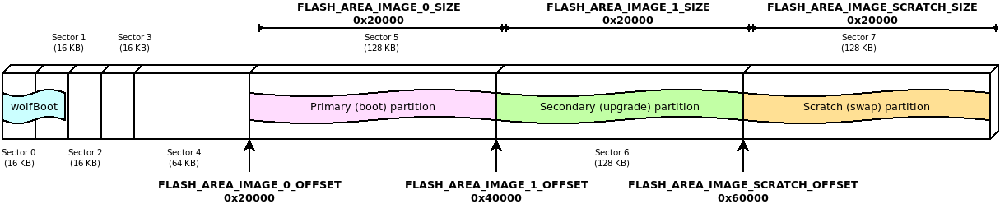
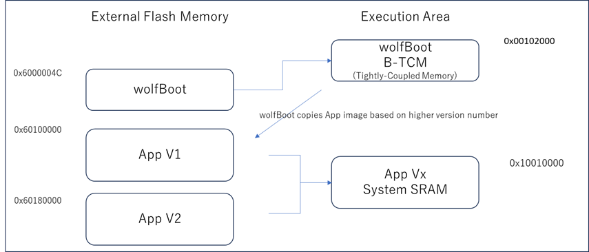

# Targets

This README describes configuration of supported targets.

## Supported Targets

* [Simulated](#simulated)
* [Cortex-A53 / Raspberry PI 3](#cortex-a53--raspberry-pi-3-experimental)
* [Cypress PSoC-6](#cypress-psoc-6)
* [Infineon AURIX TC3xx](#infineon-aurix-tc3xx)
* [Intel x86-64 Intel FSP](#intel-x86_64-with-intel-fsp-support)
* [Kontron VX3060-S2](#kontron-vx3060-s2)
* [Microchip PIC32CK](#microchip-pic32ck)
* [Microchip PIC32CZ](#microchip-pic32cz)
* [Microchip PolarFire SoC](#microchip-polarfire-soc)
* [Microchip SAMA5D3](#microchip-sama5d3)
* [Microchip SAME51](#microchip-same51)
* [Nordic nRF52840](#nordic-nrf52840)
* [Nordic nRF5340](#nordic-nrf5340)
* [Nordic nRF54L15](#nordic-nrf54l15)
* [NXP iMX-RT](#nxp-imx-rt)
* [NXP Kinetis](#nxp-kinetis)
* [NXP LPC546xx](#nxp-lpc546xx)
* [NXP LPC540xx / LPC54S0xx (SPIFI boot)](#nxp-lpc540xx--lpc54s0xx-spifi-boot)
* [NXP LPC55S69](#nxp-lpc55s69)
* [NXP LS1028A](#nxp-ls1028a)
* [NXP MCXA153](#nxp-mcxa153)
* [NXP MCXW716](#nxp-mcxw716)
* [NXP MCXN947](#nxp-mcxn947)
* [NXP S32K1XX](#nxp-s32k1xx)
* [NXP P1021 PPC](#nxp-qoriq-p1021-ppc)
* [NXP T10xx PPC (T1024 / T1040)](#nxp-qoriq-t10xx-ppc-t1024--t1040)
* [NXP T2080 PPC](#nxp-qoriq-t2080-ppc)
* [Qemu x86-64 UEFI](#qemu-x86-64-uefi)
* [Raspberry Pi pico 2 (rp2350)](#raspberry-pi-pico-rp2350)
* [Renesas RA6M4](#renesas-ra6m4)
* [Renesas RX65N](#renesas-rx65n)
* [Renesas RX72N](#renesas-rx72n)
* [Renesas RZN2L](#renesas-rzn2l)
* [SiFive HiFive1 RISC-V](#sifive-hifive1-risc-v)
* [STM32C0](#stm32c0)
* [STM32F1](#stm32f1)
* [STM32F4](#stm32f4)
* [STM32F7](#stm32f7)
* [STM32G0](#stm32g0)
* [STM32H5](#stm32h5)
* [STM32H7](#stm32h7)
* [STM32L0](#stm32l0)
* [STM32L4](#stm32l4)
* [STM32L5](#stm32l5)
* [STM32U5](#stm32u5)
* [STM32WB55](#stm32wb55)
* [TI Hercules TMS570LC435](#ti-hercules-tms570lc435)
* [Vorago VA416x0](#vorago-va416x0)
* [Xilinx Zynq UltraScale](#xilinx-zynq-ultrascale)
* [Versal Gen 1 VMK180](#versal-gen-1-vmk180)

## STM32F4

Example 512KB partitioning on STM32-F407

The example firmware provided in the `test-app` is configured to boot from the primary partition
starting at address 0x20000. The flash layout is provided by the default example using the following
configuration in `target.h`:

```C
#define WOLFBOOT_SECTOR_SIZE              0x20000
#define WOLFBOOT_PARTITION_SIZE           0x20000

#define WOLFBOOT_PARTITION_BOOT_ADDRESS   0x20000
#define WOLFBOOT_PARTITION_UPDATE_ADDRESS 0x40000
#define WOLFBOOT_PARTITION_SWAP_ADDRESS   0x60000
```

This results in the following partition configuration:



This configuration demonstrates one of the possible layouts, with the slots
aligned to the beginning of the physical sector on the flash.

The entry point for all the runnable firmware images on this target will be `0x20100`,
256 Bytes after the beginning of the first flash partition. This is due to the presence
of the firmware image header at the beginning of the partition, as explained more in details
in [Firmware image](firmware_image.md)

In this particular case, due to the flash geometry, the swap space must be as big as 128KB, to account for proper sector swapping between the two images.

On other systems, the SWAP space can be as small as 512B, if multiple smaller flash blocks are used.

More information about the geometry of the flash and in-application programming (IAP) can be found in the manufacturer manual of each target device.

### STM32F4 Programming

```
st-flash write factory.bin 0x08000000
```

### STM32F4 Debugging

1. Start GDB server

OpenOCD: `openocd --file ./config/openocd/openocd_stm32f4.cfg`
OR
ST-Link: `st-util -p 3333`

2. Start GDB Client

```sh
arm-none-eabi-gdb
add-symbol-file test-app/image.elf 0x20100
mon reset init
b main
c
```

## STM32F1

Similar layout as the STM32F4, but for a much smaller 64KB flash.

WolfBoot occupy 12KB, followed by 2x25 KB firmware partitions, and a 2KB swap:

```
WOLFBOOT_PARTITION_BOOT_ADDRESS?=0x08003000
WOLFBOOT_PARTITION_UPDATE_ADDRESS?=0x08009400
WOLFBOOT_PARTITION_SWAP_ADDRESS?=0x0800F800
```

This is with the sample config in [config/examples/stm32f1.config](config/examples/stm32f1.config).

Note that with this partition layout, WolfBoot cannot be compiled with debug support.

The test application for STM32F1 is designed so that if it boots a version 1 software, it will trigger an update
If the running software version is 2, all is good.
In both cases, PC13 is cleared (lights up the green LED on a Blue Pill board).

### STM32F1 Programming

All STM32F1 devices come with a builtin bootloader that can be used to program the device.
It allows firmware upload on USART0 (pin A9 and A10 on the Blue Pill) using a usb-serial converter.
The bootloader is entered by pulling the BOOT0 pin high.
Once the builtin bootloader is active, the STM32F1 can be programmed with `stm32flash`:

```
stm32flash -w factory.bin -b 115200 -g 0 /dev/ttyUSB0
```

## STM32L4
Example 1MB partitioning on STM32L4

- Sector size: 4KB
- Wolfboot partition size: 40 KB
- Application partition size: 488 KB

```C
#define WOLFBOOT_SECTOR_SIZE                 0x1000   /* 4 KB */
#define WOLFBOOT_PARTITION_BOOT_ADDRESS      0x0800A000
#define WOLFBOOT_PARTITION_SIZE              0x7A000  /* 488 KB */
#define WOLFBOOT_PARTITION_UPDATE_ADDRESS    0x08084000
#define WOLFBOOT_PARTITION_SWAP_ADDRESS      0x080FE000
```


## STM32L5

### Scenario 1: TrustZone Enabled


#### Example Description

The implementation shows how to switch from secure application to non-secure application,
thanks to the system isolation performed, which splits the internal Flash and internal
SRAM memories into two parts:
 - the first half is used by wolfboot running in secure mode and the secure application
 - the remaining available space is used for non-secure application and update partition

The example configuration for this scenario is available in [/config/examples/stm32l5.config](/config/examples/stm32l5.config).

#### Hardware and Software environment

- This example runs on STM32L562QEIxQ devices with security enabled (TZEN=1).
- This example has been tested with STMicroelectronics STM32L562E-DK (MB1373)
- User Option Bytes requirement (with STM32CubeProgrammer tool - see below for instructions)

```
TZEN = 1                          System with TrustZone-M enabled
DBANK = 1                         Dual bank mode
SECWM1_STRT=0x0  SECWM1_END=0x7F  All 128 pages of internal Flash Bank1 set as secure
SECWM2_STRT=0x1  SECWM2_END=0x0   No page of internal Flash Bank2 set as secure, hence Bank2 non-secure
```

- NOTE: STM32CubeProgrammer V2.3.0 is required  (v2.4.0 has a known bug for STM32L5)

#### How to use it

1. `cp ./config/examples/stm32l5.config .config`
2. `make`
3. Prepare board with option bytes configuration reported above
    - `STM32_Programmer_CLI -c port=swd mode=hotplug -ob TZEN=1 DBANK=1`
    - `STM32_Programmer_CLI -c port=swd mode=hotplug -ob SECWM1_STRT=0x0 SECWM1_END=0x7F SECWM2_STRT=0x1 SECWM2_END=0x0`
4. flash wolfBoot.bin to 0x0c00 0000
    - `STM32_Programmer_CLI -c port=swd -d ./wolfboot.bin 0x0C000000`
5. flash .\test-app\image_v1_signed.bin to 0x0804 0000
    - `STM32_Programmer_CLI -c port=swd -d ./test-app/image_v1_signed.bin 0x08040000`
6. RED LD9 will be on

- NOTE: STM32_Programmer_CLI Default Locations
* Windows: `C:\Program Files\STMicroelectronics\STM32Cube\STM32CubeProgrammer\bin\STM32_Programmer_CLI.exe`
* Linux: `/usr/local/STMicroelectronics/STM32Cube/STM32CubeProgrammer/bin/STM32_Programmer_CLI`
* Mac OS/X: `/Applications/STMicroelectronics/STM32Cube/STM32CubeProgrammer/STM32CubeProgrammer.app/Contents/MacOs/bin/STM32_Programmer_CLI`

### Scenario 2: Trustzone Enabled, wolfCrypt as secure engine for NS applications

This is similar to Scenario 1, but also includes wolfCrypt in secure mode, and
that can be accessed via PKCS11 interface by non-secure applications.

This option can be enabled with `WOLFCRYPT_TZ=1` and `WOLFCRYPT_TZ_PKCS11=1` or `WOLFCRYPT_TZ_PSA=1`
options in your configuration. This enables a PKCS11 accessible from NS domain via
non-secure callables (NSC).

The example configuration for this scenario is available in [/config/examples/stm32l5-wolfcrypt-tz.config](/config/examples/stm32l5-wolfcrypt-tz.config).

For more information, see [/docs/STM32-TZ.md](/docs/STM32-TZ.md).


### Scenario 3: Trustzone Disabled, using DUAL BANK

#### Example Description

The implementation shows how to use STM32L5xx in DUAL BANK mode, with TrustZone disabled.
The DUAL_BANK option is only available on this target when TrustZone is disabled (TZEN = 0).

The flash memory is segmented into two different banks:

  - Bank 0: (0x08000000)
  - Bank 1: (0x08040000)

Bank 0 contains the bootloader at address 0x08000000, and the application at address 0x08040000.
When a valid image is available at the same offset in Bank 1, a candidate is selected for booting between the two valid images.
A firmware update can be uploaded at address 0x08048000.

The example configuration is available in [/config/examples/stm32l5-nonsecure-dualbank.config](/config/examples/stm32l5-nonsecure-dualbank.config).

To run flash `./test-app/image.bin` to `0x08000000`.
    - `STM32_Programmer_CLI -c port=swd -d ./test-app/image.bin 0x08000000`

Or program each partition using:
1. flash `wolfboot.bin` to 0x08000000:
    - `STM32_Programmer_CLI -c port=swd -d ./wolfboot.elf`
2. flash main application to 0x0800 a000
    - `STM32_Programmer_CLI -c port=swd -d ./test-app/image_v1_signed.bin 0x0800a000`

RED LD9 will be on indicating successful boot ().

Updates can be flashed at 0x0804a000:

- `STM32_Programmer_CLI -c port=swd -d ./test-app/image_v2_signed.bin 0x0804a000`

The two partition are logically remapped by using BANK_SWAP capabilities. This partition
swap is immediate and does not require a SWAP partition.


### Debugging

Use `make DEBUG=1` and reload firmware.

- STM32CubeIDE v.1.3.0 required
- Run the debugger via:

Linux:

```
ST-LINK_gdbserver -d -cp /opt/st/stm32cubeide_1.3.0/plugins/com.st.stm32cube.ide.mcu.externaltools.cubeprogrammer.linux64_1.3.0.202002181050/tools/bin -e -r 1 -p 3333`
```

Max OS/X:

```sh
sudo ln -s /Applications/STM32CubeIDE.app/Contents/Eclipse/plugins/com.st.stm32cube.ide.mcu.externaltools.stlink-gdb-server.macos64_1.6.0.202101291314/tools/bin/native/mac_x64/libSTLinkUSBDriver.dylib /usr/local/lib/libSTLinkUSBDriver.dylib

/Applications/STM32CubeIDE.app/Contents/Eclipse/plugins/com.st.stm32cube.ide.mcu.externaltools.stlink-gdb-server.macos64_1.6.0.202101291314/tools/bin/ST-LINK_gdbserver -d -cp ./Contents/Eclipse/plugins/com.st.stm32cube.ide.mcu.externaltools.cubeprogrammer.macos64_1.6.0.202101291314/tools/bin -e -r 1 -p 3333
```

- Connect with arm-none-eabi-gdb

wolfBoot has a .gdbinit to configure
```
arm-none-eabi-gdb
add-symbol-file test-app/image.elf
mon reset init
```


## STM32U5

The STM32U5 is a Cortex-M33 (ARMv8-M).

Note: We have seen issues with vector table alignment, so the default image header size (IMAGE_HEADER_SIZE) has been increased to 1024 bytes to avoid potential issues.

### Scenario 1: TrustZone enabled, staging non-secure application

#### Example description

The implementation shows how to switch from secure application to non-secure application,
thanks to the system isolation performed, which splits the internal Flash and internal
SRAM memories into two parts:
 - the first 256KB are used by wolfboot running in secure mode and the secure application
 - the remaining available space is used for non-secure application and update partition

The example configuration for this scenario is available in [/config/examples/stm32u5.config](/config/examples/stm32u5.config).

#### Example Description

The implementation shows how to switch from secure application to non-secure application,
thanks to the system isolation performed, which splits the internal Flash and internal
SRAM memories into two parts:
 - the first half for secure application
 - the second half for non-secure application

#### Hardware and Software environment

- This example runs on STM32U585AII6Q devices with security enabled (TZEN=1).
- This example has been tested with STMicroelectronics B-U585I-IOT02A (MB1551)
- User Option Bytes requirement (with STM32CubeProgrammer tool - see below for instructions)

```
TZEN = 1                          System with TrustZone-M enabled
DBANK = 1                         Dual bank mode
SECWM1_STRT=0x0  SECWM1_END=0x7F  All 128 pages of internal Flash Bank1 set as secure
SECWM2_STRT=0x1  SECWM2_END=0x0   No page of internal Flash Bank2 set as secure, hence Bank2 non-secure
```

- NOTE: STM32CubeProgrammer V2.8.0 or newer is required

#### How to use it

1. `cp ./config/examples/stm32u5.config .config`
2. `make TZEN=1`
3. Prepare board with option bytes configuration reported above
    - `STM32_Programmer_CLI -c port=swd mode=hotplug -ob TZEN=1 DBANK=1`
    - `STM32_Programmer_CLI -c port=swd mode=hotplug -ob SECWM1_STRT=0x0 SECWM1_END=0x7F SECWM2_STRT=0x1 SECWM2_END=0x0`
4. flash wolfBoot.bin to 0x0c000000
    - `STM32_Programmer_CLI -c port=swd -d ./wolfboot.bin 0x0C000000`
5. flash .\test-app\image_v1_signed.bin to 0x08010000
    - `STM32_Programmer_CLI -c port=swd -d ./test-app/image_v1_signed.bin 0x08100000`
6. RED LD9 will be on

- NOTE: STM32_Programmer_CLI Default Locations
* Windows: `C:\Program Files\STMicroelectronics\STM32Cube\STM32CubeProgrammer\bin\STM32_Programmer_CLI.exe`
* Linux: `/usr/local/STMicroelectronics/STM32Cube/STM32CubeProgrammer/bin/STM32_Programmer_CLI`
* Mac OS/X: `/Applications/STMicroelectronics/STM32Cube/STM32CubeProgrammer/STM32CubeProgrammer.app/Contents/MacOs/bin/STM32_Programmer_CLI`

### Scenario 2: TrustZone Enabled, wolfCrypt as secure engine for NS applications

This is similar to Scenario 1, but also includes wolfCrypt in secure mode, and
that can be accessed via PKCS11 interface by non-secure applications.

This option can be enabled with `WOLFCRYPT_TZ=1` and `WOLFCRYPT_TZ_PKCS11=1` or `WOLFCRYPT_TZ_PSA=1`
options in your configuration. This enables a PKCS11 accessible from NS domain via
non-secure callables (NSC).

The example configuration for this scenario is available in [/config/examples/stm32u5-wolfcrypt-tz.config](/config/examples/stm32u5-wolfcrypt-tz.config).

For more information, see [/docs/STM32-TZ.md](/docs/STM32-TZ.md).


### Scenario 3: TrustZone Disabled (DUAL BANK mode)

#### Example Description

The implementation shows how to use STM32U5xx in DUAL_BANK mode, with TrustZone disabled.
The DUAL_BANK option is only available on this target when TrustZone is disabled (TZEN = 0).

The flash memory is segmented into two different banks:

  - Bank 0: (0x08000000)
  - Bank 1: (0x08100000)

Bank 0 contains the bootloader at address 0x08000000, and the application at address 0x08100000.
When a valid image is available at the same offset in Bank 1, a candidate is selected for booting between the two valid images.
A firmware update can be uploaded at address 0x08110000.

The example configuration is available in [/config/examples/stm32u5-nonsecure-dualbank.config](/config/examples/stm32u5-nonsecure-dualbank.config).

Program each partition using:
1. flash `wolfboot.bin` to 0x08000000:
    - `STM32_Programmer_CLI -c port=swd -d ./wolfboot.bin 0x08000000`
2. flash `image_v1_signed.bin` to 0x08010000
    - `STM32_Programmer_CLI -c port=swd -d ./test-app/image_v1_signed.bin 0x08010000`

RED LD9 will be on indicating successful boot ()

### Debugging

Use `make DEBUG=1` and reload firmware.

- STM32CubeIDE v.1.7.0 required
- Run the debugger via:

Linux:

```sh
ST-LINK_gdbserver -d -cp /opt/st/stm32cubeide_1.3.0/plugins/com.st.stm32cube.ide.mcu.externaltools.cubeprogrammer.linux64_1.3.0.202002181050/tools/bin -e -r 1 -p 3333
```

Max OS/X:

```sh
/Applications/STM32CubeIDE.app/Contents/Eclipse/plugins/com.st.stm32cube.ide.mcu.externaltools.stlink-gdb-server.macos64_2.1.300.202403291623/tools/bin/ST-LINK_gdbserver -d -cp /Applications/STM32CubeIDE.app/Contents/Eclipse/plugins/com.st.stm32cube.ide.mcu.externaltools.cubeprogrammer.macos64_2.1.201.202404072231/tools/bin -e -r 1 -p 3333
```

Win:

```
ST-LINK_gdbserver -d -cp C:\ST\STM32CubeIDE_1.7.0\STM32CubeIDE\plugins\com.st.stm32cube.ide.mcu.externaltools.cubeprogrammer.win32_2.0.0.202105311346\tools\bin -e -r 1 -p 3333
```
- Connect with arm-none-eabi-gdb or gdb-multiarch

wolfBoot has a .gdbinit to configure
```
add-symbol-file test-app/image.elf
```


## STM32L0

Example 192KB partitioning on STM32-L073

This device is capable of erasing single flash pages (256B each).

However, we choose to use a logic sector size of 4KB for the swaps, to limit the amount of
writes to the swap partition.

The proposed geometry in this example `target.h` uses 32KB for wolfBoot, and two
partitions of 64KB each, leaving room for up to 8KB to use for swap (4K are being used here).

```C
#define WOLFBOOT_SECTOR_SIZE                 0x1000   /* 4 KB */
#define WOLFBOOT_PARTITION_BOOT_ADDRESS      0x8000
#define WOLFBOOT_PARTITION_SIZE              0x10000 /* 64 KB */
#define WOLFBOOT_PARTITION_UPDATE_ADDRESS    0x18000
#define WOLFBOOT_PARTITION_SWAP_ADDRESS      0x28000
```

### STM32L0 Building

Use `make TARGET=stm32l0`. The option `CORTEX_M0` is automatically selected for this target.


## STM32G0

Supports STM32G0x0x0/STM32G0x1.

Example 128KB partitioning on STM32-G070:

- Sector size: 2KB
- Wolfboot partition size: 32KB
- Application partition size: 44 KB

```C
#define WOLFBOOT_SECTOR_SIZE                 0x800   /* 2 KB */
#define WOLFBOOT_PARTITION_BOOT_ADDRESS      0x08008000
#define WOLFBOOT_PARTITION_SIZE              0xB000  /* 44 KB */
#define WOLFBOOT_PARTITION_UPDATE_ADDRESS    0x08013000
#define WOLFBOOT_PARTITION_SWAP_ADDRESS      0x0801E000
```

### Building STM32G0

Reference configuration (see [/config/examples/stm32g0.config](/config/examples/stm32g0.config)).
You can copy this to wolfBoot root as `.config`: `cp ./config/examples/stm32g0.config .config`.
To build you can use `make`.

The TARGET for this is `stm32g0`: `make TARGET=stm32g0`.
The option `CORTEX_M0` is automatically selected for this target.
The option `NVM_FLASH_WRITEONCE=1` is mandatory on this target, since the IAP driver does not support
multiple writes after each erase operation.

#### STM32G0 Secure Hide Protection Feature (Optional)

This part supports a "secure memory protection" feature makes the wolfBoot partition unaccessible after jump to application.

It uses the `FLASH_CR:SEC_PROT` and `FLASH_SECT:SEC_SIZE` registers. This is the
number of 2KB pages to block access to from the 0x8000000 base address.

Command example to enable this for 32KB bootloader:

```
STM32_Programmer_CLI -c port=swd mode=hotplug -ob SEC_SIZE=0x10
```

Enabled with `CFLAGS_EXTRA+=-DFLASH_SECURABLE_MEMORY_SUPPORT`.
Requires `RAM_CODE=1` to enable RAMFUNCTION support.

### STM32G0 Programming

Compile requirements: `make TARGET=stm32g0 NVM_FLASH_WRITEONCE=1`

The output is a single `factory.bin` that includes `wolfboot.bin` and `test-app/image_v1_signed.bin` combined together.
This should be programmed to the flash start address `0x08000000`.

Flash using the STM32CubeProgrammer CLI:

```
STM32_Programmer_CLI -c port=swd -d factory.bin 0x08000000
```

### STM32G0 Debugging

Use `make DEBUG=1` and program firmware again.

Start GDB server on port 3333:

```
ST-LINK_gdbserver -d -e -r 1 -p 3333
OR
st-util -p 3333
```

wolfBoot has a .gdbinit to configure GDB

```
arm-none-eabi-gdb
add-symbol-file test-app/image.elf 0x08008100
mon reset init
```

## STM32C0

Supports STM32C0x0/STM32C0x1. Instructions are for the STM Nucleo-C031C6 dev board.

Tested build configurations:
* With RSA2048 and SHA2-256 the code size is 10988 and it boots in under 1 second.
* With ED25519 and SHA2-384 the code size is 10024 and takes about 10 seconds for the LED to turn on.
* With LMS-8-10-1 and SHA2-256 the code size is 8164 on gcc-13 (could fit in 8KB partition)

### Example 32KB partitioning on STM32-G070

with ED25519 or LMS-8-10-1:

- Sector size: 2KB
- Wolfboot partition size: 10KB
- Application partition size: 10 KB
- Swap size 2KB

```C
#define WOLFBOOT_SECTOR_SIZE                 0x800   /* 2 KB */
#define WOLFBOOT_PARTITION_BOOT_ADDRESS      0x08002800 /* at 10KB */
#define WOLFBOOT_PARTITION_SIZE              0x2800  /* 10 KB */
#define WOLFBOOT_PARTITION_UPDATE_ADDRESS    0x08005000 /* at 20KB */
#define WOLFBOOT_PARTITION_SWAP_ADDRESS      0x08007800 /* at 30KB */
```

with RSA2048:

- Sector size: 2KB
- Wolfboot partition size: 12KB
- Application partition size: 8 KB
- Swap size 2KB

```C
#define WOLFBOOT_SECTOR_SIZE                 0x800      /* 2 KB */
#define WOLFBOOT_PARTITION_BOOT_ADDRESS      0x08003000 /* at 12KB */
#define WOLFBOOT_PARTITION_SIZE              0x2000     /* 8 KB */
#define WOLFBOOT_PARTITION_UPDATE_ADDRESS    0x08005000 /* at 20KB */
#define WOLFBOOT_PARTITION_SWAP_ADDRESS      0x08007800 /* at 30KB */
```

### Building STM32C0

Reference configuration files (see [config/examples/stm32c0.config](/config/examples/stm32c0.config),
[config/examples/stm32c0-rsa2048.config](/config/examples/stm32c0-rsa2048.config) and
[config/examples/stm32c0-lms-8-10-1.config](/config/examples/stm32c0-lms-8-10-1.config)).

You can copy one of these to wolfBoot root as `.config`: `cp ./config/examples/stm32c0.config .config`.
To build you can use `make`.

The TARGET for this is `stm32c0`: `make TARGET=stm32c0`.
The option `CORTEX_M0` is automatically selected for this target.
The option `NVM_FLASH_WRITEONCE=1` is mandatory on this target, since the IAP driver does not support
multiple writes after each erase operation.

#### STM32C0 Secure Hide Protection Feature (Optional)

This part supports a "secure memory protection" feature makes the wolfBoot partition unaccessible after jump to application.

It uses the `FLASH_CR:SEC_PROT` and `FLASH_SECT:SEC_SIZE` registers. This is the
number of 2KB pages to block access to from the 0x8000000 base address.

Command example to enable this for 10KB bootloader:

```
STM32_Programmer_CLI -c port=swd mode=hotplug -ob SEC_SIZE=0x05
```

Enabled with `CFLAGS_EXTRA+=-DFLASH_SECURABLE_MEMORY_SUPPORT`.
Requires `RAM_CODE=1` to enable RAMFUNCTION support.

### STM32C0 Programming

Compile requirements: `make TARGET=stm32c0 NVM_FLASH_WRITEONCE=1`

The output is a single `factory.bin` that includes `wolfboot.bin` and `test-app/image_v1_signed.bin` combined together.
This should be programmed to the flash start address `0x08000000`.

Flash using the STM32CubeProgrammer CLI:

```
STM32_Programmer_CLI -c port=swd -d factory.bin 0x08000000
```

### STM32C0 Debugging

Use `make DEBUG=1` and program firmware again.

Start GDB server on port 3333:

```
ST-LINK_gdbserver -d -e -r 1 -p 3333
OR
st-util -p 3333
```

wolfBoot has a .gdbinit to configure GDB

```
arm-none-eabi-gdb
add-symbol-file test-app/image.elf 0x08008100
mon reset init
```


## STM32WB55

Example partitioning on Nucleo-68 board:

- Sector size: 4KB
- Wolfboot partition size: 32 KB
- Application partition size: 128 KB

```C
#define WOLFBOOT_SECTOR_SIZE                 0x1000   /* 4 KB */
#define WOLFBOOT_PARTITION_BOOT_ADDRESS      0x8000
#define WOLFBOOT_PARTITION_SIZE              0x20000 /* 128 KB */
#define WOLFBOOT_PARTITION_UPDATE_ADDRESS    0x28000
#define WOLFBOOT_PARTITION_SWAP_ADDRESS      0x48000
```

### STM32WB55 Building

Use `make TARGET=stm32wb`.

The option `NVM_FLASH_WRITEONCE=1` is mandatory on this target, since the IAP driver does not support
multiple writes after each erase operation.

Compile with:

`make TARGET=stm32wb NVM_FLASH_WRITEONCE=1`

### STM32WB55 with OpenOCD

`openocd --file ./config/openocd/openocd_stm32wbx.cfg`

```
telnet localhost 4444
reset halt
flash write_image unlock erase factory.bin 0x08000000
flash verify_bank 0 factory.bin
reset
```

### STM32WB55 with ST-Link

```
git clone https://github.com/stlink-org/stlink.git
cd stlink
cmake .
make
sudo make install
```

```
st-flash write factory.bin 0x08000000

# Start GDB server
st-util -p 3333
```

### STM32WB55 Debugging

Use `make DEBUG=1` and reload firmware.

wolfBoot has a .gdbinit to configure
```
arm-none-eabi-gdb
add-symbol-file test-app/image.elf 0x08008100
mon reset init
```


## SiFive HiFive1 RISC-V

### Features
* E31 RISC-V 320MHz 32-bit processor
* Onboard 16KB scratchpad RAM
* External 4MB QSPI Flash

### Default Linker Settings
* FLASH: Address 0x20000000, Len 0x6a120 (424 KB)
* RAM:   Address 0x80000000, Len 0x4000  (16 KB)

### Stock bootloader
Start Address: 0x20000000 is 64KB. Provides a "double tap" reset feature to halt boot and allow debugger to attach for reprogramming. Press reset button, when green light comes on press reset button again, then board will flash red.

### Application Code
Start Address: 0x20010000

### wolfBoot configuration

The default wolfBoot configuration will add a second stage bootloader, leaving the stock "double tap" bootloader as a fallback for recovery. Your production implementation should replace this and partition addresses in `target.h` will need updated, so they are `0x10000` less.

To set the Freedom SDK location use `FREEDOM_E_SDK=~/src/freedom-e-sdk`.

For testing wolfBoot here are the changes required:

1. Makefile arguments:
    * ARCH=RISCV
    * TARGET=hifive1

    ```
    make ARCH=RISCV TARGET=hifive1 RAM_CODE=1 clean
    make ARCH=RISCV TARGET=hifive1 RAM_CODE=1
    ```

    If using the `riscv64-unknown-elf-` cross compiler you can add `CROSS_COMPILE=riscv64-unknown-elf-` to your `make` or modify `arch.mk` as follows:

    ```
     ifeq ($(ARCH),RISCV)
    -  CROSS_COMPILE:=riscv32-unknown-elf-
    +  CROSS_COMPILE:=riscv64-unknown-elf-
    ```


2. `include/target.h`

Bootloader Size: 0x10000 (64KB)
Application Size 0x40000 (256KB)
Swap Sector Size: 0x1000 (4KB)

```c
#define WOLFBOOT_SECTOR_SIZE                 0x1000
#define WOLFBOOT_PARTITION_BOOT_ADDRESS      0x20020000

#define WOLFBOOT_PARTITION_SIZE              0x40000
#define WOLFBOOT_PARTITION_UPDATE_ADDRESS    0x20060000
#define WOLFBOOT_PARTITION_SWAP_ADDRESS      0x200A0000
```

### Build Options

* To use ECC instead of ED25519 use make argument `SIGN=ECC256`
* To output wolfboot as hex for loading with JLink use make argument `wolfboot.hex`

### Loading

Loading with JLink:

```
JLinkExe -device FE310 -if JTAG -speed 4000 -jtagconf -1,-1 -autoconnect 1
loadbin factory.bin 0x20010000
rnh
```

### Debugging

Debugging with JLink:

In one terminal:
`JLinkGDBServer -device FE310 -port 3333`

In another terminal:
```
riscv64-unknown-elf-gdb wolfboot.elf -ex "set remotetimeout 240" -ex "target extended-remote localhost:3333"
add-symbol-file test-app/image.elf 0x20020100
```


## Microchip PolarFire SoC

The PolarFire SoC is a 64-bit RISC-V SoC featuring a five-core CPU cluster (1× E51 monitor core and 4× U54 application cores) and FPGA fabric. Tested with MPFS250.

### Features
* RISC-V 64-bit architecture (rv64imac)
* Five-core CPU: 1× E51 monitor + 4× U54 application cores
* Integrated DDR3/4, LPDDR3/4 controller and PHY
* PCIe Gen2, USB 2.0, and Gigabit Ethernet interfaces
* Secure boot capabilities
* Low power consumption
* External flash support

### Supported Boot Configurations

Five ready-to-use config templates cover all supported boot mode / storage / memory combinations:

| Configuration | Config File | Boot Mode | Storage | Memory | HSS |
|---------------|-------------|-----------|---------|--------|-----|
| **SDCard** | `polarfire_mpfs250.config` | S-mode (U54 via HSS) | SD Card | DDR | Yes |
| **eMMC** | `polarfire_mpfs250.config` + `DISK_EMMC=1` | S-mode (U54 via HSS) | eMMC | DDR | Yes |
| **QSPI (S-mode)** | `polarfire_mpfs250_qspi.config` | S-mode (U54 via HSS) | MSS or SC QSPI | DDR | Yes |
| **QSPI + L2-LIM** | `polarfire_mpfs250_hss_l2lim.config` | S-mode (U54 via HSS) | SC QSPI | L2-LIM (no DDR) | Yes |
| **M-Mode (no HSS)** | `polarfire_mpfs250_m_qspi.config` | M-mode (E51, no HSS) | SC QSPI | L2 Scratchpad | No |

Key build settings that differ between configurations:

| Setting | SDCard | eMMC | QSPI | L2-LIM | M-Mode |
|---------|--------|------|------|--------|--------|
| `WOLFBOOT_ORIGIN` | `0x80000000` | `0x80000000` | `0x80000000` | `0x08040000` | `0x0A000000` |
| `WOLFBOOT_LOAD_ADDRESS` | `0x8E000000` | `0x8E000000` | `0x8E000000` | `0x08060000` | `0x0A010200` |
| `EXT_FLASH` | 0 | 0 | 1 | 1 | 1 |
| `DISK_SDCARD` | 1 | 0 | 0 | 0 | 0 |
| `DISK_EMMC` | 0 | 1 | 0 | 0 | 0 |
| `MPFS_L2LIM` | – | – | – | 1 | – |
| `RISCV_MMODE` | – | – | – | – | 1 |
| Linker script | `mpfs250.ld` | `mpfs250.ld` | `mpfs250.ld` | `mpfs250-hss.ld` | `mpfs250-m.ld` |
| HSS YAML | `mpfs.yaml` | `mpfs.yaml` | `mpfs.yaml` | `mpfs-l2lim.yaml` | N/A |
| `ELF` output | 1 | 1 | 1 | 0 (raw .bin) | 1 |

> **Note:** All configurations require `NO_ASM=1` because the MPFS250 U54/E51 cores lack RISC-V
> crypto extensions (Zknh); wolfBoot uses portable C implementations for all cryptographic operations.

### M-Mode Optional Build Flags

These flags apply to `polarfire_mpfs250_m_qspi.config` and are added via `CFLAGS_EXTRA+=-D...`.

| Flag | Default | Description |
|------|---------|-------------|
| `WATCHDOG` | undefined (disabled) | When defined, the E51 watchdog timer is **kept enabled** during wolfBoot operation with a generous timeout. When undefined, the WDT is **disabled** in `hal_init()` and re-enabled with the boot ROM default in `hal_prepare_boot()` before jumping to the application. Either way, the application receives a normal WDT. |
| `WATCHDOG_TIMEOUT_MS` | `30000` (30 s) | Watchdog timeout in milliseconds when `WATCHDOG` is defined. ECDSA P-384 verification on E51 with portable C math is bounded at ~5 s; the default 30 s avoids any need to refresh the WDT during the long verify call. |

#### Stack overflow detection

The trap handler in `src/boot_riscv.c` automatically detects stack overflow on synchronous exceptions (requires `DEBUG_BOOT`). When a trap fires with `SP < _main_hart_stack_bottom`, it prints:

```
TRAP: cause=2 epc=A000740 tval=0
      sp=A02FFE8
STACK OVERFLOW: under by 24
```

This is helpful for diagnosing illegal-instruction TRAPs at random valid `.text` addresses, which are the classic signature of stack overflow corrupting the return address.

The current `STACK_SIZE` in `hal/mpfs250-m.ld` is **32 KB**. Measured peak for ECC384 + SHA384 + SPMATHALL + NO_ASM is ~6 KB (5x headroom).

### PolarFire SoC Files

`hal/mpfs250.c` - Hardware abstraction layer (UART, QSPI, SD/eMMC, multi-hart)
`hal/mpfs250.h` - Register definitions and hardware interfaces
`hal/mpfs250.ld` - Linker script for S-mode (HSS-based boot)
`hal/mpfs250-m.ld` - Linker script for M-mode (eNVM + L2 SRAM)
`hal/mpfs250-hss.ld` - Linker script for S-mode (HSS with L2-LIM)
`hal/mpfs.dts` - Device tree source
`hal/mpfs.yaml` - HSS payload generator configuration for use of DDR
`hal/mpfs-l2lim.yaml` - HSS payload generator for the use of L2-LIM
`hal/mpfs250.its` - Example FIT image creation template

### PolarFire SoC Building wolfBoot

All build settings come from .config file. For this platform use `TARGET=mpfs250` and `ARCH=RISCV64`.

See example configuration at `config/examples/polarfire_mpfs250.config`.

```sh
# Setup .config (build settings)
cp config/examples/polarfire_mpfs250.config .config

# build boot loader
make wolfboot.elf
```

To assemble this as a flashable image you need the 0x100 byte HART header added:

```sh
git clone https://github.com/polarfire-soc/hart-software-services.git
cd hart-software-services
cd tools/hss-payload-generator
make
# install tool
sudo cp hss-payload-generator /usr/local/bin/
```

The HSS MMC boot source looks for GPT with GUID "21686148-6449-6E6F-744E-656564454649" or sector "0" if no GPT found. That GUID is the default "BIOS" boot partition.

The resulting image from `hss-payload-generator` can be directly placed into GPT BIOS partition.

Use this command to assemble a bootable wolfboot image:

```sh
hss-payload-generator -vvv -c ./hal/mpfs.yaml wolfboot.bin
```

You must generated the Device Tree Binary using:

```sh
dtc -I dts -O dtb hal/mpfs.dts -o hal/mpfs.dtb`
```

Example one-shot command:

```sh
cp ./config/examples/polarfire_mpfs250.config .config && make clean && make wolfboot.elf && size wolfboot.elf && dtc -I dts -O dtb hal/mpfs.dts -o hal/mpfs.dtb && hss-payload-generator -vvv -c ./hal/mpfs.yaml wolfboot.bin
```

The HSS tinyCLI supports the `USBDMSC` command to mount the eMMC or SD card as a USB device. You can then use "dd" to copy the boot image to the BOOT partition. Use `lsblk` to locate the boot partition and replace /dev/sdc1 in the example:

```sh
sudo dd if=wolfboot.bin of=/dev/sdc1 bs=512 && sudo cmp wolfboot.bin /dev/sdc1
```

### PolarFire SoC QSPI

PolarFire SoC has two CoreQSPI v2 controllers with identical register layouts. The selection
is made at build time via `MPFS_SC_SPI` and affects which QSPI base address wolfBoot uses:

```text
            +-------------------+                         +----------------------+
            |      U54 cores    |                         |      U54 cores       |
            |      (wolfBoot)   |                         |      (wolfBoot)      |
            +---------+---------+                         +----------+-----------+
                      |                                              |
                      | direct register access                       | direct register access
                      | (MSS QSPI @ 0x2100_0000)                    | (SC QSPI @ 0x3702_0100)
                      v                                              v
            +-------------------+                         +----------------------+
            |  MSS QSPI IP      |                         |  SC QSPI IP          |
            |  (CoreQSPI v2)    |                         |  (CoreQSPI v2)       |
            +---------+---------+                         +----------+-----------+
                      |                                              |
                      v                                              v
              External QSPI flash                           Fabric-connected flash
```

Build options:

- MSS QSPI controller (direct register access at 0x21000000, read/write/erase)
  - `EXT_FLASH=1`
  - Do not set `MPFS_SC_SPI`
  - Example config: `config/examples/polarfire_mpfs250_qspi.config` with `CFLAGS_EXTRA` line removed.

- SC QSPI controller (direct register access at 0x37020100, read/write/erase)
  - `EXT_FLASH=1`
  - `CFLAGS_EXTRA+=-DMPFS_SC_SPI`
  - Example config: `config/examples/polarfire_mpfs250_qspi.config` as-is.
  - Both controllers share the same CoreQSPI v2 register interface.
    The only difference is that SC QSPI does not need MSS clock/reset setup.

Example single-shot build: `cp config/examples/polarfire_mpfs250_qspi.config .config && make clean && make wolfboot.bin && hss-payload-generator -vvv -c ./hal/mpfs.yaml wolfboot.bin && make test-app/image.elf && ./tools/keytools/sign --ecc384 --sha384 test-app/image.elf wolfboot_signing_private_key.der 1`

Notes:
- Both modes support full read, write, and erase operations.
- For QSPI-based boot flows, disable SD/eMMC in the config (`DISK_SDCARD=0`, `DISK_EMMC=0`) unless you
  explicitly want wolfBoot to load from disk and the application from QSPI.
- The MSS QSPI path expects external flash on the MSS QSPI pins; the SC QSPI path is for
  fabric-connected flash (design flash) accessed via the System Controller's QSPI instance.

### PolarFire SoC HSS S-Mode with L2-LIM (no DDR)

wolfBoot can run in S-mode via HSS without DDR by targeting the on-chip **L2 Loosely Integrated
Memory (L2-LIM)**. HSS loads wolfBoot from SC QSPI flash into L2-LIM on a U54 application core,
and wolfBoot loads the signed application from SC QSPI into L2-LIM as well. This is useful for
early bring-up or power-constrained scenarios where DDR is not yet initialized.

**Features:**
* S-mode on U54 application core (hart 1), loaded by HSS
* wolfBoot and application both reside in L2-LIM (`0x08000000`, up to 1.5 MB)
* No DDR required
* SC QSPI flash for both wolfBoot payload and signed application image
* Raw binary output (`ELF=0`) required — ELF with debug symbols is too large for L2-LIM

**Relevant files:**

| File | Description |
|------|-------------|
| `config/examples/polarfire_mpfs250_hss_l2lim.config` | HSS S-mode + SC QSPI + L2-LIM |
| `hal/mpfs250-hss.ld` | Linker script for S-mode with L2-LIM |
| `hal/mpfs-l2lim.yaml` | HSS payload generator YAML for L2-LIM load target |

**Build:**
```sh
cp config/examples/polarfire_mpfs250_hss_l2lim.config .config
make clean && make wolfboot.bin
dtc -I dts -O dtb hal/mpfs.dts -o hal/mpfs.dtb
hss-payload-generator -vvv -c ./hal/mpfs-l2lim.yaml wolfboot.bin
```

Flash the HSS payload to the eMMC/SD BIOS partition using HSS `USBDMSC`:
```sh
sudo dd if=wolfboot.bin of=/dev/sdc1 bs=512 && sudo cmp wolfboot.bin /dev/sdc1
```

**Build and sign the test application:**
```sh
make test-app/image_v1_signed.bin
```

**Flash the signed application to QSPI:**
```sh
python3 tools/scripts/mpfs_qspi_prog.py /dev/ttyUSB1 \
    test-app/image_v1_signed.bin 0x20000
```

**Notes:**
- `ELF=0` is required: the test-app linker script (`test-app/RISCV64-mpfs250.ld`) places `.init`
  (containing `_reset()`) first so the raw binary entry point is at offset 0. The full ELF with
  debug symbols exceeds L2-LIM capacity.
- wolfBoot is placed at `0x08040000` (above the HSS L2-LIM resident region) and the application
  is loaded at `0x08060000`. The stack resides at the top of the 1.5 MB L2-LIM region.
- HSS must be built and programmed to eNVM separately (see [PolarFire Building Hart Software Services](#polarfire-building-hart-software-services-hss)).
- **LIM instruction fetch caveat:** Ensure `L2_WAY_ENABLE` leaves enough cache ways unallocated
  to back the LIM SRAM region. See the M-mode section for a detailed explanation.
- UART output appears on MMUART1 (`/dev/ttyUSB1`), same as other S-mode configurations.

### PolarFire SoC M-Mode (bare-metal eNVM boot)

wolfBoot supports running directly in Machine Mode (M-mode) on PolarFire SoC, replacing the Hart
Software Services (HSS) as the first-stage bootloader. wolfBoot runs on the E51 monitor core from
eNVM and loads a signed application from SC QSPI flash into L2 Scratchpad (on-chip RAM) — no HSS
or DDR required. This is the simplest bring-up path.

**Features:**
* Runs on E51 monitor core (hart 0) directly from eNVM
* Executes from L2 Scratchpad SRAM (256 KB at `0x0A000000`)
* Loads signed application from SC QSPI flash to L2 Scratchpad (`0x0A010200`)
* No HSS or DDR required — boots entirely from on-chip memory
* Wakes and manages secondary U54 harts via IPI
* Per-hart UART output (each hart uses its own MMUART)
* ECC384 + SHA384 signature verification

**Relevant files:**

| File | Description |
|------|-------------|
| `config/examples/polarfire_mpfs250_m_qspi.config` | M-mode + SC QSPI configuration |
| `hal/mpfs250-m.ld` | M-mode linker script (eNVM + L2 SRAM) |
| `hal/mpfs250.c` | HAL with QSPI driver, UART, L2 cache init |
| `src/boot_riscv_start.S` | M-mode assembly startup |

**Boot flow:**
1. **eNVM reset vector** (`0x20220100`): CPU starts, startup code copies wolfBoot to L2 Scratchpad
2. **L2 Scratchpad execution** (`0x0A000000`): wolfBoot runs from scratchpad
3. **Hardware init**: L2 cache configuration, UART setup
4. **QSPI init**: SC QSPI controller (`0x37020100`), JEDEC ID read, 4-byte address mode
5. **Image load**: Read signed image from QSPI flash (`0x20000`) to L2 Scratchpad (`0x0A010200`)
6. **Verify & boot**: SHA384 integrity check, ECC384 signature verification, jump to app

**Build:**
```sh
cp config/examples/polarfire_mpfs250_m_qspi.config .config
make clean && make wolfboot.elf
```

**Flash wolfBoot to eNVM** (requires SoftConsole / Libero SoC install):
```sh
export SC_INSTALL_DIR=/opt/Microchip/SoftConsole-v2022.2-RISC-V-747

$SC_INSTALL_DIR/eclipse/jre/bin/java -jar \
    $SC_INSTALL_DIR/extras/mpfs/mpfsBootmodeProgrammer.jar \
    --bootmode 1 --die MPFS250T --package FCG1152 --workdir $PWD wolfboot.elf
```

**Build and sign the test application:**
```sh
make test-app/image_v1_signed.bin
```

**Flash the signed application to QSPI** using the UART programmer (requires `EXT_FLASH=1` and
`UART_QSPI_PROGRAM=1` in `.config`, and `pyserial` installed):
```sh
python3 tools/scripts/mpfs_qspi_prog.py /dev/ttyUSB0 \
    test-app/image_v1_signed.bin 0x20000
```

The script:
1. Waits for wolfBoot to print the `QSPI-PROG: Press 'P'` prompt (power-cycle the board)
2. Sends `P` to enter programming mode
3. Transfers the binary in 256-byte ACK-driven chunks
4. wolfBoot erases, writes, and then continues booting the new image

Use `0x20000` for the boot partition and `0x02000000` for the update partition.

**QSPI partition layout** (Micron MT25QL01G, 128 MB):

| Region | Address | Size |
|--------|---------|------|
| Boot partition | `0x00020000` | ~32 MB |
| Update partition | `0x02000000` | ~32 MB |
| Swap partition | `0x04000000` | 64 KB |

**UART mapping:**

| Hart | Core | MMUART | USB device |
|------|------|--------|------------|
| 0 | E51 | MMUART0 | /dev/ttyUSB0 |
| 1 | U54_1 | MMUART1 | /dev/ttyUSB1 |
| 2 | U54_2 | MMUART2 | N/A |
| 3 | U54_3 | MMUART3 | N/A |
| 4 | U54_4 | MMUART4 | N/A |

**Expected serial output on successful boot:**
```
wolfBoot Version: 2.8.0 (...)
Running on E51 (hart 0) in M-mode
QSPI: Using SC QSPI Controller (0x37020100)
QSPI: Flash ID = 0x20 0xBA 0x21
QSPI-PROG: Press 'P' within 3s to program flash
QSPI-PROG: No trigger (got 0x00 ...), booting
Versions: Boot 1, Update 0
...
Firmware Valid
Booting at 0x...
```

**Notes:**
- The E51 is `rv64imac` (no FPU or crypto extensions). wolfBoot is compiled with `NO_ASM=1` to
  use portable C crypto implementations and `-march=rv64imac -mabi=lp64` for correct code
  generation. The `rdtime` CSR instruction is not available in bare-metal M-mode; wolfBoot uses a
  calibrated busy-loop for all delays (`udelay()` in `hal/mpfs250.c`).
- `UART_QSPI_PROGRAM=1` adds a 3-second boot pause every time. Set to `0` once the flash
  contents are stable.
- The config uses `WOLFBOOT_LOAD_ADDRESS=0x0A010200` to place the application in L2 Scratchpad
  above wolfBoot code (~64 KB at `0x0A000000`), with the stack at the top of the 256 KB region.
- **LIM instruction fetch limitation:** The on-chip LIM (`0x08000000`, 2 MB) is backed by L2
  cache ways. When `L2_WAY_ENABLE` is set to `0x0B` (all cache ways 0–7 active for caching),
  no ways remain for LIM backing SRAM. Data reads from LIM work through the L2 cache, but
  instruction fetch silently hangs — the CPU stalls with no trap generated. For this reason the
  application is loaded into L2 Scratchpad (`0x0A000000`), which is always accessible regardless
  of `L2_WAY_ENABLE`. To use LIM, reduce `L2_WAY_ENABLE` to free cache ways for LIM backing.
- **Strip debug symbols** before signing the test-app ELF. The debug build is ~150 KB but the
  stripped ELF is ~5 KB. L2 Scratchpad has ~150 KB available between wolfBoot code and the stack:
  `riscv64-unknown-elf-strip --strip-debug test-app/image.elf`
- **DDR support:** DDR initialization is available on the `polarfire_ddr` branch for use cases
  that require loading larger applications to DDR memory.

### PolarFire testing

This section describes how to build the test-application, create a custom uSD with required partitions and copying signed test-application to uSD partitions.

1) Partition uSD card (replace /dev/sdc with your actual media, find using `lsblk`):

Note: adjust +64M for larger OFP A/B

```sh
sudo fdisk /dev/sdc <<EOF
g
n
1

+8M

n
2

+64M
n
3

+64M
n
4


t
1
4
x
n
2
OFP_A
n
3
OFP_B
r
p
w
EOF
```

Result should look like:

```
Disk /dev/sdc: 29.72 GiB, 31914983424 bytes, 62333952 sectors
Disk model: MassStorageClass
Units: sectors of 1 * 512 = 512 bytes
Sector size (logical/physical): 512 bytes / 512 bytes
I/O size (minimum/optimal): 512 bytes / 512 bytes
Disklabel type: gpt
Disk identifier: 9A5E3FBC-AAB2-483E-941C-7797802BD173

Device      Start      End  Sectors  Size Type
/dev/sdc1    2048    18431    16384    8M BIOS boot
/dev/sdc2   18432   149503   131072   64M Linux filesystem
/dev/sdc3  149504   280575   131072   64M Linux filesystem
/dev/sdc4  280576 62332927 62052352 29.6G Linux filesystem
```

2) Build, Sign and copy images

```sh
# Copy wolfBoot to "BIOS" partition
sudo dd if=wolfboot.bin of=/dev/sdc1 bs=512 && sudo cmp wolfboot.bin /dev/sdc1

# make test-app
make test-app/image.elf

# Sign test-app/image with version 1
./tools/keytools/sign --ecc384 --sha384 test-app/image.elf wolfboot_signing_private_key.der 1
sudo dd if=test-app/image_v1_signed.bin of=/dev/sdc2 bs=512 && sudo cmp test-app/image_v1_signed.bin /dev/sdc2
```

4) Insert SDCARD into PolarFire and let HSS start wolfBoot. You may need to use `boot sdcard` or configure/build HSS to disable MMC / enable SDCARD.

### PolarFire Building Hart Software Services (HSS)

The Hart Software Services (HSS) is the zero-stage bootloader for the PolarFire SoC. It runs on the E51 monitor core and is responsible for system initialization, hardware configuration, and booting the U54 application cores. The HSS provides essential services including watchdog management, inter-processor communication (IPC), and loading payloads from various boot sources (eMMC, SD card, or SPI flash).

```sh
git clone https://github.com/polarfire-soc/hart-software-services.git
cd hart-software-services
make clean
make BOARD=mpfs-video-kit
make BOARD=mpfs-video-kit program
```

### PolarFire Building Yocto-SDK Linux

The Yocto Project provides a customizable embedded Linux distribution for PolarFire SoC. Microchip maintains the `meta-mchp` layer with board support packages (BSP), drivers, and example applications for their devices. The build system uses OpenEmbedded and produces bootable images that can be flashed to eMMC or SD card.

See:
* https://github.com/linux4microchip/meta-mchp/blob/scarthgap/meta-mchp-common/README.md
* https://github.com/linux4microchip/meta-mchp/blob/scarthgap/meta-mchp-polarfire-soc/README.md
* https://github.com/polarfire-soc/polarfire-soc-documentation/blob/master/reference-designs-fpga-and-development-kits/mpfs-video-kit-embedded-software-user-guide.md

Building mchp-base-image Yocto Linux:

```sh
mkdir ../yocto-dev-polarfire
cd ../yocto-dev-polarfire
repo init -u https://github.com/linux4microchip/meta-mchp-manifest.git -b refs/tags/linux4microchip+fpga-2025.10 -m polarfire-soc/default.xml
repo sync
export TEMPLATECONF=${TEMPLATECONF:-../meta-mchp/meta-mchp-polarfire-soc/meta-mchp-polarfire-soc-bsp/conf/templates/default}
source openembedded-core/oe-init-build-env
# A Microchip base image with standard Linux utilities, as well as some Microchip apps and examples
MACHINE=mpfs-video-kit bitbake mchp-base-image
OR
# A Microchip base image with additional support for software development, including toolchains and debug tools
MACHINE=mpfs-video-kit bitbake mchp-base-image-sdk
```

Build images are output to: `./tmp-glibc/deploy/images/mpfs-video-kit/`

#### Custom FIT image, signing and coping to SDCard

```sh
# Copy wolfBoot to "BIOS" partition
sudo dd if=wolfboot.bin of=/dev/sdc1 bs=512 && sudo cmp wolfboot.bin /dev/sdc1

# Extract GZIP compressed linux kernel to wolfboot root
gzip -cdvk ../yocto-dev-polarfire/build/tmp-glibc/work/mpfs_video_kit-oe-linux/linux-mchp/6.12.22+git/build/linux.bin > kernel.bin

# Create custom FIT image
mkimage -f hal/mpfs250.its fitImage
FIT description: PolarFire SoC MPFS250T
Created:         Tue Dec 23 11:29:02 2025
 Image 0 (kernel-1)
  Description:  Linux Kernel
  Created:      Tue Dec 23 11:29:02 2025
  Type:         Kernel Image
  Compression:  uncompressed
  Data Size:    19745280 Bytes = 19282.50 KiB = 18.83 MiB
  Architecture: RISC-V
  OS:           Linux
  Load Address: 0x80200000
  Entry Point:  0x80200000
  Hash algo:    sha256
  Hash value:   800ce147fa91f367ec620936a59a1035c49971ed4b9080c96bdc547471e80487
 Image 1 (fdt-1)
  Description:  Flattened Device Tree blob
  Created:      Tue Dec 23 11:29:02 2025
  Type:         Flat Device Tree
  Compression:  uncompressed
  Data Size:    19897 Bytes = 19.43 KiB = 0.02 MiB
  Architecture: RISC-V
  Load Address: 0x8a000000
  Hash algo:    sha256
  Hash value:   0b4efca8c0607c9a8f4f9a00ccb7691936e019f3181aab45e6d52dae91975039
 Default Configuration: 'conf1'
 Configuration 0 (conf1)
  Description:  Linux kernel and FDT blob
  Kernel:       kernel-1
  FDT:          fdt-1
  Hash algo:    sha256
  Hash value:   unavailable

# Sign FIT image with version 1
./tools/keytools/sign --ecc384 --sha384 fitImage wolfboot_signing_private_key.der 1

# Copy signed FIT image to both OFP A/B partitions
sudo dd if=fitImage_v1_signed.bin of=/dev/sdc2 bs=512 status=progress && sudo cmp fitImage_v1_signed.bin /dev/sdc2
sudo dd if=fitImage_v1_signed.bin of=/dev/sdc3 bs=512 status=progress && sudo cmp fitImage_v1_signed.bin /dev/sdc3

# Copy root file system
sudo dd if=../yocto-dev-polarfire/build/tmp-glibc/deploy/images/mpfs-video-kit/mchp-base-image-sdk-mpfs-video-kit.rootfs.ext4 of=/dev/sdc4 bs=4M status=progress
```

### PolarFire SoC Encryption

PolarFire SoC uses MMU mode with disk-based updates. The encryption key is stored in RAM rather than flash.

Enable encryption in your configuration with `ENCRYPT=1` and one of: `ENCRYPT_WITH_AES256=1`, `ENCRYPT_WITH_AES128=1`, or `ENCRYPT_WITH_CHACHA=1`.

| Algorithm | Key Size | Nonce/IV Size |
|-----------|----------|---------------|
| ChaCha20  | 32 bytes | 12 bytes      |
| AES-128   | 16 bytes | 16 bytes      |
| AES-256   | 32 bytes | 16 bytes      |

The `libwolfboot` API provides the following functions for managing the encryption key:

```c
int wolfBoot_set_encrypt_key(const uint8_t *key, const uint8_t *nonce);
int wolfBoot_get_encrypt_key(uint8_t *key, uint8_t *nonce);
int wolfBoot_erase_encrypt_key(void);  /* called automatically by wolfBoot_success() */
```

To use your own implementation for getting the encryption key use `CUSTOM_ENCRYPT_KEY` and `OBJS_EXTRA=src/my_custom_encrypt_key.o`.
Then provide your own implementation of `int RAMFUNCTION wolfBoot_get_encrypt_key(uint8_t *key, uint8_t *nonce);`

Example:

```c
int RAMFUNCTION wolfBoot_get_encrypt_key(uint8_t *key, uint8_t *nonce)
{
    int i;
    /* Test key: "0123456789abcdef0123456789abcdef" (32 bytes for AES-256) */
    const char test_key[] = "0123456789abcdef0123456789abcdef";
    /* Test nonce: "0123456789abcdef" (16 bytes) */
    const char test_nonce[] = "0123456789abcdef";

    for (i = 0; i < ENCRYPT_KEY_SIZE && i < (int)sizeof(test_key); i++) {
        key[i] = (uint8_t)test_key[i];
    }
    for (i = 0; i < ENCRYPT_NONCE_SIZE && i < (int)sizeof(test_nonce); i++) {
        nonce[i] = (uint8_t)test_nonce[i];
    }
    return 0;
}
```

To sign and encrypt an image, create a key file with the concatenated key and nonce, then use the sign tool:

```sh
# Create key file (32-byte key + 16-byte nonce for AES-256)
printf "0123456789abcdef0123456789abcdef0123456789abcdef" > /tmp/enc_key.der

# Sign and encrypt
./tools/keytools/sign --ecc384 --sha384 --aes256 --encrypt /tmp/enc_key.der \
    fitImage wolfboot_signing_private_key.der 1
```

The result is `fitImage_v1_signed_and_encrypted.bin`, which gets placed into your OFP_A or OFP_B partitions.

```sh
sudo dd if=fitImage_v1_signed_and_encrypted.bin of=/dev/sdc2 bs=512 status=progress && sudo cmp fitImage_v1_signed_and_encrypted.bin /dev/sdc2
sudo dd if=fitImage_v1_signed_and_encrypted.bin of=/dev/sdc3 bs=512 status=progress && sudo cmp fitImage_v1_signed_and_encrypted.bin /dev/sdc3
```

During boot, wolfBoot decrypts the image headers from disk to select the best candidate, loads and decrypts the full image to RAM, then verifies integrity and authenticity before booting. On successful boot, `wolfBoot_success()` clears the key from RAM.

See the [Encrypted Partitions](encrypted_partitions.md) documentation for additional details.

### PolarFire SoC with PQC (ML-DSA)

#### Configuration

Update your `.config` file with the following ML-DSA settings:

```makefile
# ML-DSA 87 (Category 5)
SIGN=ML_DSA
HASH=SHA256
ML_DSA_LEVEL=5
IMAGE_SIGNATURE_SIZE=4627
IMAGE_HEADER_SIZE=12288
WOLFBOOT_SECTOR_SIZE?=0x4000
```

**Important:**
- The `sign` tool requires `IMAGE_HEADER_SIZE` to be set as an environment variable, even if it's already configured in `.config`. This is because the sign tool reads the environment variable separately to determine the header size for padding. Without this, the sign tool may use a smaller default header size, causing a mismatch with wolfBoot's expected header size.
- The `WOLFBOOT_SECTOR_SIZE` must be larger than the `IMAGE_HEADER_SIZE`/

#### Signing and Encryption

```sh
# Sign and Encrypt with PQ ML-DSA 5 (87)
# NOTE: IMAGE_HEADER_SIZE must match the value in .config
IMAGE_HEADER_SIZE=12288 ML_DSA_LEVEL=5 ./tools/keytools/sign --ml_dsa --sha256 --aes256 --encrypt /tmp/enc_key.der \
    fitImage wolfboot_signing_private_key.der 1
```

**ML-DSA Parameter Reference:**

| ML_DSA_LEVEL | Security Category | Signature Size | Private Key | Public Key | Recommended IMAGE_HEADER_SIZE |
|--------------|-------------------|----------------|-------------|------------|------------------------------ |
| 2            | Category 2        | 2420           | 2560        | 1312       | 8192                          |
| 3            | Category 3        | 3309           | 4032        | 1952       | 8192                          |
| 5            | Category 5        | 4627           | 4896        | 2592       | 12288                         |

For other ML-DSA levels, adjust `ML_DSA_LEVEL`, `IMAGE_SIGNATURE_SIZE`, and `IMAGE_HEADER_SIZE` accordingly in both `.config` and the signing command.

### PolarFire Performance Comparison

#### Binary Size Comparison

The following table compares wolfBoot binary sizes for different signature algorithms on PolarFire SoC (MPFS250):

| Algorithm | Hash   | Text    | Data | BSS     | Total   | Binary Size |
|-----------|--------|---------|------|---------|---------|-------------|
| ECC384    | SHA384 | 67.1 KB | 8 B  | 3.0 KB  | 70.2 KB | 68 KB       |
| ML-DSA 87 | SHA256 | 63.9 KB | 0 B  | 14.5 KB | 78.4 KB | 64 KB       |

#### Boot Time Comparison

Boot time measurements on PolarFire SoC (RISC-V 64-bit U54 @ 625 MHz) for a 19MB encrypted FIT image:

| Algorithm   | Hash    | Load Time | Decrypt Time | Integrity Check | Signature Verify | Total Boot Time |
|-------------|---------|-----------|--------------|-----------------|------------------|-----------------|
| ECC384      | SHA384  | ~800 ms   | ~2900 ms     | ~1500 ms        | ~70 ms           | ~5.3 seconds    |
| ML-DSA 87   | SHA256  | ~835 ms   | ~2900 ms     | ~2100 ms        | ~22 ms           | ~5.9 seconds    |

### PolarFire Soc Debugging

Start GDB server:

```sh
$SC_INSTALL_DIR/openocd/bin/openocd --command "set DEVICE MPFS" --file board/microsemi-riscv.cfg
```

Start GDB Client: `riscv64-unknown-elf-gdb`

```
file wolfboot.elf
tar rem:3333
add-symbol-file ../hart-software-services/build/hss-l2scratch.elf
set pagination off
foc c

set $target_riscv=1
set mem inaccessible-by-default off
set architecture riscv:rv64
#load wolfboot.elf
#thread apply 2 set $pc=_reset
#thread apply all set $pc=_start
```

### PolarFire Example Boot Output

```
wolfBoot Version: 2.7.0 (Dec 31 2025 15:33:35)
Disk encryption enabled
Reading MBR...
Found GPT PTE at sector 1
Found valid boot signature in MBR
Valid GPT partition table
Current LBA: 0x1
Backup LBA: 0x3B723FF
Max number of partitions: 128
Software limited: only allowing up to 16 partitions per disk.
Disk size: 1849146880
disk0.p0 (0_7FFE00h@ 0_100000)
disk0.p1 (0_3FFFE00h@ 0_900000)
disk0.p2 (0_3FFFE00h@ 0_4900000)
disk0.p3 (7_65AFFE00h@ 0_8900000)
Total partitions on disk0: 4
Checking primary OS image in 0,1...
Checking secondary OS image in 0,2...
Versions, A:1 B:0
Load address 0x8E000000
Attempting boot from P:A
Boot partition: 0x801FFD90 (sz 19767004, ver 0x0, type 0x0)
Loading image from disk...done. (877 ms)
Decrypting image...done. (2894 ms)
Boot partition: 0x8E000000 (sz 19767004, ver 0x0, type 0x0)
Checking image integrity...done. (1507 ms)
Verifying image signature...done. (68 ms)
Firmware Valid.
Flattened uImage Tree: Version 17, Size 19767004
Loading Image kernel-1: 0x8E0002C8 -> 0x80200000 (19745280 bytes)
Image kernel-1: 0x80200000 (19745280 bytes)
Loading Image fdt-1: 0x8F2D4DCC -> 0x8A000000 (19897 bytes)
Image fdt-1: 0x8A000000 (19897 bytes)
Loading DTS: 0x8A000000 -> 0x8A000000 (19897 bytes)
Invalid elf, falling back to raw binary
Booting at 80200000
FDT: Version 17, Size 19897
FDT: Set chosen (13840), bootargs=earlycon root=/dev/mmcblk0p4 rootwait uio_pdrv_genirq.of_id=generic-uio
FDT: Device serial: 219A437C-6AE1F1C2-8EDC4324-685B2288
FDT: MAC0 = 00:04:A3:5B:22:88
FDT: MAC1 = 00:04:A3:5B:22:89
[    0.000000] Linux version 6.12.22-linux4microchip+fpga-2025.07-g032a7095303a (oe-user@oe-host) (riscv64-oe-linux-gcc (GCC) 13.3.0, GNU ld (GNU Binutils) 2.42.0.20240723) #1 SMP Tue Jul 22 10:04:20 UTC 2025
[    0.000000] Machine model: Microchip PolarFire-SoC VIDEO Kit
[    0.000000] SBI specification v1.0 detected
[    0.000000] SBI implementation ID=0x8 Version=0x10002
[    0.000000] SBI TIME extension detected
[    0.000000] SBI IPI extension detected
[    0.000000] SBI RFENCE extension detected
[    0.000000] SBI SRST extension detected
[    0.000000] earlycon: ns16550a0 at MMIO32 0x0000000020100000 (options '115200n8')
[    0.000000] printk: legacy bootconsole [ns16550a0] enabled
...
```

### PolarFire Benchmarks

RISC-V 64-bit U54 (RV64GC1) 625 MHz

```
./configure --enable-riscv-asm --enable-dilithium --enable-mlkem --enable-sp=yes
make
./wolfcrypt/benchmark/benchmark
------------------------------------------------------------------------------
 wolfSSL version 5.8.4
------------------------------------------------------------------------------
Math:   Multi-Precision: Wolf(SP) word-size=64 bits=3072 sp_int.c
        Single Precision: ecc 256 rsa/dh 2048 3072 sp_c64.c
        Assembly Speedups: RISCVASM ALIGN
wolfCrypt Benchmark (block bytes 1048576, min 1.0 sec each)
RNG                          5 MiB took 1.225 seconds,    4.081 MiB/s
AES-128-CBC-enc             10 MiB took 1.179 seconds,    8.478 MiB/s
AES-128-CBC-dec             10 MiB took 1.164 seconds,    8.589 MiB/s
AES-192-CBC-enc             10 MiB took 1.373 seconds,    7.281 MiB/s
AES-192-CBC-dec             10 MiB took 1.360 seconds,    7.354 MiB/s
AES-256-CBC-enc             10 MiB took 1.565 seconds,    6.389 MiB/s
AES-256-CBC-dec             10 MiB took 1.550 seconds,    6.451 MiB/s
AES-128-GCM-enc             10 MiB took 1.940 seconds,    5.156 MiB/s
AES-128-GCM-dec             10 MiB took 1.938 seconds,    5.159 MiB/s
AES-192-GCM-enc              5 MiB took 1.068 seconds,    4.680 MiB/s
AES-192-GCM-dec              5 MiB took 1.066 seconds,    4.689 MiB/s
AES-256-GCM-enc              5 MiB took 1.163 seconds,    4.298 MiB/s
AES-256-GCM-dec              5 MiB took 1.163 seconds,    4.301 MiB/s
GMAC Table 4-bit            15 MiB took 1.106 seconds,   13.566 MiB/s
CHACHA                      20 MiB took 1.107 seconds,   18.068 MiB/s
CHA-POLY                    15 MiB took 1.058 seconds,   14.178 MiB/s
POLY1305                    75 MiB took 1.036 seconds,   72.387 MiB/s
SHA                         20 MiB took 1.141 seconds,   17.535 MiB/s
SHA-256                     10 MiB took 1.071 seconds,    9.336 MiB/s
SHA-384                     15 MiB took 1.066 seconds,   14.068 MiB/s
SHA-512                     15 MiB took 1.066 seconds,   14.070 MiB/s
SHA-512/224                 15 MiB took 1.067 seconds,   14.060 MiB/s
SHA-512/256                 15 MiB took 1.070 seconds,   14.023 MiB/s
SHA3-224                    15 MiB took 1.328 seconds,   11.292 MiB/s
SHA3-256                    15 MiB took 1.398 seconds,   10.731 MiB/s
SHA3-384                    10 MiB took 1.206 seconds,    8.291 MiB/s
SHA3-512                    10 MiB took 1.729 seconds,    5.785 MiB/s
SHAKE128                    15 MiB took 1.142 seconds,   13.135 MiB/s
SHAKE256                    15 MiB took 1.402 seconds,   10.699 MiB/s
HMAC-SHA                    20 MiB took 1.145 seconds,   17.470 MiB/s
HMAC-SHA256                 10 MiB took 1.074 seconds,    9.310 MiB/s
HMAC-SHA384                 15 MiB took 1.076 seconds,   13.944 MiB/s
HMAC-SHA512                 15 MiB took 1.069 seconds,   14.036 MiB/s
PBKDF2                       1 KiB took 1.023 seconds,    1.130 KiB/s
RSA     2048   public      1000 ops took 1.087 sec, avg 1.087 ms,   920.244 ops/sec
RSA     2048  private       100 ops took 5.410 sec, avg 54.100 ms,    18.484 ops/sec
DH      2048  key gen        48 ops took 1.004 sec, avg 20.920 ms,    47.801 ops/sec
DH      2048    agree       100 ops took 2.087 sec, avg 20.873 ms,    47.909 ops/sec
ECC   [      SECP256R1]   256  key gen       800 ops took 1.100 sec, avg 1.375 ms,   727.248 ops/sec
ECDHE [      SECP256R1]   256    agree       300 ops took 1.041 sec, avg 3.470 ms,   288.152 ops/sec
ECDSA [      SECP256R1]   256     sign       600 ops took 1.144 sec, avg 1.907 ms,   524.370 ops/sec
ECDSA [      SECP256R1]   256   verify       300 ops took 1.173 sec, avg 3.909 ms,   255.844 ops/sec
ECC   [      SECP384R1]   384  key gen       100 ops took 3.887 sec, avg 38.867 ms,    25.729 ops/sec
ECDHE [      SECP384R1]   384    agree       100 ops took 3.883 sec, avg 38.827 ms,    25.755 ops/sec
ECDSA [      SECP384R1]   384     sign       100 ops took 3.948 sec, avg 39.485 ms,    25.326 ops/sec
ECDSA [      SECP384R1]   384   verify       100 ops took 2.619 sec, avg 26.190 ms,    38.183 ops/sec
ML-KEM 512    128  key gen      2000 ops took 1.021 sec, avg 0.511 ms,  1958.111 ops/sec
ML-KEM 512    128    encap      1700 ops took 1.006 sec, avg 0.592 ms,  1690.275 ops/sec
ML-KEM 512    128    decap      1300 ops took 1.075 sec, avg 0.827 ms,  1209.214 ops/sec
ML-KEM 768    192  key gen      1200 ops took 1.035 sec, avg 0.863 ms,  1158.970 ops/sec
ML-KEM 768    192    encap      1100 ops took 1.092 sec, avg 0.993 ms,  1006.925 ops/sec
ML-KEM 768    192    decap       800 ops took 1.055 sec, avg 1.319 ms,   758.026 ops/sec
ML-KEM 1024   256  key gen       800 ops took 1.124 sec, avg 1.405 ms,   711.862 ops/sec
ML-KEM 1024   256    encap       700 ops took 1.090 sec, avg 1.557 ms,   642.343 ops/sec
ML-KEM 1024   256    decap       600 ops took 1.181 sec, avg 1.968 ms,   508.073 ops/sec
ML-DSA    44  key gen       600 ops took 1.107 sec, avg 1.844 ms,   542.217 ops/sec
ML-DSA    44     sign       200 ops took 1.144 sec, avg 5.719 ms,   174.842 ops/sec
ML-DSA    44   verify       600 ops took 1.146 sec, avg 1.910 ms,   523.569 ops/sec
ML-DSA    65  key gen       400 ops took 1.267 sec, avg 3.167 ms,   315.744 ops/sec
ML-DSA    65     sign       200 ops took 1.687 sec, avg 8.436 ms,   118.543 ops/sec
ML-DSA    65   verify       400 ops took 1.272 sec, avg 3.180 ms,   314.428 ops/sec
ML-DSA    87  key gen       200 ops took 1.066 sec, avg 5.331 ms,   187.588 ops/sec
ML-DSA    87     sign       100 ops took 1.162 sec, avg 11.617 ms,    86.084 ops/sec
ML-DSA    87   verify       200 ops took 1.077 sec, avg 5.385 ms,   185.704 ops/sec
Benchmark complete
```

## STM32F7

The STM32-F76x and F77x offer dual-bank hardware-assisted swapping.
The flash geometry must be defined beforehand, and wolfBoot can be compiled to use hardware
assisted bank-swapping to perform updates.


Example 2MB partitioning on STM32-F769:

- Dual-bank configuration

BANK A: 0x08000000 to 0x080FFFFFF (1MB)
BANK B: 0x08100000 to 0x081FFFFFF (1MB)

- WolfBoot executes from BANK A after reboot (address: 0x08000000)
- Boot partition @ BANK A + 0x20000 = 0x08020000
- Update partition @ BANK B + 0x20000 = 0x08120000
- Application entry point: 0x08020100

```C
#define WOLFBOOT_SECTOR_SIZE              0x20000
#define WOLFBOOT_PARTITION_SIZE           0x40000

#define WOLFBOOT_PARTITION_BOOT_ADDRESS   0x08020000
#define WOLFBOOT_PARTITION_UPDATE_ADDRESS 0x08120000
#define WOLFBOOT_PARTITION_SWAP_ADDRESS   0x0   /* Unused, swap is hw-assisted */
```

### Build Options

To activate the dual-bank hardware-assisted swap feature on STM32F76x/77x, use the
`DUALBANK_SWAP=1` compile time option. Some code requires to run in RAM during the swapping
of the images, so the compile-time option `RAMCODE=1` is also required in this case.

Dual-bank STM32F7 build can be built using:

```
make TARGET=stm32f7 DUALBANK_SWAP=1 RAM_CODE=1
```

### Loading the firmware

To switch between single-bank (1x2MB) and dual-bank (2 x 1MB) mode mapping, this [stm32f7-dualbank-tool](https://github.com/danielinux/stm32f7-dualbank-tool)
can be used.
Before starting openocd, switch the flash mode to dualbank (e.g. via `make dualbank` using the dualbank tool).

OpenOCD configuration for flashing/debugging, can be copied into `openocd.cfg` in your working directory:

```
source [find interface/stlink.cfg]
source [find board/stm32f7discovery.cfg]
$_TARGETNAME configure -event reset-init {
    mmw 0xe0042004 0x7 0x0
}
init
reset
halt
```

OpenOCD can be either run in background (to allow remote GDB and monitor terminal connections), or
directly from command line, to execute terminal scripts.

If OpenOCD is running, local TCP port 4444 can be used to access an interactive terminal prompt. `telnet localhost 4444`

Using the following openocd commands, the initial images for wolfBoot and the test application
are loaded to flash in bank 0:

```
flash write_image unlock erase wolfboot.bin 0x08000000
flash verify_bank 0 wolfboot.bin
flash write_image unlock erase test-app/image_v1_signed.bin 0x08020000
flash verify_bank 0 test-app/image_v1_signed.bin 0x20000
reset
resume 0x0000001
```

To sign the same application image as new version (2), use the `sign` tool provided:

```
tools/keytools/sign test-app/image.bin wolfboot_signing_private_key.der 2
```

From OpenOCD, the updated image (version 2) can be flashed to the second bank:
```
flash write_image unlock erase test-app/image_v2_signed.bin 0x08120000
flash verify_bank 0 test-app/image_v1_signed.bin 0x20000
```

Upon reboot, wolfboot will elect the best candidate (version 2 in this case) and authenticate the image.
If the accepted candidate image resides on BANK B (like in this case), wolfBoot will perform one bank swap before
booting.

The bank-swap operation is immediate and a SWAP image is not required  in this case. Fallback mechanism can rely on
a second choice (older firmware) in the other bank.

### STM32F7 Debugging

Debugging with OpenOCD:

Use the OpenOCD configuration from the previous section to run OpenOCD.

From another console, connect using gdb, e.g.:

```
arm-none-eabi-gdb
(gdb) target remote:3333
```


## STM32U3

The STM32U3 family (for example the STM32U385RG on NUCLEO-U385RG-Q) is a
Cortex-M33 part **without TrustZone**, so the port is single-image only
(no `-tz` or `-ns` variants). 1 MB internal flash, 256 KB SRAM, 8 KB
pages, 128-bit (quad-word) flash write quantum.

### Flash layout (stm32u3.config)

Dual-bank flash (2 x 512 KB, 4 KB pages). Bank 1 holds wolfBoot + BOOT,
bank 2 holds UPDATE + SWAP:

```
Bank 1:
  0x08000000 - 0x0800FFFF  wolfBoot bootloader   (64 KB)
  0x08010000 - 0x0807FFFF  BOOT partition        (0x70000, 448 KB)
Bank 2:
  0x08080000 - 0x080EFFFF  UPDATE partition      (0x70000, 448 KB)
  0x080F0000 - 0x080F0FFF  SWAP sector           (4 KB)
```

### Clock and UART

UART is always available in the test-app and enabled in wolfBoot via
`DEBUG_UART=1` (on by default in the example config). USART1 on PA9
(TX) / PA10 (RX), AF7, 115200 8N1 — the ST-LINK VCP on NUCLEO-U385RG-Q.

### Building

```sh
cp config/examples/stm32u3.config .config
make clean
make
```

`DEBUG_UART=1` is enabled by default. To also run the flash self-test:

```sh
make TEST_FLASH=1
```

### Flashing

Use `STM32_Programmer_CLI` (from STM32CubeIDE or STM32CubeProgrammer).
`st-flash` does not yet support chipid 0x454.

```sh
STM32_Programmer_CLI -c port=SWD reset=HWrst -e all \
    -d factory.bin 0x08000000 -v -rst
```

The test app blinks LD2 (PA5): slow on v1, fast on v2 (post-update).

### Testing an Update

Sign the test application as version 2 and write the update trigger
magic (`pBOOT`) at the tail of the partition:

```sh
tools/keytools/sign --ecc384 --sha384 test-app/image.bin \
    wolfboot_signing_private_key.der 2
echo -n "pBOOT" > trigger_magic.bin
./tools/bin-assemble/bin-assemble \
  update.bin \
    0x0     test-app/image_v2_signed.bin \
    0x6FFFB trigger_magic.bin
STM32_Programmer_CLI -c port=SWD reset=HWrst \
    -d update.bin 0x08080000 -v -rst
```

Reset the board — wolfBoot verifies v2, swaps partitions, and jumps to
the new image. LD2 transitions from the slow (v1) blink to the fast
(v2) blink; with `DEBUG_UART=1` the UART log shows the v1 → v2
transition.


## STM32H5

Like [STM32L5](#stm32l5) and [STM32U5](#stm32u5), STM32H5 support is also demonstrated
through different scenarios.

Additionally, wolfBoot can be compiled with `FLASH_OTP_KEYSTORE` option, to store
the public key(s) used for firmware authentication into a dedicated, one-time
programmable flash area that can be write protected.
For more information, see [/docs/flash-OTP.md](/docs/flash-OTP.md).

### Scenario 1: TrustZone enabled, staging non-secure application

#### Example description

The implementation shows how to switch from secure application to non-secure application,
thanks to the system isolation performed, which splits the internal Flash and internal
SRAM memories into two parts:
 - the first 384KB are used by wolfboot running in secure mode and the secure application
 - the remaining available space (640KB) is used for non-secure application and update partition

The example configuration for this scenario is available in [/config/examples/stm32h5.config](/config/examples/stm32h5.config).


#### How to use it

- set the option bytes to enable trustzone:

`STM32_Programmer_CLI -c port=swd -ob TZEN=0xB4`

- set the option bytes to enable flash secure protection of first 384KB and remainder as non-secure:
`STM32_Programmer_CLI -c port=swd -ob SECWM1_STRT=0x0 SECWM1_END=0x2F SECWM2_STRT=0x0 SECWM2_END=0x7F`

- flash the wolfboot image to the secure partition:
`STM32_Programmer_CLI -c port=swd -d wolfboot.bin 0x0C000000`

- flash the application image to the non-secure partition:
`STM32_Programmer_CLI -c port=swd -d test-app/image_v1_signed.bin 0x08060000`

For a full list of all the option bytes tested with this configuration, refer to [STM32-TZ.md](/docs/STM32-TZ.md).

You can use the "update" command and XMODEM to send a newly signed update (see docs/flash-OTP.md) or use the steps below using the STM32_Programmer:

```sh
IMAGE_HEADER_SIZE=1024 tools/keytools/sign --ecc256 test-app/image.bin wolfboot_signing_private_key.der 2
echo -n "pBOOT" > trigger_magic.bin
./tools/bin-assemble/bin-assemble \
  update.bin \
    0x0     test-app/image_v2_signed.bin \
    0x9FFFB trigger_magic.bin
STM32_Programmer_CLI -c port=swd -d update.bin 0x0C100000
```


### Scenario 2: TrustZone Enabled, wolfCrypt as secure engine for NS applications

This is similar to Scenario 1, but also includes wolfCrypt in secure mode, and
that can be accessed via PKCS11 interface by non-secure applications.

This option can be enabled with `WOLFCRYPT_TZ=1` and `WOLFCRYPT_TZ_PKCS11=1` or `WOLFCRYPT_TZ_PSA=1`
options in your configuration. This enables a PKCS11 accessible from NS domain via
non-secure callables (NSC).

The example configuration for this scenario is available in [/config/examples/stm32h5-tz.config](/config/examples/stm32h5-tz.config).

When `WOLFCRYPT_TZ_PSA=1` is enabled, the STM32H5 test application exercises PSA
Crypto, PSA Protected Storage, and PSA Initial Attestation from the non-secure
side. See [DICE Attestation](/docs/DICE.md) for details on the attestation flow
and APIs.
For more information, see [/docs/STM32-TZ.md](/docs/STM32-TZ.md).

### Scenario 3: DUALBANK mode

The STM32H5 can be configured to use hardware-assisted bank swapping to facilitate the update.
The configuration file to copy into `.config` is `config/examples/stm32h5-dualbank.config`.

For DUALBANK with TrustZone use `stm32h5-tz-dualbank-otp.config`.

DUALBANK configuration (Tested on NUCLEO-STM32H563ZI):

```
BANK A: 0x08000000 to 0x080FFFFFF (1MB)
BANK B: 0x08100000 to 0x081FFFFFF (1MB)
```

First of all, ensure that the `SWAP_BANK` option byte is off when running wolfBoot
for the first time:
`STM32_Programmer_CLI -c port=swd -ob SWAP_BANK=0`

It is a good idea to start with an empty flash, by erasing all sectors via:
`STM32_Programmer_CLI -c port=swd -e 0 255`

Compile wolfBoot with `make`. The file `factory.bin` contains both wolfboot and the
version 1 of the application, and can be uploaded to the board at the beginning
of the first bank using `STM32_Programmer_CLI` tool:
`STM32_Programmer_CLI -c port=swd -d factory.bin 0x08000000`

Optionally, you can upload another copy of wolfboot.bin to the beginning of the second bank.
Wolfboot should take care of copying itself to the second bank upon first boot if you don't:
`STM32_Programmer_CLI -c port=swd -d wolfboot.bin 0x08100000`

After uploading the images, reboot your board. The green LED should indicate that v1 of the
test application is running.

To initiate an update, sign a new version of the app and upload the v3 to the update partition
on the second bank:

```sh
IMAGE_HEADER_SIZE=1024 tools/keytools/sign --ecc256 test-app/image.bin wolfboot_signing_private_key.der 3
STM32_Programmer_CLI -c port=swd -d test-app/image_v3_signed.bin 0x08160000
```

Reboot the board to initiate an update via DUALBANK hw-assisted swap.
Any version except the first one will also turn on the orange LED.

### Scenario 4: Replace TF-M with wolfBoot in Zephyr

For a full Zephyr integration walkthrough (build + flash), see:
[/zephyr/README.md](/zephyr/README.md)

### STM32H5 Debugging


OpenOCD: `openocd -s /usr/local/share/openocd/scripts -f board/st_nucleo_h5.cfg`

```sh
arm-none-eabi-gdb
source .gdbinit
add-symbol-file test-app/image.elf 0x08060000
mon reset init
b main
c
```


## STM32H7

The STM32H7 flash geometry must be defined beforehand.

Use the "make config" operation to generate a .config file or copy the template
using `cp ./config/examples/stm32h7.config .config`.

Example 2MB partitioning on STM32-H753:

```
WOLFBOOT_SECTOR_SIZE?=0x20000
WOLFBOOT_PARTITION_SIZE?=0xD0000
WOLFBOOT_PARTITION_BOOT_ADDRESS?=0x8020000
WOLFBOOT_PARTITION_UPDATE_ADDRESS?=0x80F0000
WOLFBOOT_PARTITION_SWAP_ADDRESS?=0x81C0000
```

### Build Options

The STM32H7 build can be built using:

```
make TARGET=stm32h7 SIGN=ECC256
```

The STM32H7 also supports using the QSPI for external flash. To enable use `QSPI_FLASH=1` in your configuration. The pins are defined in `hal/spi/spi_drv_stm32.h`. A built-in alternate pin configuration can be used with `QSPI_ALT_CONFIGURATION`. The flash and QSPI parameters are defined in `src/qspi_flash.c` and can be overridden at build time.

### STM32H7 Programming

ST-Link Flash Tools:
```
st-flash write factory.bin 0x08000000
```
OR
```
st-flash write wolfboot.bin 0x08000000
st-flash write test-app/image_v1_signed.bin 0x08020000
```

### STM32H7 Testing

To sign the same application image as new version (2), use the sign tool

Python: `tools/keytools/sign --ecc256 --sha256 test-app/image.bin wolfboot_signing_private_key.der 2`

C Tool: `tools/keytools/sign    --ecc256 --sha256 test-app/image.bin wolfboot_signing_private_key.der 2`

Flash the updated version 2 image: `st-flash write test-app/image_v2_signed.bin 0x08120000`

Upon reboot, wolfboot will elect the best candidate (version 2 in this case) and authenticate the image.
If the accepted candidate image resides on BANK B (like in this case), wolfBoot will perform one bank swap before
booting.

### STM32H7 Debugging

1. Start GDB server

ST-Link: `st-util -p 3333`

ST-Link: `ST-LINK_gdbserver -d -e -r 1 -p 3333`

Mac OS:
```
/Applications/STM32CubeIDE.app/Contents/Eclipse/plugins/com.st.stm32cube.ide.mcu.externaltools.stlink-gdb-server.macos64_2.0.300.202203231527/tools/bin/ST-LINK_gdbserver -d -cp /Applications/STM32CubeIDE.app/Contents/Eclipse/plugins/com.st.stm32cube.ide.mcu.externaltools.cubeprogrammer.macos64_2.0.200.202202231230/tools/bin -e -r 1 -p 3333
```

2. Start GDB Client from wolfBoot root:

```sh
arm-none-eabi-gdb
add-symbol-file test-app/image.elf 0x08020000
mon reset init
b main
c
```


## NXP LPC546xx

This covers the LPC546xx series (Cortex-M4F with internal NOR flash), using the
NXP MCUXpresso SDK. Tested on LPC54606J512.

For the LPC540xx / LPC54S0xx SPIFI-boot series (no internal flash), see the
[next section](#nxp-lpc540xx--lpc54s0xx-spifi-boot).

### Build Options

The build can be obtained by specifying the CPU type and the MCUXpresso SDK path at compile time.

The following configuration has been tested against LPC54606J512BD208:

```
make TARGET=lpc SIGN=ECC256 MCUXPRESSO?=/path/to/LPC54606J512/SDK
    MCUXPRESSO_CPU?=LPC54606J512BD208 \
    MCUXPRESSO_DRIVERS?=$(MCUXPRESSO)/devices/LPC54606 \
    MCUXPRESSO_CMSIS?=$(MCUXPRESSO)/CMSIS
```

### Loading the firmware

Loading with JLink (example: LPC54606J512)

```
JLinkExe -device LPC606J512 -if SWD -speed 4000
erase
loadbin factory.bin 0
r
h
```

### Debugging with JLink

```
JLinkGDBServer -device LPC606J512 -if SWD -speed 4000 -port 3333
```

Then, from another console:

```
arm-none-eabi-gdb wolfboot.elf -ex "target remote localhost:3333"
(gdb) add-symbol-file test-app/image.elf 0x0000a100
```


## NXP LPC540xx / LPC54S0xx (SPIFI boot)

This section covers the LPC540xx and LPC54S0xx family (LPC54005, LPC54016,
LPC54018, LPC54S005, LPC54S016, LPC54S018, and the "M" in-package-flash
variants LPC54018M / LPC54S018M). These are Cortex-M4F parts at 180 MHz with
**no internal NOR flash** — all code executes from SPIFI-mapped QSPI flash at
address `0x10000000`. The boot ROM loads the image from SPIFI via an
"enhanced boot block" descriptor embedded in the vector table area.

The wolfBoot HAL (`hal/nxp_lpc54s0xx.c`) is bare-metal (no NXP SDK
dependency) and targets this whole SPIFI-boot subseries. It has been
verified on the LPC54S018M-EVK, which uses an on-package Winbond W25Q32JV
(4MB) and provides an on-board Link2 debug probe (CMSIS-DAP / J-Link) with
a VCOM UART on Flexcomm0. Other members of the family should work after
adjusting the SPIFI device configuration words to match the attached QSPI
part and sector size.

Because flash erase/write operations disable XIP (execute-in-place), all flash
programming functions must run from RAM. The configuration uses `RAM_CODE=1` to
ensure this.

### LPC54S018M: Link2 debug probe setup

The LPC54S018M-EVK has an on-board LPC-Link2 debug probe (LPC4322). The probe
firmware determines the debug protocol: CMSIS-DAP or J-Link. J-Link firmware is
recommended for use with wolfBoot.

**Jumper JP5** controls the Link2 boot mode:
- **Installed (normal):** Link2 runs from its internal flash (debug probe mode)
- **Removed (DFU):** Link2 enters DFU mode for firmware programming

To program J-Link firmware onto the Link2:

1. Remove JP5 and power cycle the board. The Link2 enters DFU mode
   (USB `1fc9:000c`).

2. Install [NXP LinkServer](https://www.nxp.com/design/design-center/software/development-software/mcuxpresso-software-and-tools-/linkserver-for-microcontrollers:LINKERSERVER)
   which includes LPCScrypt.

3. Boot LPCScrypt onto the Link2 (requires sudo or udev rules):

```sh
sudo /usr/local/LinkServer/lpcscrypt/scripts/boot_lpcscrypt
```

4. Identify the LPCScrypt serial port and program J-Link firmware:

```sh
# Find the new ttyACM device created after boot_lpcscrypt
ls -lt /dev/ttyACM*

# Program J-Link firmware (replace /dev/ttyACMx with the correct port)
sudo /usr/local/LinkServer/lpcscrypt/bin/lpcscrypt -d /dev/ttyACMx \
    program /usr/local/LinkServer/lpcscrypt/probe_firmware/LPCLink2/Firmware_JLink_LPC-Link2_20230502.bin BankA
```

5. Re-install JP5 and power cycle the board. The Link2 should now enumerate
   as a Segger J-Link USB device.

**Note:** If `uart-monitor` or another tool has the serial port open, you must
release it first (e.g., `uart-monitor yield /dev/ttyACMx`) before running
lpcscrypt.

To program CMSIS-DAP firmware instead (for use with pyocd/OpenOCD):

```sh
sudo /usr/local/LinkServer/lpcscrypt/bin/lpcscrypt -d /dev/ttyACMx \
    program /usr/local/LinkServer/lpcscrypt/probe_firmware/LPCLink2/LPC432x_CMSIS_DAP_V5_460.bin.hdr BankA
```

### LPC54S018M: Toolchain

This port uses bare-metal register access and does not require the NXP
MCUXpresso SDK. Only an ARM GCC toolchain (`arm-none-eabi-gcc`) and
[pyocd](https://pyocd.io/) are needed.

```sh
pip install pyocd
pyocd pack install LPC54S018J4MET180
```

### LPC54S018M: Flash partition layout

The 4MB SPIFI flash is partitioned as follows:

| Region       | Address      | Size   |
|--------------|-------------|--------|
| wolfBoot     | 0x10000000  | 64KB   |
| Boot (app)   | 0x10010000  | 960KB  |
| Update       | 0x10100000  | 960KB  |
| Swap sector  | 0x101F0000  | 4KB    |

The sector size is 4KB, matching the W25Q32JV minimum erase size.

### LPC54S018M: Configuring and compiling

Copy the example configuration file and build with make:

```sh
cp config/examples/nxp_lpc54s0xx.config .config
make
```

This produces `factory.bin` containing wolfBoot + the signed test application.

### LPC54S018M: Loading the firmware

The on-board Link2 debugger supports both CMSIS-DAP and J-Link protocols.
See [Link2 debug probe setup](#lpc54s018m-link2-debug-probe-setup) for
programming the probe firmware.

**Using JLink** (Link2 with J-Link firmware):

```
JLinkExe -device LPC54S018M -if SWD -speed 4000
loadbin factory.bin 0x10000000
r
g
```

**Using pyocd** (Link2 with CMSIS-DAP firmware):

```sh
pyocd pack install LPC54S018J4MET180
pyocd flash -t LPC54S018J4MET180 factory.bin --base-address 0x10000000
pyocd reset -t LPC54S018J4MET180
```

**Note:** The LPC54S018M boot ROM requires two post-processing steps on
`wolfboot.bin` before the chip can boot from SPIFI flash. Both are applied
automatically by the top-level `Makefile` (see the `wolfboot.bin:` rule,
gated on `TARGET=nxp_lpc54s0xx`), so no user action is needed — but they
are documented here because the patched binary will not match the ELF output
and this affects any external flashing or signing workflow.

1. **Vector table checksum** (offset `0x1C`):
   The boot ROM validates that the sum of the first 8 words of the vector
   table (SP, Reset, NMI, HardFault, MemManage, BusFault, UsageFault,
   checksum) equals zero. The build computes
   `ck = (-sum_of_first_7_words) & 0xFFFFFFFF` and writes `ck` at offset
   `0x1C`. If this checksum is wrong, the boot ROM enters ISP mode
   (USB DFU / UART autobaud) instead of booting from SPIFI.

2. **Enhanced boot block** (at offset `0x160`, pointed to by offset `0x24`):
   A 100-byte structure (25 × uint32) that the boot ROM reads **before**
   jumping to the application, to configure the SPIFI controller for
   quad I/O fast read XIP. Key fields:
   - `0xFEEDA5A5` magic word
   - Image type / image load address (`0x10000000`) / image size
   - `0xEDDC94BD` signature (matches the pointer at offset `0x24`)
   - SPIFI device configuration words (`0x001640EF`, `0x1301001D`,
     `0x04030050`, `0x14110D09`) — these describe the W25Q32JV command
     set, dummy cycles, and timing
   - Offset `0x24` contains `{0xEDDC94BD, 0x160}` — the marker plus the
     pointer to the block itself

   Without this block the boot ROM leaves SPIFI in slow single-lane read
   mode (or unconfigured), and XIP either fails or runs far below spec.

The build prints both `[LPC] enhanced boot block` and
`vector checksum: 0xXXXXXXXX` lines when these steps run — absence of
either message means the binary is not bootable on this chip.

### LPC54S018M: Testing firmware update

The helper script [`tools/scripts/nxp-lpc54s0xx-flash.sh`](../tools/scripts/nxp-lpc54s0xx-flash.sh)
automates the full **build → sign → flash** cycle for the LPC54S018M-EVK:

1. Copies `config/examples/nxp_lpc54s0xx.config` to `.config`
2. Runs `make` to produce `factory.bin` (wolfBoot + signed v1 test-app)
3. Parses the active `.config` to resolve partition and trailer addresses
4. Erases the BOOT and UPDATE partition trailer sectors (clean boot state)
5. Flashes `factory.bin` to SPIFI at `0x10000000` via `pyocd`
6. Optionally signs a v2 test-app and flashes it to the update partition
   to exercise the swap-and-confirm update flow

It drives [pyocd](https://pyocd.io/) with CMSIS-DAP firmware on the on-board
Link2 probe. Override `CONFIG_FILE`, `PYOCD_TARGET`, or `CROSS_COMPILE` via
environment variables to adapt the script to other LPC540xx/LPC54S0xx
boards. Run with `--help` for the full option list.

```sh
# Build and flash v1 only
./tools/scripts/nxp-lpc54s0xx-flash.sh

# Build, sign v2, and flash both (full update test)
./tools/scripts/nxp-lpc54s0xx-flash.sh --test-update

# Flash existing images without rebuilding
./tools/scripts/nxp-lpc54s0xx-flash.sh --test-update --skip-build
```

**Manual steps** (if not using the script):

1. Build and flash factory.bin (version 1). USR_LED1 (P3.14) lights up.

2. Sign a version 2 update image and load it to the update partition:

```sh
# Build update image (version 2)
./tools/keytools/sign --ecc256 test-app/image.bin wolfboot_signing_private_key.der 2
```

**Using JLink:**

```
JLinkExe -device LPC54S018M -if SWD -speed 4000
loadbin test-app/image_v2_signed.bin 0x10100000
r
g
```

**Using pyocd:**

```sh
pyocd flash -t LPC54S018J4MET180 test-app/image_v2_signed.bin --base-address 0x10100000
```

3. The test application detects the update, triggers a swap via
   `wolfBoot_update_trigger()`, and resets. After the swap (~60 seconds),
   USR_LED2 (P3.3) lights up indicating version 2 is running.

4. The application calls `wolfBoot_success()` to confirm the update and
   prevent rollback.

### LPC54S018M: LED indicators

The test application uses three user LEDs (accent LEDs, active low):

| LED       | GPIO   | Meaning                    |
|-----------|--------|----------------------------|
| USR_LED1  | P3.14  | Version 1 running          |
| USR_LED2  | P3.3   | Version 2+ running         |
| USR_LED3  | P2.2   | Update activity in progress |

**Note:** The firmware swap takes approximately 60 seconds due to the SPIFI
controller mode-switch overhead for each of the 240 sector operations (960KB
partition with 4KB sectors).

### LPC54S018M: Debugging with JLink

```
JLinkGDBServer -device LPC54S018M -if SWD -speed 4000 -port 3333
```

Then, from another console:

```
arm-none-eabi-gdb wolfboot.elf -ex "target remote localhost:3333"
(gdb) add-symbol-file test-app/image.elf 0x10010100
```

Note: The image.elf symbol offset is the boot partition address (0x10010000) plus
the wolfBoot image header size (0x100).


## NXP LPC55S69

The NXP LPC55S69 is a dual-core Cortex-M33 microcontroller. The support has been
tested on the LPCXpresso55S69 board (LPC55S69-EVK), with the on-board LINK2 configured in
the default CMSIS-DAP mode.

This requires the NXP MCUXpresso SDK. We tested using
[mcuxsdk-manifests](https://github.com/nxp-mcuxpresso/mcuxsdk-manifests) and
[CMSIS_5](https://github.com/nxp-mcuxpresso/CMSIS_5) placed under "../NXP".

To set up the MCUXpresso SDK:

```
cd ../NXP

# Install west
python -m venv west-venv
source west-venv/bin/activate
pip install west

# Set up the repository
west init -m https://github.com/nxp-mcuxpresso/mcuxsdk-manifests.git mcuxpresso-sdk
cd mcuxpresso-sdk
west update_board --set board lpcxpresso55s69

deactivate
```

### LPC55S69: Configuring and compiling

Copy the example configuration file and build with make:

```sh
cp config/examples/lpc55s69.config .config
make
```

We also provide a TrustZone configuration at `config/examples/lpc55s69-tz.config`.

### LPC55S69: Loading the firmware

Download and install the LinkServer tool:
[@NXP: LinkServer for microcontrollers](https://www.nxp.com/design/design-center/software/development-software/mcuxpresso-software-and-tools-/linkserver-for-microcontrollers:LINKERSERVER#downloads)

NOTE: The LPCXpresso55S69's on-board LINK2 debugger comes loaded with CMSIS-DAP protocol, but it can be
optionally updated to use JLink protocol instead.  See the EVK user manual for how to do this, if desired.
The below examples were tested with the default CMSIS-DAP protocol.  CMSIS-DAP is supported by default in
the MCUXpresso IDE for debugging purposes.

Connect a USB cable from your development PC to P6 on the dev board.

Open a terminal to the virtual COM port with putty or similar app, settings 115200-N-8-1.

### LPC55S69: Testing firmware factory.bin

1) Erase the entire flash:

```sh
LinkServer flash LPC55S69 erase
```

2) Program the factory.bin, which contains both wolfBoot and the test-app version 1:

```sh
LinkServer flash LPC55S69 load factory.bin:0
```

3) The LED will light up blue to indicate version 1 of the firmware is running.  You should also see output
like this in the terminal window:

```sh
lpc55s69 init
Boot partition: 0xA000 (sz 24016, ver 0x1, type 0x601)
Partition 1 header magic 0xFFFFFFFF invalid at 0x15000
Boot partition: 0xA000 (sz 24016, ver 0x1, type 0x601)
Booting version: 0x1
lpc55s69 init
    boot:   ver=0x1 state=0xFF
    update: ver=0x0 state=0xFF
Calling wolfBoot_success()
    boot:   ver=0x1 state=0x00
    update: ver=0x0 state=0xFF
```

### LPC55S69: Testing firmware update

1) Sign the test-app with version 2:

```sh
./tools/keytools/sign --ecc384 --sha384 test-app/image.bin wolfboot_signing_private_key.der 2
```

2) Flash v2 update binary to your `.config`'s `WOLFBOOT_PARTITION_UPDATE_ADDRESS`

Example:
```sh
LinkServer flash LPC55S69 load test-app/image_v2_signed.bin:0x15000
```

3) You should see output like this in the terminal window:

```sh
lpc55s69 init
Boot partition: 0xA000 (sz 24016, ver 0x1, type 0x601)
Update partition: 0x15000 (sz 24016, ver 0x2, type 0x601)
Boot partition: 0xA000 (sz 24016, ver 0x1, type 0x601)
Booting version: 0x1
lpc55s69 init
    boot:   ver=0x1 state=0x00
    update: ver=0x2 state=0xFF
Update detected, version: 0x2
Triggering update...
    boot:   ver=0x1 state=0x00
    update: ver=0x2 state=0x70
...done. Reboot to apply.
```

4) Press the RESET button to reboot

5) The LED will light up green to indicate version 2 of the firmware is running.  You should also see output
like this in the terminal window:

```sh
lpc55s69 init
Update partition: 0x15000 (sz 24016, ver 0x2, type 0x601)
Boot partition: 0xA000 (sz 24016, ver 0x1, type 0x601)
Update partition: 0x15000 (sz 24016, ver 0x2, type 0x601)
Starting Update (fallback allowed 0)
Update partition: 0x15000 (sz 24016, ver 0x2, type 0x601)
Boot partition: 0xA000 (sz 24016, ver 0x1, type 0x601)
Versions: Current 0x1, Update 0x2
Copy sector 0 (part 1->2)
Copy sector 0 (part 0->1)
Copy sector 0 (part 2->0)
Boot partition: 0xA000 (sz 24016, ver 0x2, type 0x601)
Update partition: 0x15000 (sz 24016, ver 0x1, type 0x601)
Copy sector 1 (part 1->2)
Copy sector 1 (part 0->1)
Copy sector 1 (part 2->0)
Copy sector 2 (part 1->2)
Copy sector 2 (part 0->1)
Copy sector 2 (part 2->0)
Copy sector 3 (part 1->2)
Copy sector 3 (part 0->1)
Copy sector 3 (part 2->0)
Copy sector 4 (part 1->2)
Copy sector 4 (part 0->1)
Copy sector 4 (part 2->0)
Copy sector 5 (part 1->2)
Copy sector 5 (part 0->1)
Copy sector 5 (part 2->0)
Copy sector 6 (part 1->2)
Copy sector 6 (part 0->1)
Copy sector 6 (part 2->0)
Copy sector 7 (part 1->2)
Copy sector 7 (part 0->1)
Copy sector 7 (part 2->0)
Copy sector 8 (part 1->2)
Copy sector 8 (part 0->1)
Copy sector 8 (part 2->0)
Copy sector 9 (part 1->2)
Copy sector 9 (part 0->1)
Copy sector 9 (part 2->0)
Copy sector 10 (part 1->2)
Copy sector 10 (part 0->1)
Copy sector 10 (part 2->0)
Copy sector 11 (part 1->2)
Copy sector 11 (part 0->1)
Copy sector 11 (part 2->0)
Copy sector 12 (part 1->2)
Copy sector 12 (part 0->1)
Copy sector 12 (part 2->0)
Copy sector 13 (part 1->2)
Copy sector 13 (part 0->1)
Copy sector 13 (part 2->0)
Copy sector 14 (part 1->2)
Copy sector 14 (part 0->1)
Copy sector 14 (part 2->0)
Copy sector 15 (part 1->2)
Copy sector 15 (part 0->1)
Copy sector 15 (part 2->0)
Copy sector 16 (part 1->2)
Copy sector 16 (part 0->1)
Copy sector 16 (part 2->0)
Copy sector 17 (part 1->2)
Copy sector 17 (part 0->1)
Copy sector 17 (part 2->0)
Copy sector 18 (part 1->2)
Copy sector 18 (part 0->1)
Copy sector 18 (part 2->0)
Copy sector 19 (part 1->2)
Copy sector 19 (part 0->1)
Copy sector 19 (part 2->0)
Copy sector 20 (part 1->2)
Copy sector 20 (part 0->1)
Copy sector 20 (part 2->0)
Copy sector 21 (part 1->2)
Copy sector 21 (part 0->1)
Copy sector 21 (part 2->0)
Copy sector 22 (part 1->2)
Copy sector 22 (part 0->1)
Copy sector 22 (part 2->0)
Copy sector 23 (part 1->2)
Copy sector 23 (part 0->1)
Copy sector 23 (part 2->0)
Copy sector 24 (part 1->2)
Copy sector 24 (part 0->1)
Copy sector 24 (part 2->0)
Copy sector 25 (part 1->2)
Copy sector 25 (part 0->1)
Copy sector 25 (part 2->0)
Copy sector 26 (part 1->2)
Copy sector 26 (part 0->1)
Copy sector 26 (part 2->0)
Copy sector 27 (part 1->2)
Copy sector 27 (part 0->1)
Copy sector 27 (part 2->0)
Copy sector 28 (part 1->2)
Copy sector 28 (part 0->1)
Copy sector 28 (part 2->0)
Copy sector 29 (part 1->2)
Copy sector 29 (part 0->1)
Copy sector 29 (part 2->0)
Copy sector 30 (part 1->2)
Copy sector 30 (part 0->1)
Copy sector 30 (part 2->0)
Copy sector 31 (part 1->2)
Copy sector 31 (part 0->1)
Copy sector 31 (part 2->0)
Copy sector 32 (part 1->2)
Copy sector 32 (part 0->1)
Copy sector 32 (part 2->0)
Copy sector 33 (part 1->2)
Copy sector 33 (part 0->1)
Copy sector 33 (part 2->0)
Copy sector 34 (part 1->2)
Copy sector 34 (part 0->1)
Copy sector 34 (part 2->0)
Copy sector 35 (part 1->2)
Copy sector 35 (part 0->1)
Copy sector 35 (part 2->0)
Copy sector 36 (part 1->2)
Copy sector 36 (part 0->1)
Copy sector 36 (part 2->0)
Copy sector 37 (part 1->2)
Copy sector 37 (part 0->1)
Copy sector 37 (part 2->0)
Copy sector 38 (part 1->2)
Copy sector 38 (part 0->1)
Copy sector 38 (part 2->0)
Copy sector 39 (part 1->2)
Copy sector 39 (part 0->1)
Copy sector 39 (part 2->0)
Copy sector 40 (part 1->2)
Copy sector 40 (part 0->1)
Copy sector 40 (part 2->0)
Copy sector 41 (part 1->2)
Copy sector 41 (part 0->1)
Copy sector 41 (part 2->0)
Copy sector 42 (part 1->2)
Copy sector 42 (part 0->1)
Copy sector 42 (part 2->0)
Copy sector 43 (part 1->2)
Copy sector 43 (part 0->1)
Copy sector 43 (part 2->0)
Copy sector 44 (part 1->2)
Copy sector 44 (part 0->1)
Copy sector 44 (part 2->0)
Copy sector 45 (part 1->2)
Copy sector 45 (part 0->1)
Copy sector 45 (part 2->0)
Copy sector 46 (part 1->2)
Copy sector 46 (part 0->1)
Copy sector 46 (part 2->0)
Copy sector 47 (part 1->2)
Copy sector 47 (part 0->1)
Copy sector 47 (part 2->0)
Erasing remainder of partition (38 sectors)...
Boot partition: 0xA000 (sz 24016, ver 0x2, type 0x601)
Update partition: 0x15000 (sz 24016, ver 0x1, type 0x601)
Copy sector 85 (part 0->2)
Copied boot sector to swap
Boot partition: 0xA000 (sz 24016, ver 0x2, type 0x601)
Booting version: 0x2
lpc55s69 init
    boot:   ver=0x2 state=0x10
    update: ver=0x1 state=0xFF
Calling wolfBoot_success()
    boot:   ver=0x2 state=0x00
    update: ver=0x1 state=0xFF
```

### LPC55S69: Debugging

Debugging with GDB:

Note: We include a `.gdbinit` in the wolfBoot root that loads the wolfboot and test-app elf files.

In one terminal: `LinkServer gdbserver LPC55S69`

In another terminal use `gdb`:

```
b main
mon reset
c
```


## NXP LS1028A

The LS1028A is a AARCH64 armv8-a Cortex-A72 processor. Support has been tested with the NXP LS1028ARDB.

Example configurations for this target are provided in:
* NXP LS1028A: [/config/examples/nxp-ls1028a.config](/config/examples/nxp-ls1028a.config).
* NXP LS1028A with TPM: [/config/examples/nxp-ls1028a-tpm.config](/config/examples/nxp-ls1028a-tpm.config).

### Building wolfBoot for NXP LS1028A

1. Download `aarch64-none-elf-` toolchain.

2. Copy the example `nxp-ls1028a.config` file to root directory and rename to `.config`

3. Build keytools and wolfboot

```
cp ./config/examples/nxp-ls1028a.config .config
make distclean
make keytools
make
```

This should output 3 binary files, `wolfboot.bin`, `image_v1_signed.bin` and `factory.bin`
- `wolfboot.bin` is the wolfboot binary
- `image_v1_signed.bin` is the signed application image and by default is `test-app/app_nxp_ls1028a`
- `factory.bin` is the two binaries merged together


### Hardware Setup LS1028ARDB

DIP Switch Configuration for XSPI_NOR_BOOT:
```
SW2 : 0xF8 = 11111000  SW3 : 0x70 = 01110000  SW5 : 0x20 = 00100000
Where '1' = UP/ON
```

UART Configuration:
```
Baud Rate: 115200
Data Bits: 8
Parity: None
Stop Bits: 1
Flow Control: None
Specify device type - PC16552D
Configured for UART1 DB9 Connector
```

### Programming NXP LS1028A

Programming requires three components:
1. RCW binary - Distribured by NXP at `https://github.com/nxp-qoriq/qoriq-rcw-bin` or can be generated using `https://github.com/nxp-qoriq/rcw/tree/master/ls1028ardb/R_SQPP_0x85bb` (tested with `rcw_1300.bin`)
2. woflBoot
3. Application - Test app found in `test-app/app_nxp_ls1028a.c`

Once you have all components, you can use a lauterbach or CW to flash NOR flash. You must flash RCW, wolfboot and singed_image. `factory.bin` can be used which is wolfboot and the signed image merged. You will need to build a signed image for every update to the application code, which can be done by using keytools in `tools/keytools/sign` see `docs/Signing.md` for more details
and to sign a custom image.

```
Usage: tools/keytools/sign [options] image key version
```

#### Lauterbach Flashing and Debugging

1. Launch lauterbach and open the demo script `debug_wolfboot.cmm`.
2. Open any desired debug windows.
3. Hit the play button on the demo script.
4. It should pop up with a code window and at the reset startpoint. (May requrie a reset or power cycle)

```
./t32/bin/macosx64/t32marm-qt

Open Script > debug_wolfboot.cmm
```

You can modify the Lauterbach NOR flash demo or use `debug_wolfboot.cmm` script, just make sure the flash offset for
the RCW is `0x0` and the address offset for wolboot is `0x1000`.

#### Other Tools

1. Make sure the memory addresses are aligned with the `.config` file.
2. Note the important NOR flash addresses in the default config are as follows.
3. RCW location is offset `0x0` or `0x20000000` memory mapped.
4. Wolfboot location is offset `0x1000` or `0x20001000` where wolfboot starts.
5. Application location is offset `0x20000` or `0x20020000` where application code goes.
6. Update location is offset `0x40000` or `0x20040000` where the new or updated applciaiton goes.
7. Load Location is `0x18020100` which is OCRAM or where the applciaiton code is loaded if using RAM loading from
8. DTS Location is
9. Update memory locations as needed.


## Cortex-A53 / Raspberry PI 3 (experimental)

Tested using `https://github.com/raspberrypi/linux` on Ubuntu 20

Prerequisites: `sudo apt install gcc-aarch64-linux-gnu qemu-system-aarch64`

### Compiling the kernel

* Get raspberry-pi linux kernel:

```
git clone https://github.com/raspberrypi/linux linux-rpi -b rpi-4.19.y --depth=1
```

* Build kernel image:

```
export wolfboot_dir=`pwd`
cd linux-rpi
patch -p1 < $wolfboot_dir/tools/wolfboot-rpi-devicetree.diff
make ARCH=arm64 CROSS_COMPILE=aarch64-linux-gnu- bcm2711_defconfig
make ARCH=arm64 CROSS_COMPILE=aarch64-linux-gnu-
```

* Copy Image and .dtb to the wolfboot directory

```
cp ./arch/arm64/boot/Image arch/arm64/boot/dts/broadcom/bcm2710-rpi-3-b.dtb $wolfboot_dir
cd $wolfboot_dir
```

### Testing with qemu-system-aarch64

* Build wolfboot using the example configuration (RSA4096, SHA3)

```
cp config/examples/raspi3.config .config
make clean
make wolfboot.bin CROSS_COMPILE=aarch64-linux-gnu-
```

* Sign Linux kernel image
```
make keytools
./tools/keytools/sign --rsa4096 --sha3 Image wolfboot_signing_private_key.der 1
```

* Compose the image

```
tools/bin-assemble/bin-assemble wolfboot_linux_raspi.bin 0x0 wolfboot.bin \
                              0xc0000 Image_v1_signed.bin
dd if=bcm2710-rpi-3-b.dtb of=wolfboot_linux_raspi.bin bs=1 seek=128K conv=notrunc
```

* Test boot using qemu

Download [root file system image(2020-02-13-raspbian-buster-lite.zip)](https://ftp.jaist.ac.jp/pub/raspberrypi/raspbian_lite/images/raspbian_lite-2020-02-14/2020-02-13-raspbian-buster-lite.zip)
```
qemu-system-aarch64 -M raspi3b -m 1024 -serial stdio -kernel wolfboot_linux_raspi.bin -cpu cortex-a53 -drive file=../wolfboot/2020-02-13-raspbian-buster-lite.img,if=sd,format=raw
```

### Testing on [Raspberry PI 3 B Plus](https://www.raspberrypi.com/products/raspberry-pi-3-model-b-plus/)

* Copy dtb file for Raspberry PI 3 B Plus to the wolfboot directory

```
cp /path/to/raspberry-pi-linux/arch/arm64/boot/dts/broadcom/bcm2710-rpi-3-b-plus.dtb $wolfboot_dir
cd $wolfboot_dir
```

* Compose the image
```
dd if=bcm2710-rpi-3-b-plus.dtb of=wolfboot_linux_raspi.bin bs=1 seek=128K conv=notrunc
```

* Copy the kernel image to boot partition of boot media. e.g. SD card

Raspberry Pi loads `kernel8.img` when it is in `AArch64` mode. Therefore, the kernel image is copied to boot partition as `kernel8.img` file name.
```
cp wolfboot_linux_raspi.bin /media/foo/boot/kernel8.img
```

* Troubleshooting

o Turn on UART for debugging to know what boot-process is going on. Changing DEBUG_UART property in .config to 1.
```
DEBUG_UART?=1
```
UART properties set as 115200 bps, 8bit data transmission, 1 stop bit and no parity.

You would see the following message when wolfboot starts.
```
My board version is: 0xA020D3
Trying partition 0 at 0x140000
Boot partition: 0x140000 (size 14901760, version 0x1)
....
```
Note: Now, integrity-check takes 2 - 3 minutes to complete before running Linux kernel.

o Kernel panic after wolfboot message
Mount position of root file system could be wrong. Checking your boot media by `lsblk` command.
```
$ lsblk
NAME MAJ:MIN RM SIZE RO TYPE MOUNTPOINT
mmcblk0 179:0 0 29.7G 0 disk
├─mmcblk0p1 179:1 0 63M 0 part
├─mmcblk0p2 179:2 0 1K 0 part
├─mmcblk0p5 179:5 0 32M 0 part
├─mmcblk0p6 179:6 0 66M 0 part /boot
└─mmcblk0p7 179:7 0 29.6G 0 part /
```

It need to modify dtb file accordingly. Go to /path/to/raspberry-pi-linux/arch/arm/boot/dts/bcm2710-rpi-3-b-plus.dts. Change `root=/dev/mmcblk0p7` of the following line in the file to your root file system device.
```
bootargs = "coherent_pool=1M 8250.nr_uarts=1 console=ttyAMA0,115200 console=tty1 root=/dev/mmcblk0p7 rootfstype=ext4 elevator=deadline fsck.repair=yes rootwait splash plymouth.ignore-serial-consoles";
```

### Testing with kernel encryption

The raspberry pi target is used to demonstrate the end-to-end encryption when booting
images from RAM. The image is encrypted after being signed. The bootloader uses
the same symmetric key to decrypt the image to RAM before performing the
validity checks. Here are the steps to enable this feature:

* Build wolfboot using the example configuration (RSA4096, SHA3, ENCRYPT=1)

```
cp config/examples/raspi3-encrypted.config .config
make clean
make wolfboot.bin CROSS_COMPILE=aarch64-linux-gnu-
```

* Create the decrypt key + nonce

```
printf "0123456789abcdef0123456789abcdef0123456789ab" > /tmp/enc_key.der
```

* Sign and encrypt Linux kernel image
```
make keytools
./tools/keytools/sign --aes256 --encrypt /tmp/enc_key.der --rsa4096 --sha3 Image wolfboot_signing_private_key.der 1
```

* Compose the image

```
tools/bin-assemble/bin-assemble wolfboot_linux_raspi.bin 0x0 wolfboot.bin \
                              0xc0000 Image_v1_signed_and_encrypted.bin
dd if=bcm2710-rpi-3-b.dtb of=wolfboot_linux_raspi.bin bs=1 seek=128K conv=notrunc
```

* Test boot using qemu

```
qemu-system-aarch64 -M raspi3b -m 1024 -serial stdio -kernel wolfboot_linux_raspi.bin -cpu cortex-a53
```


## Xilinx Zynq UltraScale

AMD Zynq UltraScale+ MPSoC ZCU102 Evaluation Kit - Quad-core ARM Cortex-A53 (plus dual Cortex-R5).

wolfBoot replaces U-Boot in the ZynqMP boot flow:
```
FSBL -> PMUFW -> BL31 (EL3) -> wolfBoot (EL2) -> Linux (EL1)
```

wolfBoot runs from DDR at `0x8000000` (128MB, EL2, non-secure) for both QSPI and SD card boot. All clock, MIO, and DDR initialization is handled by the FSBL/PMUFW before wolfBoot starts.

This target supports **two boot paths**:
- **QSPI boot** (primary, production-style): `config/examples/zynqmp.config`
- **SD card boot** (MBR, A/B images): `config/examples/zynqmp_sdcard.config`

### Prerequisites

1. **Xilinx Vitis 2024.1 or newer**
   - Set `VITIS_PATH` environment variable: `export VITIS_PATH=/opt/Xilinx/Vitis/2024.1`
2. **Toolchain**: `aarch64-none-elf-gcc`
3. **Pre-built firmware** (FSBL, PMUFW, BL31):
   ```sh
   git clone --branch xlnx_rel_v2024.2 https://github.com/Xilinx/soc-prebuilt-firmware.git
   export PREBUILT_DIR=$(pwd)/../soc-prebuilt-firmware/zcu102-zynqmp
   ```

### Configuration Options

Key configuration options:

- `ARCH=AARCH64` - ARM 64-bit architecture
- `TARGET=zynq` - ZynqMP platform target
- `SIGN=RSA4096` - RSA 4096-bit signatures
- `HASH=SHA3` - SHA3-384 hashing
- `ELF=1` - ELF loading support

### Building with Xilinx tools (Vitis IDE)

See [IDE/XilinxSDK/README.md](/IDE/XilinxSDK/README.md) for using Xilinx IDE

### Building with gcc-aarch64-linux-gnu

Requires `gcc-aarch64-linux-gnu` package.
Use `make CROSS_COMPILE=aarch64-linux-gnu-`

### Building with QNX

```sh
source ~/qnx700/qnxsdp-env.sh
cp ./config/examples/zynqmp.config .config
make clean
make CROSS_COMPILE=aarch64-unknown-nto-qnx7.0.0-
```

### QSPI Boot (default)

Use `config/examples/zynqmp.config`.

```sh
cp config/examples/zynqmp.config .config
make clean
make
```

**QSPI layout**
| Partition   | Size   | Address     | Description                    |
|-------------|--------|-------------|--------------------------------|
| Bootloader  | -      | 0x8000000   | wolfBoot in DDR (loaded by FSBL) |
| Primary     | 42MB   | 0x800000    | Boot partition in QSPI         |
| Update      | 42MB   | 0x3A00000   | Update partition in QSPI       |
| Swap        | -      | 0x63E0000   | Swap area in QSPI              |

**Build BOOT.BIN for QSPI**

See [IDE/XilinxSDK/README.md](/IDE/XilinxSDK/README.md) for creating BOOT.BIN with the Xilinx IDE, or use the existing BIF file:

```sh
cp ${PREBUILT_DIR}/zynqmp_fsbl.elf .
cp ${PREBUILT_DIR}/pmufw.elf .
cp ${PREBUILT_DIR}/bl31.elf .

source ${VITIS_PATH}/settings64.sh
bootgen -arch zynqmp -image ./IDE/XilinxSDK/boot.bif -w -o BOOT.BIN
```

**Signing**

```sh
tools/keytools/sign --rsa4096 --sha3 /path/to/vmlinux.bin wolfboot_signing_private_key.der 1
```

**Testing with QEMU**

```sh
qemu-system-aarch64 -machine xlnx-zcu102 -cpu cortex-a53 -serial stdio -display none \
    -device loader,file=wolfboot.bin,cpu-num=0
```

### SD Card Boot (MBR + A/B)

Use `config/examples/zynqmp_sdcard.config`. This uses the Arasan SDHCI controller (SD1 - external SD card slot on ZCU102) and an **MBR** partitioned SD card.

**Partition layout**
| Partition | Name   | Size      | Type                          | Contents                                   |
|-----------|--------|-----------|-------------------------------|-------------------------------------------|
| 1         | boot   | 128MB     | FAT32 LBA (0x0c), bootable    | BOOT.BIN (FSBL + PMUFW + BL31 + wolfBoot) |
| 2         | OFP_A  | 200MB     | Linux (0x83)                  | Primary signed firmware image              |
| 3         | OFP_B  | 200MB     | Linux (0x83)                  | Update signed firmware image               |
| 4         | rootfs | remainder | Linux (0x83)                  | Linux root filesystem                      |

**Build wolfBoot + sign test images**
```sh
cp config/examples/zynqmp_sdcard.config .config
make clean
make

make test-app/image.bin
IMAGE_HEADER_SIZE=1024 ./tools/keytools/sign --rsa4096 --sha3 test-app/image.elf wolfboot_signing_private_key.der 1
IMAGE_HEADER_SIZE=1024 ./tools/keytools/sign --rsa4096 --sha3 test-app/image.elf wolfboot_signing_private_key.der 2
```

**Build BOOT.BIN for SD card**

Copy the pre-built firmware and generate BOOT.BIN:

```sh
cp ${PREBUILT_DIR}/zynqmp_fsbl.elf .
cp ${PREBUILT_DIR}/pmufw.elf .
cp ${PREBUILT_DIR}/bl31.elf .

source ${VITIS_PATH}/settings64.sh
bootgen -arch zynqmp -image ./tools/scripts/zcu102/zynqmp_sd_boot.bif -w -o BOOT.BIN
```

The BIF file (`zynqmp_sd_boot.bif`) configures the boot chain:
- FSBL at A53-0 (bootloader)
- PMUFW at PMU
- BL31 at EL3 with TrustZone
- wolfBoot at EL2

**Create SD image**
```sh
dd if=/dev/zero of=sdcard.img bs=1M count=1024
sfdisk sdcard.img <<EOF
label: dos

1 : start=2048, size=128M, type=c, bootable
2 : size=200M, type=83
3 : size=200M, type=83
4 : type=83
EOF

SECTOR2=$(sfdisk -d sdcard.img | awk '/sdcard.img2/ {for (i=1;i<=NF;i++) if ($i ~ /start=/) {gsub(/start=|,/, "", $i); print $i}}')
SECTOR3=$(sfdisk -d sdcard.img | awk '/sdcard.img3/ {for (i=1;i<=NF;i++) if ($i ~ /start=/) {gsub(/start=|,/, "", $i); print $i}}')
dd if=test-app/image_v1_signed.bin of=sdcard.img bs=512 seek=$SECTOR2 conv=notrunc
dd if=test-app/image_v2_signed.bin of=sdcard.img bs=512 seek=$SECTOR3 conv=notrunc
```

**Provision SD card**
```sh
sudo dd if=sdcard.img of=/dev/sdX bs=4M status=progress conv=fsync
sync
sudo mkfs.vfat -F 32 -n BOOT /dev/sdX1
sudo mount /dev/sdX1 /mnt
sudo cp BOOT.BIN /mnt/
sudo umount /mnt
sudo fdisk -l /dev/sdX
```

Or just mount and copy the BOOT.BIN and "dd" the partitions

```sh
# Mount the FAT boot partition and copy just the updated BOOT.BIN
sudo mount /dev/sdX1 /mnt && sudo cp BOOT.BIN /mnt/ && sudo umount /mnt && sync

# Write the signed image to partition 2 (P:A) and partition 3 (P:B)
sudo dd if=test-app/image_v1_signed.bin of=/dev/sdX2 bs=4k
sudo dd if=test-app/image_v1_signed.bin of=/dev/sdX3 bs=4k
```

**Boot Mode**

Set the ZCU102 boot mode switches (SW6) for SD card boot:

| Boot Mode | MODE Pins 3:0 | SW6[4:1]       |
| --------- | ------------- | -------------- |
| JTAG      | 0 0 0 0       | on, on, on, on |
| QSPI32    | 0 0 1 0       | on, on, off, on |
| SD1       | 1 1 1 0       | off, off, off, on |

**Debug**

Enable SDHCI debug output by uncommenting in the config:
```
CFLAGS_EXTRA+=-DDEBUG_SDHCI
CFLAGS_EXTRA+=-DDEBUG_DISK
```

**Example Boot Output**

```
wolfBoot Secure Boot
Current EL: 2
PMUFW Ver: 1.1
SDHCI: SDCard mode
Reading MBR...
Found MBR partition table
  MBR part 1: type=0x0C, start=0x100000, size=128MB
  MBR part 2: type=0x83, start=0x8100000, size=200MB
  MBR part 3: type=0x83, start=0x14900000, size=200MB
  MBR part 4: type=0x83, start=0x21100000, size=71MB
Total partitions on disk0: 4
Checking primary OS image in 0,1...
Checking secondary OS image in 0,2...
Versions, A:1 B:1
Load address 0x10000000
Attempting boot from P:A
Boot partition: 0x8038AA0 (sz 211096, ver 0x1, type 0x401)
Loading image from disk...done
Boot partition: 0x8038AA0 (sz 211096, ver 0x1, type 0x401)
Checking image integrity...done
Verifying image signature...done
Firmware Valid.
Loading elf at 0x10000000
Found valid elf64 (little endian)
Program Headers 1 (size 56)
Load 29888 bytes (offset 0x10000) to 0x10000000 (p 0x10000000)
Clear 17540 bytes at 0x10000000 (p 0x10000000)
Entry point 0x10000000
Booting at 10000000
do_boot: entry=0x10000000, EL=2
do_boot: dts=0x00000000


===========================================
 wolfBoot Test Application - AMD ZynqMP
===========================================

Current EL: 2
Boot mode: Disk-based (MBR partitions)
Application running successfully!

Entering idle loop...
```


## Versal Gen 1 VMK180

AMD Versal Prime Series VMK180 Evaluation Kit - Versal Prime XCVM1802-2MSEVSVA2197 Adaptive SoC - Dual ARM Cortex-A72.

wolfBoot replaces U-Boot in the Versal boot flow:
```
PLM -> PSM -> BL31 (EL3) -> wolfBoot (EL2) -> Linux (EL1)
```

wolfBoot runs from DDR at `0x8000000` (EL2, non-secure). All clock, MIO, and DDR initialization is handled by PLM/PSM before wolfBoot starts.

This target supports **two boot paths**:
- **QSPI boot** (primary, production-style): `config/examples/versal_vmk180.config`
- **SD card boot** (MBR, A/B images): `config/examples/versal_vmk180_sdcard.config`

### Prerequisites

1. **Xilinx Vitis 2024.1 or newer**

Note: If using QSPI there are bootgen issues with 2025.1+, so recommend 2024.1 or 2024.2

   - Set `VITIS_PATH` environment variable: `export VITIS_PATH=/opt/Xilinx/Vitis/2024.1`
2. **Toolchain**: `aarch64-none-elf-gcc`

### Common Notes

- Debugging with OCRAM (OCM): set `WOLFBOOT_ORIGIN=0xFFFC0000` (OCM is 256KB at `0xFFFC0000 - 0xFFFFFFFF`).
- Test application uses generic `boot_arm64_start.S` and `AARCH64.ld` and prints EL + version.
  - Entry point: `_start` (in `boot_arm64_start.S`) which sets up stack, clears BSS, and calls `main()`

### Configuration Options

Key configuration options in `config/examples/versal_vmk180.config`:

- `ARCH=AARCH64` - ARM 64-bit architecture
- `TARGET=versal` - Versal platform target
- `WOLFBOOT_ORIGIN=0x8000000` - Entry point in DDR
- `WOLFBOOT_SECTOR_SIZE=0x20000` - QSPI flash sector size (128KB)
- `WOLFBOOT_PARTITION_SIZE=0x2C00000` - Application partition size (44MB)
- `EXT_FLASH=1` - External flash support
- `ELF=1` - ELF loading support

### QSPI Boot (default)

Use `config/examples/versal_vmk180.config`.

**QSPI layout**
| Partition   | Size   | Address | Description |
|-------------|--------|---------|-------------|
| Bootloader  | -      | 0x8000000 | wolfBoot in DDR (loaded by BL31) |
| Primary     | 44MB   | 0x800000 | Boot partition in QSPI |
| Update      | 44MB   | 0x3400000 | Update partition in QSPI |
| Swap        | -      | 0x6000000 | Swap area in QSPI |

**QSPI Flash**

VMK180 uses dual parallel MT25QU01GBBB flash (128MB each, 256MB total). The QSPI driver supports:
- DMA mode (default) or IO polling mode (`GQSPI_MODE_IO`)
- Quad SPI (4-bit) for faster reads
- 4-byte addressing for full flash access
- Hardware striping for dual parallel operation
- 75MHz default clock (configurable via `GQSPI_CLK_DIV`)

**Build wolfBoot**
```sh
cp config/examples/versal_vmk180.config .config
make clean
make
```

**Build BOOT.BIN**
```sh
git clone --branch xlnx_rel_v2024.2 https://github.com/Xilinx/soc-prebuilt-firmware.git
export PREBUILT_DIR=$(pwd)/../soc-prebuilt-firmware/vmk180-versal
cp ${PREBUILT_DIR}/project_1.pdi .
cp ${PREBUILT_DIR}/plm.elf .
cp ${PREBUILT_DIR}/psmfw.elf .
cp ${PREBUILT_DIR}/bl31.elf .
cp ${PREBUILT_DIR}/system-default.dtb .

source ${VITIS_PATH}/settings64.sh
bootgen -arch versal -image ./tools/scripts/versal_boot.bif -w -o BOOT.BIN
```

The BIF file (`versal_boot.bif`) references files using relative paths in the same directory.

**Flash QSPI**

Flash `BOOT.BIN` to QSPI flash using your preferred method:

- **Vitis**: Use the Hardware Manager to program the QSPI flash via JTAG. Load `BOOT.BIN` and program to QSPI32 flash memory.

- **Lauterbach**: Use Trace32 to program QSPI flash via JTAG. Load `BOOT.BIN` and write to QSPI flash memory addresses.

- **U-Boot via SD Card**: Boot from SD card with U-Boot, then use TFTP to download `BOOT.BIN` and program QSPI flash:
  ```sh
  tftp ${loadaddr} BOOT.BIN
  sf probe 0 0 0
  sf erase 0 +${filesize}
  sf write ${loadaddr} 0 ${filesize}
  ```

**Firmware Update Testing**

wolfBoot supports firmware updates using the UPDATE partition. The bootloader automatically selects the image with the higher version number from either the BOOT or UPDATE partition.

- BOOT partition: `0x800000`
- UPDATE partition: `0x3400000`
- For RAM-based boot (Versal), images are loaded to `WOLFBOOT_LOAD_ADDRESS` (`0x10000000`)

Update behavior:
- wolfBoot checks both BOOT and UPDATE partitions on boot
- Selects the partition with the higher version number
- Falls back to the other partition if verification fails
- The test application displays the firmware version it was signed with

To test firmware updates, build and sign the test application with different version numbers, then flash them to the appropriate partitions.

**Example Boot Output**

```
========================================
wolfBoot Secure Boot - AMD Versal
========================================
Current EL: 2
Timer Freq: 99999904 Hz
QSPI: Lower ID: 20 BB 21
QSPI: Upper ID: 20 BB 21
QSPI: 75MHz, Quad mode, DMA
Versions: Boot 1, Update 0
Trying Boot partition at 0x800000
Loading header 512 bytes from 0x800000 to 0xFFFFE00
Loading image 664 bytes from 0x800200 to 0x10000000...done
Boot partition: 0xFFFFE00 (sz 664, ver 0x1, type 0x601)
Checking integrity...done
Verifying signature...done
Successfully selected image in part: 0
Firmware Valid
Loading elf at 0x10000000
Invalid elf, falling back to raw binary
Loading DTB (size 24894) from 0x1000 to RAM at 0x1000
Booting at 0x10000000

===========================================
 wolfBoot Test Application - AMD Versal
===========================================
Current EL: 1
Firmware Version: 2 (0x00000002)
Application running successfully!

Entering idle loop...
```

**Booting PetaLinux (QSPI)**

wolfBoot can boot a signed Linux kernel on the Versal VMK180, replacing U-Boot entirely for a secure boot chain.

Prerequisites:
1. **PetaLinux 2024.2** (or compatible version) built for VMK180
2. **Pre-built Linux images** from your PetaLinux build:
   - `Image` - Uncompressed Linux kernel (ARM64)
   - `system-default.dtb` - Device tree blob for VMK180
3. **SD card** with root filesystem (PetaLinux rootfs.ext4 written to partition 2)

wolfBoot uses a FIT (Flattened Image Tree) image containing the kernel and device tree. The ITS file (`hal/versal.its`) specifies:
- Kernel load address: `0x00200000`
- DTB load address: `0x00001000`
- SHA256 hashes for integrity

Create and sign the FIT image, then flash to QSPI:

```sh
cp /path/to/petalinux/images/linux/Image .
cp /path/to/petalinux/images/linux/system-default.dtb .
mkimage -f hal/versal.its fitImage
./tools/keytools/sign --ecc384 --sha384 fitImage wolfboot_signing_private_key.der 1

tftp ${loadaddr} fitImage_v1_signed.bin
sf probe 0
sf erase 0x800000 +${filesize}
sf write ${loadaddr} 0x800000 ${filesize}
```

**DTB Fixup for Root Filesystem**

wolfBoot automatically modifies the device tree to set the kernel command line (`bootargs`). The default configuration mounts the root filesystem from SD card partition 2:

```
earlycon root=/dev/mmcblk0p2 rootwait
```

To customize the root device, add to your config:

```makefile
# Mount root from SD card partition 4
CFLAGS_EXTRA+=-DLINUX_BOOTARGS_ROOT=\"/dev/mmcblk0p4\"
```

**Automated Testing**

```sh
export LINUX_IMAGES_DIR=/path/to/petalinux/images/linux
./tools/scripts/versal_test.sh --linux
```

**Example Linux Boot Output**

```
========================================
wolfBoot Secure Boot - AMD Versal
========================================
Current EL: 2
QSPI: Lower ID: 20 BB 21
QSPI: Upper ID: 20 BB 21
QSPI: 75MHz, Quad mode, DMA
Versions: Boot 1, Update 0
Trying Boot partition at 0x800000
Loading header 512 bytes from 0x800000 to 0xFFFFE00
Loading image 24658696 bytes from 0x800200 to 0x10000000...done (701 ms)
Boot partition: 0xFFFFE00 (sz 24658696, ver 0x1, type 0x601)
Checking integrity...done (167 ms)
Verifying signature...done (3 ms)
Successfully selected image in part: 0
Firmware Valid
Loading elf at 0x10000000
Invalid elf, falling back to raw binary
Flattened uImage Tree: Version 17, Size 24658696
Loading Image kernel-1: 0x100000D8 -> 0x200000 (24617472 bytes)
Image kernel-1: 0x200000 (24617472 bytes)
Loading Image fdt-1: 0x1177A3DC -> 0x1000 (39384 bytes)
Image fdt-1: 0x1000 (39384 bytes)
Loading DTS: 0x1000 -> 0x1000 (39384 bytes)
FDT: Version 17, Size 39384
FDT: Setting bootargs: earlycon root=/dev/mmcblk0p2 rootwait
FDT: Set chosen (28076), bootargs=earlycon root=/dev/mmcblk0p2 rootwait
Booting at 0x200000
[    0.000000] Booting Linux on physical CPU 0x0000000000 [0x410fd083]
[    0.000000] Linux version 6.6.40-xilinx-g2b7f6f70a62a ...
[    0.000000] Machine model: Xilinx Versal vmk180 Eval board revA
...
PetaLinux 2024.2 xilinx-vmk180 ttyAMA0

xilinx-vmk180 login:
```

**Boot Performance**

Typical boot timing with ECC384/SHA384 signing:

| Operation | Time |
|-----------|------|
| Load 24MB FIT from QSPI | ~700ms |
| SHA384 integrity check | ~167ms |
| ECC384 signature verify | ~3ms |
| **Total wolfBoot overhead** | **~870ms** |

---

### SD Card Boot (MBR + A/B)

Use `config/examples/versal_vmk180_sdcard.config`. This uses the Arasan SDHCI controller and an **MBR** partitioned SD card.

**Partition layout**
| Partition | Name | Size | Type | Contents |
|-----------|------|------|------|----------|
| 1 | boot | 128MB | FAT32 LBA (0x0c), bootable | BOOT.BIN (PLM + PSM + BL31 + wolfBoot) |
| 2 | OFP_A | 200MB | Linux (0x83) | Primary signed firmware image |
| 3 | OFP_B | 200MB | Linux (0x83) | Update signed firmware image |
| 4 | rootfs | remainder | Linux (0x83) | Linux root filesystem |

**Build wolfBoot + sign test images**
```sh
cp config/examples/versal_vmk180_sdcard.config .config
make clean
make

make test-app/image.bin
./tools/keytools/sign --ecc384 --sha384 test-app/image.bin wolfboot_signing_private_key.der 1
./tools/keytools/sign --ecc384 --sha384 test-app/image.bin wolfboot_signing_private_key.der 2
```

**Create SD image**
```sh
dd if=/dev/zero of=sdcard.img bs=1M count=1024
sfdisk sdcard.img <<EOF
label: dos

1 : start=2048, size=128M, type=c, bootable
2 : size=200M, type=83
3 : size=200M, type=83
4 : type=83
EOF

SECTOR2=$(sfdisk -d sdcard.img | awk '/sdcard.img2/ {for (i=1;i<=NF;i++) if ($i ~ /start=/) {gsub(/start=|,/, "", $i); print $i}}')
SECTOR3=$(sfdisk -d sdcard.img | awk '/sdcard.img3/ {for (i=1;i<=NF;i++) if ($i ~ /start=/) {gsub(/start=|,/, "", $i); print $i}}')
dd if=test-app/image_v1_signed.bin of=sdcard.img bs=512 seek=$SECTOR2 conv=notrunc
dd if=test-app/image_v2_signed.bin of=sdcard.img bs=512 seek=$SECTOR3 conv=notrunc
```

**Provision SD card**
```sh
sudo dd if=sdcard.img of=/dev/sdX bs=4M status=progress conv=fsync
sync
sudo mkfs.vfat -F 32 -n BOOT /dev/sdX1
sudo mount /dev/sdX1 /mnt
sudo cp BOOT.BIN /mnt/
sudo umount /mnt
sudo fdisk -l /dev/sdX
```

**Boot Mode**

| Boot Mode | MODE Pins 3:0 | Mode SW1[4:1]  |
| --------- | ------------- | -------------- |
| JTAG      | 0 0 0 0       | on, on, on, on |
| QSPI32    | 0 0 1 0       | on, on, off, on |
| SD1       | 1 1 1 0       | off, off, off, on |


## Cypress PSoC-6

The Cypress PSoC 62S2 is a dual-core Cortex-M4 & Cortex-M0+ MCU. The secure boot process is managed by the M0+.
WolfBoot can be compiled as second stage flash bootloader to manage application verification and firmware updates.

### Building

The following configuration has been tested using PSoC 62S2 Wi-Fi BT Pioneer Kit (CY8CKIT-052S2-43012).

#### Target specific requirements

wolfBoot uses the following components to access peripherals on the PSoC:

  * [Cypress Core Library](https://github.com/cypresssemiconductorco/core-lib)
  * [PSoC 6 Peripheral Driver Library](https://github.com/cypresssemiconductorco/psoc6pdl)
  * [CY8CKIT-062S2-43012 BSP](https://github.com/cypresssemiconductorco/TARGET_CY8CKIT-062S2-43012)

Cypress provides a [customized OpenOCD](https://github.com/cypresssemiconductorco/Openocd) for programming the flash and
debugging.

### Clock settings

wolfBoot configures PLL1 to run at 100 MHz and is driving `CLK_FAST`, `CLK_PERI`, and `CLK_SLOW` at that frequency.

#### Build configuration

The following configuration has been tested on the PSoC CY8CKIT-62S2-43012:

```
make TARGET=psoc6 \
    CYPRESS_PDL=./lib/psoc6pdl \
    CYPRESS_TARGET_LIB=./lib/TARGET_CY8CKIT-062S2-43012 \
    CYPRESS_CORE_LIB=./lib/core-lib \
    WOLFBOOT_SECTOR_SIZE=4096
```

Note: A reference `.config` can be found in [/config/examples/cypsoc6.config](/config/examples/cypsoc6.config).

Hardware acceleration is enable by default using psoc6 crypto hw support.

To compile with hardware acceleration disabled, use the option

`PSOC6_CRYPTO=0`

in your wolfBoot configuration.

#### External Flash Support

PSoC6 supports external QSPI flash for firmware storage. To enable:

```
make TARGET=psoc6 \
    EXT_FLASH=1 \
    CYPRESS_PDL=./lib/psoc6pdl \
    CYPRESS_TARGET_LIB=./lib/TARGET_CY8CKIT-062S2-43012 \
    CYPRESS_CORE_LIB=./lib/core-lib \
    WOLFBOOT_SECTOR_SIZE=4096
```

External flash uses a temporary sector backup mechanism to handle the larger erase size (for example, 0x40000-byte sectors on an S25FL512S device) compared to internal flash rows. The backup sector is automatically managed in external flash beyond the update partition.

#### Dual-Bank Flash Swap

PSoC6 supports hardware-assisted bank swapping for faster and more reliable firmware updates:

```
make TARGET=psoc6 \
    DUALBANK_SWAP=1 \
    CYPRESS_PDL=./lib/psoc6pdl \
    CYPRESS_TARGET_LIB=./lib/TARGET_CY8CKIT-062S2-43012 \
    CYPRESS_CORE_LIB=./lib/core-lib \
    WOLFBOOT_SECTOR_SIZE=4096
```

#### OpenOCD installation

Compile and install the customized OpenOCD.

Use the following configuration file when running `openocd` to connect to the PSoC6 board:

```
### openocd.cfg for PSoC-62S2

source [find interface/kitprog3.cfg]
transport select swd
adapter speed 1000
source [find target/psoc6_2m.cfg]
init
reset init
```

### Loading the firmware

To upload `factory.bin` to the device with OpenOCD, connect the device,
run OpenOCD with the configuration from the previous section, then connect
to the local openOCD server running on TCP port 4444 using `telnet localhost 4444`.

From the telnet console, type:

`program factory.bin 0x10000000`

When the transfer is finished, you can either close openOCD or start a debugging session.

### Debugging

Debugging with OpenOCD:

Use the OpenOCD configuration from the previous sections to run OpenOCD.

From another console, connect using gdb, e.g.:

```
arm-none-eabi-gdb
(gdb) target remote:3333
```

To reset the board to start from the M0+ flash bootloader position (wolfBoot reset handler), use
the monitor command sequence below:

```
(gdb) mon init
(gdb) mon reset init
(gdb) mon psoc6 reset_halt
```


## Microchip SAMA5D3

SAMA5D3 is a Cortex-A5 Microprocessor. The ATSAMA5D3-XPLAINED is the evaluation
board used for wolfBoot port, which also equips a 2MB NAND flash. WolfBoot
replaces the default first stage bootloader (at91bootstrap).

### Building wolfBoot

An example configuration file is provided.

`cp config/examples/sama5d3.config .config`

Run make to build wolfBoot.bin and the test application

`make`

### Programming wolfboot.bin into NAND flash

To flash any firmware image into the device NVMs, you need the tool `sam-ba`,
distributed by Microchip.

This procedure has been tested using sam-ba v.3.8 using ATSAMA5D3-XPLAINED board,
with JP6 (aka the `SPI_CS` jumper) removed, so the system boots from NAND by
default.

Step 1: install the tool, connect a J-Link device to the J24 JTAG connector then run the
following command to activate "lowlevel" mode:

`sam-ba -p j-link -b sama5d3-xplained -t 5 -a lowlevel`

Step 2: erase the entire NAND flash:

`sam-ba -p j-link -b sama5d3-xplained -t 5 -a nandflash -c erase`

Step 3: program `wolfboot.bin` to the beginning of the flash:

`sam-ba -p j-link -b sama5d3-xplained -t 5 -a nandflash -c writeboot:wolfboot.bin`

### Programming the test application into NAND flash

The application can be written to a second partition in nand,
e.g. at address "0x40000"

`sam-ba -p j-link -b sama5d3-xplained -t 5 -a nandflash -c write:test-app/image_v1_signed.bin:0x400000`

With the example configuration, wolfBoot will evaluate two alternative images
at addresses 0x400000 and 0x800000, authenticate, load to DRAM and stage from
`LOAD_ADDRESS`.

Ensure that the application is compiled to run from `LOAD_ADDRESS`.
Check `test-app/ARM-sama5d3.ld` for details.

## Microchip PIC32CK

The PIC32CK is a high-performance 32-bit microcontroller family from Microchip featuring an ARM Cortex-M33 core. wolfBoot has been tested on the PIC32CKSG Curiosity board, which has GPIO pins PD20 and PB25 connected to LED0 and LED1, respectively, for status indication.

### Configuration

The PIC32CK SG family models support TrustZone. The flash and memory areas marked as secure or non secure depend on configuration settings. If setting `TZEN=0`, wolfBoot ignores TrustZone configuration, with the net effect to stage the application in the secure domain. In this case the flash area used to store BOOT and UPDATE partition should be marked as secure. The config file provided in `config/examples/pic32ck.config` sets `TZEN=0` and uses flash partition addresses that are marked as secure under default settings.
The PIC32CK supports a dual-bank update mechanism but, based on configuration settings, the swap may cause an area marked as secure to be mapped in non-secure flash space. For this reason `DUALBANK_SWAP` feature should be only used after precise configuration.

### Building

To build wolfBoot for the PIC32CK:

1. Configure the build using the example configuration file:

   ```sh
   cp config/examples/pic32ck.config .config
   make clean
   make
   ```

2. Sign the application:

   ```sh
   ./tools/keytools/sign --ed25519 --sha256 ./test-app/image.bin wolfboot_signing_private_key.der 1
   ./tools/keytools/sign --ed25519 --sha256 ./test-app/image.bin wolfboot_signing_private_key.der 2
   ```

### Programming and Testing

To program the flash chip using the JLink tool:

Identify the correct JLink device for your PIC32CK. In the examples the model is PIC32CK2051SG.

1. Run the following command:

   ```sh
   JLinkExe -device PIC32CK2051SG -if SWD -speed 4000 -autoconnect 1
   ```

2. At the JLink prompt, use the following commands:

   ```
   halt
   reset
   erase
   loadfile wolfboot.bin 0x08000000
   loadfile test-app/image_v1_signed.bin 0x0c000000
   loadfile test-app/image_v2_signed.bin 0x0c07f000
   reset
   q
   ```

3. Disconnect USB debugger and power cycle board. LED0 will turn on indicating version 1. Then press the reset button and LED1 will turn on indicating version 2.

### Programming with MPlab IPE

In order to program using the MPlab IPE, you need to create the hex files for wolfBoot, and the signed application images:

```bash
arm-none-eabi-objcopy -O ihex wolfboot.elf wolfboot.hex
arm-none-eabi-objcopy -I binary -O ihex --change-addresses=0x0C000000 test-app/image_v1_signed.bin image_v1_signed.hex
arm-none-eabi-objcopy -I binary -O ihex --change-addresses=0x0C07F000 test-app/image_v2_signed.bin image_v2_signed.hex
```

then enable advanced setting in the MPLAB IPE GUI, and enable the "Allow Import Multiple Hex file" option in the Production view.
Once the option is enabled, load the hex files into the MPLAB IPE GUI (File -> Import -> Multiple hex) and program the device.

### Behavior During Testing

- The application version 1 will boot first. The application will trigger the update and light LED0. On the next reset, wolfBoot will update the application, boot application version 2, and turn on LED1.


## Microchip PIC32CZ

The PIC32CZ is a high-performance 32-bit microcontroller family from Microchip featuring an ARM Cortex-M7 core. wolfBoot has been tested on the PIC32CZCA91 Curiosity board, which has GPIO pins PB21 and PB22 connected to LED0 and LED1, respectively, for status indication.

### Configuration

The PIC32CZ supports a dual-bank update mechanism that can be activated using the `DUALBANK_SWAP=1` option in the configuration file. When activated, the boot partition must be configured to reside in the lower Program Flash Memory (PFM) area, while the update partition should be in the upper PFM area. An example configuration for the PIC32CZ with 4MB RAM is provided in `config/examples/pic32cz.config`.

### Building

To build wolfBoot for the PIC32CZ:

1. Configure the build using the example configuration file:

   ```sh
   cp config/examples/pic32cz.config .config
   make clean
   make
   ```

2. Sign the application:

   ```sh
   ./tools/keytools/sign --ed25519 --sha256 ./test-app/image.bin wolfboot_signing_private_key.der 1
   ./tools/keytools/sign --ed25519 --sha256 ./test-app/image.bin wolfboot_signing_private_key.der 2
   ```

### Programming and Testing

To program the flash chip using the JLink tool:

Identify the correct JLink device for your PIC32CZ board. In the examples the model is PIC32CZ4010CA90.

1. Run the following command:

   ```sh
   JLinkExe -device PIC32CZ4010CA90 -if SWD -speed 4000 -autoconnect 1
   ```

2. At the JLink prompt, use the following commands:

   ```
   halt
   reset
   erase
   loadfile wolfboot.bin 0x08000000
   loadfile test-app/image_v1_signed.bin 0x0c000000
   loadfile test-app/image_v2_signed.bin 0x0c200000
   reset
   q
   ```

3. Disconnect USB debugger and power cycle board. LED0 will turn on indicating version 1. Then press the reset button and LED1 will turn on indicating version 2.

### Programming with MPLAB IPE

In order to program using the MPLAB IPE, you need to create the hex files for wolfBoot, and the signed application images:

```bash
arm-none-eabi-objcopy -O ihex wolfboot.elf wolfboot.hex
arm-none-eabi-objcopy -I binary -O ihex --change-addresses=0x0C000000 test-app/image_v1_signed.bin image_v1_signed.hex
arm-none-eabi-objcopy -I binary -O ihex --change-addresses=0x0C200000 test-app/image_v2_signed.bin image_v2_signed.hex
```

then enable advanced setting in the MPLAB IPE GUI, and enable the "Allow Import Multiple Hex file" option in the Production view.
Once the option is enabled, load the hex files into the MPLAB IPE GUI (File -> Import -> Multiple hex) and program the device.

### Behavior During Testing

The test behavior depends on whether the `DUALBANK_SWAP` feature is enabled:

- **If `DUALBANK_SWAP=1`:** The higher version of the application will be automatically selected, and LED1 will turn on.
- **If `DUALBANK_SWAP=0`:** The application version 1 will boot first. The application will trigger the update and light LED0. On the next reset, wolfBoot will update the application, boot application version 2, and turn on LED1.


## Microchip SAME51

SAME51 is a Cortex-M4 microcontroller with a dual-bank, 1MB flash memory divided
in blocks of 8KB.

### Toolchain

Although it is possible to build wolfBoot with xc32 compilers,
we recommend to use gcc for building wolfBoot for best results in terms of
footprint and performance, due to some assembly optimizations in wolfCrypt, being
available for gcc only. There is no limitation however on the toolchain used
to compile the application firmware or RTOS as the two binary files are independent.


### Building using gcc/makefile

The following configurations have been tested using ATSAME51J20A development kit.

  * `config/examples/same51.config` - example configuration with swap partition (dual-bank disabled)
  * `config/examples/same51-dualbank.config` - configuration with two banks (no swap partition)

To build wolfBoot, copy the selected configuration into `.config` and run `make`.


### Building using MPLAB IDE

Example projects are provided to build wolfBoot and a test application using MPLAB.
These projects are configured to build both stages using xc32-gcc, and have been
tested with MpLab IDE v. 6.20.

The example application can be used to update the firmware over USB.

More details about building the example projects can be found in the
[IDE/MPLAB](/IDE/MPLAB) directory in this repository.


### Uploading the bootloader and the firmware image

Secure boot and updates have been tested on the SAM E51 Curiosity Nano evaluation
board, connecting to a Pro debugger to the D0/D1 pads.

The two firmware images can be uploaded separately using the JLinkExe utility:

```
$ JLinkExe -if swd -speed 1000 -Device ATSAME51J20

J-Link> loadbin wolfboot.bin 0x0

J-Link> loadbin test-app/image_v1_signed.bin 0x8000
```

The above is assuming the default configuration where the BOOT partition starts at
address `0x8000`.


## NXP iMX-RT

The NXP iMX-RT10xx family of devices contain a Cortex-M7 with a DCP coprocessor for SHA256 acceleration.

WolfBoot currently supports the NXP RT1040, RT1050, RT1060/1061/1062, and RT1064 devices.

### Building wolfBoot

MCUXpresso SDK is required by wolfBoot to access device drivers on this platform.
A package can be obtained from the [MCUXpresso SDK Builder](https://mcuxpresso.nxp.com/en/welcome), by selecting a target and keeping the default choice of components.

* For the RT1040 use `EVKB-IMXRT1040`. See configuration example in `config/examples/imx-rt1040.config`.
* For the RT1050 use `EVKB-IMXRT1050`. See configuration example in `config/examples/imx-rt1050.config`.
* For the RT1060 use `EVKB-IMXRT1060`. See configuration example in `config/examples/imx-rt1060.config`.
* For the RT1064 use `EVK-IMXRT1064`. See configuration example in `config/examples/imx-rt1064.config`.

Set the wolfBoot `MCUXPRESSO` configuration variable to the path where the SDK package is extracted, then build wolfBoot normally by running `make`.

wolfBoot support for iMX-RT1060/iMX-RT1050 has been tested using MCUXpresso SDK version 2.14.0. Support for the iMX-RT1064 has been tested using MCUXpresso SDK version 2.13.0

DCP support (hardware acceleration for SHA256 operations) can be enabled by using PKA=1 in the configuration file.

You can also get the SDK and CMSIS bundles using these repositories:
* https://github.com/nxp-mcuxpresso/mcuxsdk-manifests
* https://github.com/nxp-mcuxpresso/CMSIS_5
Use MCUXSDK=1 with this option, since the pack paths are different.

Example:
```
MCUXSDK?=1
MCUXPRESSO?=$(PWD)/../NXP/mcuxpresso-sdk/mcuxsdk
MCUXPRESSO_DRIVERS?=$(MCUXPRESSO)/devices/RT/RT1060/MIMXRT1062
MCUXPRESSO_CMSIS?="$(PWD)/../CMSIS_5/CMSIS"
```

### Custom Device Configuration Data (DCD)

On iMX-RT10xx it is possible to load a custom DCD section from an external
source file. A customized DCD section should be declared within the `.dcd_data`
section, e.g.:


`const uint8_t __attribute__((section(".dcd_data"))) dcd_data[] = { /* ... */ };`


If an external `.dcd_data` section is provided, the option `NXP_CUSTOM_DCD=1` must
be added to the configuration.

### FlexSPI Configuration Block (FCB) Look-Up Table (LUT)

By default the read LUT sequence for all i.MX RT targets uses a quad read. If your flash chip does not support this feature by default, e.g. the QE-bit is disabled from the factory, it is necessary to use a single read instead. This can be accomplished by defining `CONFIG_IMX_FCB_LUT_SINGLE_READ_DATA` when compiling wolfBoot, e.g. by adding it to the `CFLAGS_EXTRA` variable in the configuration file.

### Building wolfBoot for HAB (High Assurance Boot)

The `imx_rt` target supports building without a flash configuration, IVT, Boot Data and DCD. This is needed when wanting to use HAB through NXP's *Secure Provisioning Tool* to sign wolfBoot to enable secure boot. To build wolfBoot this way `TARGET_IMX_HAB` needs to be set to 1 in the configuration file (see `config/examples/imx-rt1060 _hab.config` for an example). When built with `TARGET_IMX_HAB=1` wolfBoot must be written to flash using NXP's *Secure Provisioning Tool*.

### Building libwolfBoot

To enable interactions with wolfBoot, your application needs to include `libwolfBoot`. When compiling this a few things are important to note:
* When using XIP, functions that have the `RAMFUNCTION` signature need to be located in RAM and not flash. To do this the `.ramcode` section needs to be placed in RAM. Note that defining `WOLFBOOT_USE_STDLIBC` will not use wolfBoot's implementation of `memcpy`, and thus breaks this requirement.
* When using XIP, the `DCACHE_InvalidateByRange` function from NXP's SDK needs to be placed in RAM. To do this exclude the file it's located in from being put into flash
```
.text :
{
    ...
    *(EXCLUDE_FILE(
        */fsl_cache.c.obj
        ) .text*) /* .text* sections (code) */
    *(EXCLUDE_FILE(
        */fsl_cache.c.obj
        ) .rodata*) /* .rodata* sections (constants, strings, etc.) */
    ...
} > FLASH
```
and instead include it in your RAM section
.ram :
{
    */fsl_cache.c.obj(.text* .rodata*)
} > RAM

### Flashing

Firmware can be directly uploaded to the target by copying `factory.bin` to the virtual USB drive associated to the device, or by loading the image directly into flash using a JTAG/SWD debugger.

The RT1050 EVKB board comes wired to use the 64MB HyperFlash. If you'd like to use QSPI there is a rework that can be performed (see AN12183). The default onboard QSPI 8MB ISSI IS25WP064A (`CONFIG_FLASH_IS25WP064A`). To use a 64Mbit Winbond W25Q64JV define `CONFIG_FLASH_W25Q64JV` (16Mbit, 32Mbit, 128Mbit, 256Mbit and 512Mbit versions are also available). These options are also available for the RT1042 and RT1061 target.

If you have updated the MCULink to use JLink then you can connect to the board with JLinkExe using one of the following commands:

```sh
# HyperFlash
JLinkExe -if swd -speed 5000 -Device "MIMXRT1042xxxxB"
JLinkExe -if swd -speed 5000 -Device "MIMXRT1052XXX6A"
JLinkExe -if swd -speed 5000 -Device "MIMXRT1062XXX6B"
# QSPI
JLinkExe -if swd -speed 5000 -Device "MIMXRT1042xxxxB?BankAddr=0x60000000&Loader=QSPI"
JLinkExe -if swd -speed 5000 -Device "MIMXRT1052XXX6A?BankAddr=0x60000000&Loader=QSPI"
JLinkExe -if swd -speed 5000 -Device "MIMXRT1062XXX6B?BankAddr=0x60000000&Loader=QSPI"
```

Flash using:

```sh
loadbin factory.bin 0x60000000
```

### Testing Update

First make the update partition, pre-triggered for update:

```sh
./tools/scripts/prepare_update.sh
```

Run the "loadbin" commands to flash the update:

```sh
loadbin update.bin 0x60030000
```

Reboot device. Expected output:

```
wolfBoot Test app, version = 1
wolfBoot Test app, version = 8
```

### NXP iMX-RT Debugging JTAG / JLINK

```sh
# Start JLink GDB server for your device
JLinkGDBServer -Device MIMXRT1042xxxxB -speed 5000 -if swd -port 3333
JLinkGDBServer -Device MIMXRT1052xxx6A -speed 5000 -if swd -port 3333
JLinkGDBServer -Device MIMXRT1062xxx6B -speed 5000 -if swd -port 3333

# From wolfBoot directory
arm-none-eabi-gdb
add-symbol-file test-app/image.elf 0x60010100
mon reset init
b main
c
```


## NXP Kinetis

Supports K64 and K82 with crypto hardware acceleration.

### Build options

See [/config/examples/kinetis-k82f.config](/config/examples/kinetis-k82f.config) for example configuration.

The TARGET is `kinetis`. For LTC PKA support set `PKA=`.

Set `MCUXPRESSO`, `MCUXPRESSO_CPU`, `MCUXPRESSO_DRIVERS` and `MCUXPRESSO_CMSIS` for MCUXpresso configuration.

### Example partitioning for K82

```
WOLFBOOT_PARTITION_SIZE?=0x7A000
WOLFBOOT_SECTOR_SIZE?=0x1000
WOLFBOOT_PARTITION_BOOT_ADDRESS?=0xA000
WOLFBOOT_PARTITION_UPDATE_ADDRESS?=0x84000
WOLFBOOT_PARTITION_SWAP_ADDRESS?=0xff000
```


## NXP QorIQ P1021 PPC

The NXP QorIQ P1021 is a PPC e500v2 based processor (two cores). This has been tested with a NAND boot source.

### Boot ROM NXP P1021

wolfBoot supports loading from external flash using the eLBC FMC (Flash Machine) with NAND.

When each e500 core comes out of reset, its MMU has one 4-Kbyte page defined at `0x0_FFFF_Fnnn`. For NAND boot the first 4KB is loaded to this region with the first offset jump instruction at `0x0_FFFF_FFFC`. The 4KB is mapped to the eLBC FCM buffers.

This device defines the default boot ROM address range to be 8 Mbytes at address `0x0_FF80_0000` to `0x0_FFFF_FFFF`.

These pin determine if the boot ROM will use small or large flash page:
* `cfg_rom_loc[0:3]` = 1000 Local bus FCM-8-bit NAND flash small page
* `cfg_rom_loc[0:3]` = 1010 Local bus FCM-8-bit NAND flash large page

If the boot sequencer is not enabled, the processor cores exit reset and fetches boot code in default configurations.

A loader must reside in the 4KB page to handle early startup including DDR and then load wolfBoot into DDR for execution.

### Design for NXP P1021

1) First stage loader (4KB) resides in first block of NAND flash.
2) Boot ROM loads this into eLBC FCM RAM and maps it to 0xFFFF0000 and sets PC to 0xFFFFFFFC
3) wolfBoot boot assembly configures TLB MMU, LAW, DDR3 and UART (same for all boot stages)
4) First stage loader relocates itself to DDR (to free FCM to allow reading NAND)
5) First stage loader reads entire wolfBoot from NAND flash to DDR and jumps to it
6) wolfBoot loads and parses the header for application partition
7) wolfBoot performs SHA2-384 hash of the application
8) wolfBoot performs a signature verification of the hash
9) wolfBoot loads the application into DDR and jumps to it

### First Stage Loader (stage 1) for NXP P1021 PPC

A first stage loader is required to load the wolfBoot image into DDR for execution. This is because only 4KB of code space is available on boot. The stage 1 loader must also copy iteslf from the FCM buffer to DDR (or L2SRAM) to allow using of the eLBC to read NAND blocks.

#### Flash Layout for NXP P1021 PPC (default)

| File                         | NAND offset |
| ---------------------------- | ----------- |
| stage1/loader_stage1.bin     | 0x00000000  |
| wolfboot.bin                 | 0x00008000  |
| test-app/image_v1_signed.bin | 0x00200000  |
| update                       | 0x01200000  |
| fsl_qe_ucode_1021_10_A.bin   | 0x01F00000  |
| swap block                   | 0x02200000  |

### Building wolfBoot for NXP P1021 PPC

By default wolfBoot will use `powerpc-linux-gnu-` cross-compiler prefix. These tools can be installed with the Debian package `gcc-powerpc-linux-gnu` (`sudo apt install gcc-powerpc-linux-gnu`).

The `make` creates a `factory_wstage1.bin` image that can be programmed at `0x00000000`, that include the first stage loader, wolfBoot and a signed test application.

To build the first stage load, wolfBoot, sign a custom application and assembly a single factory image use:

```
cp config/examples/nxp-p1021.config .config

# build the key tools
make keytools

make clean
make stage1

# Build wolfBoot (with or without DEBUG)
make DEBUG=1 wolfboot.bin
# OR
make wolfboot.bin

# Build test app
make test-app/image.bin

# Sign the ELF32 application
# 1=version (can be any 32-bit value)
IMAGE_HEADER_SIZE=512 ./tools/keytools/sign \
    --ecc384 \
    --sha384 \
    test-app/image.elf \
    wolfboot_signing_private_key.der \
    1

./tools/bin-assemble/bin-assemble \
  factory.bin \
    0x0        hal/nxp_p1021_stage1.bin \
    0x8000     wolfboot.bin \
    0x200000   test-app/image_v1_signed.bin \
    0x01F00000 fsl_qe_ucode_1021_10_A.bin
```

### Debugging NXP P1021 PPC

Use `V=1` to show verbose output for build steps.
Use `DEBUG=1` to enable debug symbols.

The first stage loader must fit into 4KB. To build this in release and assemble a debug version of wolfBoot use the following steps:

```
make clean
make stage1
make DEBUG=1 wolfboot.bin
make DEBUG=1 test-app/image_v1_signed.bin
make factory_wstage1.bin
```


## NXP QorIQ T10xx PPC (T1024 / T1040)

The NXP QorIQ T1024 and T1040 are 64-bit PPC e5500 based processors at 1400MHz. Each core has 256KB L2 cache. Both share the same HAL code (`hal/nxp_t10xx.c`) with `#ifdef` guards for differences.

| Feature        | T1024                  | T1040                        |
| -------------- | ---------------------- | ---------------------------- |
| Cores          | 2                      | 4                            |
| SVR            | 0x8548_0010            | 0x8528_0011                  |
| DDR4           | 2 GB                   | 8 GB (Micron 18ASF1G72AZ)   |
| NOR Flash      | 64 MB at 0xEC000000    | 128 MB at 0xE8000000         |
| Flash TLB      | 64 MB page             | 256 MB page (no 128M on e5500) |
| PCIe           | 3 controllers          | 3 controllers                |
| Ethernet       | 4 mEMAC                | 5 DTSEC                     |
| QE FW address  | 0xEFE00000             | 0xEFF10000                   |
| Board          | T1024RDB               | T1040D4RDB                   |
| Config         | `nxp-t1024.config`     | `nxp-t1040.config`           |

Both use the same wolfBoot partition layout at the top of flash — addresses
differ only because the NOR base differs (64MB vs 128MB NOR).

### T1024 Board Info

Board: T1024RDB, Board rev: 0x3031, CPLD ver: 0x42

T1024E, Version: 1.0, (0x8548_0010)
e5500, Version: 2.1, (0x8024_1021)

Reset Configuration Word (RCW):
00000000: 0810000e 00000000 00000000 00000000
00000010: 2d800003 40408812 fc027000 21000000
00000020: 00000000 00000000 60000000 00036800
00000030: 00000100 484a5808 00000000 00000006

Flash is NOR on IFC CS0 (0x0_EC00_0000) 64MB.

#### T1024 NOR Flash Layout (64MB, 128KB block)

| Description       | Address    | Size                |
| ----------------- | ---------- | ------------------- |
| RCW               | 0xEC000000 | 0x00020000 (128 KB) |
| Free              | 0xEC020000 | 0x000D0000 (832 KB) |
| Swap Sector       | 0xEC0F0000 | 0x00010000 ( 64 KB) |
| Free              | 0xEC100000 | 0x00700000 (  7 MB) |
| FDT (Primary)     | 0xEC800000 | 0x00020000 (128 KB) |
| FDT (Update)      | 0xEC820000 | 0x00020000 (128 KB) |
| Free              | 0xEC840000 | 0x008A0000 (  8 MB) |
| Ethernet Config   | 0xED0E0000 | 0x00000400 (  1 KB) |
| Free              | 0xED100000 | 0x00F00000 ( 15 MB) |
| Application (OS)  | 0xEE000000 | 0x00F00000 ( 15 MB) |
| Update (OS)       | 0xEEF00000 | 0x00F00000 ( 15 MB) |
| QUICC (QE)        | 0xEFE00000 | 0x00100000 (  1 MB) |
| DPAA (FMAN)       | 0xEFF00000 | 0x00020000 (128 KB) |
| wolfBoot          | 0xEFF40000 | 0x000BC000 (752 KB) |
| wolfBoot Stage 1  | 0xEFFFC000 | 0x00004000 ( 16 KB) |

### T1040 Board Info

Board: T1040D4RDB, Board ID: 0x1130013, CPLD PLD ver: 0x13

T1040E, Version: 1.1, (0x8528_0011)
e5500, Version: 2.1, (0x8024_1021)

Reset Configuration Word (RCW):
00000000: 0c18000e 0e000000 00000000 00000000
00000010: 66000002 40000002 ec027000 01000000
00000020: 00000000 00000000 00000000 00030810
00000030: 00000000 0342580f 00000000 00000000

Flash is NOR on IFC CS0 (0x0_E800_0000) 128MB (Micron JS28F00AM29EWHA, 16-bit, AMD CFI).

#### T1040 NOR Flash Layout (128MB, 128KB block)

| Description       | Address    | Size                 |
| ----------------- | ---------- | -------------------- |
| RCW               | 0xE8000000 | 0x00020000 (128 KB)  |
| Free              | 0xE8020000 | 0x000D0000 (832 KB)  |
| Swap Sector       | 0xE80F0000 | 0x00010000 ( 64 KB)  |
| Free              | 0xE8100000 | 0x00700000 (  7 MB)  |
| FDT (Primary)     | 0xE8800000 | 0x00020000 (128 KB)  |
| FDT (Update)      | 0xE8820000 | 0x00020000 (128 KB)  |
| Free              | 0xE8840000 | 0x057C0000 ( 87 MB)  |
| Application (OS)  | 0xEE000000 | 0x00F00000 ( 15 MB)  |
| Update (OS)       | 0xEEF00000 | 0x00F00000 ( 15 MB)  |
| Free              | 0xEFE00000 | 0x00100000 (  1 MB)  |
| DPAA (FMAN)       | 0xEFF00000 | 0x00010000 ( 64 KB)  |
| QUICC (QE)        | 0xEFF10000 | 0x00010000 ( 64 KB)  |
| Free              | 0xEFF20000 | 0x00020000 (128 KB)  |
| wolfBoot          | 0xEFF40000 | 0x000BC000 (752 KB)  |
| wolfBoot Stage 1  | 0xEFFFC000 | 0x00004000 ( 16 KB)  |

Note: On T1040, FMAN and QE firmware share the same 128KB NOR erase sector
(0xEFF00000-0xEFF1FFFF). They must be programmed together in a single
erase/write operation.

### Design

Both T1024 and T1040 use a two-stage boot. Stage1 runs XIP from NOR flash,
initializes DDR, and copies wolfBoot to DDR for execution.

#### Boot Sequence

```
Reset vector (0xEFFFFFFC) -> Stage1 bootstrap TLB (0xEFFFF000)
  -> Stage1 loader XIP from flash (0xEFFFC000)
    -> hal_early_init: DDR controller init
    -> boot_entry_C: copies wolfBoot .data/.bss to DDR
    -> Copies wolfBoot binary to DDR (0x7FF00000)
    -> Jumps to wolfBoot
  -> wolfBoot (running from DDR at 0x7FF00000)
    -> LAW/TLB init, UART, LIODN, IFC, CPLD, PCIe, QE, FMAN, multi-core
    -> Verify + load application ELF to 0x70000000
    -> FDT fixup, do_boot -> application entry
```

#### Memory Hierarchy

```
CPU Core (e5500) -> L1 (32KB I + 32KB D) -> L2 (256KB per core)
                 -> CoreNet Fabric -> CPC (256KB, SRAM or cache)
                 -> DDR Controller -> DDR4
                 -> IFC Controller -> NOR Flash
```

#### Memory Map

| Region           | Virtual Address | Physical Address   | Size   | Notes                       |
| ---------------- | --------------- | ------------------ | ------ | --------------------------- |
| DDR              | 0x00000000      | 0x00000000         | 2/8 GB | T1024: 2GB, T1040: 8GB      |
| CPC SRAM         | 0xFDFE0000      | 0xFDFE0000         | 256 KB | Initial stack (stage1)      |
| L1 Locked DCache | 0xFDFC0000      | 0xFDFC0000         | 16 KB  | Stage1 stack before DDR     |
| NOR Flash        | 0xE8/EC000000   | 0x0F_E8/EC000000   | 64/128 MB | T1024: EC, T1040: E8     |
| CCSRBAR          | 0xFE000000      | 0x0F_FE000000      | 16 MB  | Peripheral registers        |

Note: Stage1 uses 32-bit physical addresses (PHYS_HIGH=0x0). wolfBoot main
relocates to 36-bit physical addresses (PHYS_HIGH=0xF) matching the hardware
default bus routing.

#### TLB Entries (MMU TLB1)

Configured by `boot_ppc_start.S` during stage1:

| Entry | Virtual Address  | Physical Address  | Size   | Attributes | Purpose            |
| ----- | ---------------- | ----------------- | ------ | ---------- | ------------------ |
| 0     | 0xFFFFF000       | 0xFFFFF000        | 4 KB   | I, SX/SR   | Boot ROM           |
| 1     | 0xFE000000       | 0xFE000000        | 16 MB  | I\|G, All  | CCSRBAR            |
| 2     | FLASH_BASE_ADDR  | FLASH_BASE_ADDR   | 64/256 MB | W\|G, All  | NOR Flash (XIP) |
| 9     | 0xFDFE0000       | 0xFDFE0000        | 256 KB | M, All     | CPC SRAM           |
| 12    | 0x00000000       | 0x00000000        | 2 GB   | M, All     | DDR                |

The e5500 supports a 2GB MMU page size, so a single TLB entry covers the
low 2GB of DDR. Larger DDR (T1040's 8GB) is accessible via LAW but only the
first 2GB is mapped in the 32-bit effective address space.

T1024 uses 64MB flash TLB page (matching its 64MB NOR). T1040 uses 256MB
page because e5500 has no 128MB page size (jumps 64M to 256M). The 128MB
over-map is harmless as the extra region has no LAW target.

#### LAW Entries (Local Access Windows)

**Stage1 (assembly):**

| Index | Base Address     | Size   | Target        | Purpose              |
| ----- | ---------------- | ------ | ------------- | -------------------- |
| 0     | 0xFE000000       | 16 MB  | CoreNet       | CCSRBAR routing      |
| 1     | FLASH_BASE_ADDR  | 64/128 MB | IFC        | NOR Flash            |
| 2     | 0xFDFE0000       | 256 KB | DDR_1         | CPC SRAM routing     |

**wolfBoot main (C code, law_init):**

| Index | Base Address | Size   | Target        | Purpose              |
| ----- | ------------ | ------ | ------------- | -------------------- |
| 3     | BMAN_BASE    | 32 MB  | BMAN          | Buffer Manager       |
| 4     | QMAN_BASE    | 32 MB  | QMAN          | Queue Manager        |
| 5     | DCSR_BASE    | 4 MB   | DCSR          | Debug Control/Status |
| 15    | 0x00000000   | 2/8 GB | DDR_1         | Main DDR memory      |

#### Cold Boot Stack

Stage1 uses L1 locked data cache (16KB at 0xFDFC0000) as the initial stack.
`dcbz` allocates cache lines without bus reads; `dcbtls` locks them to prevent
eviction. This provides a core-local stack before DDR is available.

After DDR init in `hal_early_init()`, the CPC is configured as 256KB SRAM for
general use. wolfBoot main runs with its stack in DDR.

#### DDR Errata

- **A-008378** (T1024/T1040): Set DEBUG_29[8:11]=0x9 before DDR enable
- **A-009942** (T1040 only): Adjust CPO setting after DDR training completes
- **A-008109** (T1024 only): DDR_SLOW mode and debug register adjustments

#### Multi-Core

T1024 has 2 cores; T1040 has 4 cores. The primary core (core 0) completes all
initialization. Secondary cores spin on a spin-table in DDR, waiting for a
non-zero entry point written by the OS. The boot page is at 0x7FFFF000.

#### UART

DUART0 at CCSRBAR + 0x11C500 (0xFE11C500), 115200 baud, 8N1.
Both RDB boards use UART0 on the front-panel micro-USB connector.

#### Lauterbach TRACE32 Scripts

Debugging scripts are in `tools/scripts/nxp_t1040/`:

- **t1040_flash.cmm** — Flash programming using CPC SRAM as target buffer.
  Programs RCW, FMAN+QE (combined), wolfBoot, stage1, and test application.
  Also supports full backup/restore of the 128MB NOR.
- **t1040_debug.cmm** — Debug session setup. Configures TLB/LAW for debugger
  access, loads wolfBoot + stage1 + test-app ELF symbols, and sets breakpoints.
  Supports source-level debugging with STRIPPART for path resolution.

The debug script sets high TLB1 entries (10-13) so they do not conflict with
the boot_ppc_start.S entries (0-9, 12). The e5500 has only 2 on-chip
instruction breakpoints.

### Building

By default wolfBoot will use `powerpc-linux-gnu-` cross-compiler prefix. These tools can be installed with the Debian package `gcc-powerpc-linux-gnu` (`sudo apt install gcc-powerpc-linux-gnu`).

```
cp ./config/examples/nxp-t1024.config .config   # T1024
cp ./config/examples/nxp-t1040.config .config   # T1040
make clean
make keytools
make
```

The `make` creates a `factory_wstage1.bin` image. For T1024 it is programmed at `0xEC000000`; for T1040 at `0xE8000000`.

Or each `make` component can be manually built using:

```
make stage1
make wolfboot.elf
make test-app/image_v1_signed.bin
```

If getting errors with keystore then you can reset things using `make distclean`.

Use `V=1` to show verbose output for build steps.
Use `DEBUG=1` to enable debug symbols.

The first stage loader must fit into 16KB. To build stage1 in release and wolfBoot with debug symbols:

```
make clean
make stage1
make DEBUG=1 wolfboot.bin
make DEBUG=1 test-app/image_v1_signed.bin
make factory_wstage1.bin
```

### Signing Custom application

```
./tools/keytools/sign --ecc384 --sha384 custom.elf wolfboot_signing_private_key.der 1
```

### Assembly of custom firmware image

**T1024:**

```
./tools/bin-assemble/bin-assemble factory_custom.bin \
    0xEC000000 RCW.bin \
    0xEC800000 custom.dtb \
    0xEE000000 custom_v1_signed.bin \
    0xEFE00000 iram_Type_A_T1024_r1.0.bin \
    0xEFF00000 fsl_fman_ucode_t1024_r1.0_108_4_5.bin \
    0xEFF40000 wolfboot.bin \
    0xEFFFC000 stage1/loader_stage1.bin
```

Flash factory_custom.bin to NOR base 0xEC00_0000

**T1040:**

```
./tools/bin-assemble/bin-assemble factory_custom.bin \
    0xE8000000 RCW.bin \
    0xE8800000 custom.dtb \
    0xEE000000 custom_v1_signed.bin \
    0xEFF00000 fsl_fman_ucode_t1040.bin \
    0xEFF10000 t1040_qe.bin \
    0xEFF40000 wolfboot.bin \
    0xEFFFC000 stage1/loader_stage1.bin
```

Flash factory_custom.bin to NOR base 0xE800_0000


## NXP QorIQ T2080 PPC

The NXP QorIQ T2080 is a PPC e6500 based processor (four cores). Support has been tested with the NAII 68PPC2.

Example configuration: [/config/examples/nxp-t2080.config](/config/examples/nxp-t2080.config).
Stock layout is default; for NAII 68PPC2, uncomment the "# NAII 68PPC2:" lines and comment the stock lines.

### Design NXP T2080 PPC

The QorIQ requires a Reset Configuration Word (RCW) to define the boot parameters, which resides at the start of the flash (0xE8000000).

The flash boot entry point is `0xEFFFFFFC`, which is an offset jump to wolfBoot initialization boot code. Initially the PowerPC core enables only a 4KB region to execute from. The initialization code (`src/boot_ppc_start.S`) sets the required CCSR and TLB for memory addressing and jumps to wolfBoot `main()`.

#### Boot Sequence and Hardware Constraints

**Memory Hierarchy:**

```
CPU Core → L1 (32KB I + 32KB D) → L2 (256KB/cluster, shared by 4 cores)
         → CoreNet Fabric → CPC (2MB, SRAM or L3 cache)
         → DDR Controller → DDR SDRAM
         → IFC Controller → NOR Flash
```

Each core begins execution at effective address `0x0_FFFF_FFFC` with a single
4KB MMU page (RM 4.3.3). The assembly startup (`boot_ppc_start.S`) configures
TLBs, caches, and stack before jumping to C code.

**Cold Boot Stack (L1 Locked D-Cache)**

CPC SRAM is unreliable for stores on cold power-on — L1 dirty-line evictions
through CoreNet to CPC cause bus errors (silent CPU checkstop with `MSR[ME]=0`).
The fix (matching U-Boot) uses L1 locked D-cache as the initial 16KB stack:
`dcbz` allocates cache lines without bus reads, `dcbtls` locks them so they
are never evicted. The locked lines at `L1_CACHE_ADDR` (0xF8E00000) are
entirely core-local. After DDR init in `hal_init()`, the stack relocates to
DDR and the CPC switches from SRAM to L3 cache mode.

**Flash TLB and XIP**

The flash TLB uses `MAS2_W | MAS2_G` (Write-Through + Guarded) during XIP
boot, allowing L1 I-cache to cache instruction fetches while preventing
speculative prefetch to the IFC. C code switches to `MAS2_I | MAS2_G` during
flash write/erase (command mode), then `MAS2_M` for full caching afterward.

**RAMFUNCTION Constraints**

The NAII 68PPC2 NOR flash (two S29GL01GS x8 in parallel, 16-bit bus) enters
command mode bank-wide — instruction fetches during program/erase return status
data instead of code. All flash write/erase functions are marked `RAMFUNCTION`,
placed in `.ramcode`, copied to DDR, and remapped via TLB9. Key rules:

- **No calls to flash-resident code.** The linker generates trampolines that
  jump back to flash addresses. Any helper called from RAMFUNCTION code must
  itself be RAMFUNCTION or fully inlined. Delay/clock helpers (for example,
  `udelay` and associated clock accessors) are provided by `nxp_ppc.c` and
  are marked `RAMFUNCTION` so they can be safely invoked without executing
  from flash `.text`.
- **Inline TLB/cache ops.** `hal_flash_cache_disable/enable` use
  `set_tlb()` / `write_tlb()` (inline `mtspr` helpers) and direct
  L1CSR0/L1CSR1 manipulation.
- **WBP timing.** The write-buffer-program sequence (unlock → 0x25 → count →
  data → 0x29) must execute without bus-stalling delays. UART output between
  steps (~87us per character at 115200) triggers DQ1 abort.
- **WBP abort recovery.** Plain `AMD_CMD_RESET` (0xF0) is ignored in
  WBP-abort state; the full unlock + 0xF0 sequence is required.

**Multi-Core (ENABLE_MP)**

The e6500 L2 cache is per-cluster (shared by all 4 cores). Secondary cores
must skip L2 flash-invalidate (L2FI) since the primary core already
initialized the shared L2; they only set L1 stash ID via L1CSR2.

**e6500 64-bit GPR**

The e6500 has 64-bit GPRs even in 32-bit mode. `lis` sign-extends to 64 bits,
producing incorrect values for addresses >= 0x80000000 (e.g., `lis r3, 0xEFFE`
→ `0xFFFFFFFF_EFFE0000`), causing TLB misses on `blr`. The `LOAD_ADDR32`
macro (`li reg, 0` + `oris` + `ori`) avoids this for all address loads.

**MSR Configuration**

After the stack is established: `MSR[CE|ME|DE|RI]` — critical interrupt,
machine check (exceptions instead of checkstop), debug, and recoverable
interrupt enable. Branch prediction (BUCSR) is deferred to `hal_init()` after
DDR stack relocation.

**UART Debug Checkpoints (`DEBUG_UART=1`)**

Assembly startup emits characters to UART0 (0xFE11C500, 115200 baud):

```
1 - CPC invalidate start       A - L2 cluster enable start
2 - CPC invalidate done        B - L2 cluster enabled
3 - CPC SRAM configured        E - L1 cache setup
4 - SRAM LAW configured        F - L1 I-cache enabled
5 - Flash TLB configured       G - L1 D-cache enabled
6 - CCSRBAR TLB configured     D - Stack ready (L1 locked cache)
7 - SRAM TLB configured        Z - About to jump to C code
8 - CPC enabled
```

### Building wolfBoot for NXP T2080 PPC

By default wolfBoot will use `powerpc-linux-gnu-` cross-compiler prefix. These tools can be installed with the Debian package `gcc-powerpc-linux-gnu` (`sudo apt install gcc-powerpc-linux-gnu`).

The `make` creates a `factory.bin` image that can be programmed at `0xE8080000`
(For NAII 68PPC2, first edit `nxp-t2080.config` to uncomment the NAII 68PPC2 lines.)

```
cp ./config/examples/nxp-t2080.config .config
make clean
make keytools
make
```

Or each `make` component can be manually built using:

```
make wolfboot.elf
make test-app/image_v1_signed.bin
```

If getting errors with keystore then you can reset things using `make distclean`.

#### Building QorIQ Linux SDK fsl-toolchain

To use the NXP cross-compiler:

Find "QorIQ Linux SDK v2.0 PPCE6500 IMAGE.iso" on nxp.com and extract the "fsl-toolchain". Then run the script to install to default location `/opt/fsl-qoriq/2.0/`.

Then add the following lines to your `.config`:
```
CROSS_COMPILE?=/opt/fsl-qoriq/2.0/sysroots/x86_64-fslsdk-linux/usr/bin/powerpc-fsl-linux/powerpc-fsl-linux-
CROSS_COMPILE_PATH=/opt/fsl-qoriq/2.0/sysroots/ppce6500-fsl-linux/usr
```

### Programming NXP T2080 PPC

NOR Flash Region: `0xE8000000 - 0xEFFFFFFF` (128 MB)

Flash Layout (with files):

| Description | File | Address |
| ----------- | ---- | ------- |
| Reset Configuration Word (RCW) | `68PPC2_RCW_v0p7.bin` | `0xE8000000` |
| Frame Manager Microcode | `fsl_fman_ucode_t2080_r1.0.bin` | `0xE8020000` |
| Signed Application | `test-app/image_v1_signed.bin` | `0xE8080000` |
| wolfBoot | `wolfboot.bin` | `0xEFF40000` |
| Boot Entry Point (with offset jump to init code) |  | `0xEFFFFFFC` |

Or program the `factory.bin` to `0xE8080000`

Example Boot Debug Output (with `DEBUG_UART=1`):

```
wolfBoot Init
Build: Mar  3 2026 13:22:20
IFC CSPR0: 0x141 (WP set)
Ramcode: copied 5584 bytes to DDR, TLB9 remapped
CPC: Released SRAM, full 2MB L3 CPC cache enabled
Flash: caching enabled (L1+L2+CPC)
MP: Starting cores (boot page 0x7FFFF000, spin table 0x7FFFE100)
Versions: Boot 1, Update 0
Trying Boot partition at 0xEFFC0000
Boot partition: 0xEFFC0000 (sz 3468, ver 0x1, type 0x601)
Checking integrity...done
Verifying signature...done
Successfully selected image in part: 0
Firmware Valid
Copying image from 0xEFFC0200 to RAM at 0x19000 (3468 bytes)
Failed parsing DTB to load
Booting at 0x19000
FDT: Invalid header! -1
Test App

0x00000001
0x00000002
0x00000003
```

#### Flash Programming with Lauterbach

See these TRACE32 demo script files:
* `./demo/powerpc64bit/hardware/qoriq_t2/t2080rdb/flash_cfi.cmm`
* `./demo/powerpc64bit/hardware/qoriq_t2/t2080rdb/demo_set_rcw.cmm`

```
DO flash_cfi.cmm

FLASH.ReProgram 0xEFF40000--0xEFFFFFFF /Erase
Data.LOAD.binary wolfboot.bin 0xEFF40000
FLASH.ReProgram.off

Data.LOAD.binary wolfboot.bin 0xEFF40000 /Verify
```

Note: To disable the flash protection bits use:

```
;enter Non-volatile protection mode (C0h)
Data.Set 0xE8000000+0xAAA %W 0xAAAA
Data.Set 0xE8000000+0x554 %W 0x5555
Data.Set 0xE8000000+0xAAA %W 0xC0C0
;clear all protection bit (80h/30h)
Data.Set 0xE8000000 %W 0x8080
Data.Set 0xE8000000 %W 0x3030
;exit Non-volatile protection mode (90h/00h)
Data.Set 0xE8000000 %W 0x9090
Data.Set 0xE8000000 %W 0x0000
```

#### Flash Programming with CodeWarrior TAP

In CodeWarrior use the `Flash Programmer` tool (see under Commander View -> Miscellaneous)
* Connection: "CodeWarrior TAP Connection"
* Flash Configuration File: "T2080QDS_NOR_FLASH.xml"
* Unprotect flash memory before erase: Check
* Choose file and set offset address.

#### Flash Programming from U-Boot

```
tftp 1000000 wolfboot.bin
protect off eff40000 +C0000
erase eff40000 +C0000
cp.b 1000000 eff40000 C0000
protect on eff40000 +C0000
cmp.b 1000000 eff40000 C0000
```

### Debugging NXP T2080 PPC

#### Lauterbach

```
SYStem.RESet
SYStem.BdmClock 15.MHz
SYStem.CPU T2080
SYStem.DETECT CPU
CORE.ASSIGN 1.
SYStem.Option.FREEZE OFF
SYStem.Up

Data.LOAD.Elf wolfboot.elf /NoCODE

Break main
List.auto
Go
```

If cross-compiling on a different machine you can use the `/StripPART` option:

```
sYmbol.SourcePATH.SetBaseDir ~/wolfBoot
Data.LOAD.Elf wolfboot.elf /NoCODE /StripPART "/home/username/wolfBoot/"
```

#### CodeWarrior TAP

This is an example for debugging the T2080 with CodeWarrior TAP, however we were not successful using it. The Lauterbach is what we ended up using to debug.

Start GDB Proxy:

Linux: /opt/Freescale/CW_PA_v10.5.1/PA/ccs/bin/gdbproxy
Windows: C:\Freescale\CW_PA_v10.5.1\PA\ccs\bin\gdbproxy.exe

```
set logging on
set debug remote 10
set remotetimeout 20
set tdesc filename ../xml/e6500.xml
set remote hardware-breakpoint-limit 10
target remote t2080-tap-01:2345
mon probe fpga
mon ccs_host t2080-tap-01
mon ccs_path /opt/Freescale/CodeWarrior_PA_10.5.1/PA/ccs/bin/ccs
mon jtag_speed 12500
mon jtag_chain t4amp
mon connect
Remote debugging using t2080-tap-01:2345
0x00000000 in ?? ()
(gdb) mon get_probe_status
Connected to gdbserver t2080-tap-01:2345

Executing Initialization File: /opt/Freescale/CodeWarrior_PA_10.5.1/PA/PA_Support/Initialization_Files/QorIQ_T2/68PPC2_init_sram.tcl
thread break: Stopped, 0x0, 0x0, cpuPowerPCBig,  Connected (state, tid, pid, cpu, target)
```


## NXP MCXA153

NXP MCXA153 is a Cortex-M33 microcontroller running at 96MHz.
The support has been tested using FRDM-MCXA153 with the onboard MCU-Link configured in JLink mode.

This requires the [NXP MCUXpresso SDK](https://github.com/nxp-mcuxpresso/mcuxsdk-manifests),
placed into `../NXP/mcuxpresso-sdk` by default (see .config or set with
`MCUXPRESSO`).

To set up the MCUXpresso SDK:

```
cd ../NXP

# Install west
python -m venv west-venv
source west-venv/bin/activate
pip install west

# Set up the repository
west init -m https://github.com/nxp-mcuxpresso/mcuxsdk-manifests.git mcuxpresso-sdk
cd mcuxpresso-sdk
west update_board --set board frdmmcxa153

deactivate
```

### MCX A: Configuring and compiling

Copy the example configuration file and build with make:

```sh
cp config/examples/mcxa.config .config`
make
```

### MCX A: Loading the firmware

The NXP Freedom MCX W board debugger comes loaded with MCU Link, but it can be updated to JLink.
- Download and install the tool to update MCU Link to support jlink:
[@NXP: LinkServer for microcontrollers](https://www.nxp.com/design/design-center/software/development-software/mcuxpresso-software-and-tools-/linkserver-for-microcontrollers:LINKERSERVER#downloads)

- put the rom bootloader in 'dfu' mode by adding a jumper JP8 (ISP_EN)

- run `scripts/program_JLINK` to update the onboard debugger

- when the update is complete, remove the jumper in JP8

Use JLinkExe tool to upload the initial firmware: `JLinkExe -if swd -Device MCXA153`

At the Jlink prompt, type:

```
loadbin factory.bin 0
Downloading file [factory.bin]...
J-Link: Flash download: Bank 0 @ 0x00000000: Skipped. Contents already match
O.K.
```

Reset or power cycle board.

Once wolfBoot has performed validation of the partition and booted the D15 Green LED on P3_13 will illuminate.

### MCX A: Testing firmware update

1) Sign the test-app with version 2:

```sh
./tools/keytools/sign --ecc256 test-app/image.bin wolfboot_signing_private_key.der 2
```

2) Create a bin footer with wolfBoot trailer "BOOT" and "p" (ASCII for 0x70 == IMG_STATE_UPDATING):

```sh
echo -n "pBOOT" > trigger_magic.bin
```

3) Assembly new factory update.bin:

```sh
./tools/bin-assemble/bin-assemble \
  update.bin \
    0x0    test-app/image_v2_signed.bin \
    0xAFFB trigger_magic.bin
```

4) Flash update.bin to 0x13000 (`loadbin update.bin 0x13000`). The D15 RGB LED Blue P3_0 will show if version is > 1.

Note: For alternate larger scheme flash `update.bin` to `0x14000` and place trigger_magic.bin at `0x9FFB`.

### MCX A: Debugging

Debugging with JLink:

Note: We include a `.gdbinit` in the wolfBoot root that loads the wolfboot and test-app elf files.

In one terminal: `JLinkGDBServer -if swd -Device MCXA153 -port 3333`

In another terminal use `gdb`:

```
b main
mon reset
c
```

## NXP MCXW716

NXP MCXW716 is a Cortex-M33 microcontroller running at 96MHz.
The support has been tested using FRDM-MCXW716 with the onboard MCU-Link configured in JLink mode.

This requires the NXP MCUXpresso SDK. We tested using [mcuxsdk-manifests](https://github.com/nxp-mcuxpresso/mcuxsdk-manifests)
and [CMSIS_5](https://github.com/nxp-mcuxpresso/CMSIS_5) placed under "../NXP".
Adjust the MCUXPRESSO and MCUXPRESSO_CMSIS variables in your .config file
according to your paths.

To set up the MCUXpresso SDK:

```
cd ../NXP

# Install west
python -m venv west-venv
source west-venv/bin/activate
pip install west

# Set up the repository
west init -m https://github.com/nxp-mcuxpresso/mcuxsdk-manifests.git mcuxpresso-sdk
cd mcuxpresso-sdk
west update_board --set board frdmmcxw71

deactivate
```

### MCX W: Configuring and compiling

Copy the example configuration file and build with make:

```sh
cp config/examples/mcxw.config .config`
make
```

We also provide a TrustZone configuration at `config/examples/mcxw-tz.config`.

### MCX W: Loading the firmware

The NXP Freedom MCX W board debugger comes loaded with MCU Link, but it can be updated to JLink.
- Download and install the tool to update MCU Link to support jlink:
[@NXP: LinkServer for microcontrollers](https://www.nxp.com/design/design-center/software/development-software/mcuxpresso-software-and-tools-/linkserver-for-microcontrollers:LINKERSERVER#downloads)

- put the rom bootloader in 'dfu' mode by adding a jumper in JP5 (ISP_EN)

- run `scripts/program_JLINK` to update the onboard debugger

- when the update is complete, remove the jumper in JP5

Use JLinkExe tool to upload the initial firmware: `JLinkExe -if swd -Device MCXW716`

At the Jlink prompt, type:

```
loadbin factory.bin 0
Downloading file [factory.bin]...
J-Link: Flash download: Bank 0 @ 0x00000000: Skipped. Contents already match
O.K.
```

Reset or power cycle board.

The blue led (PA20) will show to indicate version 1 of the firmware has been staged.


### MCX W: Testing firmware update

1) Sign the test-app with version 2:

```sh
./tools/keytools/sign --ecc256 test-app/image.bin wolfboot_signing_private_key.der 2
```

2) Create a bin footer with wolfBoot trailer "BOOT" and "p" (ASCII for 0x70 == IMG_STATE_UPDATING):

```sh
echo -n "pBOOT" > trigger_magic.bin
```

3) Assembly new factory update.bin:

```sh
./tools/bin-assemble/bin-assemble \
  update.bin \
    0x0    test-app/image_v2_signed.bin \
    0xAFFB trigger_magic.bin
```

4) Flash update.bin to 0x13000 (`loadbin update.bin 0x13000`).

Once wolfBoot has performed validation of the partition and staged a firmware with version > 1, the D15 Green LED on PA19 will show.

Note: For alternate larger scheme flash `update.bin` to `0x14000` and place trigger_magic.bin at `0x9FFB`.

### MCX W: Debugging

Debugging with JLink:

Note: We include a `.gdbinit` in the wolfBoot root that loads the wolfboot and test-app elf files.

In one terminal: `JLinkGDBServer -if swd -Device MCXW716 -port 3333`

In another terminal use `gdb`:

```
b main
mon reset
c
```


## NXP MCXN947

The NXP MCXN947 is a dual-core Cortex-M33 microcontroller. The support has been
tested on the FRDM-MCXN947 board, with the on-board MCU-Link configured in
JLink mode.

This requires the NXP MCUXpresso SDK. We tested using
[mcuxsdk-manifests](https://github.com/nxp-mcuxpresso/mcuxsdk-manifests) and
[CMSIS_5](https://github.com/nxp-mcuxpresso/CMSIS_5) placed under "../NXP".

To set up the MCUXpresso SDK:

```
cd ../NXP

# Install west
python -m venv west-venv
source west-venv/bin/activate
pip install west

# Set up the repository
west init -m https://github.com/nxp-mcuxpresso/mcuxsdk-manifests.git mcuxpresso-sdk
cd mcuxpresso-sdk
west update_board --set board frdmmcxn947

deactivate
```

### MCX N: Configuring and compiling

Copy the example configuration file and build with make:

```sh
cp config/examples/mcxn.config .config`
make
```

We provide three configuration files:
- `mcxn.config`: basic configuration file; both wolfBoot and your application
  run in secure world.
- `mcxn-tz.config`: wolfBoot runs in secure world, your application runs in
  non-secure world.
- `mcxn-wolfcrypt-tz.config`: same as above, but also includes a non-secure
  callable (NSC) wolfPKCS11 API to perform crypto operations via wolfCrypt and
  access a secure keyvault provided by wolfBoot.

### MCX N: Loading the firmware

The NXP Freedom MCX N board debugger comes loaded with MCU Link, but it can be updated to JLink.
- Download and install the tool to update MCU Link to support jlink:
[@NXP: LinkServer for microcontrollers](https://www.nxp.com/design/design-center/software/development-software/mcuxpresso-software-and-tools-/linkserver-for-microcontrollers:LINKERSERVER#downloads)

- put the rom bootloader in 'dfu' mode by adding a jumper in J21

- run `scripts/program_JLINK` to update the onboard debugger

- when the update is complete, remove the jumper in J21

Use JLinkExe tool to upload the initial firmware: `JLinkExe -if swd -Device MCXN947_M33_0`

At the Jlink prompt, type:

```
loadbin factory.bin 0
```

Reset or power cycle the board.

The RGB will light up blue to indicate version 1 of the firmware has been
staged.

### MCX N: Testing firmware update

1) Sign the test-app with version 2:

```sh
./tools/keytools/sign --ecc256 test-app/image.bin wolfboot_signing_private_key.der 2
```

2) Create a bin footer with wolfBoot trailer "BOOT" and "p" (ASCII for 0x70 == IMG_STATE_UPDATING):

```sh
echo -n "pBOOT" > trigger_magic.bin
```

3) Assembly new factory update.bin (replace `0xAFFB` with the appropriate
address, which should be your `.config`'s `WOLFBOOT_PARTITION_SIZE` minus `5`):

```sh
./tools/bin-assemble/bin-assemble \
  update.bin \
    0x0    test-app/image_v2_signed.bin \
    0xAFFB trigger_magic.bin
```

4) Flash update.bin to your `.config`'s `WOLFBOOT_PARTITION_UPDATE_ADDRESS`
(e.g. `loadbin update.bin 0x15000`).

Once wolfBoot has performed validation of the partition and staged a firmware
with version > 1, the RGB LED will light up green.

### MCX N: Debugging

Debugging with JLink:

Note: We include a `.gdbinit` in the wolfBoot root that loads the wolfboot and test-app elf files.

In one terminal: `JLinkGDBServer -if swd -Device MCXN947_M33_0 -port 3333`

In another terminal use `gdb`:

```
b main
mon reset
c
```


## NXP S32K1XX

The NXP S32K1xx family (S32K142, S32K144, S32K146, S32K148) are automotive-grade
Cortex-M4F microcontrollers. wolfBoot support has been tested on the S32K142 with
256KB Flash and 32KB SRAM.

**Key Features:**
- ARM Cortex-M4F core at up to 112 MHz (HSRUN mode) or 80 MHz (RUN mode)
- Flash sector size: 2KB (4KB when flash is over 256KB)
- 8-byte (phrase) flash programming unit
- Bare-metal implementation (no SDK required)
- LPUART debug output support

### NXP S32K1XX: Memory Layout

The default memory layout for S32K142 (256KB Flash):

| Region | Address Range | Size |
|--------|---------------|------|
| Bootloader | 0x00000000 - 0x0000BFFF | 48 KB |
| Boot Partition | 0x0000C000 - 0x00024FFF | 100 KB |
| Update Partition | 0x00025000 - 0x0003DFFF | 100 KB |
| Swap Sector | 0x0003E000 - 0x0003E7FF | 2 KB |

### NXP S32K1XX: Configuration

Example configuration files:
- [/config/examples/nxp-s32k142.config](/config/examples/nxp-s32k142.config) - S32K142 (256KB Flash, 32KB SRAM)
- [/config/examples/nxp-s32k144.config](/config/examples/nxp-s32k144.config) - S32K144 (512KB Flash, 64KB SRAM)
- [/config/examples/nxp-s32k146.config](/config/examples/nxp-s32k146.config) - S32K146 (1MB Flash, 128KB SRAM)
- [/config/examples/nxp-s32k148.config](/config/examples/nxp-s32k148.config) - S32K148 (2MB Flash, 256KB SRAM)

```sh
# Copy configuration (example for S32K142)
cp config/examples/nxp-s32k142.config .config

# Build wolfBoot
make clean
make

# Build test application
make test-app/image.bin
```

### NXP S32K1XX: Configuration Options

The following build options are available for the S32K1xx HAL:

| Option | Description |
|--------|-------------|
| `NVM_FLASH_WRITEONCE` | **Required for S32K1xx.** Flash can only be written once between erases. Enables proper sector swap trailer management. |
| `RAM_CODE` | **Required for S32K1xx.** Run flash operations from RAM (no read-while-write on same block). |
| `WOLFBOOT_RESTORE_CLOCK` | Restore clock to SIRC (8 MHz) before booting application. Recommended for applications that configure their own clocks. |
| `WOLFBOOT_DISABLE_WATCHDOG_ON_BOOT` | Keep watchdog disabled when jumping to application. By default, the watchdog is re-enabled before boot since it is enabled out of reset. |
| `WATCHDOG` | Enable watchdog during wolfBoot operation. Recommended for production. |
| `WATCHDOG_TIMEOUT_MS` | Watchdog timeout in milliseconds when `WATCHDOG` is enabled (default: 1000ms). |
| `S32K1XX_CLOCK_HSRUN` | Enable HSRUN mode (112 MHz). Requires external crystal and SPLL (not fully implemented). |
| `DEBUG_UART` | Enable LPUART1 debug output. |
| `DEBUG_HARDFAULT` | Enable detailed hard fault debugging output. |
| `S32K144`, `S32K146`, `S32K148` | Select variant (default is S32K142). Affects flash/SRAM size definitions. |
| `WOLFBOOT_FOPT` | Override the Flash Option Byte (FOPT) in the Flash Configuration Field (FCF at 0x40D). Default is `0xFF`. Set via `CFLAGS_EXTRA+=-DWOLFBOOT_FOPT=0xF7` in your `.config` file. See FOPT bit field table below. |

**FOPT Bit Fields** (from S32K1xx Reference Manual Table 25-2):

| Bit(s) | Field | Default | Description |
|--------|-------|---------|-------------|
| 7-6 | Reserved | 1 | Reserved for future expansion. |
| 5 | Reserved | 1 | Reserved. |
| 4 | Reserved | 1 | Reserved for future expansion. |
| 3 | RESET_PIN_CFG | 1 | `1`: RESET pin enabled (pullup, passive filter). `0`: RESET pin disabled after POR (use PTA5 as GPIO). |
| 2 | NMI_PIN_CFG | 1 | `1`: NMI pin/interrupts enabled. `0`: NMI interrupts always blocked (pin defaults to NMI_b with pullup). |
| 1 | Reserved | 1 | Reserved for future expansion. |
| 0 | LPBOOT | 1 | `1`: Core/system clock divider (OUTDIV1) = divide by 1. `0`: OUTDIV1 = divide by 2. Not available on S32K14xW. |

Example: To disable the RESET pin (use PTA5 as GPIO), set bit 3 to 0: `WOLFBOOT_FOPT=0xF7`.

**IMPORTANT:** Flash sector size depends on the S32K variant:
- **S32K142** (256KB Flash): 2KB sectors (`WOLFBOOT_SECTOR_SIZE=0x800`)
- **S32K144/S32K146/S32K148** (512KB+ Flash): 4KB sectors (`WOLFBOOT_SECTOR_SIZE=0x1000`)

### NXP S32K1XX: Debug UART

For UART debug output, connect a USB-to-serial adapter to LPUART1 pins (PTC6=RX, PTC7=TX) and open a terminal at 115200 baud.

Debug output uses LPUART1 on pins:
- **TX**: PTC7
- **RX**: PTC6

Baud rate: 115200, 8N1

Enable with `DEBUG_UART=1` in your configuration.

### NXP S32K1XX: Programming and Debugging

The S32K1xx can be programmed and debugged using various tools. The recommended approach uses PEMicro debug probes (commonly found on S32K EVB boards).

**Using PEMicro (recommended for S32K EVB boards):**

1. Install PEMicro GDB Server from [pemicro.com](https://www.pemicro.com/products/product_viewDetails.cfm?product_id=15320167)
Linux: `~/.local/pemicro/`

2. Start PEMicro GDB Server:
```sh
pegdbserver_console -device=NXP_S32K1xx_S32K142F256M15 -startserver -interface=OPENSDA -port=USB1 -serverport=7224 -speed=5000
```

3. In another terminal, connect with GDB and flash:
```sh
arm-none-eabi-gdb --nx wolfboot.elf
target remote :7224
monitor reset halt
load
monitor reset run
```

### NXP S32K1XX: USB Mass Storage Programming

The S32K EVB boards include an OpenSDA debugger that exposes a USB mass storage interface for easy programming. Simply copy the `.srec` file to the mounted USB drive.

**Steps:**

1. Connect the S32K EVB board via USB (OpenSDA port)
2. The board will mount as a USB drive (e.g., `S32K142EVB`)
3. Build the factory image:

```sh
make factory.srec
```

4. Copy the `.srec` file to the mounted drive:

```sh
cp factory.srec /media/<user>/S32K142EVB/
```

The board will automatically program the flash and reset.

### NXP S32K1XX: Test Application

The S32K1xx test application (`test-app/app_s32k1xx.c`) provides a feature-rich demo application for testing wolfBoot functionality.

**Features:**
- **LED Indicators**: Green LED for firmware v1, Blue LED for firmware v2+
- **Interactive Console**: UART-based command interface
- **XMODEM Firmware Update**: Upload new firmware images via XMODEM protocol
- **Partition Information**: Display boot/update partition status and versions
- **Keystore Display**: Show public key information from the bootloader

**Console Commands:**

| Command | Description |
|---------|-------------|
| `help` | Show available commands |
| `info` | Display partition and keystore information |
| `status` | Show partition versions and states |
| `success` | Mark current firmware as successful (wolfBoot_success) |
| `trigger` | Set update flag if update image is in flash |
| `update` | Receive firmware via XMODEM and trigger update |
| `timestamp` | Show current system time (ms) |
| `reboot` | Perform software reset |

**UART Configuration:**
- LPUART1: PTC7 (TX), PTC6 (RX)
- Baud rate: 115200, 8N1

**Example Output:**

```
========================================
S32K1xx wolfBoot Test Application
Copyright 2025 wolfSSL Inc.
========================================
Firmware Version: 1

=== Partition Information ===
Boot Partition:
  Address: 0x0000C000
  Version: 1
  State:   SUCCESS
Update Partition:
  Address: 0x00025000
  Version: 0
  State:   SUCCESS
Swap Partition:
  Address: 0x0003E000
  Size:    2048 bytes

=== Keystore Information ===
Number of public keys: 1
Hash: SHA-256

Key #0:
  Algorithm: ECDSA P-256 (secp256r1)
  Size:      64 bytes
  Data:
        9a 33 e0 18 24 4b a7 29 51 90 15 f0 74 6e e4 a6
        bf 2d 00 47 32 1f 32 5a d6 9a 30 32 d1 c3 30 3f
        0a e3 1b 0d 0f 98 b2 e6 5c eb 42 1c 64 2b 32 db
        a4 48 75 5b e3 49 94 45 12 64 e3 57 b4 5b 81 73

Type 'help' for available commands.

cmd>
```

### NXP S32K1XX: TODO

- [ ] **XMODEM improvements**: ISR-based UART RX for reliable high-speed transfers
- [ ] **SPLL + SOSC support**: Add external crystal oscillator and SPLL configuration for true 112 MHz operation in HSRUN mode
- [ ] **Hardware crypto acceleration**: Integrate CSEc (Cryptographic Services Engine) for hardware-accelerated crypto operations
- [ ] **FlexNVM/EEPROM support**: Add support for FlexNVM partitioning and EEPROM emulation
- [ ] **CAN/LIN bootloader**: Add firmware update over CAN or LIN bus for automotive applications


## TI Hercules TMS570LC435

See [/config/examples/ti-tms570lc435.config](/config/examples/ti-tms570lc435.config) for example configuration.


## Nordic nRF52840

We have full Nordic nRF5280 examples for Contiki and RIOT-OS in our [wolfBoot-examples repo](https://github.com/wolfSSL/wolfboot-examples)

Examples for nRF52:
* RIOT-OS: https://github.com/wolfSSL/wolfBoot-examples/tree/master/riotOS-nrf52840dk-ble
* Contiki-OS: https://github.com/wolfSSL/wolfBoot-examples/tree/master/contiki-nrf52

Example of flash memory layout and configuration on the nRF52:

  - 0x000000 - 0x01efff : Reserved for Nordic SoftDevice binary
  - 0x01f000 - 0x02efff : Bootloader partition for wolfBoot
  - 0x02f000 - 0x056fff : Active (boot) partition
  - 0x057000 - 0x057fff : Unused
  - 0x058000 - 0x07ffff : Upgrade partition

```c
#define WOLFBOOT_SECTOR_SIZE              4096
#define WOLFBOOT_PARTITION_SIZE           0x28000

#define WOLFBOOT_PARTITION_BOOT_ADDRESS   0x2f000
#define WOLFBOOT_PARTITION_SWAP_ADDRESS   0x57000
#define WOLFBOOT_PARTITION_UPDATE_ADDRESS 0x58000
```


## Nordic nRF5340

Tested with the Nordic nRF5340-DK. This device has two cores:
1) Application core: Cortex-M33 at 128MHz, w/TrustZone, 1MB flash, 512KB RAM
2) Network core: Cortex-M33 at 64MHz, 256KB Flash and 64KB RAM

Four different configurations are available at `config/examples`:
- `nrf5340.config`: for the app core; does not make use of TrustZone, i.e. it
  always runs in secure mode.
- `nrf5340-tz.config`: for the app core; makes use of TrustZone, i.e. boots the
  application as non-secure code.
- `nrf5340-wolfcrypt-tz.config`: for the app core; same as above, but also
  includes a non-secure callable (NSC) wolfPKCS11 API to perform crypto
  operations via wolfCrypt and access a secure keyvault provided by wolfBoot.
- `nrf5340_net.config`: for the net core.

The DK board has two virtual COM ports. Application core and Network core will each output to different VCOM ports.
The cores communicate firmware updates using shared memory hosted on application core.

Example Boot Output:

Application Core:

```
wolfBoot HAL Init (app core)
Boot header magic 0x00000000 invalid at 0x20000128
Update partition: 0x100000 (sz 4120, ver 0x1, type 0x202)
Network Image: Update not found
Network Core: Releasing for boot
Status: App 8 (ver 0), Net 1 (ver 1)
Boot partition: 0xC000 (sz 4832, ver 0x1, type 0x201)
Boot header magic 0x00000000 invalid at 0x20000128
Boot partition: 0xC000 (sz 4832, ver 0x1, type 0x201)
Booting version: 0x1
Waiting for network core...
========================
nRF5340 wolfBoot (app core)
Copyright 2024 wolfSSL Inc
GPL v3
Version : 0x1
========================
```

Network Core:

```
wolfBoot HAL Init (net core)
Boot partition: 0x100C000 (sz 4120, ver 0x1, type 0x202)
Network Image: Ver 0x1, Size 4120
Waiting for status from app core...
Status: App 8 (ver 0), Net 1 (ver 2)
Boot partition: 0x100C000 (sz 4120, ver 0x1, type 0x202)
Boot header magic 0xF7E99810 invalid at 0x21000128
Boot partition: 0x100C000 (sz 4120, ver 0x1, type 0x202)
Booting version: 0x1
========================
nRF5340 wolfBoot (net core)
Copyright 2024 wolfSSL Inc
GPL v3
Version : 0x1
========================
```

Example output when doing an update:

Application Core:

```
wolfBoot HAL Init (app core)
Update partition: 0x0 (sz 4832, ver 0x2, type 0x201)
Network Image: Ver 0x2, Size 4832
Found Network Core update: Ver 1->2, Size 4376->5088
Network image valid, loading into shared mem
Waiting for net core update to finish...
Network core firmware update done
Status: App 8 (ver 2), Net 4 (ver 2)
Update partition: 0x0 (sz 4832, ver 0x2, type 0x201)
Boot partition: 0xC000 (sz 4832, ver 0x1, type 0x201)
Update partition: 0x0 (sz 4832, ver 0x2, type 0x201)
Staring Update (fallback allowed 0)
Update partition: 0x0 (sz 4832, ver 0x2, type 0x201)
Boot partition: 0xC000 (sz 4832, ver 0x1, type 0x201)
Versions: Current 0x1, Update 0x2
Copy sector 0 (part 1->2)
Copy sector 0 (part 0->1)
Copy sector 0 (part 2->0)
Boot partition: 0xC000 (sz 4832, ver 0x2, type 0x201)
Boot header magic 0x00000000 invalid at 0x20000128
Copy sector 1 (part 1->2)
Copy sector 1 (part 0->1)
Copy sector 1 (part 2->0)
Erasing remainder of partition (235 sectors)...
Boot partition: 0xC000 (sz 4832, ver 0x2, type 0x201)
Boot header magic 0x00000000 invalid at 0x20000128
Copy sector 236 (part 0->2)
Boot partition: 0xC000 (sz 4832, ver 0x2, type 0x201)
Booting version: 0x2
Waiting for network core...
========================
nRF5340 wolfBoot (app core)
Copyright 2024 wolfSSL Inc
GPL v3
Version : 0x2
========================
```

Network Core:

```
wolfBoot HAL Init (net core)
Boot partition: 0x100C000 (sz 4120, ver 0x1, type 0x201)
Network Image: Ver 0x1, Size 4120
Waiting for status from app core...
Starting update: Ver 1->2, Size 4376->4376
Status: App 2 (ver 2), Net 1 (ver 1)
Update partition: 0x100000 (sz 4120, ver 0x2, type 0x202)
Boot partition: 0x100C000 (sz 4120, ver 0x1, type 0x201)
Update partition: 0x100000 (sz 4120, ver 0x2, type 0x202)
Staring Update (fallback allowed 0)
Update partition: 0x100000 (sz 4120, ver 0x2, type 0x202)
Boot partition: 0x100C000 (sz 4120, ver 0x1, type 0x201)
Versions: Current 0x1, Update 0x2
Copy sector 0 (part 1->2)
Copy sector 0 (part 0->1)
Copy sector 0 (part 2->0)
Boot partition: 0x100C000 (sz 4120, ver 0x2, type 0x202)
Update partition: 0x100000 (sz 4120, ver 0x1, type 0x201)
Copy sector 1 (part 1->2)
Copy sector 1 (part 0->1)
Copy sector 1 (part 2->0)
Copy sector 2 (part 1->2)
Copy sector 2 (part 0->1)
Copy sector 2 (part 2->0)
Erasing remainder of partition (88 sectors)...
Boot partition: 0x100C000 (sz 4120, ver 0x2, type 0x202)
Update partition: 0x100000 (sz 4120, ver 0x1, type 0x201)
Copy sector 90 (part 0->2)
Boot partition: 0x100C000 (sz 4120, ver 0x2, type 0x202)
Booting version: 0x2
Boot partition: 0x100C000 (sz 4120, ver 0x2, type 0x202)
Network Image: Ver 0x2, Size 4120
Network version (after update): 0x2
========================
nRF5340 wolfBoot (net core)
Copyright 2024 wolfSSL Inc
GPL v3
Version : 0x2
========================
```

### Building / Flashing Nordic nRF5340

You may optionally use `./tools/scripts/nrf5340/build_flash.sh` for building and flashing both cores.

The `nrfjprog` can be used to program external QSPI flash for testing. Example: `nrfjprog --program <qspi_content.hex> --verify -f nrf53`

#### Application Core

Flash base: 0x00000000, SRAM base: 0x20000000

Building Application core:

```sh
cp config/examples/nrf5340.config .config
make clean
make
```

Flashing Application core with JLink:

```
JLinkExe -device nRF5340_xxAA_APP -if SWD -speed 4000 -jtagconf -1,-1 -autoconnect 1
loadbin factory.bin 0x0
rnh
```

#### Network Core

Flash base: 0x01000000, SRAM base: 0x21000000

Building Network core:

```sh
cp config/examples/nrf5340_net.config .config
make clean
make
```

Flashing Network core with JLink:

```
JLinkExe -device nRF5340_xxAA_NET -if SWD -speed 4000 -jtagconf -1,-1 -autoconnect 1
loadbin factory.bin 0x01000000
rnh
```

### Debugging Nordic nRF5340

Debugging with JLink:

1) Start GDB Server:
```
# To debug the app core:
JLinkGDBServer -device nRF5340_xxAA_APP -if SWD -port 3333
# To debug the net core:
JLinkGDBServer -device nRF5340_xxAA_NET -if SWD -port 3334
```

2) Start GDB

```
cd tools/scripts/nrf5340

# To debug the app core:
arm-none-eabi-gdb -x app.gdbinit
# To debug the net core:
arm-none-eabi-gdb -x net.gdbinit

b main
mon reset
c
```


## Nordic nRF54L15

Tested with the Nordic nRF54L15-DK. This device features a 128MHz Arm Cortex-M33 application
processor with TrustZone support, a 128MHz RISC-V coprocessor (VPR) used as a SoftPeripheral,
1524KB of RRAM (Resistive RAM), and 256KB of RAM. wolfBoot runs on the Cortex-M33 only and does
not interact with the RISC-V coprocessor.

Two configurations are available at `config/examples`:

- `nrf54l15.config`: TrustZone disabled; wolfBoot and the application always run in secure mode.

- `nrf54l15-wolfcrypt-tz.config`: TrustZone enabled; wolfBoot runs in secure mode and boots the
  application as non-secure code. Includes a non-secure callable (NSC) wolfPKCS11 API for
  cryptographic operations via wolfCrypt, and a secure keyvault managed by wolfBoot. The update
  partition is in secure memory and is intended to be written via wolfBoot's NSC veneers from the
  non-secure application. See the "NSC API" section in `docs/API.md`.

### Flash Memory Layout

#### nrf54l15.config

```
0x00000000 - 0x0000FFFF  wolfBoot        (64 KB)
0x00010000 - 0x000C5FFF  Boot partition  (728 KB)
0x000C6000 - 0x0017BFFF  Update partition (728 KB)
0x0017C000 - 0x0017CFFF  Swap area       (4 KB)
```

#### nrf54l15-wolfcrypt-tz.config

```
0x00000000 - 0x0004EFFF  wolfBoot         (316 KB)  secure
0x0004F000 - 0x00064FFF  Keyvault          (88 KB)  secure
0x00065000 - 0x00065FFF  NSC region         (4 KB)  non-secure callable
0x00066000 - 0x000F0FFF  Boot partition    (556 KB)  non-secure
0x000F1000 - 0x0017BFFF  Update partition  (556 KB)  secure
0x0017C000 - 0x0017CFFF  Swap area          (4 KB)  secure
```

### UART

Debug output is available on UART20, connected to the J-Link VCOM port (TX=P1.4, RX=P1.5).
A secondary UART (UART30, TX=P0.0, RX=P0.1) is reserved for the `UART_FLASH` feature.

### Building

```sh
cp config/examples/nrf54l15.config .config
make clean
make
```

Or, for the TrustZone + wolfCrypt variant:

```sh
cp config/examples/nrf54l15-wolfcrypt-tz.config .config
make clean
make
```

### Flashing

Flash the factory image using JLink:

```
JLinkExe -device nRF54L15_xxAA -if SWD -speed 4000 -autoconnect 1
loadbin factory.bin 0x0
rnh
```

### Testing an Update

Sign the test application as version 2, then write the update trigger magic (`pBOOT`)
at the end of the partition.

#### nrf54l15.config (partition size 0xB6000)

```sh
tools/keytools/sign --ecc384 --sha384 test-app/image.bin wolfboot_signing_private_key.der 2
echo -n "pBOOT" > trigger_magic.bin
./tools/bin-assemble/bin-assemble \
  update.bin \
    0x0      test-app/image_v2_signed.bin \
    0xB5FFB  trigger_magic.bin
```

Flash the assembled image to the update partition:

```
JLinkExe -device nRF54L15_xxAA -if SWD -speed 4000 -autoconnect 1
loadbin update.bin 0xC6000
rnh
```

#### nrf54l15-wolfcrypt-tz.config (partition size 0x8B000)

```sh
tools/keytools/sign --ecc384 --sha384 test-app/image.bin wolfboot_signing_private_key.der 2
echo -n "pBOOT" > trigger_magic.bin
./tools/bin-assemble/bin-assemble \
  update.bin \
    0x0      test-app/image_v2_signed.bin \
    0x8AFFB  trigger_magic.bin
```

Flash the assembled image to the update partition:

```
JLinkExe -device nRF54L15_xxAA -if SWD -speed 4000 -autoconnect 1
loadbin update.bin 0xF1000
rnh
```

## Simulated

You can create a simulated target that uses files to mimic an internal and
optionally an external flash. The build will produce an executable ELF file
`wolfBoot.elf`. You can provide another executable ELF as firmware image and it
will be executed. The command-line arguments of `wolfBoot.elf` are forwarded to
the application. The example application `test-app\app_sim.c` uses the arguments
to interact with `libwolfboot.c` and automate functional testing.  You can
find an example configuration in `config/examples/sim.config`.

An example of using the `test-app/sim.c` to test firmware update:

```
cp ./config/examples/sim.config .config
make

# create the file internal_flash.dd with firmware v1 on the boot partition and
# firmware v2 on the update partition
make test-sim-internal-flash-with-update
# it should print 1
./wolfboot.elf success get_version
# trigger an update
./wolfboot.elf update_trigger
# it should print 2
./wolfboot.elf success get_version
# it should print 2
./wolfboot.elf success get_version
```

Note: This also works on Mac OS, but `objcopy` does not exist. Install with `brew install binutils` and make using `OBJCOPY=/usr/local/Cellar//binutils/2.41/bin/objcopy make`.


## Raspberry Pi Pico rp2350

See instructions in [IDE/pico-sdk/rp2350/README.md](/IDE/pico-sdk/rp2350/README.md)


## Renesas RX65N

Tested on the:
* RX65N-2MB-Starter-Kit-Plus (RSK+)
* RX65N Target Board (RTK5RX65N0C00000BR) (includes onboard E2 Lite emulator)

### Renesas Console

Console output is supported with `DEBUG_UART=1`.

* RSK+:
This board includes a USB to Serial port that uses SCI8 and PJ1/PJ2.
This is the wolfBoot HAL default for RX65N.

* RX65N target board:
Can route UART Serial output to PC3 via PMOD1-IO0 at Pin 9.
This requires an external TTL UART to USB adapter.
You will need to set `CFLAGS_EXTRA+="-DDEBUG_UART_SCI=3"` in .config.
In the renesas-rx.c uart_init these port mode and port function select settings are needed:

```c
/* Configure PC3/PC2 for UART */
PORT_PMR(0xC) |= ((1 << 2) | (1 << 3));
/* SCI Function Select = 0xA (UART) */
MPC_PFS(0xC2) = 0xA; /* PC2-RXD5 */
MPC_PFS(0xC3) = 0xA; /* PC3-TXD5 */
```

Example Boot Output (with DEBUG_UART=1):

```
wolfBoot HAL Init
Boot partition: 0xFFE00000
Image size 25932

| ------------------------------------------------------------------- |
| Renesas RX User Application in BOOT partition started by wolfBoot   |
| ------------------------------------------------------------------- |

wolfBoot HAL Init

=== Boot Partition[ffe00000] ===
Magic:    WOLF
Version:  01
Status:   ff (New)
Trailer Magic: ˇˇˇˇ

=== Update Partition[ffef0000] ===
Magic:    ˇˇˇˇ
Version:  00
Status:   ff (New)
Trailer Magic: ˇˇˇˇ

Current Firmware Version: 1
Hit any key to call wolfBoot_success the firmware.
```

### Renesas Flash Layout

Default Onboard Flash Memory Layout (2MB) (32KB sector):

| Description       | Address    | Size                |
| ----------------- | ---------- | ------------------- |
| OFSM Option Mem   | 0xFE7F5D00 | 0x00000080 (128 B ) |
| Application       | 0xFFE00000 | 0x000F0000 (960 KB) |
| Update            | 0xFFEF0000 | 0x000F0000 (960 KB) |
| Swap              | 0xFFFE0000 | 0x00010000 ( 64 KB) |
| wolfBoot          | 0xFFFF0000 | 0x00010000 ( 64 KB) |


### Renesas Data Endianess

To switch RX parts to big endian data use the Renesas Flashing Tool:

Download the Renesas Flashing Tool: https://www.renesas.com/us/en/software-tool/renesas-flash-programmer-programming-gui
Download the Renesas E2 Lite Linux Driver: https://www.renesas.com/us/en/document/swo/e2-emulator-e2-emulator-lite-linux-driver?r=488806

Default location on Windows: `C:\Program Files (x86)\Renesas Electronics\Programming Tools\Renesas Flash Programmer V3.14`.

```sh
# Big Endian
rfp-cli -if fine -t e2l -device RX65x -auth id FFFFFFFFFFFFFFFFFFFFFFFFFFFFFFFF -write32 0xFE7F5D00 0xFFFFFFF8
OR
# Little Endian
rfp-cli -if fine -t e2l -device RX65x -auth id FFFFFFFFFFFFFFFFFFFFFFFFFFFFFFFF -write32 0xFE7F5D00 0xFFFFFFFF
```

### Building Renesas RX65N

Building RX wolfBoot requires the RX-ELF compiler. Please Download and install the Renesas RX GCC toolchain:
https://llvm-gcc-renesas.com/rx-download-toolchains/

Default installation path (Linux): `~/toolchains/gcc_8.3.0.202311_rx_elf`
Default installation path (Windows): `C:\ProgramData\GCC for Renesas RX 8.3.0.202305-GNURX-ELF\rx-elf\rx-elf`

Configuration:
Use `./config/examples/renesas-rx65n.config` as a starting point by copying it to the wolfBoot root as `.config`.

```sh
cp ./config/examples/renesas-rx65n.config .config
make
```

With RX GCC path or or custom cross compiler directly:
`make CROSS_COMPILE="~/toolchains/gcc_8.3.0.202311_rx_elf/bin/rx-elf-"`
OR
`make RX_GCC_PATH="~/toolchains/gcc_8.3.0.202311_rx_elf"`

TSIP: To enable TSIP use `make PKA=1`. See [docs/Renesas.md](docs/Renesas.md) for details.

### Flashing Renesas RX65N

Default Flash ID Code: FFFFFFFFFFFFFFFFFFFFFFFFFFFFFFFF

Flash Using:

```
rfp-cli -if fine -t e2l -device RX65x -auto -auth id FFFFFFFFFFFFFFFFFFFFFFFFFFFFFFFF \
    -bin FFFF0000 wolfboot.bin \
    -bin FFE00000 test-app/image_v1_signed.bin \
    -run
```

Note: Endianess: if using big endian add `-endian big`

Note: Linux Install E2 Lite USB Driver:

```sh
sudo cp 99-renesas-emu.rules /etc/udev/rules.d/
sudo udevadm control --reload-rules
```

### Debugging Renesas RX65N

Create a new "Renesas Debug" project. Choose the "E2 Lite" emulator and the built `wolfboot.elf`. After project is created open the "Debug Configuration" and change the debugger interface from "JTAG" to "FINE". Run debug and it will stop in the "reset" code in `boot_renesas_start.S`. If using Big Endian change endianess mode in "Debugger -> Debug Tool Settings -> Memory Endian -> Big Endian".


## Renesas RX72N

Tested on the RX72N ENVISION KIT (HMI development kit for IoT systems). This includes an onboard E2 Lite emulator.

The Renesas RX72N is supported either natively with "make" or through e2Studio. If using e2Studio see [Readme.md](../IDE/Renesas/e2studio/RX72N/Readme.md).

Default UART Serial on SCI2 at P12-RXD2 P13-TXD2. Use USB on CN8 to attach a Virtual USB COM port. This feaure is enabled with `DEBUG_UART=1`.

Example Boot Output (with DEBUG_UART=1):

```
wolfBoot HAL Init
Boot partition: 0xFFC00000
Image size 27772

| ------------------------------------------------------------------- |
| Renesas RX User Application in BOOT partition started by wolfBoot   |
| ------------------------------------------------------------------- |

wolfBoot HAL Init

=== Boot Partition[ffc00000] ===
Magic:    WOLF
Version:  01
Status:   ff (New)
Trailer Magic: ˇˇˇˇ

=== Update Partition[ffdf0000] ===
Magic:    ˇˇˇˇ
Version:  00
Status:   ff (New)
Trailer Magic: ˇˇˇˇ

Current Firmware Version: 1
Hit any key to call wolfBoot_success the firmware.
```

Default Onboard Flash Memory Layout (4MB) (32KB sector):

| Description       | Address    | Size                 |
| ----------------- | ---------- | -------------------- |
| OFSM Option Mem   | 0xFE7F5D00 | 0x00000080 ( 128 B ) |
| Application       | 0xFFC00000 | 0x001F0000 (1984 KB) |
| Update            | 0xFFDF0000 | 0x001F0000 (1984 KB) |
| Swap              | 0xFFFE0000 | 0x00010000 (  64 KB) |
| wolfBoot          | 0xFFFF0000 | 0x00010000 (  64 KB) |

To switch RX parts to big endian data use:

```sh
# Big Endian
rfp-cli -if fine -t e2l -device RX72x -auth id FFFFFFFFFFFFFFFFFFFFFFFFFFFFFFFF -write32 0xFE7F5D00 0xFFFFFFF8
OR
# Little Endian
rfp-cli -if fine -t e2l -device RX72x -auth id FFFFFFFFFFFFFFFFFFFFFFFFFFFFFFFF -write32 0xFE7F5D00 0xFFFFFFFF
```

### Building Renesas RX72N

Building RX wolfBoot requires the RX-ELF compiler. Please Download and install the Renesas RX GCC toolchain:
https://llvm-gcc-renesas.com/rx-download-toolchains/

Default installation path (Linux): `~/toolchains/gcc_8.3.0.202311_rx_elf`
Default installation path (Windows): `C:\ProgramData\GCC for Renesas RX 8.3.0.202305-GNURX-ELF\rx-elf\rx-elf`

Configuration:
Use `./config/examples/renesas-rx72n.config` as a starting point by copying it to the wolfBoot root as `.config`.

```sh
cp ./config/examples/renesas-rx72n.config .config
make
```

With RX GCC path or or custom cross compiler directly:
`make CROSS_COMPILE="~/toolchains/gcc_8.3.0.202311_rx_elf/bin/rx-elf-"`
OR
`make RX_GCC_PATH="~/toolchains/gcc_8.3.0.202311_rx_elf"`


TSIP: To enable TSIP use `make PKA=1`. See [docs/Renesas.md](docs/Renesas.md) for details.

### Flashing Renesas RX72N

Download the Renesas Flashing Tool: https://www.renesas.com/us/en/software-tool/renesas-flash-programmer-programming-gui
Download the Renesas E2 Lite Linux Driver: https://www.renesas.com/us/en/document/swo/e2-emulator-e2-emulator-lite-linux-driver?r=488806

Default Flash ID Code: FFFFFFFFFFFFFFFFFFFFFFFFFFFFFFFF

Flash Using:

```
rfp-cli -if fine -t e2l -device RX72x -auto -auth id FFFFFFFFFFFFFFFFFFFFFFFFFFFFFFFF \
    -bin FFFF0000 wolfboot.bin \
    -bin FFC00000 test-app/image_v1_signed.bin \
    -run
```

Note: Endianess: if using big endian add `-endian big`

Note: Linux Install E2 Lite USB Driver:

```sh
sudo cp 99-renesas-emu.rules /etc/udev/rules.d/
sudo udevadm control --reload-rules
```


## Renesas RA6M4

This example for `Renesas RA6M4` demonstrates a simple secure firmware update by wolfBoot. A sample application v1 is
securely updated to v2. Both versions behave the same except displaying its version of v1 or v2.
They are compiled by e2Studio and running on the target board.

In this demo, you may download two versions of application binary file by Renesas Flash Programmer.
You can download and execute wolfBoot by e2Studio debugger. Use a USB connection between PC and the
board for the debugger and flash programmer.

Flash Allocation:
```
+---------------------------+------------------------+-----+
| B |H|                     |H|                      |     |
| o |e|   Primary           |e|   Update             |Swap |
| o |a|   Partition         |a|   Partition          |Sect |
| t |d|                     |d|                      |     |
+---------------------------+------------------------+-----+
0x00000000: wolfBoot
0x00010000: Primary partition (Header)
0x00010200: Primary partition (Application image)
0x00080000: Update  partition (Header)
0x00080200: Update  partition (Application image)
0x000F0000: Swap sector
```

Detailed steps can be found at [Readme.md](../IDE/Renesas/e2studio/RA6M4/Readme.md).

## Renesas RZN2L
This example demonstrates simple secure firmware boot from external flash by wolfBoot.
A sample application v1 is securely loaded into internal RAM if there is not higher version in update region. A sample application v2 will be loaded when it is in update region.Both versions behave the same except blinking LED Red(v1) or Yellow(v2). They are compiled by e2Studio and running on the target board.

The example uses SPI boot mode with external flash on the evaluation board. On this boot mode, the loader program, which is wolfBoot, is copied to the internal RAM(B-TCM). wolfBoot copies the application program from external flash memory to RAM(System RAM). As final step of wolfBoot the entry point of the copied application program is called if its integrity and authenticity are OK.




Detailed steps can be found at [Readme.md](../IDE/Renesas/e2studio/RZN2L/Readme.md).

## Qemu x86-64 UEFI

The simplest option to compile wolfBoot as a bootloader for x86-64bit machines is
the UEFI mode. This mechanism requires an UEFI bios, which stages wolfBoot
by running the binary as an EFI application.

The following instructions describe the procedure to configure wolfBoot as EFI
application and run it on qemu using tianocore as main firmware. A GNU/Linux system
built via buildroot is then authenticated and staged by wolfBoot.

### Prerequisites:

 * qemu-system-x86_64
 * [GNU-EFI] (https://sourceforge.net/projects/gnu-efi/)
 * Open Virtual Machine firmware bios images (OVMF) by [Tianocore](https://tianocore.org)

On a debian-like system it is sufficient to install the packages as follows:

```
# for wolfBoot and others
apt install git make gcc

# for test scripts
apt install sudo dosfstools curl
apt install qemu qemu-system-x86 ovmf gnu-efi

# for buildroot
apt install file bzip2 g++ wget cpio unzip rsync bc
```

### Configuration

An example configuration is provided in [config/examples/x86_64_efi.config](config/examples/x86_64_efi.config)

### Building and running on qemu

The bootloader and the initialization script `startup.nsh` for execution in the EFI environment are stored in a loopback FAT partition.

The script [tools/efi/prepare_uefi_partition.sh](tools/efi/prepare_uefi_partition.sh) creates a new empty
FAT loopback partitions and adds `startup.nsh`.

A kernel with an embedded rootfs partition can be now created and added to the image, via the
script [tools/efi/compile_efi_linux.sh](tools/efi/compile_efi_linux.sh). The script actually adds two instances
of the target systems: `kernel.img` and `update.img`, both signed for authentication, and tagged with version
`1` and `2` respectively.

Compiling with `make` will produce the bootloader image in `wolfboot.efi`.


The script [tools/efi/run_efi.sh](tools/efi/run_efi.sh) will add `wolfboot.efi` to the bootloader loopback
partition, and run the system on qemu. If both kernel images are present and valid, wolfBoot will choose the image
with the higher version number, so `update.img` will be staged as it's tagged with version `2`.

The sequence is summarized below:

```
cp config/examples/x86_64_efi.config .config
tools/efi/prepare_efi_partition.sh
make
tools/efi/compile_efi_linux.sh
tools/efi/run_efi.sh
```

```
EFI v2.70 (EDK II, 0x00010000)
[700/1832]
Mapping table
      FS0: Alias(s):F0a:;BLK0:
          PciRoot(0x0)/Pci(0x1,0x1)/Ata(0x0)
     BLK1: Alias(s):
               PciRoot(0x0)/Pci(0x1,0x1)/Ata(0x0)
Press ESC in 1 seconds to skip startup.nsh or any other key to continue.
Starting wolfBoot EFI...
Image base: 0xE3C6000
Opening file: kernel.img, size: 6658272
Opening file: update.img, size: 6658272
Active Part 1
Firmware Valid
Booting at 0D630000
Staging kernel at address D630100, size: 6658016
```

You can `Ctrl-C` or login as `root` and power off qemu with `poweroff`


## Intel x86_64 with Intel FSP support

This setup is more complex than the UEFI approach described earlier, but allows
for complete control of the machine since the very first stage after poweron.

In other words, wolfBoot can run as a secure replacement of the system BIOS, thanks to the
integration with the Intel Firmware Support Package (FSP). FSP provides services
for target-specific initial configuration (memory and silicon initialization,
power management, etc.). These services are designed to be accessed and invoked
by the bootloader.

If wolfBoot is compiled with FSP support, it invokes the necessary machine-dependent
binary code, which that can be obtained from the chip manufacturer.

The following variables must be set in your `.config` file when using this feature:


- `ARCH` = `x86_64`
- `TARGET` = A useful name for the target you want to support. You can refer to
  x86_fsp_qemu or kontron_vx3060_s2 for reference
- `FSP_T_BASE`: the base address where the FSP-T binary blob will be loaded.
- `FSP_M_BASE`: the base address where the FSP-M binary blob will be loaded.
- `FSP_S_BASE`: the base address where the FSP-S binary blob will be loaded.
- `FSP_T_BIN`: path to the FSP-T binary blob
- `FSP_M_BIN`: path to the FSP-M binary blob
- `FSP_S_BIN`: path to the FSP-S binary blob
- `WOLFBOOT_ORIGIN`: the start address of wolfBoot inside the flash (flash is mapped so that it ends at the 4GB boundary)
- `BOOTLOADER_PARTITION_SIZE`: the size of the partition that stores wolfBoot in the flash
- `WOLFBOOT_LOAD_BASE`: the address where wolfboot will be loaded in RAM after the first initialization phase

While Intel FSP aims to abstract away specific machine details, you still need
some machine-specific code. Current supported targets are QEMU and the TigerLake based Kontron VX3060-S2 board.
Refer to the Intel Integration Guide of the selected silicon for more information.

Note:

- This feature requires `NASM` to be installed on the machine building wolfBoot.


### Running on 64-bit QEMU

Two example configuration files are available: `config/examples/x86_fsp_qemu.config` and `config/examples/x86_fsp_qemu_seal.config`.
Both will try to load a 64bit ELF/Multiboot2 payload from the emulated sata drive.
The second one is an example of configuration that also do measure boot and seal/unseal secrets using a TPM.

A test ELF/Multiboot2 image is provided as well. To test `config/examples/x86_fsp_qemu.config` use the following steps:


```
# Copy the example configuration for this target
cp config/examples/x86_fsp_qemu.config .config

# Create necessary Intel FSP binaries from edk2 repo
./tools/scripts/x86_fsp/qemu/qemu_build_fsp.sh

# build wolfboot
make

# make test-app
make test-app/image.elf

# make_hd.sh sign the image, creates a file-based hard disk image with GPT table and raw partitions and then copies the signed images into the partitions.
IMAGE=test-app/image.elf tools/scripts/x86_fsp/qemu/make_hd.sh

# run wolfBoot + test-image
./tools/scripts/x86_fsp/qemu/qemu.sh
```

#### Sample boot output using config/examples/x86_fsp_qemu.config
```
Cache-as-RAM initialized
FSP-T:0.0.10 build 0
FSP-M:0.0.10 build 0
no microcode for QEMU target
calling FspMemInit...

============= FSP Spec v2.0 Header Revision v3 ($QEMFSP$ v0.0.10.0) =============
Fsp BootFirmwareVolumeBase - 0xFFE30000
Fsp BootFirmwareVolumeSize - 0x22000
Fsp TemporaryRamBase       - 0x4
Fsp TemporaryRamSize       - 0x50000
Fsp PeiTemporaryRamBase    - 0x4
Fsp PeiTemporaryRamSize    - 0x34000
Fsp StackBase              - 0x34004
Fsp StackSize              - 0x1C000
Register PPI Notify: DCD0BE23-9586-40F4-B643-06522CED4EDE
Install PPI: 8C8CE578-8A3D-4F1C-9935-896185C32DD3
Install PPI: 5473C07A-3DCB-4DCA-BD6F-1E9689E7349A
The 0th FV start address is 0x000FFE30000, size is 0x00022000, handle is 0xFFE30000
Register PPI Notify: 49EDB1C1-BF21-4761-BB12-EB0031AABB39
Register PPI Notify: EA7CA24B-DED5-4DAD-A389-BF827E8F9B38
Install PPI: B9E0ABFE-5979-4914-977F-6DEE78C278A6
Install PPI: A1EEAB87-C859-479D-89B5-1461F4061A3E
Install PPI: DBE23AA9-A345-4B97-85B6-B226F1617389
DiscoverPeimsAndOrderWithApriori(): Found 0x2 PEI FFS files in the 0th FV
Loading PEIM 9B3ADA4F-AE56-4C24-8DEA-F03B7558AE50
Loading PEIM at 0x000FFE3D8C8 EntryPoint=0x000FFE3EC4C PcdPeim.efi
Install PPI: 06E81C58-4AD7-44BC-8390-F10265F72480
Install PPI: 01F34D25-4DE2-23AD-3FF3-36353FF323F1
Install PPI: 4D8B155B-C059-4C8F-8926-06FD4331DB8A
Install PPI: A60C6B59-E459-425D-9C69-0BCC9CB27D81
Register PPI Notify: 605EA650-C65C-42E1-BA80-91A52AB618C6
Loading PEIM 9E1CC850-6731-4848-8752-6673C7005EEE
Loading PEIM at 0x000FFE3F114 EntryPoint=0x000FFE411DF FspmInit.efi
FspmInitPoint() - Begin
BootMode : 0x0
Install PPI: 7408D748-FC8C-4EE6-9288-C4BEC092A410
Register PPI Notify: F894643D-C449-42D1-8EA8-85BDD8C65BDE
PeiInstallPeiMemory MemoryBegin 0x3EF00000, MemoryLength 0x100000
FspmInitPoint() - End
Temp Stack : BaseAddress=0x34004 Length=0x1C000
Temp Heap  : BaseAddress=0x4 Length=0x34000
Total temporary memory:    327680 bytes.
  temporary memory stack ever used:       3360 bytes.
  temporary memory heap used for HobList: 2104 bytes.
  temporary memory heap occupied by memory pages: 0 bytes.
Old Stack size 114688, New stack size 131072
Stack Hob: BaseAddress=0x3EF00000 Length=0x20000
Heap Offset = 0x3EF1FFFC Stack Offset = 0x3EECFFFC
Loading PEIM 52C05B14-0B98-496C-BC3B-04B50211D680
Loading PEIM at 0x0003EFF5150 EntryPoint=0x0003EFFBBC6 PeiCore.efi
Reinstall PPI: 8C8CE578-8A3D-4F1C-9935-896185C32DD3
Reinstall PPI: 5473C07A-3DCB-4DCA-BD6F-1E9689E7349A
Reinstall PPI: B9E0ABFE-5979-4914-977F-6DEE78C278A6
Install PPI: F894643D-C449-42D1-8EA8-85BDD8C65BDE
Notify: PPI Guid: F894643D-C449-42D1-8EA8-85BDD8C65BDE, Peim notify entry point: FFE40AB2
Memory Discovered Notify invoked ...
FSP TOLM = 0x3F000000
Migrate FSP-M UPD from 7F540 to 3EFF4000
FspMemoryInitApi() - [Status: 0x00000000] - End
success
top reserved 0_3EF00000h
mem: [ 0x3EEF0000, 0x3EF00000 ] - stack (0x10000)
mem: [ 0x3EEEFFF4, 0x3EEF0000 ] - stage2 parameter (0xC)
hoblist@0x3EF20000
mem: [ 0x3EEE8000, 0x3EEEFFF4 ] - page tables (0x7FF4)
page table @ 0x3EEE8000 [length: 7000]
mem: [ 0x3EEE7FF8, 0x3EEE8000 ] - stage2 ptr holder (0x8)
TOLUM: 0x3EEE7FF8
TempRamExitApi() - Begin
Memory Discovered Notify completed ...
TempRamExitApi() - [Status: 0x00000000] - End
mem: [ 0x800000, 0x800084 ] - stage1 .data (0x84)
mem: [ 0x8000A0, 0x801A80 ] - stage1 .bss (0x19E0)
mem: [ 0xFED5E00, 0xFEEAF00 ] - FSPS (0x15100)
Authenticating FSP_S at FED5E00...
Image size 86016
verify_payload: image open successfully.
verify_payload: integrity OK. Checking signature.
FSP_S: verified OK.
FSP-S:0.0.10 build 0
call silicon...
SiliconInitApi() - Begin
Install PPI: 49EDB1C1-BF21-4761-BB12-EB0031AABB39
Notify: PPI Guid: 49EDB1C1-BF21-4761-BB12-EB0031AABB39, Peim notify entry point: FFE370A2
The 1th FV start address is 0x0000FED5F00, size is 0x00015000, handle is 0xFED5F00
DiscoverPeimsAndOrderWithApriori(): Found 0x4 PEI FFS files in the 1th FV
Loading PEIM 86D70125-BAA3-4296-A62F-602BEBBB9081
Loading PEIM at 0x0003EFEE150 EntryPoint=0x0003EFF15B9 DxeIpl.efi
Install PPI: 1A36E4E7-FAB6-476A-8E75-695A0576FDD7
Install PPI: 0AE8CE5D-E448-4437-A8D7-EBF5F194F731
Loading PEIM 131B73AC-C033-4DE1-8794-6DAB08E731CF
Loading PEIM at 0x0003EFE6000 EntryPoint=0x0003EFE702B FspsInit.efi
FspInitEntryPoint() - start
Register PPI Notify: 605EA650-C65C-42E1-BA80-91A52AB618C6
Register PPI Notify: BD44F629-EAE7-4198-87F1-39FAB0FD717E
Register PPI Notify: 7CE88FB3-4BD7-4679-87A8-A8D8DEE50D2B
Register PPI Notify: 6ECD1463-4A4A-461B-AF5F-5A33E3B2162B
Register PPI Notify: 30CFE3E7-3DE1-4586-BE20-DEABA1B3B793
FspInitEntryPoint() - end
Loading PEIM BA37F2C5-B0F3-4A95-B55F-F25F4F6F8452
Loading PEIM at 0x0003EFDC000 EntryPoint=0x0003EFDDA67 QemuVideo.efi
NO valid graphics config data found!
Loading PEIM 29CBB005-C972-49F3-960F-292E2202CECD
Loading PEIM at 0x0003EFD2000 EntryPoint=0x0003EFD3265 FspNotifyPhasePeim.efi
The entry of FspNotificationPeim
Reinstall PPI: 0AE8CE5D-E448-4437-A8D7-EBF5F194F731
DXE IPL Entry
FSP HOB is located at 0x3EF20000
Install PPI: 605EA650-C65C-42E1-BA80-91A52AB618C6
Notify: PPI Guid: 605EA650-C65C-42E1-BA80-91A52AB618C6, Peim notify entry point: FFE3EB9A
Notify: PPI Guid: 605EA650-C65C-42E1-BA80-91A52AB618C6, Peim notify entry point: 3EFE6EE0
FspInitEndOfPeiCallback++
FspInitEndOfPeiCallback--
FSP is waiting for NOTIFY
FspSiliconInitApi() - [Status: 0x00000000] - End
success
pcie retraining failed FFFFFFFF
cap a 0
ddt disabled 0
device enable: 0
device enable: 128
NotifyPhaseApi() - Begin  [Phase: 00000020]
FSP Post PCI Enumeration ...
Install PPI: 30CFE3E7-3DE1-4586-BE20-DEABA1B3B793
Notify: PPI Guid: 30CFE3E7-3DE1-4586-BE20-DEABA1B3B793, Peim notify entry point: 3EFE6F12
FspInitAfterPciEnumerationCallback++
FspInitAfterPciEnumerationCallback--
NotifyPhaseApi() - End  [Status: 0x00000000]
NotifyPhaseApi() - Begin  [Phase: 00000040]
FSP Ready To Boot ...
Install PPI: 7CE88FB3-4BD7-4679-87A8-A8D8DEE50D2B
Notify: PPI Guid: 7CE88FB3-4BD7-4679-87A8-A8D8DEE50D2B, Peim notify entry point: 3EFE6F44
FspReadyToBootCallback++
FspReadyToBootCallback--
NotifyPhaseApi() - End  [Status: 0x00000000]
NotifyPhaseApi() - Begin  [Phase: 000000F0]
FSP End of Firmware ...
Install PPI: BD44F629-EAE7-4198-87F1-39FAB0FD717E
Notify: PPI Guid: BD44F629-EAE7-4198-87F1-39FAB0FD717E, Peim notify entry point: 3EFE6F76
FspEndOfFirmwareCallback++
FspEndOfFirmwareCallback--
NotifyPhaseApi() - End  [Status: 0x00000000]
CPUID(0):D 68747541 444D4163
mem: [ 0x1FFFF00, 0x200CC70 ] - wolfboot (0xCD70)
mem: [ 0x200CC70, 0x222FA00 ] - wolfboot .bss (0x222D90)
load wolfboot end
Authenticating wolfboot at 2000000...
Image size 52336
verify_payload: image open successfully.
verify_payload: integrity OK. Checking signature.
wolfBoot: verified OK.
starting wolfboot 64bit
AHCI port 0: No disk detected
AHCI port 1: No disk detected
AHCI port 2: No disk detected
AHCI port 3: No disk detected
AHCI port 4: No disk detected
AHCI port 5: Disk detected (det: 3 ipm: 1)
SATA disk drive detected on AHCI port 5
Reading MBR...
Found GPT PTE at sector 1
Found valid boot signature in MBR
Valid GPT partition table
Current LBA: 0x1
Backup LBA: 0x1FFFF
Max number of partitions: 128
Software limited: only allowing up to 16 partitions per disk.
Disk size: 66043392
disk0.p0 (0_1000000h@ 0_100000)
disk0.p1 (0_1000000h@ 0_1100000)
Total partitions on disk0: 2
Checking primary OS image in 0,0...
Checking secondary OS image in 0,1...
Versions, A:1 B:2
Load address 0x222FA00
Attempting boot from partition B
mem: [ 0x222FA00, 0x2241DC8 ] - ELF (0x123C8)
Loading image from disk...done.
Image size 74696
Checking image integrity...done.
Verifying image signature...done.
Firmware Valid.
Booting at 222FB00
mem: [ 0x100, 0x1E0 ] - MPTABLE (0xE0)
Loading elf at 0x222FB00
Found valid elf64 (little endian)
Program Headers 7 (size 56)
Load 504 bytes (offset 0x0) to 0x400000 (p 0x400000)
Load 3999 bytes (offset 0x1000) to 0x401000 (p 0x401000)
Load 1952 bytes (offset 0x2000) to 0x402000 (p 0x402000)
Load 32 bytes (offset 0x3000) to 0x403000 (p 0x403000)
Entry point 0x401000
Elf loaded (ret 0), entry 0x0_401000
mb2 header found at 2232B00
booting...
wolfBoot QEMU x86 FSP test app
```

### Running on QEMU with swtpm (TPM emulator)

First step: [clone and install swtpm](https://github.com/stefanberger/swtpm), a
TPM emulator that can be connected to qemu guest VMs. This TPM emulator will
create a memory-mapped I/O device.

A small note is that `config/examples/x86_fsp_qemu_seal.config` showcases two
different key ecc size of 384 and 256 of authentication for image verification
and TPM sealing respectively.

The correct steps to run the example:
```
# copy the example configuration for this target
cp config/examples/x86_fsp_qemu_seal.config .config

# create necessary Intel FSP binaries from edk2 repo
tools/scripts/x86_fsp/qemu/qemu_build_fsp.sh

# make keytools and tpmtools
make keytools
make tpmtools

# create two keys, one for signing the images (ecc384) and one to seal/unseal secret into the TPM (ecc256)
./tools/keytools/keygen --force --ecc384 -g wolfboot_signing_private_key.der --ecc256 -g tpm_seal_key.key

# build wolfboot, manually add ECC256 for TPM
make CFLAGS_EXTRA="-DHAVE_ECC256"

# compute the value of PCR0 to sign with TPM key
PCR0=$(python ./tools/scripts/x86_fsp/compute_pcr.py --target qemu wolfboot_stage1.bin | tail -n 1)

# sign the policy
./tools/tpm/policy_sign -ecc256 -key=tpm_seal_key.key  -pcr=0 -pcrdigest=$PCR0

# install the policy
./tools/scripts/x86_fsp/tpm_install_policy.sh policy.bin.sig

# make test-app
make test-app/image.elf

# make_hd.sh sign the image, creates a file-based hard disk image with GPT table and raw partitions and then copy the signed images into the partitions.
IMAGE=test-app/image.elf SIGN=--ecc384 tools/scripts/x86_fsp/qemu/make_hd.sh

# run wolfBoot + test-image, use -t to emulate a TPM (requires swtpm)
./tools/scripts/x86_fsp/qemu/qemu.sh -t
```

For more advanced uses of TPM, please check [TPM.md](TPM.md) to configure wolfBoot
according to your secure boot strategy.

## Kontron VX3060-S2

wolfBoot supports Kontron VX3060-S2 board using Intel Firmware Support Package
(FSP). You can find more details about the wolfBoot support with Intel FSP in
the above [section](#intel-x86_64-with-intel-fsp-support). A minimal
configuration example is provided in
[config/examples/kontron_vx3060_s2.config](config/examples/kontron_vx3060_s2.config).
In order to produce a flashable flash image, a dump of the original flash is
required. To build wolfBoot, follow the following steps:

```
cp config/examples/kontron_vx3060_s2.config .config
./tools/scripts/x86_fsp/tgl/tgl_download_fsp.sh
make
./tools/scripts/x86_fsp/tgl/assemble_image.sh -n /path/to/original/flash/dump
```

After running the above commands, you should find a file named `final_image.bin` in the root folder of the repository. The image can be flashed directly into the board.
By default wolfBoot tries to read a wolfBoot image from the SATA drive.
The drive should be partitioned with a GPT table, wolfBoot tries to load an image saved in the 5th or the 6th partition.
You can find more details in `src/update_disk.c`. wolfBoot doesn't try to read from a filesystem and the images need to be written directly into the partition.
This is an example boot log:
```
Press any key within 2 seconds to toogle BIOS flash chip
Cache-as-RAM initialized
FSP-T:A.0.7E build 70
FSP-M:A.0.7E build 70
microcode revision: AA, date: 12-28-2022
machine_update_m_params
calling FspMemInit...
warm reset required
Press any key within 2 seconds to toogle BIOS flash chip
Cache-as-RAM initialized
FSP-T:A.0.7E build 70
FSP-M:A.0.7E build 70
microcode revision: AA, date: 12-28-2022
machine_update_m_params
calling FspMemInit...
success
top reserved 0_78C50000h
mem: [ 0x78C40000, 0x78C50000 ] - stack (0x10000)
mem: [ 0x78C3FFF4, 0x78C40000 ] - stage2 parameter (0xC)
hoblist@0x78C90000
mem: [ 0x78C38000, 0x78C3FFF4 ] - page tables (0x7FF4)
page table @ 0x78C38000 [length: 7000]
mem: [ 0x78C37FF8, 0x78C38000 ] - stage2 ptr holder (0x8)
TOLUM: 0x78C37FF8
mem: [ 0x100000, 0x100014 ] - stage1 .data (0x14)
mem: [ 0x100020, 0x100040 ] - stage1 .bss (0x20)
CPUID(0):1B 756E6547 6C65746E
mem: [ 0x58000100, 0x5806196C ] - wolfboot (0x6186C)
mem: [ 0x5806196C, 0x58282000 ] - wolfboot .bss (0x220694)
load wolfboot end
Authenticating wolfboot at 58000200...
Boot partition: 0x58000100 (sz 399212, ver 0x1, type 0x201)
verify_payload: image open successfully.
verify_payload: integrity OK. Checking signature.
wolfBoot: verified OK.
starting wolfboot 64bit
call temp ram exit...successA.0.7E build 70
call silicon...successcap a 2268409840
ddt disabled 0
device enable: 172049
device enable: 172049
AHCI port 0: Disk detected (det: 04 ipm: 00)
AHCI port 1: Disk detected (det: 03 ipm: 01)
SATA disk drive detected on AHCI port 1
Reading MBR...
Found GPT PTE at sector 1
Found valid boot signature in MBR
Valid GPT partition table
Current LBA: 0x1
Backup LBA: 0x6FCCF2F
Max number of partitions: 128
Software limited: only allowing up to 16 partitions per disk.
Disk size: 1107095552
disk0.p0 (0_8000000h@ 0_100000)
disk0.p1 (0_20000000h@ 0_8100000)
disk0.p2 (4_0h@ 0_28100000)
disk0.p3 (4_0h@ 4_28100000)
disk0.p4 (1_0h@ 8_28100000)
disk0.p5 (0_80000000h@ 9_28100000)
disk0.p6 (0_80000000h@ 9_A8100000)
Total partitions on disk0: 7
Checking primary OS image in 0,5...
Checking secondary OS image in 0,6...
Versions, A:1 B:1
Load address 0x58282000
Attempting boot from partition A
```
At this point, the kernel image in partition "A" is verified and staged and you should be seeing the log messages of your OS booting.

## Infineon AURIX TC3xx

wolfBoot supports the Infineon AURIX TC3xx family and includes a demo application for the TC375 AURIX LiteKit-V2. It can be configured to run on either the TriCore application cores or the HSM core.

On AURIX TC3xx devices, wolfBoot can also integrate with [wolfHSM](https://www.wolfssl.com/products/wolfhsm/) to offload cryptographic operations and key management to the HSM core.

Currently, wolfBoot for TC3xx is distributed as part of the wolfHSM TC3xx platform release bundle, not as a standalone package. This bundle is under NDA and is not publicly available.

For access to the TC3xx platform release or for more information on using wolfBoot and wolfHSM on AURIX devices, contact [facts@wolfssl.com](mailto:facts@wolfssl.com).


## Vorago VA416x0

Tested on VA41620 and VA41630 MCU's.

MCU: Cortex-M4 with Triple-Mode Redundancy (TMR) RAD hardening at up to 100MHz.
FLASH: The VA41630 has 256KB of internal SPI FRAM (for the VA41620 its external). FRAM is Infineon FM25V20A.

Default flash layout:

| Partition   | Size  | Address | Description |
|-------------|-------|---------|-------------|
| Bootloader  | 38KB  | 0x0     | Bootloader partition |
| Application | 108KB | 0x9800  | Boot partition |
| Update      | 108KB | 0x24800 | Update partition |
| Swap        | 2KB   | 0x3F800 | Swap area |

SRAM: 64KB on-chip SRAM and 256KB on-chip instruction/program memory

Boot ROM loads at 20MHz from SPI bus to internal data SRAM.

By default the bootloader is built showing logs on UART0. To use UART1 set `DEBUG_UART_NUM=1`. To disable the bootloader UART change `DEBUG_UART=0` in the `.config`.

### Building Vorago VA416x0

All build settings come from .config file. For this platform use `TARGET=va416x0`.
See example configuration at `config/examples/vorago_va416x0.config`.
The default build uses DEBUG_UART=1 to generate logging on the UART.

```sh
cp config/examples/vorago_va416x0.config .config
make VORAGO_SDK_DIR=$PWD/../VA416xx_SDK/
        [CC ARM] src/string.o
        [CC ARM] src/image.o
        [CC ARM] src/libwolfboot.o
        [CC ARM] hal/hal.o
        [CC ARM] hal/va416x0.o
        [CC ARM] src/keystore.o
        [CC ARM] src/loader.o
        [CC ARM] /home/davidgarske/GitHub/wolfboot/../VA416xx_SDK//common/drivers/src/va416xx_hal.o
        [CC ARM] /home/davidgarske/GitHub/wolfboot/../VA416xx_SDK//common/drivers/src/va416xx_hal_spi.o
        [CC ARM] /home/davidgarske/GitHub/wolfboot/../VA416xx_SDK//common/drivers/src/va416xx_hal_clkgen.o
        [CC ARM] /home/davidgarske/GitHub/wolfboot/../VA416xx_SDK//common/drivers/src/va416xx_hal_ioconfig.o
        [CC ARM] /home/davidgarske/GitHub/wolfboot/../VA416xx_SDK//common/drivers/src/va416xx_hal_irqrouter.o
        [CC ARM] /home/davidgarske/GitHub/wolfboot/../VA416xx_SDK//common/drivers/src/va416xx_hal_uart.o
        [CC ARM] /home/davidgarske/GitHub/wolfboot/../VA416xx_SDK//common/drivers/src/va416xx_hal_timer.o
        [CC ARM] /home/davidgarske/GitHub/wolfboot/../VA416xx_SDK//common/mcu/src/system_va416xx.o
        [CC ARM] /home/davidgarske/GitHub/wolfboot/../VA416xx_SDK//common/utils/src/spi_fram.o
        [CC ARM] src/boot_arm.o
        [AS ARM] /home/davidgarske/GitHub/wolfboot/lib/wolfssl/wolfcrypt/src/port/arm/thumb2-aes-asm.o
        [CC ARM] /home/davidgarske/GitHub/wolfboot/lib/wolfssl/wolfcrypt/src/port/arm/thumb2-aes-asm_c.o
        [AS ARM] /home/davidgarske/GitHub/wolfboot/lib/wolfssl/wolfcrypt/src/port/arm/thumb2-sha256-asm.o
        [CC ARM] /home/davidgarske/GitHub/wolfboot/lib/wolfssl/wolfcrypt/src/port/arm/thumb2-sha256-asm_c.o
        [AS ARM] /home/davidgarske/GitHub/wolfboot/lib/wolfssl/wolfcrypt/src/port/arm/thumb2-sha512-asm.o
        [CC ARM] /home/davidgarske/GitHub/wolfboot/lib/wolfssl/wolfcrypt/src/port/arm/thumb2-sha512-asm_c.o
        [AS ARM] /home/davidgarske/GitHub/wolfboot/lib/wolfssl/wolfcrypt/src/port/arm/thumb2-sha3-asm.o
        [CC ARM] /home/davidgarske/GitHub/wolfboot/lib/wolfssl/wolfcrypt/src/port/arm/thumb2-sha3-asm_c.o
        [AS ARM] /home/davidgarske/GitHub/wolfboot/lib/wolfssl/wolfcrypt/src/port/arm/thumb2-chacha-asm.o
        [CC ARM] /home/davidgarske/GitHub/wolfboot/lib/wolfssl/wolfcrypt/src/port/arm/thumb2-chacha-asm_c.o
        [CC ARM] src/update_flash.o
        [CC ARM] /home/davidgarske/GitHub/wolfboot/lib/wolfssl/wolfcrypt/src/sha256.o
        [CC ARM] /home/davidgarske/GitHub/wolfboot/lib/wolfssl/wolfcrypt/src/hash.o
        [CC ARM] /home/davidgarske/GitHub/wolfboot/lib/wolfssl/wolfcrypt/src/memory.o
        [CC ARM] /home/davidgarske/GitHub/wolfboot/lib/wolfssl/wolfcrypt/src/wc_port.o
        [CC ARM] /home/davidgarske/GitHub/wolfboot/lib/wolfssl/wolfcrypt/src/wolfmath.o
        [CC ARM] /home/davidgarske/GitHub/wolfboot/lib/wolfssl/wolfcrypt/src/logging.o
        [CC ARM] /home/davidgarske/GitHub/wolfboot/lib/wolfssl/wolfcrypt/src/asn.o
        [CC ARM] /home/davidgarske/GitHub/wolfboot/lib/wolfssl/wolfcrypt/src/ecc.o
        [CC ARM] /home/davidgarske/GitHub/wolfboot/lib/wolfssl/wolfcrypt/src/sp_int.o
        [CC ARM] /home/davidgarske/GitHub/wolfboot/lib/wolfssl/wolfcrypt/src/sp_cortexm.o
        [CC ARM] /home/davidgarske/GitHub/wolfboot/lib/wolfssl/wolfcrypt/src/sha512.o
        [LD] wolfboot.elf
        [BIN] wolfboot.bin
        [SIZE]
   text    data     bss     dec     hex filename
  34636       4   26976   61616    f0b0 wolfboot.elf
```

Example of wolfBoot binary sizes based on algorithms:

| Authentication | Hash | wolfBoot Size |
|----------------|------|---------------|
| ECC256 | SHA256 | 25,836 |
| ECC384 | SHA384 | 34,652 |
| ECC521 | SHA384 | 38,608 |
| ED25519 | SHA256 | 31,448 |
| RSA2048 | SHA256 | 19,148 |
| RSA3072 | SHA384 | 28,828 |
| RSA4096 | SHA3-384 | 19,216 |
| ML-DSA 87 | SHA256 | 25,168 |

### Flashing Vorago VA416x0

Flash using Segger JLink: `JLinkExe -CommanderScript tools/scripts/va416x0/flash_va416xx.jlink`

Example JLink flash script `tools/scripts/va416x0/flash_va416xx.jlink`:

```
device VA416XX
si 1
speed 2000
r
h
write4 0x40010010 0x1
exec SetCompareMode = 0
loadbin factory.bin 0x0
write4 0x40010010 0x0
loadfile ../VA416xx_SDK/loader.elf
exit
```

The `loader.elf` programs the external SPI FRAM with the IRAM image. It is created with `make loader` from the SDK.

See `tools/scripts/va416x0/build_test.sh clean` for flashing examples.

Example boot ouput on UART 0 (MCU TX):

```
wolfBoot HAL Init
Boot partition: 0x9800 (sz 5060, ver 0x1, type 0x601)
Partition 1 header magic 0x00000000 invalid at 0x24800
Boot partition: 0x9800 (sz 5060, ver 0x1, type 0x601)
Booting version: 0x1
========================
VA416x0 wolfBoot demo Application
Copyright 2025 wolfSSL Inc
GPL v3
Version : 0x1
========================

System information
====================================
Firmware version : 0x1
Current firmware state: NEW
No image in update partition.

Bootloader OTP keystore information
====================================
Number of public keys: 1

  Public Key #0: size 96, type 6, mask FFFFFFFF
  ====================================
  5F D6 0D 55 DE 8B 17 99 C0 57 4A A9 D1 EF 2A C8
  6C 36 4A D7 BA 21 5A CB 13 45 AE 45 A0 35 C9 B3
  6B 0D 4F FF 69 47 29 17 10 1D 6D 4F 44 83 3E EF
  9B BE B7 BB 11 75 01 81 45 14 19 7E B2 BD C0 A6
  11 0C FA F6 B5 F9 59 BA B9 A5 8E 34 4A CD C5 83
  7E 43 EF 61 6E C4 15 88 3C FE D6 76 47 D9 82 A4
```

### Debugging Vorago VA416x0

Start the GDB server: `JLinkGDBServer -device VA416XX -if SWD -speed 2000 -port 3333`

Run: `arm-none-eabi-gdb`. This will source the `.gdbinit` to load symbols for `wolfboot.elf` and `test-app/image.elf`. It will also attempt to connect to the GDB server on default port 3333.

### Testing updates on VA416x0

See `tools/scripts/va416x0/build_test.sh update`:

```sh
# Sign a new test app with version 2
IMAGE_HEADER_SIZE=512 ./tools/keytools/sign --ecc384 --sha384 test-app/image.bin wolfboot_signing_private_key.der 2

# Create a bin footer with wolfBoot trailer "BOOT" and "p" (ASCII for 0x70 == IMG_STATE_UPDATING)
echo -n "pBOOT" > trigger_magic.bin

# Assembly new factory update.bin
./tools/bin-assemble/bin-assemble \
    update.bin \
        0x0     wolfboot.bin \
        0xB800  test-app/image_v1_signed.bin \
        0x25800 test-app/image_v2_signed.bin \
        0x3F7FB trigger_magic.bin

# Use JLink to load
#JLinkExe -CommanderScript tools/scripts/va416x0/flash_va416xx_update.jlink
device VA416XX
si 1
speed 2000
r
h
write4 0x40010010 0x1
exec SetCompareMode = 0
loadbin update.bin 0x0
write4 0x40010010 0x0
loadfile ../VA416xx_SDK/loader.elf
exit
```

Example update output:

```
wolfBoot HAL Init
Boot partition: 0x9800 (sz 5060, ver 0x1, type 0x601)
Update partition: 0x24800 (sz 5060, ver 0x2, type 0x601)
Starting Update (fallback allowed 0)
Update partition: 0x24800 (sz 5060, ver 0x2, type 0x601)
Boot partition: 0x9800 (sz 5060, ver 0x1, type 0x601)
Versions: Current 0x1, Update 0x2
Copy sector 0 (part 1->2)
Copy sector 0 (part 0->1)
Copy sector 0 (part 2->0)
Boot partition: 0x9800 (sz 5060, ver 0x2, type 0x601)
Update partition: 0x24800 (sz 5060, ver 0x1, type 0x601)
Copy sector 1 (part 1->2)
Copy sector 1 (part 0->1)
Copy sector 1 (part 2->0)
Copy sector 2 (part 1->2)
Copy sector 2 (part 0->1)
Copy sector 2 (part 2->0)
Erasing remainder of partition (50 sectors)...
Boot partition: 0x9800 (sz 5060, ver 0x2, type 0x601)
Update partition: 0x24800 (sz 5060, ver 0x1, type 0x601)
Copy sector 52 (part 0->2)
Copied boot sector to swap
Boot partition: 0x9800 (sz 5060, ver 0x2, type 0x601)
Booting version: 0x1
========================
VA416x0 wolfBoot demo Application
Copyright 2025 wolfSSL Inc
GPL v3
Version : 0x2
========================

System information
====================================
Firmware version : 0x2
Current firmware state: TESTING
Backup firmware version : 0x1
Update state: NEW
Update image older than current.

Bootloader OTP keystore information
====================================
Number of public keys: 1

  Public Key #0: size 96, type 6, mask FFFFFFFF
  ====================================
  5F D6 0D 55 DE 8B 17 99 C0 57 4A A9 D1 EF 2A C8
  6C 36 4A D7 BA 21 5A CB 13 45 AE 45 A0 35 C9 B3
  6B 0D 4F FF 69 47 29 17 10 1D 6D 4F 44 83 3E EF
  9B BE B7 BB 11 75 01 81 45 14 19 7E B2 BD C0 A6
  11 0C FA F6 B5 F9 59 BA B9 A5 8E 34 4A CD C5 83
  7E 43 EF 61 6E C4 15 88 3C FE D6 76 47 D9 82 A4

Booting new firmware, marking successful boot
```

Boot logs after hard reset:

```
wolfBoot HAL Init
Boot partition: 0x9800 (sz 5060, ver 0x2, type 0x601)
Update partition: 0x24800 (sz 5060, ver 0x1, type 0x601)
Boot partition: 0x9800 (sz 5060, ver 0x2, type 0x601)
Booting version: 0x2
========================
VA416x0 wolfBoot demo Application
Copyright 2025 wolfSSL Inc
GPL v3
Version : 0x2
========================

System information
====================================
Firmware version : 0x2
Current firmware state: CONFIRMED
Backup firmware version : 0x1
Update state: NEW
Update image older than current.

Bootloader OTP keystore information
====================================
Number of public keys: 1

  Public Key #0: size 96, type 6, mask FFFFFFFF
  ====================================
  5F D6 0D 55 DE 8B 17 99 C0 57 4A A9 D1 EF 2A C8
  6C 36 4A D7 BA 21 5A CB 13 45 AE 45 A0 35 C9 B3
  6B 0D 4F FF 69 47 29 17 10 1D 6D 4F 44 83 3E EF
  9B BE B7 BB 11 75 01 81 45 14 19 7E B2 BD C0 A6
  11 0C FA F6 B5 F9 59 BA B9 A5 8E 34 4A CD C5 83
  7E 43 EF 61 6E C4 15 88 3C FE D6 76 47 D9 82 A4
```
