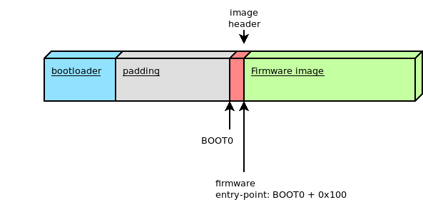

# Firmware image

## Firmware entry point

WolfBoot can only chain-load and execute firmware images from a specific entry point in memory,
which must be specified as the origin of the FLASH memory in the linker script of the embedded
application. This corresponds to the first partition in the flash memory.

Multiple firmware images can be created this way, and stored in two different partitions. The bootloader
will take care of moving the selected firmware to the first (BOOT) partition before chain-loading the image.

Due to the presence of an image header, the entry point of the application has a fixed additional offset 
of 256B from the beginning of the flash partition.

## Firmware image header

Each (signed) firmware image is pre-pended with a fixed-size **image header**, containing
useful information about the firmware. The **image header** is padded to fit in 256B, in order
to guarantee that the entry point of the actual firmware is stored on the flash starting from
a 256-Bytes aligned address. This ensures that the bootloader can relocate the vector table before
chain-loading the firmware the interrupt continue to work properly after the boot is complete.

*The image header is stored at the beginning of the slot and the actual firmware image starts 256 Bytes after it*

### Image header: Tags

The **image header** is prepended with a single 4-byte magic number, followed by a 4-byte field indicating the 
firmware image (excluding the header). All numbers in the header are stored in Little-endian format.

The two fixed fields are followed by one or more tags. Each TAG is structured as follows:

  - 2 bytes indicating the **Type**
  - 2 bytes indicating the **size** of the tag, excluding the type and size bytes
  - ***N*** bytes of tag content

With the following exception:
  - A '0xFF' in the Type field indicate a simple padding byte. The 'padding' byte has no **size** field, and the next byte should be processed as **Type** again.

Each **Type** has a different meaning, and integrate information about the firmware. The following Tags are mandatory for validating the firmware image:

  - A 'version' Tag (type: 0x0001, size: 4 Bytes) indicating the version number for the firmware stored in the image
  - A 'timestamp' Tag (type: 0x0002, size 8 Bytes) indicating the timestamp in unix seconds for the creation of the firmware
  - A 'sha256 digest' Tag (type: 0x0003, size: 32 Bytes) used for integrity check of the firmware
  - A 'firmware signature' Tag (type: 0x0020, size: 64 Bytes) used to validate the signature stored with the firmware against a known public key
  - A 'firmware type' Tag (type: 0x0030, size: 2 Bytes) used to identify the type of firmware, and the authentication mechanism in use.

Optionally, a 'public key hint digest' Tag can be transmitted in the header (type: 0x10, size:32 Bytes). This Tag contains the SHA256 digest of the public key used 
by the signing tool. The bootloader may use this field to locate the correct public key in case of multiple keys available.

wolfBoot will, in all cases, refuse to boot an image that cannot be verified and authenticated using the built-in digital signature authentication mechanism.

### Image signing tool

The image signing tool generates the header with all the required Tags for the compiled image, and add them to the output file that can be then
stored on the primary slot on the device, or transmitted later to the device through a secure channel to initiate an update.

### Storing firmware image

Firmware images are stored with their full header at the beginning of any of the partitions on the system.
wolfBoot can only boot images from the BOOT partition, while keeping a second firmware image in the UPDATE partition.

In order to boot a different image, wolfBoot will have to swap the content of the two images.

For more information on how firmware images are stored and managed within the two partitions, see [Flash partitions](flash_partitions.md)

