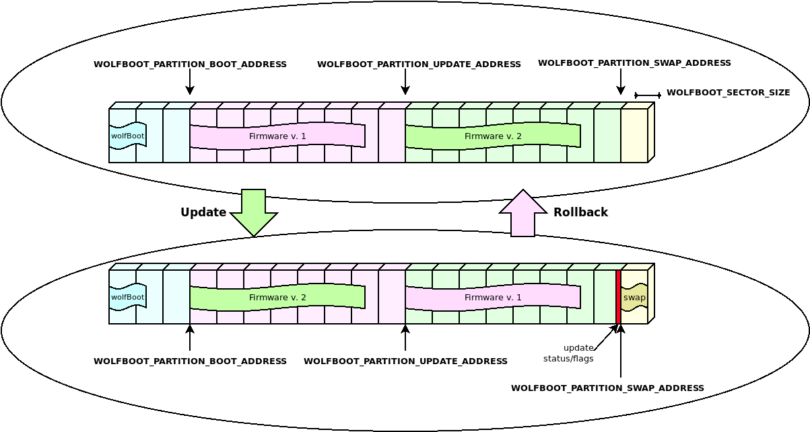

# Firmware update

This section documents the complete firmware update procedure, enabling secure boot
for an existing embedded application.

The steps to complete a firmware update with wolfBoot are:
   - Compile the firmware with the correct entry point
   - Sign the firmware
   - Transfer the image using a secure connection, and store it to the secondary firmware slot
   - Trigger the image swap
   - Reboot to let the bootloader begin the image swap

At any given time, an application or OS running on a wolfBoot system can receive an updated version of itself,
and store the updated image in the second partition in the FLASH memory.

Applications or OS threads can be linked to the [libwolfboot library](API.md), which exports the API to trigger
the update at the next reboot, and some helper functions to access the flash partition for 
erase/write through the target specific [HAL](HAL.md).

## Update procedure description

Using the [API](API.md) provided to the application, wolfBoot offers the possibility to initiate, confirm or 
rollback an update.

After storing the new firmware image in the UPDATE partition, the application should initiate the update by calling
`wolfBoot_update_trigger()`. By doing so, the UPDATE partition is marked for update. Upon the next reboot, wolfBoot will:
  - Validate the new firmware image stored in the UPDATE partition
  - Verify the signature attached against a known public key stored in the bootloader image
  - Swap the content of the BOOT and the UPDATE partitions
  - Mark the new firmware in the BOOT partition as in state `STATE_TESTING`
  - Boot into the newly received firmware

### Successful boot

Upon a successful boot, the application should inform the bootloader by calling `wolfBoot_success()`, after verifying that
the system is up and running again. This operation confirms the update to a new firmware.

Failing to set the BOOT partition to `STATE_SUCCESS` before the next reboot triggers a roll-back operation.
Roll-back is initiated by the bootloader by triggering a new update, this time starting from the backup copy of the original 
(pre-update) firmware, which is now stored in the UPDATE partition due to the swap occurring earlier.

### Building a new firmware image

Firmware images are position-dependent, and can only boot from the origin of the **BOOT** partition in FLASH.
This design constraint implies that the chosen firmware is always stored in the **BOOT** partition, and wolfBoot
is responsible for pre-validating an update image and copy it to the correct address.

All the firmware images must therefore have their entry point set to the address corresponding to the beginning 
of the **BOOT** partition, plus an offset of 256 Bytes to account for the image header.

Once the firmware is compiled and linked, it must be signed using the `sign` tool. The tool produces
a signed image that can be transferred to the target using a secure connection, using the same key corresponding
to the public key currently used for verification.

The tool also adds all the required Tags to the image header, containing the signatures and the SHA256 hash of 
the firmware.
