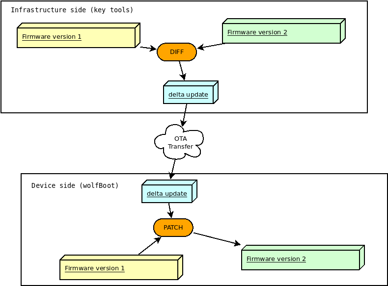
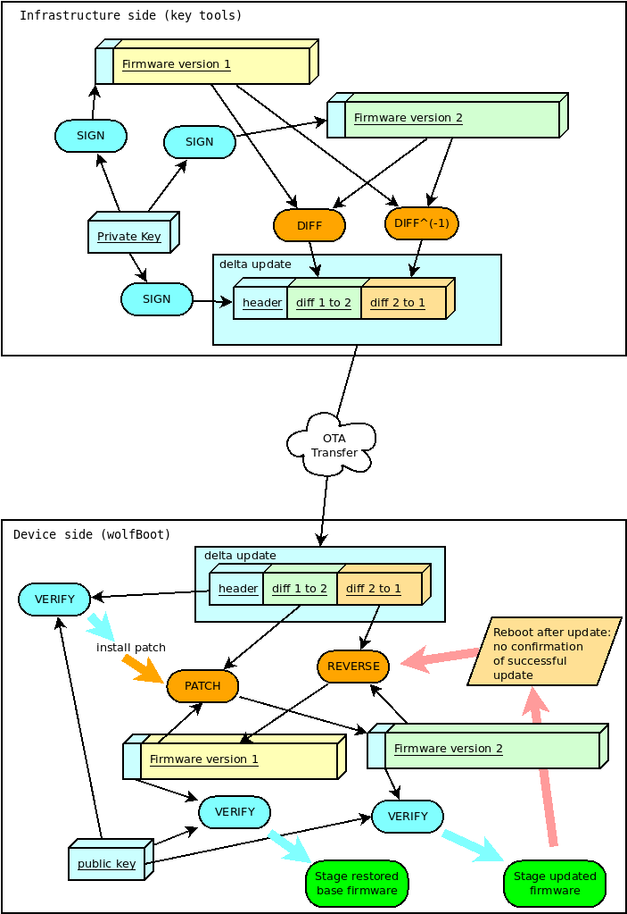

# Firmware update

This section documents the complete firmware update procedure, enabling secure boot
for an existing embedded application.

## Updating Microcontroller FLASH

The steps to complete a firmware update with wolfBoot are:
   - Compile the firmware with the correct entry point
   - Sign the firmware
   - Transfer the image using a secure connection, and store it to the secondary firmware slot
   - Trigger the image swap
   - Reboot to let the bootloader begin the image swap

At any given time, an application or OS running on a wolfBoot system can receive an updated version of itself,
and store the updated image in the second partition in the FLASH memory.

Applications or OS threads can be linked to the [libwolfboot library](API.md), which exports the API to trigger
the update at the next reboot, and some helper functions to access the flash partition for 
erase/write through the target specific [HAL](HAL.md).

## Update procedure description

Using the [API](API.md) provided to the application, wolfBoot offers the possibility to initiate, confirm or 
rollback an update.

After storing the new firmware image in the UPDATE partition, the application should initiate the update by calling
`wolfBoot_update_trigger()`. By doing so, the UPDATE partition is marked for update. Upon the next reboot, wolfBoot will:
  - Validate the new firmware image stored in the UPDATE partition
  - Verify the signature attached against a known public key stored in the bootloader image
  - Swap the content of the BOOT and the UPDATE partitions
  - Mark the new firmware in the BOOT partition as in state `STATE_TESTING`
  - Boot into the newly received firmware

If the system is interrupted during the swap operation and reboots,
wolfBoot will pick up where it left off and continue the update
procedure.

### Successful boot

Upon a successful boot, the application should inform the bootloader by calling `wolfBoot_success()`, after verifying that
the system is up and running again. This operation confirms the update to a new firmware.

Failing to set the BOOT partition to `STATE_SUCCESS` before the next reboot triggers a roll-back operation.
Roll-back is initiated by the bootloader by triggering a new update, this time starting from the backup copy of the original 
(pre-update) firmware, which is now stored in the UPDATE partition due to the swap occurring earlier.

### Building a new firmware image

Firmware images are position-dependent, and can only boot from the origin of the **BOOT** partition in FLASH.
This design constraint implies that the chosen firmware is always stored in the **BOOT** partition, and wolfBoot
is responsible for pre-validating an update image and copy it to the correct address.

All the firmware images must therefore have their entry point set to the address corresponding to the beginning 
of the **BOOT** partition, plus an offset of 256 Bytes to account for the image header.

Once the firmware is compiled and linked, it must be signed using the `sign` tool. The tool produces
a signed image that can be transferred to the target using a secure connection, using the same key corresponding
to the public key currently used for verification.

The tool also adds all the required Tags to the image header, containing the signatures and the SHA256 hash of 
the firmware.

### Self-update

wolfBoot can update itself if `RAM_CODE` is set. This procedure
operates almost the same as firmware update with a few key
differences. The header of the update is marked as a bootloader
update (use `--wolfboot-update` for the sign tools).

The new signed wolfBoot image is loaded into the UPDATE parition and
triggered the same as a firmware update. Instead of performing a swap,
after the image is validated and signature verified, the bootloader is
erased and the new image is written to flash. This operation is _not_
safe from interruption. Interruption will prevent the device from
rebooting.

wolfBoot can be used to deploy new bootloader versions as well as
update keys.

### Incremental updates (aka: 'delta' updates)

wolfBoot supports incremental updates, based on a specific older version. The sign tool
can create a small "patch" that only contains the binary difference between the version
currently running on the target and the update package. This reduces the size of the image
to be transferred to the target, while keeping the same level of security through public key
verification, and integrity due to the repeated check (on the patch and the resulting image).

The format of the patch is based on the mechanism suggested by Bentley/McIlroy, which is particularly effective
to generate small binary patches. This is useful to minimize time and resources needed to transfer,
authenticate and install updates.

#### How it works

As an alternative to transferring the entire firmware image, the key tools create
a binary diff between a base version previously uploaded and the new updated image.

The resulting bundle (delta update) contains the information to derive the content
of version '2' of the firmware, starting from the base version, that is currently
running on the target (version '1' in this example), and the reverse patch to downgrade
version '2' back to version '1' if something goes wrong running the new version.

On the device side, wolfboot will recognize and verify the authenticity of the delta update before
applying the patch to the current firmware. The new firmware is rebuilt in place,
replacing the content of the BOOT partition according to the indication in the
(authenticated) 'delta update' bundle.

#### Two-steps verification

Binary patches are created by comparing signed firmware images. wolfBoot verifies
that the patch is applied correctly by checking for the integrity and the authenticity
of the resulting image after the patch.

The delta update bundle itself, containing the patches, is prefixed with a manifest
header describing the details for the patch, and signed like a normal full update bundle.

This means that wolfBoot will apply two levels of authentication: the first one 
when the delta bundle is processed (e.g. when an update is triggered), and the second
one every time a patch is applied, or reversed, to validate the firmware image
before booting.

These steps are performed automatically by the key tools when using the `--delta`
option, as described in the example.

#### Confirming the update

From the application perspective, nothing changes from the normal, 'full' update case.
Application must still call `wolfBoot_success()` on the first boot with the updated version
to ensure that the update is confirmed.

Failing to confirm the success of the update will cause wolfBoot to revert the patch
applied during the update. The 'delta update' bundle also contains a reverse patch,
which can revert the update and restore the base version of the firmware.

The diagram below shows the authentication steps and the diff/patch process in both
directions (update and roll-back for missed confirmation).

#### Incremental update: example

Requirement: wolfBoot is compiled with `DELTA_UPDATES=1`

Version "1" is signed as usual, as a standalone image:

`tools/keytools/sign.py --ecc256 --sha256 test-app/image.bin ecc256.der 1`

When updating from version 1 to version 2, you can invoke the sign tool as:

`tools/keytools/sign.py --delta test-app/image_v1_signed.bin --ecc256 --sha256 test-app/image.bin ecc256.der 2`

Besides the usual output file `image_v2_signed.bin`, the sign tool creates an additional `image_v2_signed_diff.bin`
which should be noticeably smaller in size as long as the two binary files contain overlapping areas.

This is the delta update bundle, a signed package containing the patches for updating version 1 to version 2, and to roll back to version 1 if needed, after the first patch has been applied.

The delta bundle `image_v2_signed_diff.bin` can be now transferred to the update partition on the target like a full update image.

At next reboot, wolfBoot recognizes the incremental update, checks the integrity, the authenticity and the versions
of the patch. If all checks succeed, the new version is installed by applying the patch on the current firmware image.

If the update is not confirmed, at the next reboot wolfBoot will restore the original base `image_v1_signed.bin`, using
the reverse patch contained in the delta update bundle.

